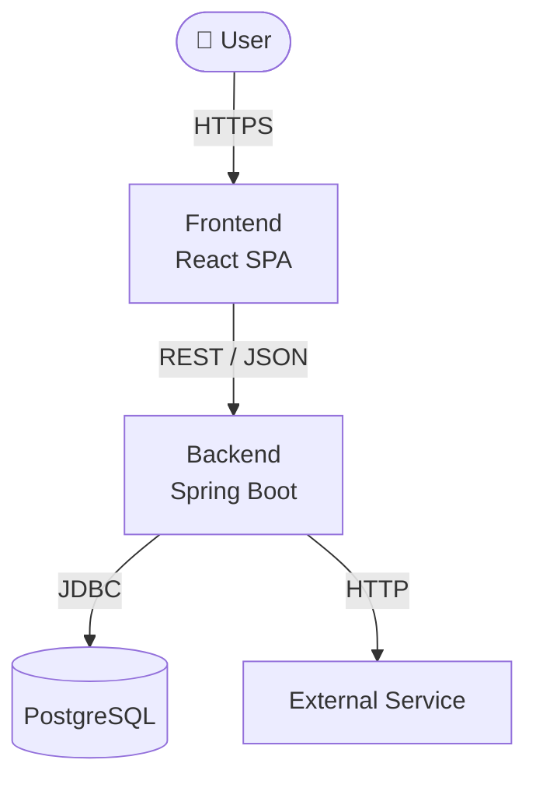
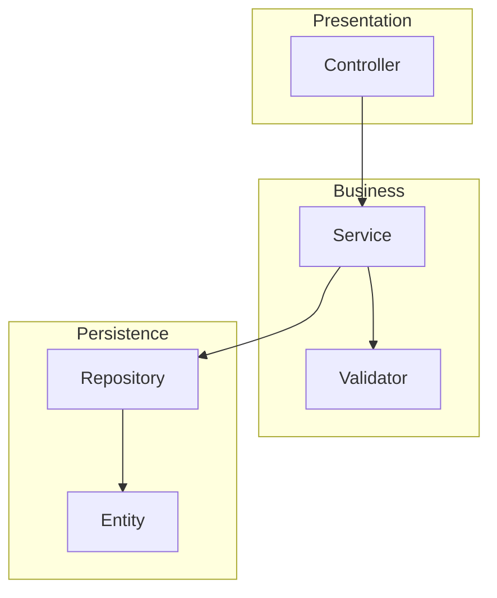
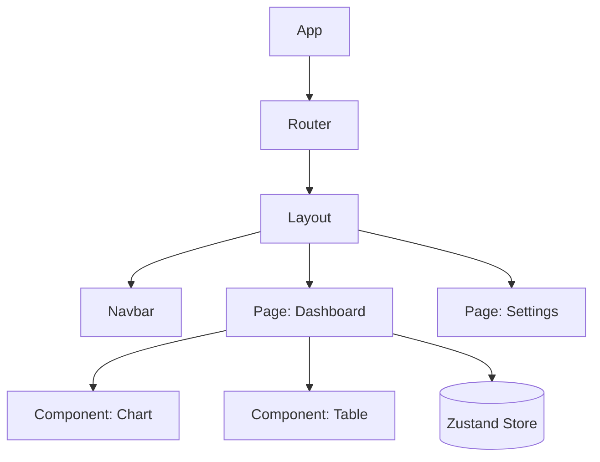
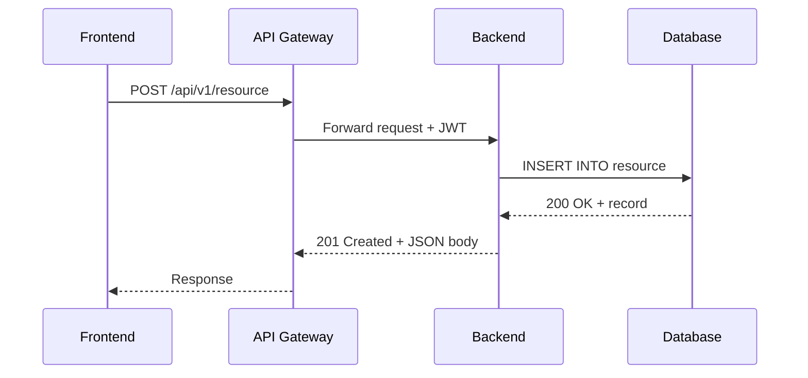
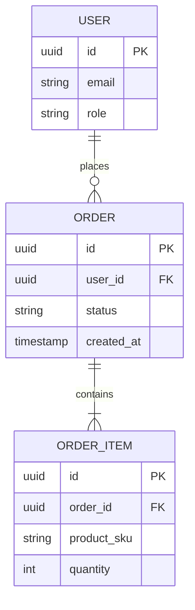
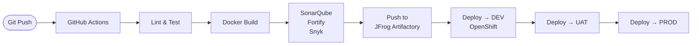
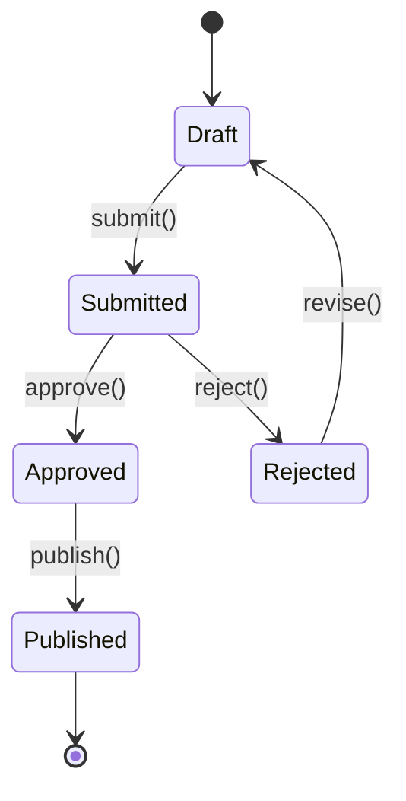

# GitHub Wiki Generator

Generate structured, developer-friendly GitHub Wiki pages from a codebase. Produces Markdown
files with embedded Mermaid diagrams covering architecture, data flow, API contracts, component
hierarchy, and onboarding guides.

---

## Step 1 — Codebase Discovery

Before writing anything, build a mental model of the project. Perform these actions:

### 1a. Understand the project structure
```
view /path/to/project          # Top-level directory tree
view /path/to/project/src      # Source root
```
Look for:
- Framework signals: `package.json`, `pom.xml`, `build.gradle`, `requirements.txt`, `go.mod`
- Entry points: `main.tsx`, `App.tsx`, `index.ts`, `Application.java`, `main.py`
- Config files: `.env.example`, `application.yml`, `application.properties`, `vite.config.ts`
- Test directories: `__tests__`, `spec/`, `src/test/`

### 1b. Identify the tech stack
Determine:
- **Frontend**: Framework (React/Vue/Angular), state management (Redux/Zustand/Pinia), routing, UI library
- **Backend**: Framework (Spring Boot/Express/FastAPI), ORM/data layer, authentication mechanism
- **Infrastructure**: CI/CD configs (`.github/workflows/`), Docker, OpenShift/K8s manifests, API gateway

### 1c. Map key domain concepts
Read through models, DTOs, entities, and types to extract the core domain vocabulary.
For Java/Spring: `src/main/java/**/model/`, `**/entity/`, `**/dto/`
For TypeScript: `src/types/`, `src/models/`, `src/interfaces/`

---

## Step 2 — Wiki Structure Planning

### Must-Have Pages (always generate these)

```
Wiki Pages
├── Home.md                  # Project overview + navigation index          [REQUIRED]
├── Architecture.md          # System context diagram + tech decisions       [REQUIRED]
├── Frontend.md              # Component hierarchy, routing, state mgmt      [REQUIRED]
├── Backend.md               # Layers (controller → service → repo)          [REQUIRED]
├── API-Reference.md         # Endpoints, request/response schemas           [REQUIRED]
├── Data-Model.md            # ER diagram + entity descriptions              [REQUIRED]
└── Development-Guide.md     # Local setup, build commands, dev workflow     [REQUIRED]
```

### Optional Pages (generate only if relevant content exists)

```
├── Configuration.md         # Env vars, Spring profiles, secrets mgmt      [if .env / application.yml found]
├── Deployment.md            # CI/CD pipeline, OpenShift/Docker promotion    [if pipeline config found]
└── Authentication.md        # Auth flow, roles, token strategy              [if auth logic is complex]
```

**Decision rule:** Omit optional pages if the codebase has no material to fill them.
Add extra pages for significant cross-cutting concerns (e.g. `Event-Driven.md`, `Caching.md`).
For pure backend services (no `src/` frontend), skip `Frontend.md` and expand `Backend.md` instead.

---

## Step 3 — Mermaid Diagram Patterns

Embed Mermaid diagrams to replace walls of text. Use the patterns below for common needs.

### System Context Diagram (C4 Level 1)


### Component / Layer Diagram (Backend)


### Frontend Component Hierarchy


### API Request / Response Sequence


### Entity Relationship Diagram


### CI/CD Pipeline


### State Machine (for workflow-heavy features)


---

## Step 4 — Page Writing Guidelines

### Home.md ✦ Required
- One-paragraph project summary (what it does, who uses it, tech highlights)
- Quick-start command block (clone → install → run)
- Navigation table linking all wiki pages with a one-line description each
- Badge row if applicable (build status, coverage, version)

### Architecture.md ✦ Required
- **System context diagram** (C4 Level 1) — always the first section
- **Container diagram** (C4 Level 2) if the system has multiple deployable units
- Key architectural decisions as an ADR-lite table: Decision | Options Considered | Choice | Rationale
- Technology choices table: Component | Technology | Version | Why
- Non-functional requirements: scalability, security, availability, observability

### Frontend.md ✦ Required
- Tech stack table: Library | Version | Purpose
- Directory structure tree with one-line description per folder
- **Component hierarchy diagram** (graph TD) — required
- Routing table: Path | Component | Auth Required | Description
- State management section: list stores, their slices/actions, and which components consume them
- Key conventions: naming patterns, file colocation rules, import aliases (`@/`, `~`)
- API integration: where HTTP calls live, base URL config, error handling pattern

### Backend.md ✦ Required
- **Layered architecture diagram** (graph TD with subgraphs) — required
- Package structure tree with one-line description per package
- Core domain models table: Class | Type (Entity/DTO/VO) | Description
- Service layer table: Service Class | Responsibility | Key Dependencies
- Cross-cutting concerns: logging strategy, global exception handler, validation approach, security filter chain summary

### API-Reference.md ✦ Required
- Base URL and versioning strategy
- Authentication mechanism (Bearer JWT, OAuth2, API key) with header format example
- **Sequence diagram** for at least one representative request flow — required
- For each resource group (one H2 section per controller/router):
  - Endpoint table: Method | Path | Description | Auth Required
  - Request body: TypeScript interface or JSON schema block
  - Response: JSON example with status codes
- Error codes table: Code | Message | When it occurs

### Data-Model.md ✦ Required
- **ER diagram** (erDiagram) — required, cover all major entities
- For each entity: table with column name, type, nullable, description
- Relationships narrative: plain-English explanation of the key associations
- Migration strategy: tool used (Flyway / Liquibase / manual), migration file location

### Development-Guide.md ✦ Required
Structure the page with these exact sections:

```md
## Prerequisites
List runtimes, tools, and versions required (Java 17+, Node 18+, Docker, etc.)

## Repository Setup
git clone ...
cd project
cp .env.example .env      # explain key vars to fill in

## Running Locally
### Backend
./mvnw spring-boot:run    # or gradle bootRun

### Frontend
npm install
npm run dev

## Running Tests
### Backend
./mvnw test

### Frontend
npm test                  # unit
npm run e2e               # integration if applicable

## Code Style & Linting
- ESLint / Checkstyle config location
- Pre-commit hooks (Husky, lefthook)
- How to run the formatter manually

## Common Issues
Table: Symptom | Likely Cause | Fix
```

### Configuration.md ✦ Optional
- Environment variables table: Variable | Default | Required | Description
- Spring profiles / Node environments table: Profile | Purpose | Key Differences
- Secrets management: approach used (Vault, OpenShift Secrets, K8s Secrets), what is never in source control

### Deployment.md ✦ Optional
- **CI/CD pipeline diagram** (flowchart LR) — required if page is generated
- Branching strategy → environment mapping table: Branch | Environment | Auto-deploy?
- OpenShift / Docker deployment steps (numbered)
- Rollback procedure

---

## Step 5 — Output Format

Generate **one `.md` file per wiki page**. Naming convention follows GitHub Wiki standards:

| Wiki Page | Filename |
|---|---|
| Home | `Home.md` |
| Architecture | `Architecture.md` |
| Frontend | `Frontend.md` |
| Backend | `Backend.md` |
| API Reference | `API-Reference.md` |
| Data Model | `Data-Model.md` |
| Development Guide | `Development-Guide.md` |
| Configuration | `Configuration.md` *(optional)* |
| Deployment | `Deployment.md` *(optional)* |

**Formatting rules for every file:**
- H1 (`#`) for the page title — exactly one per file
- H2 (`##`) for major sections, H3 (`###`) for subsections
- All diagrams in fenced ` ```mermaid ``` ` blocks
- Code examples with appropriate language tags: ` ```java `, ` ```typescript `, ` ```yaml `, ` ```bash `
- Prefer tables and diagrams over prose paragraphs
- Each section should be scannable — a developer should locate what they need in under 30 seconds
- Do not use HTML in Markdown; GitHub Wiki renders standard GFM only

---

## Step 6 — Quality Checklist

Before presenting output, verify each item:

**Coverage**
- [ ] All 7 required pages are generated (`Home`, `Architecture`, `Frontend`, `Backend`, `API-Reference`, `Data-Model`, `Development-Guide`)
- [ ] Optional pages generated only when supporting content exists in the codebase
- [ ] `Home.md` navigation table links to every generated page

**Diagrams**
- [ ] `Architecture.md` contains a system context diagram (C4 Level 1)
- [ ] `Frontend.md` contains a component hierarchy diagram
- [ ] `Backend.md` contains a layered architecture diagram
- [ ] `API-Reference.md` contains at least one sequence diagram
- [ ] `Data-Model.md` contains an ER diagram covering all major entities
- [ ] All Mermaid blocks: balanced `subgraph`/`end`, no duplicate node IDs, valid syntax

**Content accuracy**
- [ ] API endpoint table covers all `@RestController` / `@RequestMapping` routes found in code
- [ ] ER diagram entities match `@Entity` classes or DB schema files
- [ ] Dev setup commands match actual scripts in `package.json` / `pom.xml` / `Makefile`
- [ ] No placeholder text (`TODO`, `[describe here]`, `[replace this]`) left in any file

**Format**
- [ ] Each file starts with exactly one H1
- [ ] One `.md` file per page, named per the filename table in Step 5
- [ ] No HTML tags; pure GitHub Flavored Markdown only

---

## Notes for Specific Stacks

### Spring Boot
- Scan `@RestController` classes for API endpoints
- Scan `@Entity` / JPA classes for the data model
- Read `application.yml` / `application.properties` for config
- Check `SecurityConfig` for authentication/authorization rules
- Check `pom.xml` for dependency insights (Flyway, Kafka, Redis, etc.)

### React / TypeScript
- Read `src/routes` or `App.tsx` router config for routing table
- Read `src/store` or `src/state` for state management docs
- Check `vite.config.ts` / `webpack.config.js` for build aliases and proxy settings
- Scan `src/api` or `src/services` for API client calls

### OpenShift / K8s
- Read `deployment.yaml`, `service.yaml`, `configmap.yaml` for infra docs
- Map ConfigMaps → Configuration.md, Secrets → note in Configuration.md

---

## Output Delivery

1. Write each page as a separate `.md` file to `/mnt/user-data/outputs/wiki/`
2. Call `present_files` with all generated files in this priority order:
   `Home.md`, `Architecture.md`, `Backend.md`, `Frontend.md`, `API-Reference.md`, `Data-Model.md`, `Development-Guide.md`, then any optional pages
3. After presenting, remind the user:
   - Files can be copy-pasted into the **GitHub Wiki editor** (Edit tab on any wiki page)
   - Or committed directly to the `<repo-name>.wiki.git` repository for version-controlled wiki updates
   - Mermaid diagrams render natively in GitHub — no plugin required
