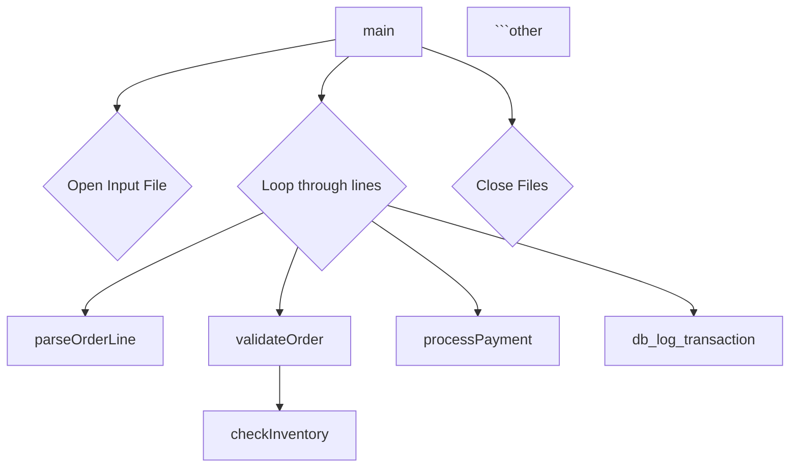

# AI-Assisted Legacy Code Analysis

### **Core Philosophy & Rules for a Successful AI Partnership**

Before we dive into prompts, it's crucial to establish the right mindset and rules of engagement with your AI agent.

1. **You are the Analyst, the AI is the Intern:** The AI is brilliant at parsing syntax, summarizing logic, and generating boilerplate text. However, it lacks business context, historical knowledge, and critical thinking. Your job is to guide it, verify its output, and add the crucial layer of business insight.
2. **Context is King:** The AI's effectiveness is directly proportional to the context you provide. Don't just paste code; provide surrounding functions, data structure definitions (like C structs or Java classes), database schemas, and brief explanations of the business domain.
3. **Iterative Refinement:** Don't expect a perfect specification in one shot. Your process will be a conversation. Ask a high-level question, get a summary, then ask a more detailed follow-up question about a specific part.
4. **Break Down Complexity:** Feed the AI manageable chunks. Instead of dropping a 5,000-line file, focus on one function or class at a time. Analyze the pieces, then ask the AI to synthesize the bigger picture.
5. **Verify, Don't Trust:** **Always assume the AI can be wrong (hallucinate).** Use its output as a well-formed first draft. You must cross-reference its analysis with the actual code and your own understanding.

---

### **Step-by-Step Process with AI Instructions (Prompts)**

Here is a phased approach to analyzing a legacy program and creating a specification.

#### **Phase 1: High-Level Reconnaissance & Structural Analysis**

**Goal:** Understand the program's overall structure, dependencies, and main entry points without getting bogged down in details.

- **Step 1.1: Overall Purpose & File Structure**
    - **Prompt:** "I am analyzing this legacy C/Java program to migrate it to Spring Boot. This file, `[filename.c]`, is part of it. Analyze the code and provide a high-level summary of its primary purpose and key responsibilities. List the main functions/methods and what you believe each one does at a high level."
    - **Context to provide:** Paste the entire file content.
- **Step 1.2: Identify Dependencies & Interactions**
    - **Prompt:** "Based on the code provided, identify all external dependencies. This includes:
        1. Included header files or imported Java packages.
        2. Calls to external libraries or system functions.
        3. Any indicators of database connections (e.g., function names like `db_connect`, SQL strings).
        4. File I/O operations (reading from or writing to specific file paths).
        5. Network communication (e.g., socket programming, HTTP calls)."
- **Step 1.3: Generate a Call Graph Diagram**
    - **Prompt:** "Generate a call graph for the functions within this file using Mermaid.js `graph TD` syntax. Start with the main entry point function `[main_function_name]`. This will help me visualize the program flow."
    - **Why this is great:** Visual diagrams are incredibly helpful. You can paste the Mermaid syntax into an online editor or a tool like Obsidian to see the graph instantly.

#### **Phase 2: Deep Dive into Business Logic**

**Goal:** Extract the detailed "what" and "why" from the code. This is where you transform raw code logic into business rules.

- **Step 2.1: Detailed Function Analysis**
    - *Select a key function identified in Phase 1.*
    - **Prompt:** "Let's do a deep dive on the function `[function_name]`. Provide a step-by-step explanation of its business logic in plain English. For each step, reference the specific line numbers. Focus on the *intent* of the code, not just a literal translation. For example, instead of 'it loops through an array', say 'it processes each item in the customer's order'."
    - **Context to provide:** Paste the function code and any relevant data structures (structs/classes) it uses.
- **Step 2.2: Extracting Business Rules**
    - **Prompt:** "From our analysis of the `[function_name]` function, extract a list of explicit and implicit business rules. For example:
        - A user's credit score must be above 650 to be approved.
        - Orders of type 'EXPEDITED' must be processed within 1 hour.
        - The transaction log file must be appended with the result."
- **Step 2.3: Defining the Data Contract**
    - **Prompt:** "Analyze the function `[function_name]`. Define its data contract by identifying:
        1. **Input Parameters:** List each parameter, its data type, and its purpose.
        2. **Input Validation:** What validation rules are applied to the inputs? (e.g., `userID` cannot be null, `amount` must be positive).
        3. **Return Value/Output:** Describe the data structure that is returned and the meaning of different return values (e.g., 0 for success, -1 for error).
        4. **Side Effects:** Does this function modify global state, write to a file, or update a database record?"

#### **Phase 3: Synthesizing the Specification & Revamp Design**

**Goal:** Use the extracted knowledge to create formal specification artifacts and brainstorm the new Spring Boot design.

- **Step 3.1: Generating User Stories / Functional Requirements**
    - **Prompt:** "Based on the business logic for processing a `[business_entity, e.g., 'customer order']` that we've discussed, write a set of user stories in the Gherkin format (Given/When/Then) or standard Agile format (`As a [user], I want [action], so that [benefit]`). Create one for the success scenario and at least one for a key failure scenario."
- **Step 3.2: Mapping to Spring Boot Architecture**
    - **Prompt:** "We are revamping this legacy function `[function_name]` into a Spring Boot microservice. Propose a modern design. Please suggest:
        1. **REST API Endpoint:** A suitable HTTP method (GET, POST, etc.), a resource URI, and the Spring Boot Controller method signature.
        2. **DTOs:** A Java record or class for the Request Body (if any) and the Response Body, based on the data contract we identified.
        3. **Service Layer:** A signature for a method in a `@Service` class that would contain the core business logic.
        4. **Data Persistence:** If the legacy code interacts with a database, suggest a Spring Data JPA Entity and Repository interface to manage the data."
- **Step 3.3: Generating Sequence Diagrams for the New Design**
    - **Prompt:** "Generate a sequence diagram in Mermaid.js syntax for the proposed Spring Boot application flow. It should show the interaction between the `Client`, `Controller`, `Service`, and `Repository` for the `[e.g., 'processOrder']` feature."

---

### **Brainstorming: What to Include in the Final Specification Document**

This document is your key deliverable. The AI has helped you gather all the raw material; now you structure it professionally.

#### **Specification Document Template**

**1. Introduction**
*   1.1. Purpose of this Document
*   1.2. Scope (Which parts of the legacy program are covered)
*   1.3. Business Context & Objectives of the Revamp

**2. As-Is Analysis (Legacy System)**
*   2.1. High-Level Architecture Overview (Generated with AI's help)
*   2.2. Key Modules & Responsibilities (Summarized from AI analysis)
*   2.3. External Dependencies & Interfaces (Lists of DBs, files, other systems)
*   2.4. Core Business Processes & Logic
*   *For each key process (e.g., "User Registration", "Report Generation"):*
*   **Description:** Plain English summary.
*   **Detailed Logic:** Step-by-step logic extracted by the AI.
*   **Business Rules:** Bulleted list of rules.
*   **Diagrams:** Call graphs or flowcharts (Mermaid diagrams from the AI).

**3. Functional Requirements (To-Be System)**
*   3.1. Epics & User Stories (Generated with AI's help, then refined by you)
*   3.2. Detailed Functional Requirements (Classic "The system shall..." statements, derived from business rules)
*   3.3. In-Scope / Out-of-Scope Features

**4. Non-Functional Requirements (NFRs)**
*   4.1. **Security:** (e.g., Authentication/Authorization needs based on legacy logic)
*   4.2. **Performance:** (Any implicit performance expectations from the old code, e.g., batch job timing)
*   4.3. **Reliability & Error Handling:** (How should the new system handle errors identified in the legacy code?)
*   4.4. **Maintainability & Logging**

**5. To-Be Design (Proposed Spring Boot Application)**
*   5.1. High-Level Architecture (e.g., Microservices, RESTful API)
*   5.2. API Design
*   *For each User Story:*
*   **Endpoint:** `POST /api/v1/orders`
*   **Request DTO:** (Code snippet of the Java record)
*   **Response DTO(s):** (Code snippets for 200 OK, 400 Bad Request)
*   5.3. Data Model (Proposed JPA Entities, based on DB analysis)
*   5.4. Key Component Interactions (Sequence diagrams generated by AI)

**6. Data Migration Strategy** (If applicable)
*   (How will data from the legacy database be moved to the new one?)

**7. Appendices**
*   A. Legacy Code Snippets for Reference
*   B. Full Mermaid Diagram Sources

By following this structured approach, you leverage the AI for what it does best—code analysis and content generation—while you maintain full control and apply your critical system analyst skills to ensure accuracy, add business context, and design a robust modern solution.


---

### **The Markdown-Driven Analysis Workflow**

Let's assume you have a legacy file you're analyzing, for example, `order_processor.c`. You will create a series of markdown files like `01-summary.md`, `02-dependencies.md`, etc.

#### **Phase 1: High-Level Reconnaissance**

- **Directory Structure:**

```other
analysis/
├── 01-summary.md
├── 02-dependencies.md
└── 03-call-graph.md
```

---

**Step 1.1: Overall Purpose & File Structure**

- **Goal:** Get a high-level summary of the file's purpose.
- **AI Prompt:**

```other
Act as a senior software analyst. I am providing you with the content of a legacy C file named 'order_processor.c'. Your task is to analyze it and generate a summary in markdown format.

The markdown should include:
1.  A "High-Level Purpose" section explaining what the program does from a business perspective.
2.  A "Key Responsibilities" section with a bulleted list of its main tasks.
3.  A "Main Functions" section with a table listing the key functions and a brief, one-sentence description of each.

Here is the code for 'order_processor.c':
```

    [... PASTE ENTIRE CONTENT OF order_processor.c HERE ...]

```other

```

- **Resulting File:** `01-summary.md`
- **Markdown Template (`01-summary.md`):**

```other
# Analysis Summary: order_processor.c

*   **Date:** 2023-10-27
*   **Analyst:** [Your Name]
*   **AI Assistant:** GitHub Copilot / Cursor

## 1. High-Level Purpose

[AI-generated summary: e.g., This program appears to be a batch processor for customer orders. It reads order data from a specified input file, validates each order against a set of business rules, calculates totals, and writes the processed results to an output file and a database log.]

## 2. Key Responsibilities

*   [AI-generated bullet point: e.g., Reading raw order data from a text file.]
*   [AI-generated bullet point: e.g., Validating order details like customer ID, item stock, and price.]
*   [AI-generated bullet point: e.g., Connecting to a database to log transaction status.]
*   [AI-generated bullet point: e.g., Generating a formatted output file with processed orders.]

## 3. Main Functions

| Function Name         | Description                                        |
| --------------------- | -------------------------------------------------- |
| `main`                | [AI-generated: e.g., Orchestrates the entire process from file reading to writing.] |
| `parseOrderLine`      | [AI-generated: e.g., Parses a single line from the input file into an Order struct.] |
| `validateOrder`       | [AI-generated: e.g., Checks the validity of a given order against business rules.] |
| `db_log_transaction`  | [AI-generated: e.g., Inserts a record of the transaction into the database.] |
```

---

**Step 1.2: Identify Dependencies & Interactions**

- **Goal:** Document all external touchpoints.
- **AI Prompt:**

```other
Act as a senior software analyst. I'm providing you with the source code for 'order_processor.c' and my initial summary from '01-summary.md'.

Your task is to analyze the source code again, focusing on its external dependencies and interactions. Generate a markdown report that lists:
1.  Included libraries and header files.
2.  Any functions indicating database interaction (e.g., function names, SQL strings).
3.  All file I/O operations (reading or writing), including the file paths if visible.
4.  Any signs of network communication.

**Context from 01-summary.md:**
```

    [... PASTE CONTENT OF 01-summary.md HERE ...]

```other
**Source Code for order_processor.c:**
```

    [... PASTE ENTIRE CONTENT OF order_processor.c HERE ...]

```other

```

- **Resulting File:** `02-dependencies.md`
- **Markdown Template (`02-dependencies.md`):**

```other
# Dependency Analysis: order_processor.c

## 1. Libraries and Includes

*   `stdio.h`: Standard input/output operations.
*   `stdlib.h`: Standard library functions (e.g., memory allocation).
*   `string.h`: String manipulation functions.
*   `db_client.h`: [AI-generated: e.g., Custom header for database client functions.]

## 2. Database Interactions

*   **Functions:** `db_connect()`, `db_log_transaction()`, `db_disconnect()`
*   **SQL Strings Found:**
    *   `INSERT INTO transaction_log (...) VALUES (...)`

## 3. File I/O Operations

*   **Input:** Reads from a file path passed as a command-line argument (`argv[1]`).
*   **Output:** Writes to a hardcoded file path: `/var/log/processed_orders.out`.
*   **Error Log:** Appends errors to `/var/log/order_processor.err`.

## 4. Network Communication

*   [AI-generated: e.g., No direct network communication (sockets, HTTP) was identified in this file.]
```

---

**Step 1.3: Generate a Call Graph Diagram**

- **Goal:** Visualize the execution flow.
- **AI Prompt:**

```other
Based on the provided source code for 'order_processor.c', generate a call graph showing how the functions call each other. Start the graph from the `main` function.

**Format the output as a Mermaid.js 'graph TD' (Top Down) diagram inside a markdown code block.**

**Source Code for order_processor.c:**
```

    [... PASTE ENTIRE CONTENT OF order_processor.c HERE ...]

```other

```

- **Resulting File:** `03-call-graph.md`
- **Markdown Template (`03-call-graph.md`):**

````other
# Call Graph: order_processor.c

This diagram illustrates the function call hierarchy within the program, starting from the `main` entry point.



---

#### **Phase 2: Deep Dive into Business Logic**

Now you'll create a sub-directory for detailed function analysis.

- **Directory Structure:**

```other
analysis/
├── ... (files from phase 1)
└── functions/
    ├── validateOrder-logic.md
    ├── validateOrder-rules.md
    └── validateOrder-contract.md
```

---

**Step 2.1: Detailed Function Analysis**

- **Goal:** Understand the step-by-step logic of a single, important function.
- **AI Prompt:**

```other
Let's perform a deep-dive analysis of the `validateOrder` function from `order_processor.c`.

Provide a step-by-step explanation of its business logic in plain English. Format the output as a markdown table with columns: "Step", "Code Reference (Lines)", and "Explanation". Focus on the *business intent* of the code.

**Context: Overall Summary**
```

    [... PASTE CONTENT OF 01-summary.md HERE ...]

````other
**Source Code for `validateOrder` function:**
```c
[... PASTE ONLY THE validateOrder FUNCTION AND ANY STRUCTS IT USES ...]
````

```other

```

- **Resulting File:** `functions/validateOrder-logic.md`
- **Markdown Template (`validateOrder-logic.md`):**

```other
# Detailed Logic: validateOrder()

## 1. Purpose in one sentence

This function checks if a given order is valid by ensuring the customer exists, the product is in stock, and the order total is within the allowed limits.

## 2. Step-by-Step Business Logic

| Step | Code Reference (Lines) | Explanation                                               |
| :--: | ---------------------- | --------------------------------------------------------- |
| 1    | `85-87`                | Checks if the customer ID in the order is not null or empty. |
| 2    | `90-95`                | Queries the database to confirm the customer ID exists in the `customers` table. |
| 3    | `98-105`               | For each item in the order, it checks if the product quantity is greater than zero. |
| 4    | `108-112`              | Checks if the total order amount exceeds the maximum allowed limit of $5000. |
```

---

**Step 2.2: Extracting Business Rules**

- **Goal:** Convert the low-level logic into high-level business rules.
- **AI Prompt:**

```other
Based on the detailed step-by-step analysis of the `validateOrder` function I'm providing below, extract a list of explicit and implicit business rules. Format this as a numbered list in markdown.

**Context: Detailed Logic for validateOrder()**
```

    [... PASTE CONTENT OF validateOrder-logic.md HERE ...]

```other

```

- **Resulting File:** `functions/validateOrder-rules.md`
- **Markdown Template (`validateOrder-rules.md`):**

```other
# Business Rules: validateOrder()

1.  An order must be associated with a valid, non-empty customer ID.
2.  The customer ID must exist in the master `customers` database table.
3.  Every line item in an order must have a quantity greater than zero.
4.  The total value of a single order cannot exceed $5,000.
5.  If any validation rule fails, the order is considered invalid.
```

---

#### **Phase 3: Synthesizing the Specification & Revamp Design**

Now, use the collected markdown files to design the new system.

**Step 3.1: Generating User Stories**

- **Goal:** Define the requirements for the new system.
- **AI Prompt:**

```other
Act as a product owner. I'm providing you with a set of business rules for validating a customer order. Your task is to write user stories in the Gherkin format (Given/When/Then).

Create scenarios for both a successful validation and at least two failure cases based on the rules.

**Context: Business Rules for Order Validation**
```

    [... PASTE CONTENT OF validateOrder-rules.md HERE ...]

```other

```

- **Resulting File:** `specs/user-stories-order-validation.md`
- **Markdown Template (`specs/user-stories-order-validation.md`):**

````other
# User Stories: Order Validation Feature

**Epic:** Order Processing

### Scenario: Successfully validate a valid order

```gherkin
Given a customer has submitted an order
And the customer exists in the system
And all items in the order have a quantity greater than zero
And the total order value is less than $5000
When the system validates the order
Then the order should be marked as "VALID"
````

    ### Scenario: Fail validation due to an invalid customer

```other
Given a customer has submitted an order
And the customer does not exist in the system
When the system validates the order
Then the order should be marked as "INVALID"
And the reason for failure should be "Customer not found"
```

    ### Scenario: Fail validation due to excessive total value

```other
Given a customer has submitted an order
And the total order value is $6000
When the system validates the order
Then the order should be marked as "INVALID"
And the reason for failure should be "Exceeds maximum order value"
```

```other

```

By following this step-by-step, markdown-centric process, you create a comprehensive, traceable, and easily shareable specification. Each step builds on the last, allowing you and your AI agent to collaborate effectively on the path from legacy code to a modern Spring Boot application.

