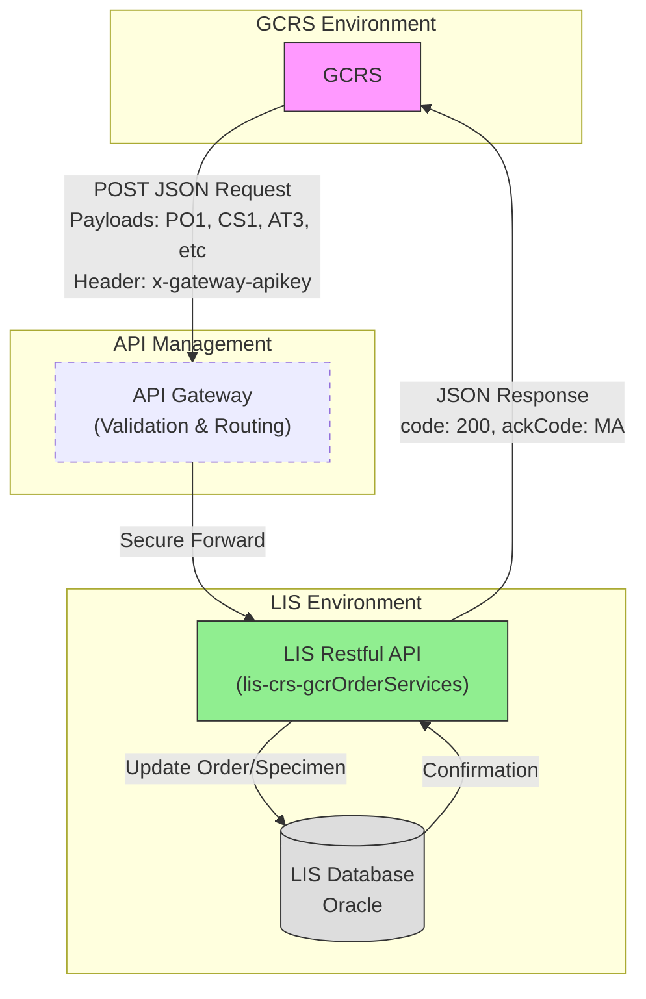
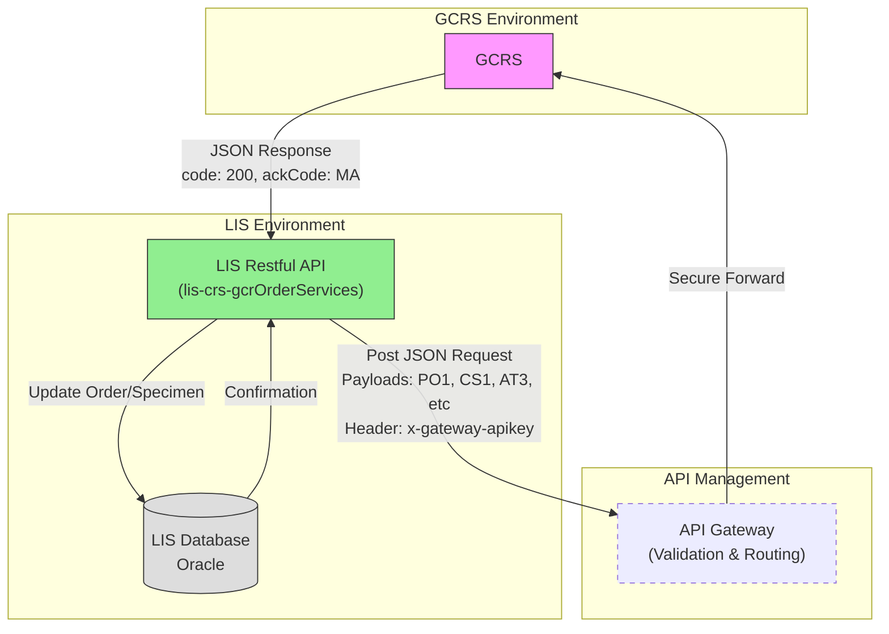

# Receiver

```mermaid
flowchart TD
    %% Node Definitions
    subgraph GCRS_Env [GCRS Environment]
        GCRS["GCRS"]
    end

    subgraph API_Mgmt [API Management]
        Gateway["API Gateway<br/>(Validation & Routing)"]
    end

    subgraph LIS_Env [LIS Environment]
        API["LIS Restful API<br/>(lis-crs-gcrOrderServices)"]
        DB[(LIS Database<br/>Oracle)]
    end

    %% Connections
    GCRS -->|POST JSON Request<br/>Payloads: PO1, CS1, AT3, etc<br/>Header: x-gateway-apikey| Gateway
    Gateway -->|Secure Forward| API
    API -->|Update Order/Specimen| DB
    DB -->|Confirmation| API
    API -->|JSON Response<br/>code: 200, ackCode: MA| GCRS

    %% Styling
    style GCRS fill:#FF99FF,stroke:#333,stroke-width:1px
    style API fill:#90EE90,stroke:#333,stroke-width:1px
    style Gateway stroke-dasharray: 5 5
    style DB fill:#DDD,stroke:#333
```

# Sender

```mermaid
flowchart TB
 subgraph GCRS_Env["GCRS Environment"]
        GCRS["GCRS"]
  end
 subgraph API_Mgmt["API Management"]
        Gateway["API Gateway<br>(Validation &amp; Routing)"]
  end
 subgraph LIS_Env["LIS Environment"]
        API["LIS Restful API<br>(lis-crs-gcrOrderServices)"]
        DB[("LIS Database<br>Oracle")]
  end
    API -- "Post JSON Request<br>Payloads: PO1, CS1, AT3, etc<br>Header: x-gateway-apikey" --> Gateway
    Gateway -- Secure Forward --> GCRS
    API -- Update Order/Specimen --> DB
    DB -- Confirmation --> API
    GCRS -- JSON Response<br>code: 200, ackCode: MA --> API

    style GCRS fill:#FF99FF,stroke:#333,stroke-width:1px
    style Gateway stroke-dasharray: 5 5
    style API fill:#90EE90,stroke:#333,stroke-width:1px
    style DB fill:#DDD,stroke:#333
```