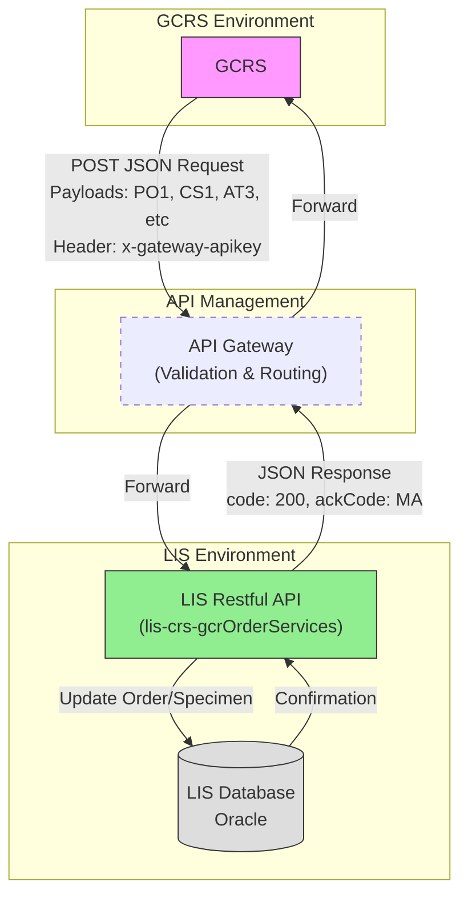
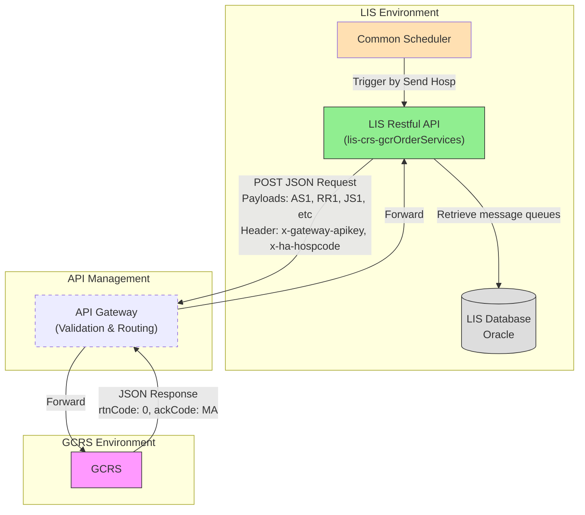

# Receiver

```mermaid
flowchart TD
    %% Node Definitions
    subgraph GCRS_Env [GCRS Environment]
        GCRS["GCRS"]
    end

    subgraph API_Mgmt [API Management]
        Gateway["API Gateway<br/>(Validation & Routing)"]
    end

    subgraph LIS_Env [LIS Environment]
        API["LIS Restful API<br/>(lis-crs-gcrOrderServices)"]
        DB[(LIS Database<br/>Oracle)]
    end

    %% Connections
    GCRS -->|POST JSON Request<br/>Payloads: PO1, CS1, AT3, etc<br/>Header: x-gateway-apikey| Gateway
    Gateway -->|Forward| API
    API -->|Update Order/Specimen| DB
    DB -->|Confirmation| API
    API --> |JSON Response<br/>code: 200, ackCode: MA| Gateway
    Gateway --> |Forward| GCRS

    %% Styling
    style GCRS fill:#FF99FF,stroke:#333,stroke-width:1px
    style API fill:#90EE90,stroke:#333,stroke-width:1px
    style Gateway stroke-dasharray: 5 5
    style DB fill:#DDD,stroke:#333
```

# Sender

```mermaid
flowchart TD
 subgraph LIS_Env["LIS Environment"]
        DB[("LIS Database<br>Oracle")]
        COMM_SCH["Common Scheduler"]
        API["LIS Restful API<br>(lis-crs-gcrOrderServices)"]
  end
 subgraph API_Mgmt["API Management"]
        Gateway["API Gateway<br>(Validation &amp; Routing)"]
  end
 subgraph GCRS_Env["GCRS Environment"]
        GCRS["GCRS"]
  end
    COMM_SCH --> |Trigger by Send Hosp| API
    API --> |Retrieve message queues| DB
    API --> |POST JSON Request<br/>Payloads: AS1, RR1, JS1, etc<br/>Header: x-gateway-apikey, x-ha-hospcode| Gateway
    Gateway --> |Forward| GCRS
    GCRS --> |JSON Response<br/>rtnCode: 0, ackCode: MA|Gateway
    Gateway --> |Forward| API

    style DB fill:#DDD,stroke:#333
    style COMM_SCH fill:#FFE0B2
    style API fill:#90EE90,stroke:#333,stroke-width:1px
    style Gateway stroke-dasharray: 5 5
    style GCRS fill:#FF99FF,stroke:#333,stroke-width:1px
```
