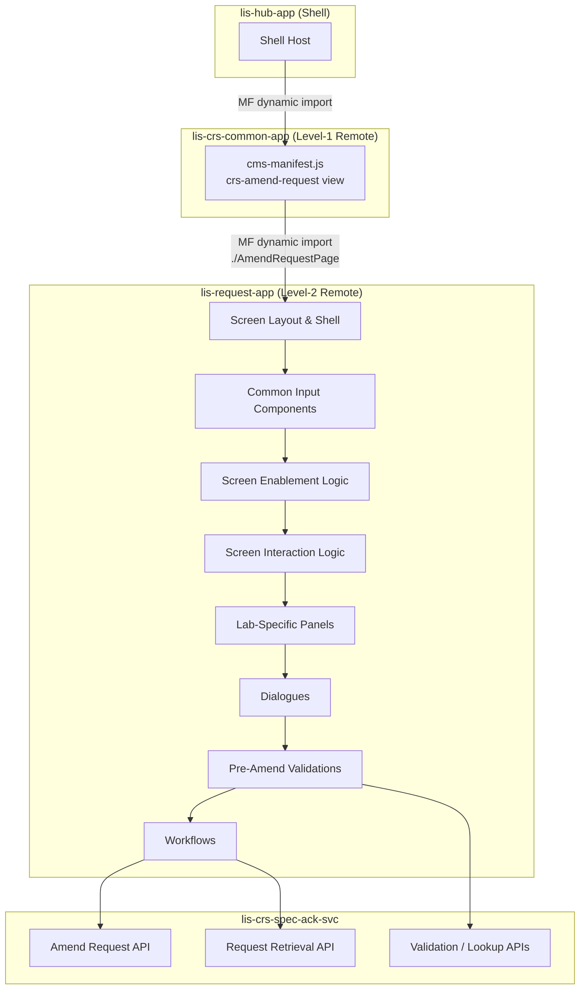

# Amend Request Screen — Migration Plan

> [!info] Purpose
> This document tracks the full migration of the legacy Adobe Flex **Amend Request** screen to the React micro-frontend architecture (`lis-request-app`). It serves as the living task list for AI-assisted coding and will be updated continuously as work progresses.

## Architecture Reference

- [[LIS/ECP/Micro-Frontend-Backend Architecture/00 - Overview|00 — CRS Revamp System Overview]]
- [[LIS/ECP/Micro-Frontend-Backend Architecture/02 - Micro-Frontend Architecture|02 — Micro-Frontend Architecture]]
- [[LIS/ECP/Micro-Frontend-Backend Architecture/03 - Backend Microservices|03 — Backend Microservices]]

**Target Repositories**

| Layer | Repository | Port | Notes |
|---|---|---|---|
| Frontend (new) | `lis-request-app` | TBD | New Remote Plugin MFE; owns Amend Request screen alongside Registration |
| Frontend (consumer) | `lis-crs-common-app` | 3010 | Consumes `lis-request-app` via Webpack Module Federation |
| Backend | `lis-crs-spec-ack-svc` | 8118 | `CrsAmendController` — primary amend API |
| Hub BFF | `lis-hub-svc` | 5000 | Auth, dictionary, default values via Hub API |

**MFE Integration**

`lis-request-app` follows the same sub-remote pattern as `lab-crs-app`:

```
lis-hub-app  →  lis-crs-common-app  →  lis-request-app
  (Shell)          (Level-1 Remote)       (Level-2 Remote)
```

- `lis-request-app` exposes Amend Request screen (e.g. `./AmendRequestPage`)
- `lis-crs-common-app` consumes it via `craco.config.js` Module Federation config
- `lis-crs-common-app` registers the `crs-amend-request` view in its `cms-manifest.js` and renders the consumed component

**Key Constraints**
- `lis-request-app` is shared with [[CRS/Revamp/Registration Migration Plan|Registration]] — both screens live in the same MFE remote
- `lis-crs-common-app` already consumes `lis-request-app`; only a new view registration is needed
- Amend Request component wrapped with scoped Emotion cache (`key: "request"`) via `renderReactComponent`
- State access through `LisApiContext` only — no direct Zustand store imports from the Shell
- All API calls via `apiContext.request` (configured Axios with Bearer JWT + `ServiceParameterVo` headers)
- Backend responses follow `ResultDataResponse<T>` envelope; all data operations use `POST`

---

## Knowledge Base Reference

- [[Knowledge Base/01_Screens/Amend Request/_Amend_Request_Overview|Amend Request Screen Overview]]

---

## Screen Overview

The Amend Request screen allows authorised laboratory staff to modify the request information of an already-registered specimen request without creating a new request. Staff retrieve an existing request by its request number, review the patient demographic details (read-only), and edit the request information fields before confirming the amendment.

It consists of:

1. **Request No. Input + Action Buttons** — Entry point; Amend / Clear / Input Specimen No. / Send Out / Print Send Out / Print Form
2. **Patient Demographic Panel** — HKID, Encounter, Name (English + Chinese), Sex, Age, Age Unit — all read-only after retrieval
3. **Request Information Panel** — Category, Pay Code, Clinical Detail, Reference, Comment, Bill, Urgency, Confidential, Private, Bed, Request Doctor, Request Location, Report Location, Report Copy, Specimen Datetimes (Collect / Request / Arrival)
4. **Data Retention Panel** — Permanent / Follow Laboratory radio buttons (General Lab only)
5. **Lab-Specific Panels** — ANAT / BBNK / MICR-VIRO (conditionally shown based on retrieved request)

Legacy implementation: Adobe Flex (ActionScript/MXML), MVVM with Parsley DI.

**Epics:** LISP-220 · LISP-222 · LISP-223 · LISP-229

---

## Migration Scope



---

## Task List

> [!tip] Status Legend
> - `[ ]` — Pending
> - `[/]` — In Progress
> - `[x]` — Completed
> - `[-]` — Skipped / Not Applicable

---

### Phase 0 — View Registration in `lis-request-app`

> [!note]
> `lis-request-app` is already scaffolded for the Registration screen. Phase 0 here covers only the additions needed to register Amend Request as a second screen in the same MFE.

#### 0A — New screen in `lis-request-app`

| # | Task | Status | Notes |
|---|---|---|---|
| 0A.1 | Expose `./AmendRequestPage` in `ModuleFederationPlugin` in `craco.config.js` | `[ ]` | Add alongside existing `./RegistrationPage` expose |
| 0A.2 | Scaffold `AmendRequest/` folder structure under `src/screens/` | `[ ]` | Components, hooks, types, api sub-folders — mirror `Registration/` layout |
| 0A.3 | Configure Emotion scoped cache for Amend Request root | `[ ]` | `key: "request"` in `renderReactComponent` (shared with Registration) |

#### 0B — Integration into `lis-crs-common-app`

| # | Task | Status | Notes |
|---|---|---|---|
| 0B.1 | Register `crs-amend-request` view in `cms-manifest.js` | `[ ]` | Add to `views[]` array; set `menuRoute: "AmendRequest"` |
| 0B.2 | Wire `onWillDisplayView` in `plugin-manifest.module.ts` to lazy-import `./AmendRequestPage` from `LisRequestApp` | `[ ]` | `const Component = await import('LisRequestApp/AmendRequestPage')` |
| 0B.3 | Pass `apiContext` down to Amend Request component via prop or Context | `[ ]` | Same bridge pattern as Registration |

---

### Phase 1 — Common Reusable Components

> [!note]
> Components marked **[Reuse]** are already built for Registration — wire them in rather than rebuilding.

| # | Task | Status | Reference |
|---|---|---|---|
| 1.1 | **Request No. Input Component** — free-text entry, triggers request retrieval on confirm; display-only when retrieved | `[ ]` | [[Knowledge Base/01_Screens/Amend Request/Workflows/Request Retrieval/Retrieve Request\|Retrieve Request]] |
| 1.2 | **Location Input Component** — 3-part composite (Hospital + Specialty + Ward/Sub-Spec) **[Reuse]** | `[ ]` | Used for Req Loc, Rpt Loc, Copy Loc |
| 1.3 | **Doctor Input Component** — 2-part composite (Hospital + Doctor code/name) **[Reuse]** | `[ ]` | [[Knowledge Base/01_Screens/Amend Request/Interactions/Doctor Description\|Doctor Description]] |
| 1.4 | **DateTime Input Component** — date+time picker **[Reuse]** | `[ ]` | Used for Collect / Arrive / Request datetimes |
| 1.5 | **Lab Selection Component** — CRS multi-match picker when request found in multiple labs | `[ ]` | [[Knowledge Base/01_Screens/Amend Request/Components/Laboratory Selection\|Laboratory Selection]] |

---

### Phase 2 — Screen Layout

| # | Task | Status | Reference |
|---|---|---|---|
| 2.1 | **Request No. Input + Action Buttons area** — Request No. field, Amend / Clear buttons always present; Input Specimen No. / Send Out / Print Send Out / Print Form conditional | `[ ]` | [[Knowledge Base/01_Screens/Amend Request/Components/Buttons\|Buttons]] |
| 2.2 | **Patient Demographic Panel** — HKID, Encounter, Name (English + Chinese), Sex, Age, Age Unit; all read-only | `[ ]` | [[Knowledge Base/01_Screens/Amend Request/Components/Patient Panel\|Patient Panel]] (CRST-771) |
| 2.3 | **Request Information Panel** — Category, Pay Code, Clinical Detail, Reference, Comment, Bill, Urgency, Confidential, Private, Bed, Request Doctor, Request Loc, Report Loc, Report Copy, Collect / Request / Arrival datetimes | `[ ]` | [[Knowledge Base/01_Screens/Amend Request/Components/Request Info Panel\|Request Info Panel]] (CRST-772) |
| 2.4 | **Data Retention Panel** — Permanent / Follow Laboratory radio buttons; General Lab only; controlled by LAB_FUNCTION access right | `[ ]` | [[Knowledge Base/01_Screens/Amend Request/Components/Data Retention Panel\|Data Retention Panel]] (CRST-776) |
| 2.5 | **Urgency Color** — red highlight on Request Info Panel when Urgency = Urgent | `[ ]` | [[Knowledge Base/01_Screens/Amend Request/Interactions/Urgency Color\|Urgency Color]] (CRST-788) |

---

### Phase 3 — Screen Enablement Logic

Controls which panels/fields are enabled or disabled based on screen state.

| # | Task | Status | Reference |
|---|---|---|---|
| 3.1 | **Default Opening Behaviour** — Request No. input enabled; Patient + Request Info panels disabled; Amend button disabled | `[ ]` | [[Knowledge Base/01_Screens/Amend Request/Interactions/Default Focus - Initial\|Default Focus – Initial]] (CRST-785) |
| 3.2 | **Object Enablement After Retrieval** — comprehensive field/button matrix; enable editable fields, keep patient panel read-only | `[ ]` | [[Knowledge Base/01_Screens/Amend Request/Enablement/Object Enablement After Retrieval\|Object Enablement After Retrieval]] (CRST-778) |
| 3.3 | **Input Specimen No. Button Visibility** — shown only when USID lab option is enabled | `[ ]` | [[Knowledge Base/01_Screens/Amend Request/Components/Buttons\|Buttons]] |
| 3.4 | **Send Out / Print Send Out / Print Form Button Visibility** — shown only when Sendout function is enabled | `[ ]` | [[Knowledge Base/01_Screens/Amend Request/Components/Buttons\|Buttons]] |
| 3.5 | **ANAT Panel Visibility** — shown when retrieved request belongs to ANAT lab | `[ ]` | [[Knowledge Base/01_Screens/Amend Request/Components/ANAT Panel/ANAT Panel — Enablement\|ANAT Panel Enablement]] (CRST-821) |
| 3.6 | **BBNK Panel Visibility** — shown when retrieved request belongs to Blood Bank lab | `[ ]` | [[Knowledge Base/01_Screens/Amend Request/Components/BBNK Panel/BBNK Panel Enablement\|BBNK Panel Enablement]] (CRST-827) |
| 3.7 | **MICR-VIRO Panel Visibility** — shown when retrieved request belongs to MICR or VIRO lab | `[ ]` | [[Knowledge Base/01_Screens/Amend Request/Components/MICR-VIRO Panel/MICR-VIRO Panel — Enablement\|MICR-VIRO Panel Enablement]] (CRST-829) |
| 3.8 | **Data Retention Panel Enablement** — enabled only after retrieval for a lab number; access controlled by LAB_FUNCTION right | `[ ]` | [[Knowledge Base/01_Screens/Amend Request/Components/Data Retention Panel\|Data Retention Panel]] (CRST-776) |

---

### Phase 4 — Screen Interaction Logic

Field-level cross-field interactions and dynamic behaviours.

| # | Task | Status | Reference |
|---|---|---|---|
| 4.1 | **Default Focus (Initial)** — cursor starts on Request No. field when screen opens | `[ ]` | [[Knowledge Base/01_Screens/Amend Request/Interactions/Default Focus - Initial\|Default Focus – Initial]] (CRST-785) |
| 4.2 | **Default Focus after Request No.** — focus moves to Category field after successful request retrieval | `[ ]` | [[Knowledge Base/01_Screens/Amend Request/Interactions/Default Focus - After Request No.\|Default Focus – After Request No.]] (CRST-786) |
| 4.3 | **Tab Sequence** — DB-driven tab order through editable fields (`OBJECT_ATTRIBUTE` table, function=`AMEND`) | `[ ]` | [[Knowledge Base/01_Screens/Amend Request/Interactions/Tab Sequence\|Tab Sequence]] (CRST-787) |
| 4.4 | **Copy Request Date to Collection Date** — auto-populate Collection Date from Request Date on change | `[ ]` | [[Knowledge Base/01_Screens/Amend Request/Interactions/Copy Request Date to Collection Date\|Copy Request Date to Collection Date]] (CRST-789) |
| 4.5 | **Doctor Description** — auto-populate doctor full name and department when doctor code is selected | `[ ]` | [[Knowledge Base/01_Screens/Amend Request/Interactions/Doctor Description\|Doctor Description]] (CRST-790) |
| 4.6 | **Location Interaction — Change Doctor Hospital** — auto-sync doctor hospital when Request Location hospital changes | `[ ]` | [[Knowledge Base/01_Screens/Amend Request/Interactions/Location Interaction - Change Doctor Hospital\|Location – Change Doctor Hospital]] (CRST-791) |
| 4.7 | **Location Interaction — Private Referral** — set Private flag automatically when a private referral location is selected | `[ ]` | [[Knowledge Base/01_Screens/Amend Request/Interactions/Location Interaction - Private Referral\|Location – Private Referral]] (CRST-792) |
| 4.8 | **Clear Button** — show confirmation dialogue; reset all fields and return screen to initial state | `[ ]` | [[Knowledge Base/01_Screens/Amend Request/Interactions/Clear Button\|Clear Button]] (CRST-794) |
| 4.9 | **Urgency Color Interaction** — apply / remove red highlight on Request Info Panel based on Urgency value | `[ ]` | [[Knowledge Base/01_Screens/Amend Request/Interactions/Urgency Color\|Urgency Color]] (CRST-788) |

---

### Phase 5 — Lab-Specific Panels

#### 5A — ANAT Panel (Anatomical Pathology)

| # | Task | Status | Reference |
|---|---|---|---|
| 5A.1 | **ANAT Panel container** — conditional render; shown only for ANAT requests | `[ ]` | [[Knowledge Base/01_Screens/Amend Request/Components/ANAT Panel/ANAT Panel — Enablement\|ANAT Panel Enablement]] (CRST-821) |
| 5A.2 | **ANAT Panel Enablement** — field-level enablement rules within the panel | `[ ]` | [[Knowledge Base/01_Screens/Amend Request/Components/ANAT Panel/ANAT Panel — Enablement\|ANAT Panel Enablement]] (CRST-821) |
| 5A.3 | **ANAT Panel Load Data** — populate ANAT fields from AP_REQUEST table on retrieval | `[ ]` | [[Knowledge Base/01_Screens/Amend Request/Components/ANAT Panel/ANAT Panel — Load Data\|ANAT Panel Load Data]] (CRST-822) |
| 5A.4 | **ANAT Panel Tab Sequence** — tab order through ANAT-specific fields | `[ ]` | [[Knowledge Base/01_Screens/Amend Request/Components/ANAT Panel/ANAT Panel — Tab Sequence\|ANAT Panel Tab Sequence]] (CRST-823) |

#### 5B — BBNK Panel (Blood Bank)

| # | Task | Status | Reference |
|---|---|---|---|
| 5B.1 | **BBNK Panel container** — conditional render; shown only for Blood Bank requests | `[ ]` | [[Knowledge Base/01_Screens/Amend Request/Components/BBNK Panel/BBNK Panel Enablement\|BBNK Panel Enablement]] (CRST-827) |
| 5B.2 | **BBNK Panel Enablement** — panel visibility and component enablement rules | `[ ]` | [[Knowledge Base/01_Screens/Amend Request/Components/BBNK Panel/BBNK Panel Enablement\|BBNK Panel Enablement]] (CRST-827) |
| 5B.3 | **BBNK Panel Load Data** — populate Blood Bank fields on retrieval | `[ ]` | [[Knowledge Base/01_Screens/Amend Request/Components/BBNK Panel/BBNK Load Data\|BBNK Load Data]] (CRST-828) |
| 5B.4 | **BBNK Panel Tab Sequence** — tab order through Blood Bank fields | `[ ]` | [[Knowledge Base/01_Screens/Amend Request/Components/BBNK Panel/BBNK Panel Tab Sequence\|BBNK Tab Sequence]] (CRST-830) |

#### 5C — MICR-VIRO Panel (Microbiology / Virology)

| # | Task | Status | Reference |
|---|---|---|---|
| 5C.1 | **MICR-VIRO Panel container** — conditional render; shown only for MICR or VIRO requests | `[ ]` | [[Knowledge Base/01_Screens/Amend Request/Components/MICR-VIRO Panel/MICR-VIRO Panel — Enablement\|MICR-VIRO Panel Enablement]] (CRST-829) |
| 5C.2 | **MICR-VIRO Panel Enablement** — panel visibility and component enablement rules | `[ ]` | [[Knowledge Base/01_Screens/Amend Request/Components/MICR-VIRO Panel/MICR-VIRO Panel — Enablement\|MICR-VIRO Panel Enablement]] (CRST-829) |
| 5C.3 | **MICR-VIRO Panel Load Data** — populate Microbiology/Virology fields on retrieval | `[ ]` | [[Knowledge Base/01_Screens/Amend Request/Components/MICR-VIRO Panel/MICR-VIRO Panel — Load Data\|MICR-VIRO Load Data]] (CRST-834) |
| 5C.4 | **MICR-VIRO Panel Tab Sequence** — tab order through MBS/VRS fields | `[ ]` | [[Knowledge Base/01_Screens/Amend Request/Components/MICR-VIRO Panel/MICR-VIRO Panel — Tab Sequence\|MICR-VIRO Tab Sequence]] (CRST-835) |

---

### Phase 6 — Dialogues

| # | Task | Status | Reference |
|---|---|---|---|
| 6.1 | **USID Input Dialogue** — specimen number entry; validates USID existence | `[ ]` | [[Knowledge Base/01_Screens/Amend Request/Components/USID Input Dialogue\|USID Input Dialogue]] (CRST-817) |
| 6.2 | **Report Copy Input Dialogue** — add/edit additional report copy locations | `[ ]` | [[Knowledge Base/01_Screens/Amend Request/Components/Report Copy Input Dialogue\|Report Copy Input Dialogue]] (CRST-793) |
| 6.3 | **Laboratory Selection Dialogue** — CRS multi-match picker when request is found in multiple labs | `[ ]` | [[Knowledge Base/01_Screens/Amend Request/Components/Laboratory Selection\|Laboratory Selection]] (CRST-856) |
| 6.4 | **Change Reason Dialogue** — required popup when specific tracked fields are modified; captures reason for change | `[ ]` | [[Knowledge Base/01_Screens/Amend Request/Workflows/Save Actions/Change Reason Dialogue\|Change Reason Dialogue]] (CRST-800) |
| 6.5 | **Private Change Reason Dialogue** — required popup when Private or Lab Only status changes | `[ ]` | [[Knowledge Base/01_Screens/Amend Request/Workflows/Save Actions/Private Change Reason Dialogue\|Private Change Reason Dialogue]] (CRST-799) |
| 6.6 | **User Validation Dialogue** — secondary authentication prompt for privileged amend actions | `[ ]` | [[Knowledge Base/01_Screens/Amend Request/Validations/User Validation\|User Validation]] (CRST-798) |
| 6.7 | **Special Blood Dialogue** — BBNK-specific; blood category selection with three-state checkboxes | `[ ]` | [[Knowledge Base/01_Screens/Amend Request/Components/BBNK Panel/Special Blood Dialogue\|Special Blood Dialogue]] (CRST-833) |

---

### Phase 7 — Pre-Amend Validations

All triggered when user clicks **Amend**, before the request is sent to the server.

| # | Task | Status | Reference |
|---|---|---|---|
| 7.1 | **Amend Request Validation (coordinator)** — orchestrates all validators; determines order and short-circuit logic | `[ ]` | [[Knowledge Base/01_Screens/Amend Request/Validations/Amend Request Validation\|Amend Request Validation]] (CRST-797) |
| 7.2 | **Clinical Detail / Reference / Comment Validation** — character limit enforcement | `[ ]` | [[Knowledge Base/01_Screens/Amend Request/Validations/Clinical Detail Reference Comment Validation\|Clinical Detail Validation]] (CRST-892) |
| 7.3 | **Datetime Validation** — specimen datetime rules (Collect ≤ Arrive ≤ Request, future date guards) | `[ ]` | [[Knowledge Base/01_Screens/Amend Request/Validations/Datetime Validation\|Datetime Validation]] (CRST-893) |
| 7.4 | **Location Validation** — Request / Report / Report Copy location rules | `[ ]` | [[Knowledge Base/01_Screens/Amend Request/Validations/Location Validation\|Location Validation]] (CRST-895) |
| 7.5 | **Confidential Validation** | `[ ]` | [[Knowledge Base/01_Screens/Amend Request/Validations/Confidential Validation\|Confidential Validation]] (CRST-896) |
| 7.6 | **Bill Validation** | `[ ]` | [[Knowledge Base/01_Screens/Amend Request/Validations/Bill Validation\|Bill Validation]] (CRST-897) |
| 7.7 | **Urgency Validation** | `[ ]` | [[Knowledge Base/01_Screens/Amend Request/Validations/Urgency Validation\|Urgency Validation]] (CRST-898) |
| 7.8 | **Lab Only Validation** | `[ ]` | [[Knowledge Base/01_Screens/Amend Request/Validations/Lab Only Validation\|Lab Only Validation]] (CRST-899) |
| 7.9 | **Request Doctor Validation** — doctor code and hospital matching | `[ ]` | [[Knowledge Base/01_Screens/Amend Request/Validations/Request Doctor Validation\|Request Doctor Validation]] (CRST-894) |
| 7.10 | **Clinical Detail on Sendout Request Validation** — mandatory clinical detail for sendout requests | `[ ]` | [[Knowledge Base/01_Screens/Amend Request/Validations/Clinical Detail on Sendout Request Validation\|Sendout Clinical Detail Validation]] (CRST-900) |
| 7.11 | **MICR-VIRO Validation** — Microbiologist, Specimen Type, Treatment Category rules | `[ ]` | [[Knowledge Base/01_Screens/Amend Request/Validations/MICR-VIRO Validation\|MICR-VIRO Validation]] (CRST-836) |

---

### Phase 8 — Workflows

#### 8A — Request Retrieval

| # | Task | Status | Reference |
|---|---|---|---|
| 8A.1 | **Retrieve Request** — main retrieval workflow; data mapping from response to all panels | `[ ]` | [[Knowledge Base/01_Screens/Amend Request/Workflows/Request Retrieval/Retrieve Request\|Retrieve Request]] (CRST-779) |
| 8A.2 | **Initial Values Snapshot** — capture before-image of all editable fields immediately after retrieval; used for change detection | `[ ]` | [[Knowledge Base/01_Screens/Amend Request/Workflows/Request Retrieval/Initial Values Snapshot\|Initial Values Snapshot]] (CRST-780) |
| 8A.3 | **Request Not Found Message** — display error when request number does not exist | `[ ]` | [[Knowledge Base/01_Screens/Amend Request/Workflows/Request Retrieval/Request Not Found Message\|Request Not Found]] (CRST-783) |
| 8A.4 | **Request Cancelled Message** — display warning when retrieved request is in cancelled status | `[ ]` | [[Knowledge Base/01_Screens/Amend Request/Workflows/Request Retrieval/Request Cancelled Message\|Request Cancelled]] (CRST-782) |
| 8A.5 | **Not Supported Lab Message** — display restriction message when lab is not supported in CRS | `[ ]` | [[Knowledge Base/01_Screens/Amend Request/Workflows/Request Retrieval/Not Supported Lab Message\|Not Supported Lab]] (CRST-781) |
| 8A.6 | **Request Retrieval from Other Screen** — handle pre-populated Request No. passed from source screens | `[ ]` | [[Knowledge Base/01_Screens/Amend Request/Workflows/Request Retrieval/Request Retrieval from Other Screen\|Retrieval from Other Screen]] (CRST-784) |
| 8A.7 | **Laboratory Selection** — present multi-match picker when request is found in more than one lab | `[ ]` | [[Knowledge Base/01_Screens/Amend Request/Components/Laboratory Selection\|Laboratory Selection]] (CRST-856) |

#### 8B — Amend Save Sequence

| # | Task | Status | Reference |
|---|---|---|---|
| 8B.1 | **Change Reason Dialogue trigger** — detect tracked-field changes by comparing current values against initial snapshot; open Change Reason Dialogue when changes found | `[ ]` | [[Knowledge Base/01_Screens/Amend Request/Workflows/Save Actions/Change Reason Dialogue\|Change Reason Dialogue]] (CRST-800) |
| 8B.2 | **Regenerate Report Determination** — prompt for report regeneration when request has already been printed | `[ ]` | [[Knowledge Base/01_Screens/Amend Request/Workflows/Save Actions/Regenerate Report Determination\|Regenerate Report Determination]] (CRST-801) |
| 8B.3 | **Report Copy Determination** — recalculate primary report destination from Report Copy list | `[ ]` | [[Knowledge Base/01_Screens/Amend Request/Workflows/Save Actions/Report Copy Determination\|Report Copy Determination]] (CRST-807) |
| 8B.4 | **Change Audit** — write field change audit entries to TESTRSLT_AUDIT for all modified fields | `[ ]` | [[Knowledge Base/01_Screens/Amend Request/Workflows/Save Actions/Change Audit\|Change Audit]] (CRST-803) |
| 8B.5 | **Operation Audit** — write sendout form audit entries | `[ ]` | [[Knowledge Base/01_Screens/Amend Request/Workflows/Save Actions/Operation Audit\|Operation Audit]] (CRST-806) |
| 8B.6 | **Doctor Modified Alert** — display confirmation alert when the requesting doctor has been changed | `[ ]` | [[Knowledge Base/01_Screens/Amend Request/Workflows/Save Actions/Doctor Modified Alert\|Doctor Modified Alert]] (CRST-814) |
| 8B.7 | **Report Printed in TB/DH Form Alert** — display reprint warning when TB or DH report form was previously printed | `[ ]` | [[Knowledge Base/01_Screens/Amend Request/Workflows/Save Actions/Report Printed in TB DH Form Alert\|TB/DH Form Alert]] (CRST-815) |
| 8B.8 | **USID Data Conversion** — prepare specimen relation data for saving | `[ ]` | [[Knowledge Base/01_Screens/Amend Request/Workflows/Save Actions/USID Data Conversion\|USID Data Conversion]] (CRST-819) |
| 8B.9 | **USID Not Found Alert** — display warning when entered USID does not exist in the system | `[ ]` | [[Knowledge Base/01_Screens/Amend Request/Workflows/Save Actions/USID Not Found Alert\|USID Not Found Alert]] (CRST-818) |
| 8B.10 | **USID Audit** — write specimen relation audit entries (types 559, 560, 564, 565) | `[ ]` | [[Knowledge Base/01_Screens/Amend Request/Workflows/Save Actions/USID Audit\|USID Audit]] (CRST-820) |
| 8B.11 | **Create PHLC Lab Order** — create PHLC outbound message for eligible send-out requests | `[ ]` | [[Knowledge Base/01_Screens/Amend Request/Workflows/Save Actions/Create PHLC Lab Order\|Create PHLC Lab Order]] (CRST-816) |
| 8B.12 | **Print Send Out Form** — auto-print triggering conditions and print sequence post-amend | `[ ]` | [[Knowledge Base/01_Screens/Amend Request/Workflows/Save Actions/Print Send Out Form\|Print Send Out Form]] (CRST-812) |
| 8B.13 | **Amend Action Result Message** — display success or failure messages (501, 1992, 3861, 4332) | `[ ]` | [[Knowledge Base/01_Screens/Amend Request/Workflows/Save Actions/Amend Action Result Message\|Amend Action Result Message]] (CRST-808) |
| 8B.14 | **Clear Screen** — reset all panels and return to initial state after successful amendment | `[ ]` | [[Knowledge Base/01_Screens/Amend Request/Workflows/Save Actions/Clear Screen\|Clear Screen]] (CRST-810) |

#### 8C — ANAT Save Actions

| # | Task | Status | Reference |
|---|---|---|---|
| 8C.1 | **ANAT Amend Request** — ANAT-specific amend processing and payload assembly | `[ ]` | [[Knowledge Base/01_Screens/Amend Request/Workflows/Save Actions/ANAT/ANAT Amend Request\|ANAT Amend Request]] (CRST-824) |
| 8C.2 | **ANAT Change Audit** — ANAT field change audit formatting and submission | `[ ]` | [[Knowledge Base/01_Screens/Amend Request/Workflows/Save Actions/ANAT/ANAT Change Audit\|ANAT Change Audit]] (CRST-825) |
| 8C.3 | **ANAT Regenerate Report Alert** — ANAT-specific report regeneration confirmation | `[ ]` | [[Knowledge Base/01_Screens/Amend Request/Workflows/Save Actions/ANAT/ANAT Regenerate Report Alert\|ANAT Regenerate Report Alert]] (CRST-826) |

#### 8D — BBNK Save Actions

| # | Task | Status | Reference |
|---|---|---|---|
| 8D.1 | **BBNK Amend Request** — Blood Bank amend processing with ZIKV special handling | `[ ]` | [[Knowledge Base/01_Screens/Amend Request/Workflows/Save Actions/BBNK/BBNK Amend Request\|BBNK Amend Request]] (CRST-831) |
| 8D.2 | **BBNK Change Audit** — Blood Bank field change audit formatting and submission | `[ ]` | [[Knowledge Base/01_Screens/Amend Request/Workflows/Save Actions/BBNK/BBNK Change Audit\|BBNK Change Audit]] (CRST-832) |

#### 8E — MICR-VIRO Save Actions

| # | Task | Status | Reference |
|---|---|---|---|
| 8E.1 | **MICR-VIRO Amend Request** — Microbiology/Virology amend processing and payload assembly | `[ ]` | [[Knowledge Base/01_Screens/Amend Request/Workflows/Save Actions/MICR-VIRO/MICR-VIRO Amend Request\|MICR-VIRO Amend Request]] (CRST-837) |
| 8E.2 | **MICR-VIRO Change Audit** — MICR-VIRO field change audit formatting and submission | `[ ]` | [[Knowledge Base/01_Screens/Amend Request/Workflows/Save Actions/MICR-VIRO/MICR-VIRO Change Audit\|MICR-VIRO Change Audit]] (CRST-838) |

---

### Phase 9 — Backend API

All endpoints expected in `lis-crs-spec-ack-svc` under `CrsAmendController`. Requests use `POST` with `ResultDataResponse<T>` response envelope.

| # | Task | Status | Notes |
|---|---|---|---|
| 9.1 | **Retrieve Request by Request No.** — fetch full request data for display | `[ ]` | Check `CrsAmendController` or `CrsSearchController` |
| 9.2 | **Amend Request endpoint (general)** — main POST to persist amended request | `[ ]` | `CrsAmendController` POST endpoint |
| 9.3 | **ANAT Amend Request endpoint** — ANAT-specific fields | `[ ]` | |
| 9.4 | **BBNK Amend Request endpoint** — Blood Bank-specific fields | `[ ]` | |
| 9.5 | **MICR-VIRO Amend Request endpoint** — Microbiology/Virology-specific fields | `[ ]` | |
| 9.6 | **Change Audit endpoint** — write TESTRSLT_AUDIT entries | `[ ]` | May be part of amend payload or separate call |
| 9.7 | **Doctor search / lookup endpoint** — verify / reuse existing from Registration | `[ ]` | May already exist in Hub BFF |
| 9.8 | **Location search / lookup endpoint** — verify / reuse existing from Registration | `[ ]` | May already exist in Hub BFF |
| 9.9 | **USID lookup endpoint** — check specimen number existence | `[ ]` | |
| 9.10 | **Lab options / configuration endpoint** — tab sequence (`OBJECT_ATTRIBUTE`), lab options | `[ ]` | Reuse from Registration if already built |

---

### Phase 10 — Integration & Testing

| # | Task | Status | Notes |
|---|---|---|---|
| 10.1 | Unit tests — common input components (Request No. input, Lab Selection) | `[ ]` | |
| 10.2 | Unit tests — validation logic (all Phase 7 validators) | `[ ]` | |
| 10.3 | Unit tests — change detection (Initial Values Snapshot vs. modified state) | `[ ]` | |
| 10.4 | Unit tests — workflow hooks (retrieval, save sequence) | `[ ]` | |
| 10.5 | Integration test — full amend save flow (happy path, no tracked-field changes) | `[ ]` | |
| 10.6 | Integration test — amend with Change Reason Dialogue triggered | `[ ]` | |
| 10.7 | Integration test — ANAT amend | `[ ]` | |
| 10.8 | Integration test — BBNK amend | `[ ]` | |
| 10.9 | Integration test — MICR-VIRO amend | `[ ]` | |
| 10.10 | Integration test — retrieval from another screen (pre-populated Request No.) | `[ ]` | |
| 10.11 | Accessibility — keyboard tab sequence matches DB config | `[ ]` | |

---

## User Story Map

| CRST ID | Story | Phase |
|---|---|---|
| CRST-771 | Patient Demographic Panel | 2.2 |
| CRST-772 | Request Information Panel | 2.3 |
| CRST-775 | Buttons | 2.1 |
| CRST-776 | Data Retention Selection Panel | 2.4 |
| CRST-778 | Object Enablement After Retrieval | 3.2 |
| CRST-779 | Retrieve Request | 8A.1 |
| CRST-780 | Initial Values of Request | 8A.2 |
| CRST-781 | Not Supported Lab Message | 8A.5 |
| CRST-782 | Request Cancelled Message | 8A.4 |
| CRST-783 | Request Not Found Message | 8A.3 |
| CRST-784 | Request Retrieval from Other Screen | 8A.6 |
| CRST-856 | Laboratory Selection | 8A.7 |
| CRST-785 | Default Focus (Initial) | 4.1 |
| CRST-786 | Default Focus after Request No. | 4.2 |
| CRST-787 | Tab Sequence | 4.3 |
| CRST-788 | Urgency Color | 4.9 |
| CRST-789 | Copy Request Date to Collection Date | 4.4 |
| CRST-790 | Doctor Description | 4.5 |
| CRST-791 | Location Interaction — Change Doctor Hospital | 4.6 |
| CRST-792 | Location Interaction — Private Referral | 4.7 |
| CRST-793 | Report Copy Input Dialogue | 6.2 |
| CRST-794 | Clear Button | 4.8 |
| CRST-797 | Validation (AmendRequestDataValidator) | 7.1 |
| CRST-892 | Clinical Detail / Reference / Comment Validation | 7.2 |
| CRST-893 | Request Info Datetime Validation | 7.3 |
| CRST-895 | Request / Report / Copy Location Validation | 7.4 |
| CRST-896 | Confidential Validation | 7.5 |
| CRST-897 | Bill Validation | 7.6 |
| CRST-898 | Urgency Validation | 7.7 |
| CRST-899 | Lab Only Validation | 7.8 |
| CRST-900 | Clinical Detail on Sendout Request Validation | 7.10 |
| CRST-894 | Request Doctor Validation | 7.9 |
| CRST-798 | User Validation | 6.6 |
| CRST-799 | Private Change Reason Dialogue | 6.5 |
| CRST-800 | Change Reason Dialogue | 6.4 |
| CRST-801 | Regenerate Report Determination | 8B.2 |
| CRST-803 | Change Audit | 8B.4 |
| CRST-806 | Operation Audit | 8B.5 |
| CRST-807 | Report Copy Determination | 8B.3 |
| CRST-808 | Amend Action Result Message | 8B.13 |
| CRST-810 | Clear Screen | 8B.14 |
| CRST-812 | Print Send Out Form | 8B.12 |
| CRST-813 | Print Send Out Button | 2.1 |
| CRST-814 | Doctor Modified Alert | 8B.6 |
| CRST-815 | Report Printed in TB/DH Form Alert | 8B.7 |
| CRST-816 | Create PHLC Lab Order | 8B.11 |
| CRST-817 | USID Input Dialogue | 6.1 |
| CRST-818 | USID Not Found Alert | 8B.9 |
| CRST-819 | USID Data Conversion | 8B.8 |
| CRST-820 | USID Audit | 8B.10 |
| CRST-821 | ANAT Panel — Enablement | 5A.2 |
| CRST-822 | ANAT Panel — Load Data | 5A.3 |
| CRST-823 | ANAT Panel — Tab Sequence | 5A.4 |
| CRST-824 | ANAT: Amend Request | 8C.1 |
| CRST-825 | ANAT: Change Audit | 8C.2 |
| CRST-826 | ANAT: Regenerate Report Alert | 8C.3 |
| CRST-827 | BBNK Panel — Enablement | 5B.2 |
| CRST-828 | BBNK Panel — Load Data | 5B.3 |
| CRST-830 | BBNK Panel — Tab Sequence | 5B.4 |
| CRST-831 | BBNK: Amend Request | 8D.1 |
| CRST-832 | BBNK: Change Audit | 8D.2 |
| CRST-833 | Special Blood Dialogue | 6.7 |
| CRST-829 | MICR/VIRO Panel — Enablement | 5C.2 |
| CRST-834 | MICR/VIRO Panel — Load Data | 5C.3 |
| CRST-835 | MICR/VIRO Panel — Tab Sequence | 5C.4 |
| CRST-836 | MICR/VIRO Validation | 7.11 |
| CRST-837 | MICR/VIRO: Amend Request | 8E.1 |
| CRST-838 | MICR/VIRO: Change Audit | 8E.2 |

---

## Dependencies & Blockers

> [!warning] Track any blocking items here

| # | Description | Blocking Phase | Status |
|---|---|---|---|
| D.1 | Confirm `CrsAmendController` endpoint contracts (request/response DTOs) | 9.2 | `[ ]` |
| D.2 | Confirm TESTRSLT_AUDIT write mechanism — part of amend payload or separate API? | 8B.4 | `[ ]` |
| D.3 | Confirm dictionary keys for Category, Bill, Urgency, Age Unit used in Amend context | 2.3 | `[ ]` |
| D.4 | Confirm `OBJECT_ATTRIBUTE` table access for Amend tab sequence — via BFF or spec-ack-svc? | 4.3 | `[ ]` |
| D.5 | Confirm PHLC Lab Order creation service contract | 8B.11 | `[ ]` |
| D.6 | Confirm print service API for Send Out Form auto-print | 8B.12 | `[ ]` |
| D.7 | Confirm Change Reason tracked-field list — which specific field changes trigger the dialogue? | 8B.1 | `[ ]` |
| D.8 | Confirm LAB_FUNCTION access right check for Data Retention Panel — via Hub BFF or local? | 3.8 | `[ ]` |

---

## Progress Summary

| Phase | Total Tasks | Completed | In Progress | Pending |
|---|---|---|---|---|
| Phase 0 — View Registration | 6 | 0 | 0 | 6 |
| Phase 1 — Common Components | 5 | 0 | 0 | 5 |
| Phase 2 — Screen Layout | 5 | 0 | 0 | 5 |
| Phase 3 — Enablement | 8 | 0 | 0 | 8 |
| Phase 4 — Interaction | 9 | 0 | 0 | 9 |
| Phase 5 — Lab Panels | 12 | 0 | 0 | 12 |
| Phase 6 — Dialogues | 7 | 0 | 0 | 7 |
| Phase 7 — Validations | 11 | 0 | 0 | 11 |
| Phase 8 — Workflows | 28 | 0 | 0 | 28 |
| Phase 9 — Backend API | 10 | 0 | 0 | 10 |
| Phase 10 — Testing | 11 | 0 | 0 | 11 |
| **Total** | **112** | **0** | **0** | **112** |

---

## Changelog

| Date | Change |
|---|---|
| 2026-03-22 | Initial document created — full task list from Knowledge Base analysis (69 source files, 68 user stories mapped) |
