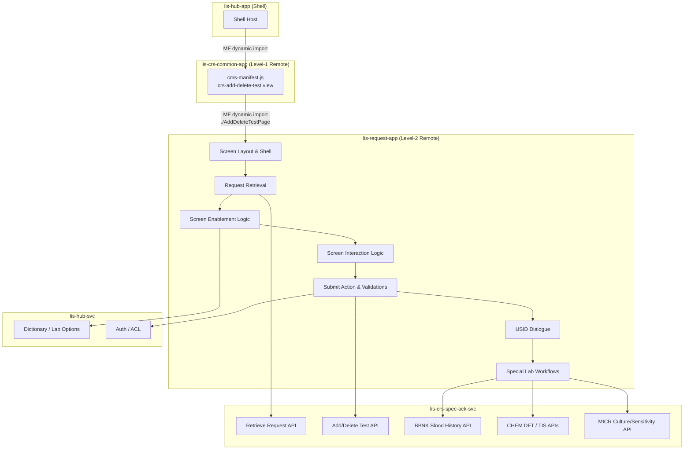

# Add/Delete Test Screen — Migration Plan

> [!info] Purpose
> This document tracks the full migration of the legacy Adobe Flex **Add/Delete Test** (Test Maintenance) screen to the React micro-frontend architecture (`lis-request-app`). It serves as the living task list for AI-assisted coding and will be updated continuously as work progresses.

## Architecture Reference

- [[LIS/ECP/Micro-Frontend-Backend Architecture/00 - Overview|00 — CRS Revamp System Overview]]
- [[LIS/ECP/Micro-Frontend-Backend Architecture/02 - Micro-Frontend Architecture|02 — Micro-Frontend Architecture]]
- [[LIS/ECP/Micro-Frontend-Backend Architecture/03 - Backend Microservices|03 — Backend Microservices]]

**Target Repositories**

| Layer | Repository | Port | Notes |
|---|---|---|---|
| Frontend (new) | `lis-request-app` | TBD | Level-2 Remote Plugin MFE; shared with Registration and Amend Request |
| Frontend (consumer) | `lis-crs-common-app` | 3010 | Consumes `lis-request-app` via Webpack Module Federation |
| Backend (CRS) | `lis-crs-spec-ack-svc` | 8118 | CRS domain service — primary API for test add/delete operations |
| Hub BFF | `lis-hub-svc` | 5000 | Auth, dictionary, lab options via Hub API |

**MFE Integration**

`lis-request-app` is a shared Level-2 Remote alongside Registration and Amend Request:

```
lis-hub-app  →  lis-crs-common-app  →  lis-request-app
  (Shell)          (Level-1 Remote)       (Level-2 Remote)
```

- `lis-request-app` exposes the Add/Delete Test screen (e.g. `./AddDeleteTestPage`)
- `lis-crs-common-app` consumes it via `craco.config.js` Module Federation config
- `lis-crs-common-app` registers the `crs-add-delete-test` view in its `cms-manifest.js` and renders the consumed component

**Key Constraints**
- `lis-request-app` is shared with [[CRS/Revamp/Migration Plan/Frontend/Registration Migration Plan|Registration]] and [[CRS/Revamp/Migration Plan/Frontend/Amend Request Migration Plan|Amend Request]] — repo scaffold already exists; only a new view registration is needed
- Add/Delete Test component wrapped with scoped Emotion cache (`key: "request"`) via `renderReactComponent`
- State access through `LisApiContext` only — no direct Zustand store imports from the Shell
- All API calls via `apiContext.request` (configured Axios with Bearer JWT + `ServiceParameterVo` headers)
- Backend responses follow `ResultDataResponse<T>` envelope; all data operations use `POST`
- Patient Demographics panel is always **read-only** — no patient editing on this screen
- Test Grid uses `display:none` for hidden panels (Ctr/Sub-ctr columns hidden until Special Lab request retrieved) — never conditional unmount

---

## Knowledge Base Reference

- [[Knowledge Base/01_Screens/Add Delete Test/_Add_Delete_Test_Overview|Add/Delete Test Screen Overview]]

---

## Screen Overview

The Add/Delete Test screen allows laboratory staff to add new tests to, or delete existing tests from, a previously registered request. It consists of:

1. **Request No. Input** — Screen entry point; triggers request retrieval on confirm
2. **Patient Demographics Panel** — Name, Location, DOB/Age, Sex, Pay Code — all read-only after retrieval
3. **Test Grid** — DEL toggle column + Specimen, Test Profile, Group, Test Code, Test Name, Ctr, Sub-ctr, Status Date, Optional columns
4. **Test Panel** — Add test input (enabled after retrieval)
5. **Input Specimen No. Button** — USID specimen ID entry; visible for all, enabled for USID-enabled labs only
6. **Submit Button** — Triggers add/delete test action; disabled until retrieval
7. **Clear / Exit Buttons** — Clear resets screen; Exit always enabled
8. **Discharged Text Indicator** — BTH private hospital only; read-only

Key differentiators from Cancel/Wipeout Request screens:
- Tests can be **added** (not just deleted)
- **DEL** toggle column in Test Grid for marking deletion
- **Submit** replaces Cancel/Wipeout action button
- Lab-specific sub-rules apply (BBNK cross-match, CHEM DFT/TIS, MICR culture/sensitivity)

Legacy implementation: Adobe Flex (ActionScript/MXML), MVVM with Parsley DI.

---

## Migration Scope



---

## Task List

> [!tip] Status Legend
> - `[ ]` — Pending
> - `[/]` — In Progress
> - `[x]` — Completed
> - `[-]` — Skipped / Not Applicable
> - `[!]` — Blocked (pending resolution of a dependency)

---

### Phase 0 — View Registration in `lis-request-app`

> [!note]
> `lis-request-app` repository is already scaffolded for Registration and Amend Request. Only a new view entry-point needs to be registered.

| # | Task | Status | Notes |
|---|---|---|---|
| 0.1 | Register `crs-add-delete-test` view in `cms-manifest.js` in `lis-crs-common-app` | `[ ]` | Add to `views[]` array; set `menuRoute: "AddDeleteTest"` |
| 0.2 | Wire `onWillDisplayView` in `plugin-manifest.module.ts` to lazy-import `./AddDeleteTestPage` from `LisRequestApp` | `[ ]` | `const Component = await import('LisRequestApp/AddDeleteTestPage')` |
| 0.3 | Expose `./AddDeleteTestPage` in `ModuleFederationPlugin` in `lis-request-app` `craco.config.js` | `[ ]` | Alongside existing `./RegistrationPage` and `./AmendRequestPage` entries |
| 0.4 | Scaffold `AddDeleteTest/` folder structure under `src/screens/` in `lis-request-app` | `[ ]` | Components, hooks, types, api sub-folders |

---

### Phase 1 — Screen Layout
**Epic:** LISP-261 — Add/Delete Test — Layout

| # | Task | Status | Reference |
|---|---|---|---|
| 1.1 | **Screen shell & root component** — `AddDeleteTestPage` root, Emotion cache wrapper (`key: "request"`), `apiContext` prop wiring | `[ ]` | [[Knowledge Base/01_Screens/Add Delete Test/Components/Default Screen Behavior\|Default Screen Behavior]] |
| 1.2 | **Request No. Input** — text field, enabled on open, triggers retrieval on Enter/confirm | `[ ]` | [[Knowledge Base/01_Screens/Add Delete Test/Components/Default Screen Behavior\|Default Screen Behavior]] |
| 1.3 | **Patient Demographics Panel** — Name, Location, DOB, Age, Sex, Pay Code; always read-only; Discharged indicator (BTH only) | `[ ]` | [[Knowledge Base/01_Screens/Add Delete Test/Components/Default Screen Behavior\|Default Screen Behavior]] |
| 1.4 | **Test Grid** — fixed 10-column layout (DEL, Specimen, Test Profile, Group, Test Code, Test Name, Ctr, Sub-ctr, Status Date, Optional); Ctr/Sub-ctr hidden by default | `[ ]` | [[Knowledge Base/01_Screens/Add Delete Test/Components/Default Screen Behavior\|Default Screen Behavior]] |
| 1.5 | **Test Panel** — add test input field (disabled until retrieval) | `[ ]` | [[Knowledge Base/01_Screens/Add Delete Test/Components/Default Screen Behavior\|Default Screen Behavior]] |
| 1.6 | **Action Buttons** — Submit (disabled on open), Clear (disabled on open), Exit (always enabled), Input Specimen No. (disabled on open) | `[ ]` | [[Knowledge Base/01_Screens/Add Delete Test/Components/Default Screen Behavior\|Default Screen Behavior]] |

---

### Phase 2 — Request Retrieval
**Epic:** LISP-262 — Add/Delete Test — Request Retrieval

| # | Task | Status | Reference |
|---|---|---|---|
| 2.1 | **Laboratory Selection** — lab selection logic applied before retrieval | `[ ]` | [[Knowledge Base/01_Screens/Add Delete Test/Components/Laboratory Selection\|Laboratory Selection]] |
| 2.2 | **Retrieve Request** — POST to retrieve request by request no.; populate Demographics panel and Test Grid on success | `[ ]` | [[Knowledge Base/01_Screens/Add Delete Test/Workflows/Request Retrieval/Retrieve Request\|Retrieve Request]] |
| 2.3 | **Not Supported Lab Message** — display message when selected lab does not support add/delete test | `[ ]` | [[Knowledge Base/01_Screens/Add Delete Test/Workflows/Request Retrieval/Not Supported Lab Message\|Not Supported Lab Message]] |
| 2.4 | **Patient Discharged Message** — display message when patient is discharged | `[ ]` | [[Knowledge Base/01_Screens/Add Delete Test/Workflows/Request Retrieval/Patient Discharged Message\|Patient Discharged Message]] |
| 2.5 | **Private Patient Message** — display message when patient is private | `[ ]` | [[Knowledge Base/01_Screens/Add Delete Test/Workflows/Request Retrieval/Private Patient Message\|Private Patient Message]] |
| 2.6 | **Request Cancelled Message** — display message when request is cancelled | `[ ]` | [[Knowledge Base/01_Screens/Add Delete Test/Workflows/Request Retrieval/Request Cancelled Message\|Request Cancelled Message]] |
| 2.7 | **Request Not Found Message** — display message when request no. does not exist | `[ ]` | [[Knowledge Base/01_Screens/Add Delete Test/Workflows/Request Retrieval/Request Not Found Message\|Request Not Found Message]] |

---

### Phase 3 — Screen Object Enablement
**Epic:** LISP-263 — Add/Delete Test — Screen Object Enablement

| # | Task | Status | Reference |
|---|---|---|---|
| 3.1 | **Object Enablement After Retrieval** — enable Submit, Clear, Input Specimen No., Test Panel; reveal Ctr/Sub-ctr columns for Special Lab requests | `[ ]` | [[Knowledge Base/01_Screens/Add Delete Test/Components/Enablement/Object Enablement After Retrieval\|Object Enablement After Retrieval]] |

---

### Phase 4 — Screen Object Interaction
**Epic:** LISP-264 — Add/Delete Test — Screen Object Interaction

| # | Task | Status | Reference |
|---|---|---|---|
| 4.1 | **Clear Button** — reset all fields; return screen to initial state | `[ ]` | [[Knowledge Base/01_Screens/Add Delete Test/Components/Interactions/Clear Button\|Clear Button]] |
| 4.2 | **Default Focus — Initial** — set initial keyboard focus on Request No. input when screen opens | `[ ]` | [[Knowledge Base/01_Screens/Add Delete Test/Components/Interactions/Default Focus - Initial\|Default Focus - Initial]] |
| 4.3 | **Tab Sequence** — keyboard tab order across screen objects | `[ ]` | [[Knowledge Base/01_Screens/Add Delete Test/Components/Interactions/Tab Sequence\|Tab Sequence]] |
| 4.4 | **Mark Test to Delete** — toggle DEL column checkbox for a test row | `[ ]` | [[Knowledge Base/01_Screens/Add Delete Test/Workflows/Screen Object Interaction/Mark Test to Delete\|Mark Test to Delete]] |
| 4.5 | **Mark Test to Delete — Order Check** — validate delete/un-delete sequence in order | `[ ]` | [[Knowledge Base/01_Screens/Add Delete Test/Workflows/Screen Object Interaction/Mark Test to Delete - Check Test Delete or Un-delete in Order\|Mark Test to Delete - Order Check]] |
| 4.6 | **Mark Test to Delete — User Access Right Validation** — check user ACL before allowing deletion mark | `[ ]` | [[Knowledge Base/01_Screens/Add Delete Test/Workflows/Screen Object Interaction/Mark Test to Delete - User Access Right Validation\|Mark Test to Delete - User Access Right Validation]] |

---

### Phase 5 — Submit Action
**Epic:** LISP-265 — Add/Delete Test — Submit Action

| # | Task | Status | Reference |
|---|---|---|---|
| 5.1 | **Add Test User Access Right Validation** — validate user has rights to add tests before submit | `[ ]` | [[Knowledge Base/01_Screens/Add Delete Test/Workflows/Submit Action/Add Test User Access Right Validation\|Add Test User Access Right Validation]] |
| 5.2 | **Add Test Validation** — validate newly added tests before submit | `[ ]` | [[Knowledge Base/01_Screens/Add Delete Test/Workflows/Submit Action/Add Test Validation\|Add Test Validation]] |
| 5.3 | **Delete Test Validation** — validate tests marked for deletion before submit | `[ ]` | [[Knowledge Base/01_Screens/Add Delete Test/Workflows/Submit Action/Delete Test Validation\|Delete Test Validation]] |
| 5.4 | **Change Reason Dialogue** — display change reason dialogue before confirming submit | `[ ]` | [[Knowledge Base/01_Screens/Add Delete Test/Components/Change Reason Dialogue\|Change Reason Dialogue]] |
| 5.5 | **Add/Delete Test (Action)** — POST add/delete test payload to `lis-crs-spec-ack-svc`; handle success and clear screen | `[ ]` | [[Knowledge Base/01_Screens/Add Delete Test/Workflows/Submit Action/Add Delete Test (Action)\|Add/Delete Test Action]] |
| 5.6 | **Server Error Message** — display error message on server failure response | `[ ]` | [[Knowledge Base/01_Screens/Add Delete Test/Workflows/Submit Action/Server Error Message\|Server Error Message]] |

---

### Phase 6 — USID
**Epic:** LISP-266 — Add/Delete Test — USID

| # | Task | Status | Reference |
|---|---|---|---|
| 6.1 | **USID Input Dialogue** — open specimen ID input dialogue from Input Specimen No. button | `[ ]` | [[Knowledge Base/01_Screens/Add Delete Test/Components/USID Input Dialogue\|USID Input Dialogue]] |
| 6.2 | **Create Specimen Profile Relation from Request** — for HA hospitals; create specimen-profile relation from retrieved request | `[ ]` | [[Knowledge Base/01_Screens/Add Delete Test/Workflows/USID/Create Specimen Profile Relation from Request\|Create Specimen Profile Relation from Request]] |
| 6.3 | **Profile Not Mapped to Specimen Message** — display message when no profile mapping exists for specimen | `[ ]` | [[Knowledge Base/01_Screens/Add Delete Test/Workflows/USID/Profile Not Mapped to Specimen Message\|Profile Not Mapped to Specimen Message]] |
| 6.4 | **USID Not Found Alert** — display alert when USID does not match any specimen | `[ ]` | [[Knowledge Base/01_Screens/Add Delete Test/Workflows/USID/USID Not Found Alert\|USID Not Found Alert]] |

---

### Phase 7 — Special Lab Workflow: CHEM
**Epic:** LISP-267 — Add/Delete Test — Special Lab Workflow (CHEM)

| # | Task | Status | Reference |
|---|---|---|---|
| 7.1 | **CHEM Mark Test to Delete** — CHEM-specific logic when marking a test for deletion | `[ ]` | [[Knowledge Base/01_Screens/Add Delete Test/Workflows/Special Lab Workflow/CHEM/CHEM Mark Test to Delete\|CHEM Mark Test to Delete]] |
| 7.2 | **CHEM Mark Test to Delete — Check DFT** — validate DFT (Duplicate-Free Test) rules before marking | `[ ]` | [[Knowledge Base/01_Screens/Add Delete Test/Workflows/Special Lab Workflow/CHEM/CHEM Mark Test to Delete - Check DFT\|CHEM Mark Test to Delete - Check DFT]] |
| 7.3 | **CHEM Mark Test to Delete — Check TIS Correlation** — validate TIS (Test Interaction/Sensitivity) correlation before marking | `[ ]` | [[Knowledge Base/01_Screens/Add Delete Test/Workflows/Special Lab Workflow/CHEM/CHEM Mark Test to Delete - Check TIS Correlation\|CHEM Mark Test to Delete - Check TIS Correlation]] |

---

### Phase 8 — Special Lab Workflow: BBNK
**Epic:** LISP-268 — Add/Delete Test — Special Lab Workflow (BBNK)

| # | Task | Status | Reference |
|---|---|---|---|
| 8.1 | **BBNK Get Patient Blood History** — retrieve patient blood history on request retrieval for BBNK lab | `[ ]` | [[Knowledge Base/01_Screens/Add Delete Test/Workflows/Special Lab Workflow/BBNK/BBNK Get Patient Blood History\|BBNK Get Patient Blood History]] |
| 8.2 | **BBNK Mark Test to Delete** — BBNK-specific logic when marking a test for deletion | `[ ]` | [[Knowledge Base/01_Screens/Add Delete Test/Workflows/Special Lab Workflow/BBNK/BBNK Mark Test to Delete\|BBNK Mark Test to Delete]] |
| 8.3 | **BBNK Mark Test to Delete — Check Cross Match Group** — validate cross match group constraints before marking | `[ ]` | [[Knowledge Base/01_Screens/Add Delete Test/Workflows/Special Lab Workflow/BBNK/BBNK Mark Test to Delete - Check Cross Match Group\|BBNK Mark Test to Delete - Check Cross Match Group]] |
| 8.4 | **BBNK Test Code Determination** — determine applicable test codes for BBNK lab context | `[ ]` | [[Knowledge Base/01_Screens/Add Delete Test/Workflows/Special Lab Workflow/BBNK/BBNK Test Code Determination\|BBNK Test Code Determination]] |

---

### Phase 9 — Special Lab Workflow: MICR
**Epic:** LISP-269 — Add/Delete Test — Special Lab Workflow (MICR)

| # | Task | Status | Reference |
|---|---|---|---|
| 9.1 | **MICR Retrieve Request** — MICR-specific request retrieval logic (culture/sensitivity data) | `[ ]` | [[Knowledge Base/01_Screens/Add Delete Test/Workflows/Special Lab Workflow/MICR/MICR Retrieve Request\|MICR Retrieve Request]] |
| 9.2 | **MICR Mark Test to Delete** — MICR-specific logic when marking a test for deletion | `[ ]` | [[Knowledge Base/01_Screens/Add Delete Test/Workflows/Special Lab Workflow/MICR/MICR Mark Test to Delete\|MICR Mark Test to Delete]] |
| 9.3 | **MICR Mark Test to Delete — Culture or Sensitivity Check** — validate culture/sensitivity relationships before marking | `[ ]` | [[Knowledge Base/01_Screens/Add Delete Test/Workflows/Special Lab Workflow/MICR/MICR Mark Test to Delete - Culture or Sensitivity Check\|MICR Mark Test to Delete - Culture or Sensitivity Check]] |

---

### Phase 10 — Backend API

All requests use `POST` with `ResultDataResponse<T>` response envelope.

#### 10A — Request & Test APIs (`lis-crs-spec-ack-svc`)

| # | Task | Status | Notes |
|---|---|---|---|
| 10A.1 | **Retrieve request endpoint** — retrieve registered request by request no.; return patient demographics + test list | `[ ]` | Used by Phase 2 retrieval workflow |
| 10A.2 | **Add/delete test endpoint** — accept add/delete test payload; execute test modifications on the request | `[ ]` | Primary submit action endpoint |
| 10A.3 | **BBNK blood history endpoint** — retrieve patient blood history for BBNK cross-match context | `[ ]` | Called on request retrieval for BBNK lab |
| 10A.4 | **CHEM DFT check endpoint** — validate DFT rules for CHEM test deletion | `[ ]` | Called during CHEM mark-to-delete flow |
| 10A.5 | **CHEM TIS correlation check endpoint** — validate TIS correlation for CHEM test deletion | `[ ]` | Called during CHEM mark-to-delete flow |
| 10A.6 | **MICR culture/sensitivity check endpoint** — validate culture/sensitivity relations for MICR test deletion | `[ ]` | Called during MICR mark-to-delete flow |
| 10A.7 | **Create specimen profile relation endpoint** — create specimen-profile relation for USID-enabled HA hospital requests | `[ ]` | Called from USID dialogue flow |

#### 10B — Dictionary / Configuration (`lis-hub-svc`)

| # | Task | Status | Notes |
|---|---|---|---|
| 10B.1 | **Lab options** — retrieve lab-specific options (USID enabled, Special Lab flag, etc.) | `[ ]` | Drives conditional UI behaviour and feature flags |
| 10B.2 | **User access rights** — validate ACL for test add/delete operations | `[ ]` | Called during mark-to-delete and submit validations |

---

## Progress Summary

| Phase | Tasks | Completed | In Progress | Pending |
|---|---|---|---|---|
| Phase 0 — View Registration | 4 | 0 | 0 | 4 |
| Phase 1 — Screen Layout | 6 | 0 | 0 | 6 |
| Phase 2 — Request Retrieval | 7 | 0 | 0 | 7 |
| Phase 3 — Screen Object Enablement | 1 | 0 | 0 | 1 |
| Phase 4 — Screen Object Interaction | 6 | 0 | 0 | 6 |
| Phase 5 — Submit Action | 6 | 0 | 0 | 6 |
| Phase 6 — USID | 4 | 0 | 0 | 4 |
| Phase 7 — Special Lab: CHEM | 3 | 0 | 0 | 3 |
| Phase 8 — Special Lab: BBNK | 4 | 0 | 0 | 4 |
| Phase 9 — Special Lab: MICR | 3 | 0 | 0 | 3 |
| Phase 10 — Backend API | 9 | 0 | 0 | 9 |
| **Total** | **53** | **0** | **0** | **53** |

---

## Changelog

| Date | Change |
|---|---|
| 2026-04-05 | Migration plan created |
