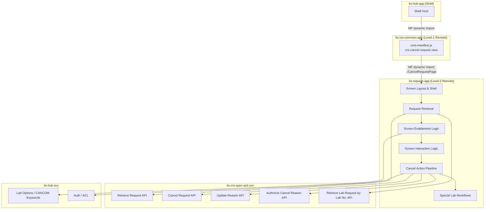

# Cancel Request Screen — Migration Plan

> [!info] Purpose
> This document tracks the full migration of the legacy Adobe Flex **Cancel Request** screen to the React micro-frontend architecture (`lis-request-app`). It serves as the living task list for AI-assisted coding and will be updated continuously as work progresses.

## Architecture Reference

- [[LIS/ECP/Micro-Frontend-Backend Architecture/00 - Overview|00 — CRS Revamp System Overview]]
- [[LIS/ECP/Micro-Frontend-Backend Architecture/02 - Micro-Frontend Architecture|02 — Micro-Frontend Architecture]]
- [[LIS/ECP/Micro-Frontend-Backend Architecture/03 - Backend Microservices|03 — Backend Microservices]]

**Target Repositories**

| Layer | Repository | Port | Notes |
|---|---|---|---|
| Frontend (new) | `lis-request-app` | TBD | Level-2 Remote Plugin MFE; shared with Registration, Amend Request, Add/Delete Test |
| Frontend (consumer) | `lis-crs-common-app` | 3010 | Consumes `lis-request-app` via Webpack Module Federation |
| Backend (CRS) | `lis-crs-spec-ack-svc` | 8118 | CRS domain service — primary API for cancel request operations |
| Hub BFF | `lis-hub-svc` | 5000 | Auth, dictionary, lab options via Hub API |

**MFE Integration**

`lis-request-app` is the shared Level-2 Remote for all request-management screens:

```
lis-hub-app  →  lis-crs-common-app  →  lis-request-app
  (Shell)          (Level-1 Remote)       (Level-2 Remote)
```

- `lis-request-app` exposes the Cancel Request screen (e.g. `./CancelRequestPage`)
- `lis-crs-common-app` consumes it via `craco.config.js` Module Federation config
- `lis-crs-common-app` registers the `crs-cancel-request` view in its `cms-manifest.js` and renders the consumed component

**Key Constraints**
- `lis-request-app` is shared with [[CRS/Revamp/Migration Plan/Frontend/Registration Migration Plan|Registration]], [[CRS/Revamp/Migration Plan/Frontend/Amend Request Migration Plan|Amend Request]], and [[CRS/Revamp/Migration Plan/Frontend/Add Delete Test Migration Plan|Add/Delete Test]] — repo scaffold already exists; only a new view registration is needed
- Cancel Request component wrapped with scoped Emotion cache (`key: "request"`) via `renderReactComponent`
- State access through `LisApiContext` only — no direct Zustand store imports from the Shell
- All API calls via `apiContext.request` (configured Axios with Bearer JWT + `ServiceParameterVo` headers)
- Backend responses follow `ResultDataResponse<T>` envelope; all data operations use `POST`
- Patient Demographics panel is always **read-only** — no patient editing on this screen
- Cancel Comment shortcut buttons (up to 15) are sourced from the **CANCOM** keyword group per performing lab
- Update Reason and Authorize Reason buttons are conditional on the `AMEND_CANCEL_COMMENT` lab option
- Specimen and Site section is visible **only** for MBS and VRS labs
- Test Grid Specimen column is conditional on USID enablement for the performing lab

---

## Knowledge Base Reference

- [[Knowledge Base/01_Screens/Cancel Request/_Cancel_Request_Overview|Cancel Request Screen Overview]]

---

## Screen Overview

The Cancel Request screen allows authorised laboratory staff to cancel an existing specimen request. Staff retrieve a request by its request number, review the attached tests, enter a cancel reason, and confirm the cancellation. It consists of:

1. **Request No. Input** — Screen entry point; triggers request retrieval on tab-away
2. **Action Buttons** — Cancel Request (always), Update Reason + Authorize Reason (conditional on `AMEND_CANCEL_COMMENT` lab option)
3. **Patient Demographics Panel** — Name, HKID, Encounter, Sex, Age, Req. Doc, Location — all read-only after retrieval
4. **Test Grid** — Test code, status date (colour-coded), Optional flag; Specimen column shown only when USID enabled
5. **Cancel Reason Text Input** — Free-text area; pre-populated from existing cancel reason if previously cancelled
6. **Cancel Comment Shortcut Buttons** — Up to 15 buttons from CANCOM keyword group; each appends keyword description to Cancel Reason
7. **Specimen and Site Section** — Read-only; visible for MBS and VRS labs only
8. **Reminder Label** — Optional red-bold label from `CANCEL_REMINDER` lab option

Key differentiators from other request maintenance screens:
- **No test grid DEL column** — cancellation applies to the entire request, not individual tests
- **Cancel Reason** text input with configurable CANCOM shortcut buttons
- **Eight-step cancel pipeline** — Validation → User Validation → Confirmation → Package → Server call → Message → Clear
- **Update Reason / Authorize Reason** optional secondary actions for previously cancelled requests
- **Keep Cancel Reason** checkbox auto-checked when a prior cancel reason exists

Legacy implementation: Adobe Flex (ActionScript/MXML), MVVM with Parsley DI.

---

## Migration Scope



---

## Task List

> [!tip] Status Legend
> - `[ ]` — Pending
> - `[/]` — In Progress
> - `[x]` — Completed
> - `[-]` — Skipped / Not Applicable
> - `[!]` — Blocked (pending resolution of a dependency)

---

### Phase 0 — View Registration in `lis-request-app`

> [!note]
> `lis-request-app` repository is already scaffolded for Registration, Amend Request, and Add/Delete Test. Only a new view entry-point needs to be registered.

| # | Task | Status | Notes |
|---|---|---|---|
| 0.1 | Register `crs-cancel-request` view in `cms-manifest.js` in `lis-crs-common-app` | `[ ]` | Add to `views[]` array; set `menuRoute: "CancelRequest"` |
| 0.2 | Wire `onWillDisplayView` in `plugin-manifest.module.ts` to lazy-import `./CancelRequestPage` from `LisRequestApp` | `[ ]` | `const Component = await import('LisRequestApp/CancelRequestPage')` |
| 0.3 | Expose `./CancelRequestPage` in `ModuleFederationPlugin` in `lis-request-app` `craco.config.js` | `[ ]` | Alongside existing screen entries |
| 0.4 | Scaffold `CancelRequest/` folder structure under `src/screens/` in `lis-request-app` | `[ ]` | Components, hooks, types, api sub-folders |

---

### Phase 1 — Screen Layout
**Epic:** LISP-244 — Cancel Request — Layout

| # | Task | Status | Reference |
|---|---|---|---|
| 1.1 | **Screen shell & root component** — `CancelRequestPage` root, Emotion cache wrapper (`key: "request"`), `apiContext` prop wiring; Cancel Comment test initialisation check (message 219) | `[ ]` | [[Knowledge Base/01_Screens/Cancel Request/Components/Default Screen Behavior\|Default Screen Behavior]] — CRST-924 |
| 1.2 | **Request No. input + Action Buttons area** — Request No. field (enabled on open), Cancel Request button (disabled), Update Reason button (conditional on `AMEND_CANCEL_COMMENT`), Authorize Reason button (conditional on `AMEND_CANCEL_COMMENT`) | `[ ]` | [[Knowledge Base/01_Screens/Cancel Request/Components/Default Screen Behavior\|Default Screen Behavior]] — CRST-924 |
| 1.3 | **Patient Demographics Panel** — Name, HKID, Encounter, Sex, Age, Age Unit, Req. Doc, Request Location, Report Location, Report Copy, Bed; always read-only | `[ ]` | [[Knowledge Base/01_Screens/Cancel Request/Components/Default Screen Behavior\|Default Screen Behavior]] — CRST-924 |
| 1.4 | **Test Grid** — Test code, status date (colour-coded by status), Optional flag; Specimen column shown only when USID enabled for performing lab | `[ ]` | [[Knowledge Base/01_Screens/Cancel Request/Components/Default Screen Behavior\|Default Screen Behavior]] — CRST-924 |
| 1.5 | **Cancel Reason text input** — free-text area; disabled on open; pre-populated from existing cancel reason on retrieval | `[ ]` | [[Knowledge Base/01_Screens/Cancel Request/Components/Default Screen Behavior\|Default Screen Behavior]] — CRST-924 |
| 1.6 | **Cancel Comment shortcut buttons** — up to 15 buttons from CANCOM keyword group; each appends `key_desc` to Cancel Reason; disabled on open; hidden when no CANCOM keywords configured | `[ ]` | [[Knowledge Base/01_Screens/Cancel Request/Components/Default Screen Behavior\|Default Screen Behavior]] — CRST-924 |
| 1.7 | **Specimen and Site section** — read-only; visible only for MBS and VRS labs | `[ ]` | [[Knowledge Base/01_Screens/Cancel Request/Components/Default Screen Behavior\|Default Screen Behavior]] — CRST-924 |
| 1.8 | **Reminder Label** — optional red-bold label from `CANCEL_REMINDER` lab option; hidden when option not set | `[ ]` | [[Knowledge Base/01_Screens/Cancel Request/Components/Default Screen Behavior\|Default Screen Behavior]] — CRST-924 |

---

### Phase 2 — Request Retrieval
**Epic:** LISP-245 — Cancel Request — Request Retrieval

| # | Task | Status | Reference |
|---|---|---|---|
| 2.1 | **Laboratory Selection** — determine performing lab from request number prefix before retrieval | `[ ]` | [[Knowledge Base/01_Screens/Cancel Request/Components/Laboratory Selection\|Laboratory Selection]] — CRST-929 |
| 2.2 | **Retrieve Request** — POST to retrieve request by request no. + lab no.; populate Demographics, Test Grid, Clinical Detail, Comment, Cancel Reason; transition to ready state | `[ ]` | [[Knowledge Base/01_Screens/Cancel Request/Workflows/Request Retrieval/Retrieve Request\|Retrieve Request]] — CRST-925 |
| 2.3 | **Not Supported Lab Message** — display message when retrieved request's lab is not supported on this screen | `[ ]` | [[Knowledge Base/01_Screens/Cancel Request/Workflows/Request Retrieval/Not Supported Lab Message\|Not Supported Lab Message]] — CRST-930 |
| 2.4 | **Request Cancelled Message** — display message when retrieved request is already cancelled | `[ ]` | [[Knowledge Base/01_Screens/Cancel Request/Workflows/Request Retrieval/Request Cancelled Message\|Request Cancelled Message]] — CRST-931 |
| 2.5 | **Request Not Found Message** — display message when request no. does not exist | `[ ]` | [[Knowledge Base/01_Screens/Cancel Request/Workflows/Request Retrieval/Request Not Found Message\|Request Not Found Message]] — CRST-926 |
| 2.6 | **Test Result display** — load test results from retrieved request into Test Grid; colour-code rows by test status | `[ ]` | [[Knowledge Base/01_Screens/Cancel Request/Workflows/Request Retrieval/Test Result\|Test Result]] — CRST-927 |
| 2.7 | **Cancel Comment Test check** — on screen load, verify `CANCEL_COMMENT` lab option is configured; display message 219 if not | `[ ]` | [[Knowledge Base/01_Screens/Cancel Request/Workflows/Request Retrieval/Cancel Comment Test\|Cancel Comment Test]] — CRST-928 |
| 2.8 | **Retrieve Cancel Request Reason** — search retrieved tests for the Cancel Comment test; if found with non-empty text, load into Cancel Reason field and check Keep Cancel Reason | `[ ]` | [[Knowledge Base/01_Screens/Cancel Request/Workflows/Request Retrieval/Retrieve Cancel Request Reason\|Retrieve Cancel Request Reason]] — CRST-980 |
| 2.9 | **Retain Cancel Request Reason Handling** — Keep Cancel Reason checkbox behaviour; controls whether existing cancel reason is retained or cleared on retrieval | `[ ]` | [[Knowledge Base/01_Screens/Cancel Request/Workflows/Request Retrieval/Retain Cancel Request Reason Handling\|Retain Cancel Request Reason Handling]] — CRST-979 |
| 2.10 | **Retrieve Lab Request by Assigned Lab No.** — retrieve lab-specific request data by the lab number assigned to the request | `[ ]` | [[Knowledge Base/01_Screens/Cancel Request/Workflows/Request Retrieval/Retrieve Lab Request by its Assigned Lab No\|Retrieve Lab Request by its Assigned Lab No.]] — CRST-981 |

---

### Phase 3 — Screen Object Enablement
**Epic:** LISP-246 — Cancel Request — Screen Object Enablement

| # | Task | Status | Reference |
|---|---|---|---|
| 3.1 | **Object Enablement After Retrieval** — enable Cancel Request button, Cancel Reason text input, Cancel Comment shortcut buttons; disable Request No. field; enable Update Reason / Authorize Reason buttons where applicable | `[ ]` | [[Knowledge Base/01_Screens/Cancel Request/Components/Enablement/Object Enablement After Retrieval\|Object Enablement After Retrieval]] — CRST-932 |

---

### Phase 4 — Screen Object Interaction
**Epic:** LISP-258 — Cancel Request — Screen Object Interaction

| # | Task | Status | Reference |
|---|---|---|---|
| 4.1 | **Tab Sequence** — keyboard tab order across screen objects | `[ ]` | [[Knowledge Base/01_Screens/Cancel Request/Components/Interactions/Tab Sequence\|Tab Sequence]] — CRST-933 |
| 4.2 | **Default Focus — Initial** — set initial keyboard focus on Request No. input when screen opens | `[ ]` | [[Knowledge Base/01_Screens/Cancel Request/Components/Interactions/Default Focus - Initial\|Default Focus - Initial]] — CRST-934 |
| 4.3 | **Clear Button** — reset all fields; return screen to initial state | `[ ]` | [[Knowledge Base/01_Screens/Cancel Request/Components/Interactions/Clear Button\|Clear Button]] — CRST-935 |
| 4.4 | **Decode Text** — decode and display formatted text in relevant fields (Clinical Detail, Comment, Cancel Reason) | `[ ]` | [[Knowledge Base/01_Screens/Cancel Request/Components/Interactions/Decode Text\|Decode Text]] — CRST-936 |

---

### Phase 5 — Cancel Action
**Epic:** LISP-247 — Cancel Request — Cancel Action

> [!note] Eight-Step Cancel Pipeline
> The cancel action follows a fixed sequence: (1) Gather info → (2) Confirmation message → (3) Validation → (4) User Validation → (5) Ask for Confirmation → (6) Package & Server call → (7) Completion message → (8) Clear screen.

| # | Task | Status | Reference |
|---|---|---|---|
| 5.1 | **Validation** — validate cancel prerequisites; determine Request Level (4=Printed, 3=Authorized, 2=Entered, 1=No Result) | `[ ]` | [[Knowledge Base/01_Screens/Cancel Request/Workflows/Cancel Action/Validation\|Validation]] — CRST-938 |
| 5.2 | **User Validation** — secondary authentication prompt for privileged cancel actions; capture Authorize ID and Acting By ID | `[ ]` | [[Knowledge Base/01_Screens/Cancel Request/Workflows/Cancel Action/User Validation\|User Validation]] — CRST-939 |
| 5.3 | **Ask for Confirmation** — present final confirmation dialogue before committing cancellation | `[ ]` | [[Knowledge Base/01_Screens/Cancel Request/Workflows/Cancel Action/Ask for Confirmation\|Ask for Confirmation]] — CRST-940 |
| 5.4 | **Cancel Request (Action)** — assemble cancel package (lab result, cancel comment, cancel comment test key, authorize ID, acting by ID, request level, is-authorize flag); POST to server; handle response | `[ ]` | [[Knowledge Base/01_Screens/Cancel Request/Workflows/Cancel Action/Cancel Request (Action)\|Cancel Request (Action)]] — CRST-941 |
| 5.5 | **Confirmation Message** — display message 673 in message monitor on successful cancellation | `[ ]` | [[Knowledge Base/01_Screens/Cancel Request/Workflows/Cancel Action/Confirmation Message\|Confirmation Message]] — CRST-937 |
| 5.6 | **Failure Message** — display message 674 ("Record update failed!") when server returns failure state | `[ ]` | [[Knowledge Base/01_Screens/Cancel Request/Workflows/Cancel Action/Failure Message\|Failure Message]] — CRST-942 |
| 5.7 | **Server Error Message** — display message 3385 when backend throws an exception | `[ ]` | [[Knowledge Base/01_Screens/Cancel Request/Workflows/Cancel Action/Server Error Message\|Server Error Message]] — CRST-943 |
| 5.8 | **Authorize Cancel Reason** — secondary pipeline to authorise an existing cancel reason; uses same cancel package with `isAuthorize = true` | `[ ]` | [[Knowledge Base/01_Screens/Cancel Request/Workflows/Cancel Action/Authorize Cancel Reason\|Authorize Cancel Reason]] — CRST-944 |
| 5.9 | **Update Reason** — allow authorised staff to amend the cancel reason on a previously cancelled request | `[ ]` | [[Knowledge Base/01_Screens/Cancel Request/Workflows/Cancel Action/Update Reason\|Update Reason]] — CRST-945 |

---

### Phase 6 — Special Lab Workflow: ANAT
**Epic:** LISP-248 — Cancel Request — Special Lab Workflow (ANAT)

| # | Task | Status | Reference |
|---|---|---|---|
| 6.1 | **ANAT Object Enablement After Retrieval** — ANAT-specific field/button enablement rules that override the standard enablement matrix | `[ ]` | [[Knowledge Base/01_Screens/Cancel Request/Special Lab Workflow/ANAT/Object Enablement After Retrieval (ANAT)\|Object Enablement After Retrieval (ANAT)]] — CRST-946 |

---

### Phase 7 — Special Lab Workflow: BBNK
**Epic:** LISP-249 — Cancel Request — Special Lab Workflow (BBNK)

| # | Task | Status | Reference |
|---|---|---|---|
| 7.1 | **BBNK Blood Inventory Validation** — validate blood inventory constraints before allowing cancellation of a BBNK request | `[ ]` | [[Knowledge Base/01_Screens/Cancel Request/Special Lab Workflow/BBNK/Blood Inventory Validation (BBNK)\|Blood Inventory Validation (BBNK)]] — CRST-947 |
| 7.2 | **BBNK Blood Released Message** — display message when blood has already been released for the request being cancelled | `[ ]` | [[Knowledge Base/01_Screens/Cancel Request/Special Lab Workflow/BBNK/Blood Released Message (BBNK)\|Blood Released Message (BBNK)]] — CRST-949 |
| 7.3 | **BBNK User Access Right Checking** — verify user has sufficient access rights to cancel a BBNK blood bank request | `[ ]` | [[Knowledge Base/01_Screens/Cancel Request/Special Lab Workflow/BBNK/User Access Right Checking (BBNK)\|User Access Right Checking (BBNK)]] — CRST-950 |

---

### Phase 8 — Special Lab Workflow: MICR/VIRO
**Epic:** LISP-250 — Cancel Request — Special Lab Workflow (MICR/VIRO)

| # | Task | Status | Reference |
|---|---|---|---|
| 8.1 | **Display MICR/VIRO Information** — show read-only Specimen and Site section for MBS and VRS lab requests on retrieval | `[ ]` | [[Knowledge Base/01_Screens/Cancel Request/Special Lab Workflow/MICR-VIRO/Display MICR-VIRO Information\|Display MICR-VIRO Information]] — CRST-951 |

---

### Phase 9 — Backend API

All requests use `POST` with `ResultDataResponse<T>` response envelope.

#### 9A — Cancel Request APIs (`lis-crs-spec-ack-svc`)

| # | Task | Status | Notes |
|---|---|---|---|
| 9A.1 | **Retrieve request endpoint** — retrieve full request data by request no. + lab no.; return demographics, tests, clinical detail, comment, existing cancel reason | `[ ]` | Used by Phase 2 retrieval workflow (CRST-925) |
| 9A.2 | **Cancel request endpoint** — accept cancel package (lab result, cancel comment, cancel comment test key, authorize/acting-by IDs, request level, is-authorize flag); commit cancellation | `[ ]` | Primary cancel action endpoint (CRST-941) |
| 9A.3 | **Update reason endpoint** — update cancel reason text on a previously cancelled request | `[ ]` | Used by Update Reason action (CRST-945) |
| 9A.4 | **Authorize cancel reason endpoint** — authorise the cancel reason on a previously cancelled request | `[ ]` | Used by Authorize Cancel Reason action (CRST-944) |
| 9A.5 | **Retrieve lab request by assigned lab no.** — fetch lab-specific request data by the lab number assigned to the request | `[ ]` | Used by CRST-981 retrieval workflow |

#### 9B — Dictionary / Configuration (`lis-hub-svc`)

| # | Task | Status | Notes |
|---|---|---|---|
| 9B.1 | **Lab options + CANCOM keywords** — retrieve `USID.ENABLE`, `CANCEL.AMEND_CANCEL_COMMENT`, `CANCEL.CANCEL_REMINDER`, `CANCEL.CANCEL_COMMENT` options; retrieve CANCOM keyword group (up to 15 entries) for Cancel Comment buttons | `[ ]` | Drives all conditional UI behaviour on screen load |
| 9B.2 | **User access rights** — validate ACL for cancel, update reason, and authorize cancel reason operations | `[ ]` | Called during User Validation and BBNK access right checks |

---

## Progress Summary

| Phase | Tasks | Completed | In Progress | Pending |
|---|---|---|---|---|
| Phase 0 — View Registration | 4 | 0 | 0 | 4 |
| Phase 1 — Screen Layout | 8 | 0 | 0 | 8 |
| Phase 2 — Request Retrieval | 10 | 0 | 0 | 10 |
| Phase 3 — Screen Object Enablement | 1 | 0 | 0 | 1 |
| Phase 4 — Screen Object Interaction | 4 | 0 | 0 | 4 |
| Phase 5 — Cancel Action | 9 | 0 | 0 | 9 |
| Phase 6 — Special Lab: ANAT | 1 | 0 | 0 | 1 |
| Phase 7 — Special Lab: BBNK | 3 | 0 | 0 | 3 |
| Phase 8 — Special Lab: MICR/VIRO | 1 | 0 | 0 | 1 |
| Phase 9 — Backend API | 7 | 0 | 0 | 7 |
| **Total** | **48** | **0** | **0** | **48** |

---

## Changelog

| Date | Change |
|---|---|
| 2026-04-05 | Migration plan created |
