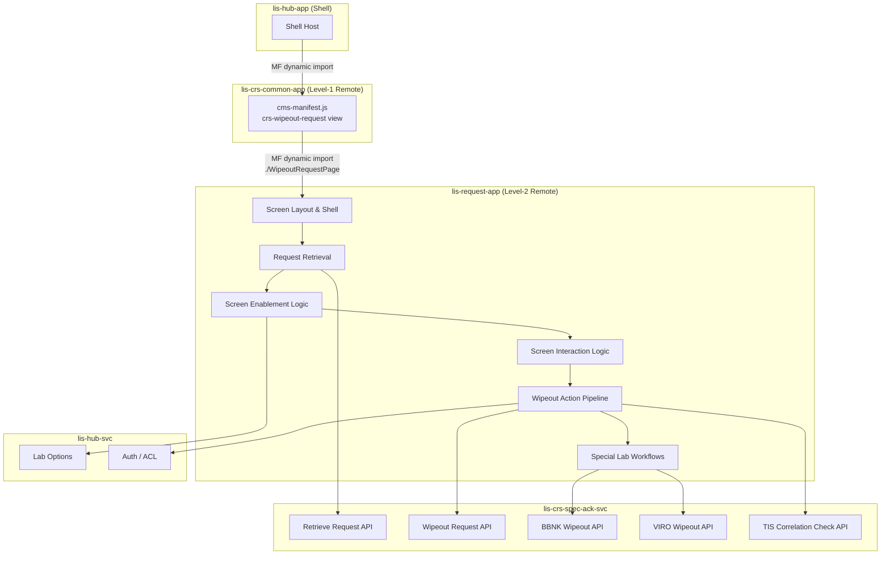

# Wipeout Request Screen — Migration Plan

> [!info] Purpose
> This document tracks the full migration of the legacy Adobe Flex **Wipeout Request** screen to the React micro-frontend architecture (`lis-request-app`). It serves as the living task list for AI-assisted coding and will be updated continuously as work progresses.

## Architecture Reference

- [[LIS/ECP/Micro-Frontend-Backend Architecture/00 - Overview|00 — CRS Revamp System Overview]]
- [[LIS/ECP/Micro-Frontend-Backend Architecture/02 - Micro-Frontend Architecture|02 — Micro-Frontend Architecture]]
- [[LIS/ECP/Micro-Frontend-Backend Architecture/03 - Backend Microservices|03 — Backend Microservices]]

**Target Repositories**

| Layer | Repository | Port | Notes |
|---|---|---|---|
| Frontend (new) | `lis-request-app` | TBD | Level-2 Remote Plugin MFE; shared with Registration, Amend Request, Add/Delete Test, Cancel Request |
| Frontend (consumer) | `lis-crs-common-app` | 3010 | Consumes `lis-request-app` via Webpack Module Federation |
| Backend (CRS) | `lis-crs-spec-ack-svc` | 8118 | CRS domain service — primary API for wipeout operations |
| Hub BFF | `lis-hub-svc` | 5000 | Auth, dictionary, lab options via Hub API |

**MFE Integration**

`lis-request-app` is the shared Level-2 Remote for all request-management screens:

```
lis-hub-app  →  lis-crs-common-app  →  lis-request-app
  (Shell)          (Level-1 Remote)       (Level-2 Remote)
```

- `lis-request-app` exposes the Wipeout Request screen (e.g. `./WipeoutRequestPage`)
- `lis-crs-common-app` consumes it via `craco.config.js` Module Federation config
- `lis-crs-common-app` registers the `crs-wipeout-request` view in its `cms-manifest.js` and renders the consumed component

**Key Constraints**
- `lis-request-app` is shared with [[CRS/Revamp/Migration Plan/Frontend/Registration Migration Plan|Registration]], [[CRS/Revamp/Migration Plan/Frontend/Amend Request Migration Plan|Amend Request]], [[CRS/Revamp/Migration Plan/Frontend/Add Delete Test Migration Plan|Add/Delete Test]], and [[CRS/Revamp/Migration Plan/Frontend/Cancel Request Migration Plan|Cancel Request]] — repo scaffold already exists; only a new view registration is needed
- Wipeout Request component wrapped with scoped Emotion cache (`key: "request"`) via `renderReactComponent`
- State access through `LisApiContext` only — no direct Zustand store imports from the Shell
- All API calls via `apiContext.request` (configured Axios with Bearer JWT + `ServiceParameterVo` headers)
- Backend responses follow `ResultDataResponse<T>` envelope; all data operations use `POST`
- Patient Demographics panel is always **read-only** — no patient editing on this screen
- Wipeout Request screen shares significant logic with [[CRS/Revamp/Migration Plan/Frontend/Cancel Request Migration Plan|Cancel Request]] — reuse components where possible (Test Grid, Specimen/Site section, Lab Selection, Object Enablement, Tab Sequence, Clear Button, User Validation)
- **No Cancel Reason input, no Cancel Comment buttons, no Update/Authorize Reason buttons** — distinguishes Wipeout from Cancel Request
- Test Grid Specimen column is conditional on USID enablement for the performing lab
- Specimen and Site section visible **only** for MBS and VRS labs

---

## Knowledge Base Reference

- [[Knowledge Base/01_Screens/Wipeout Request/_Wipeout_Request_Overview|Wipeout Request Screen Overview]]

> [!tip] Relationship to Cancel Request
> Wipeout Request shares the majority of its screen structure, retrieval workflow, validation logic, and interaction behaviour with [[Knowledge Base/01_Screens/Cancel Request/_Cancel_Request_Overview|Cancel Request]]. Where the two screens are functionally identical, implementations should be shared or derived from Cancel Request equivalents.

---

## Screen Overview

The Wipeout Request screen allows authorised laboratory staff to permanently remove a previously registered request from the system. Unlike Cancel Request — which records a cancellation reason and leaves an audit trail — Wipeout Request obliterates the request entirely. It consists of:

1. **Request No. Input** — Screen entry point; triggers request retrieval on tab-away
2. **Wipeout Request Button** — Primary action; disabled until retrieval
3. **Patient Demographics Panel** — Name, HKID, Encounter, Sex, Age, Req. Doc, Location — all read-only
4. **Test Grid** — Test code, status date (colour-coded), Optional flag; Specimen column shown only when USID enabled
5. **Specimen and Site Section** — Read-only; visible for MBS and VRS labs only
6. **Clear / Exit Buttons** — Clear resets screen; Exit always enabled

Key differences from [[CRS/Revamp/Migration Plan/Frontend/Cancel Request Migration Plan|Cancel Request]]:
- **No Cancel Reason text input**, no Cancel Comment shortcut buttons, no Retain Cancel Reason checkbox
- **No Update Reason / Authorize Reason buttons** — no amend/authorize comment flow
- **No Cancel Comment initialisation check** — screen does not check for `CANCEL_COMMENT` lab option on load
- **Wipeout Request** button replaces the Cancel Request button
- **TIS Correlation Check** — unique pre-wipeout validation step (no equivalent in Cancel Request)
- **VIRO special workflow** — Pair Specimen Check and paired request packing (not in Cancel Request)
- **BBNK Ask for Confirmation** — includes "delete historical data?" prompt (not in Cancel Request)

Legacy implementation: Adobe Flex (ActionScript/MXML), MVVM with Parsley DI.

---

## Migration Scope



---

## Task List

> [!tip] Status Legend
> - `[ ]` — Pending
> - `[/]` — In Progress
> - `[x]` — Completed
> - `[-]` — Skipped / Not Applicable
> - `[!]` — Blocked (pending resolution of a dependency)

---

### Phase 0 — View Registration in `lis-request-app`

> [!note]
> `lis-request-app` repository is already scaffolded for Registration, Amend Request, Add/Delete Test, and Cancel Request. Only a new view entry-point needs to be registered.

| # | Task | Status | Notes |
|---|---|---|---|
| 0.1 | Register `crs-wipeout-request` view in `cms-manifest.js` in `lis-crs-common-app` | `[ ]` | Add to `views[]` array; set `menuRoute: "WipeoutRequest"` |
| 0.2 | Wire `onWillDisplayView` in `plugin-manifest.module.ts` to lazy-import `./WipeoutRequestPage` from `LisRequestApp` | `[ ]` | `const Component = await import('LisRequestApp/WipeoutRequestPage')` |
| 0.3 | Expose `./WipeoutRequestPage` in `ModuleFederationPlugin` in `lis-request-app` `craco.config.js` | `[ ]` | Alongside existing screen entries |
| 0.4 | Scaffold `WipeoutRequest/` folder structure under `src/screens/` in `lis-request-app` | `[ ]` | Components, hooks, types, api sub-folders; reuse shared components from Cancel Request where applicable |

---

### Phase 1 — Screen Layout
**Epic:** LISP-251 — Wipeout Request — Layout

| # | Task | Status | Reference |
|---|---|---|---|
| 1.1 | **Screen shell & root component** — `WipeoutRequestPage` root, Emotion cache wrapper (`key: "request"`), `apiContext` prop wiring | `[ ]` | [[Knowledge Base/01_Screens/Wipeout Request/Components/Default Screen Behavior\|Default Screen Behavior]] — CRST-982 |
| 1.2 | **Request No. input + Wipeout Request button** — Request No. field (enabled on open); Wipeout Request button (disabled on open); no Cancel Reason, Update Reason, or Authorize Reason controls | `[ ]` | [[Knowledge Base/01_Screens/Wipeout Request/Components/Default Screen Behavior\|Default Screen Behavior]] — CRST-982 |
| 1.3 | **Patient Demographics Panel** — Name, HKID, Encounter, Sex, Age, Age Unit, Req. Doc, Request Location, Report Location, Report Copy, Bed; always read-only | `[ ]` | [[Knowledge Base/01_Screens/Wipeout Request/Components/Default Screen Behavior\|Default Screen Behavior]] — CRST-982 |
| 1.4 | **Test Grid** — Test code, status date (colour-coded), Optional flag; Specimen column conditional on USID enablement (`USID.ENABLE` lab option) | `[ ]` | [[Knowledge Base/01_Screens/Wipeout Request/Components/Default Screen Behavior\|Default Screen Behavior]] — CRST-982 |
| 1.5 | **Specimen and Site section** — read-only; visible only for MBS and VRS labs | `[ ]` | [[Knowledge Base/01_Screens/Wipeout Request/Components/Default Screen Behavior\|Default Screen Behavior]] — CRST-982 |
| 1.6 | **Clear Button + Exit Button** — Clear resets screen (disabled on open); Exit always enabled | `[ ]` | [[Knowledge Base/01_Screens/Wipeout Request/Components/Default Screen Behavior\|Default Screen Behavior]] — CRST-982 |

---

### Phase 2 — Request Retrieval
**Epic:** LISP-252 — Wipeout Request — Request Retrieval

| # | Task | Status | Reference |
|---|---|---|---|
| 2.1 | **Laboratory Selection** — determine performing lab from request number prefix before retrieval | `[ ]` | [[Knowledge Base/01_Screens/Wipeout Request/Components/Laboratory Selection\|Laboratory Selection]] — CRST-983 |
| 2.2 | **Retrieve Request** — POST by request no. + lab no.; populate Demographics, Test Grid, Clinical Detail, Comment, Specimen/Site section; transition to ready state | `[ ]` | [[Knowledge Base/01_Screens/Wipeout Request/Workflows/Request Retrieval/Retrieve Request\|Retrieve Request]] — CRST-985 |
| 2.3 | **Not Supported Lab Message** — display message when retrieved request's lab is not supported on this screen | `[ ]` | [[Knowledge Base/01_Screens/Wipeout Request/Workflows/Request Retrieval/Not Supported Lab Message\|Not Supported Lab Message]] — CRST-984 |
| 2.4 | **Request Not Found Message** — display message when request no. does not exist | `[ ]` | [[Knowledge Base/01_Screens/Wipeout Request/Workflows/Request Retrieval/Request Not Found Message\|Request Not Found Message]] — CRST-986 |
| 2.5 | **Test Result display** — load test results into Test Grid; colour-code rows by test status | `[ ]` | [[Knowledge Base/01_Screens/Wipeout Request/Workflows/Request Retrieval/Test Result\|Test Result]] — CRST-987 |

---

### Phase 3 — Screen Object Enablement
**Epic:** LISP-253 — Wipeout Request — Screen Object Enablement

| # | Task | Status | Reference |
|---|---|---|---|
| 3.1 | **Object Enablement After Retrieval** — enable Wipeout Request button; disable Request No. field; enable any other controls requiring a retrieved request | `[ ]` | [[Knowledge Base/01_Screens/Wipeout Request/Components/Enablement/Object Enablement After Retrieval\|Object Enablement After Retrieval]] — CRST-988 |

---

### Phase 4 — Screen Object Interaction
**Epic:** LISP-254 — Wipeout Request — Screen Object Interaction

| # | Task | Status | Reference |
|---|---|---|---|
| 4.1 | **Tab Sequence** — keyboard tab order across screen objects | `[ ]` | [[Knowledge Base/01_Screens/Wipeout Request/Components/Interactions/Tab Sequence\|Tab Sequence]] — CRST-989 |
| 4.2 | **Default Focus — Initial** — set initial keyboard focus on Request No. input when screen opens | `[ ]` | [[Knowledge Base/01_Screens/Wipeout Request/Components/Interactions/Default Focus - Initial\|Default Focus - Initial]] — CRST-990 |
| 4.3 | **Clear Button** — show confirmation prompt; reset all fields and return screen to initial state | `[ ]` | [[Knowledge Base/01_Screens/Wipeout Request/Components/Interactions/Clear Button\|Clear Button]] — CRST-991 |

---

### Phase 5 — Wipeout Action
**Epic:** LISP-255 — Wipeout Request — Wipeout Action

> [!note] Eight-Step Wipeout Pipeline
> The wipeout action follows the same structural pipeline as Cancel Request: (1) Confirmation message → (2) Gather server info / blood inventory validation → (3) Validation + TIS Correlation Check → (4) User Validation → (5) Ask for Confirmation → (6) Package & Server call → (7) Result message → (8) Clear screen.

| # | Task | Status | Reference |
|---|---|---|---|
| 5.1 | **Confirmation Message** — "Are you sure?" prompt shown when user clicks Wipeout Request button (step 1 of pipeline) | `[ ]` | [[Knowledge Base/01_Screens/Wipeout Request/Workflows/Wipeout Action/Confirmation Message\|Confirmation Message]] — CRST-992 |
| 5.2 | **Validation** — validate wipeout prerequisites; determine Request Level (4=Printed, 3=Authorized, 2=Entered, 1=No Result) | `[ ]` | [[Knowledge Base/01_Screens/Wipeout Request/Workflows/Wipeout Action/Validation\|Validation]] — CRST-993 |
| 5.3 | **TIS Correlation Check** — if `CHECK_TIS_CORRELATION` lab option is enabled, query server for TIS correlation; block wipeout with message 2738 if correlated (unique to Wipeout Request) | `[ ]` | [[Knowledge Base/01_Screens/Wipeout Request/Workflows/Wipeout Action/TIS Correlation Check\|TIS Correlation Check]] — CRST-999 |
| 5.4 | **User Validation** — secondary authentication prompt; capture Authorize ID and Acting By ID | `[ ]` | [[Knowledge Base/01_Screens/Wipeout Request/Workflows/Wipeout Action/User Validation\|User Validation]] — CRST-994 |
| 5.5 | **Ask for Confirmation** — present final confirmation dialogue before committing wipeout | `[ ]` | [[Knowledge Base/01_Screens/Wipeout Request/Workflows/Wipeout Action/Ask for Confirmation\|Ask for Confirmation]] — CRST-995 |
| 5.6 | **Wipeout Request (Action)** — assemble base wipeout package (lab result, authorize ID, acting by ID, request level); POST to server; handle success/failure/error; clear screen on success | `[ ]` | [[Knowledge Base/01_Screens/Wipeout Request/Workflows/Wipeout Action/Wipeout Request (Action)\|Wipeout Request (Action)]] — CRST-996 |
| 5.7 | **Failure Message** — display message 674 ("Record update failed!") when server returns failure state | `[ ]` | [[Knowledge Base/01_Screens/Wipeout Request/Workflows/Wipeout Action/Failure Message\|Failure Message]] — CRST-997 |
| 5.8 | **Server Error Message** — display message 3385 when backend throws an exception | `[ ]` | [[Knowledge Base/01_Screens/Wipeout Request/Workflows/Wipeout Action/Server Error Message\|Server Error Message]] — CRST-998 |

---

### Phase 6 — Special Lab Workflow: BBNK
**Epic:** LISP-256 — Wipeout Request — Special Lab Workflow (BBNK)

| # | Task | Status | Reference |
|---|---|---|---|
| 6.1 | **BBNK Blood Inventory Validation** — server-side check at pipeline step 2; validate blood unit states (issued/transfused blocks; reserved/allocated/analyser-ordered requires Release Blood right) | `[ ]` | [[Knowledge Base/01_Screens/Wipeout Request/Special Lab Workflow/BBNK/Blood Inventory Validation\|Blood Inventory Validation (BBNK)]] — CRST-1000 |
| 6.2 | **BBNK User Access Right Checking** — check `cbx_release_blood` right against `w_lis_bbnk_wipeout_request`; show warning (msg 2376/4354) with right, error (msg 2377/4355) without | `[ ]` | [[Knowledge Base/01_Screens/Wipeout Request/Special Lab Workflow/BBNK/User Access Right Checking\|User Access Right Checking (BBNK)]] — CRST-1002 |
| 6.3 | **BBNK Ask for Confirmation** — prompt message 1659 if patient has only one BBNK request (historical data at risk); prompt message 4413 if Corp Blood Requirement exists | `[ ]` | [[Knowledge Base/01_Screens/Wipeout Request/Special Lab Workflow/BBNK/Ask for Confirmation\|BBNK Ask for Confirmation]] — CRST-1001 |
| 6.4 | **BBNK Wipeout Message** — post-success message monitor notification specific to BBNK wipeout (including historical data deletion confirmation) | `[ ]` | [[Knowledge Base/01_Screens/Wipeout Request/Special Lab Workflow/BBNK/Wipeout Message\|BBNK Wipeout Message]] — CRST-1003 |
| 6.5 | **BBNK Wipeout Request** — append BBNK-specific field to wipeout package: `isDeleteHistoricalPatientDataNeeded` flag (from BBNK Ask for Confirmation response) | `[ ]` | [[Knowledge Base/01_Screens/Wipeout Request/Special Lab Workflow/BBNK/Wipeout Request\|BBNK Wipeout Request]] — CRST-1004 |

---

### Phase 7 — Special Lab Workflow: VIRO
**Epic:** LISP-257 — Wipeout Request — Special Lab Workflow (VIRO)

| # | Task | Status | Reference |
|---|---|---|---|
| 7.1 | **VIRO Pair Specimen Check** — if VIRO request has a paired specimen, prompt message 1886; if user confirms and request is First Specimen, verify `PAIRUP_TEST` config exists (block with msg 1889 if missing) | `[ ]` | [[Knowledge Base/01_Screens/Wipeout Request/Special Lab Workflow/VIRO/Pair Specimen Check\|VIRO Pair Specimen Check]] — CRST-1005 |
| 7.2 | **VIRO Wipeout Request** — append VIRO-specific fields to wipeout package: `isFirstSpecimenRequest`, `pairSpecimenRequestNo`, `vrsPairUpTestKey`; backend removes Pair Up Test result from Second Specimen when First Specimen is wiped out | `[ ]` | [[Knowledge Base/01_Screens/Wipeout Request/Special Lab Workflow/VIRO/Wipeout Request\|VIRO Wipeout Request]] — CRST-1006 |

---

### Phase 8 — Backend API

All requests use `POST` with `ResultDataResponse<T>` response envelope.

#### 8A — Wipeout APIs (`lis-crs-spec-ack-svc`)

| # | Task | Status | Notes |
|---|---|---|---|
| 8A.1 | **Retrieve request endpoint** — retrieve full request data by request no. + lab no.; return demographics, tests, clinical detail, comment; includes VIRO pair specimen data where applicable | `[ ]` | Used by Phase 2 retrieval workflow |
| 8A.2 | **Wipeout request endpoint (general)** — accept base wipeout package (lab result, authorize/acting-by IDs, request level); commit wipeout | `[ ]` | Primary wipeout action endpoint (CRST-996) |
| 8A.3 | **BBNK wipeout endpoint** — accept wipeout package with `isDeleteHistoricalPatientDataNeeded` flag; commit BBNK-specific wipeout including optional historical data deletion | `[ ]` | Used by BBNK wipeout action (CRST-1004) |
| 8A.4 | **VIRO wipeout endpoint** — accept wipeout package with pair specimen fields; commit VIRO-specific wipeout; remove Pair Up Test result from Second Specimen when First Specimen is wiped out | `[ ]` | Used by VIRO wipeout action (CRST-1006) |
| 8A.5 | **TIS correlation check endpoint** — query `tis_correlation` table for the request no. as `pat_reqno` or `donor_reqno`; return correlation status | `[ ]` | Used by TIS Correlation Check (CRST-999) |

#### 8B — Dictionary / Configuration (`lis-hub-svc`)

| # | Task | Status | Notes |
|---|---|---|---|
| 8B.1 | **Lab options** — retrieve `USID.ENABLE`, `TEST_MAINTENANCE.CHECK_TIS_CORRELATION`, `PAIRUP.PAIRUP_TEST` options; drives conditional UI and validation behaviour | `[ ]` | Multiple option groups required |
| 8B.2 | **User access rights** — validate ACL for wipeout operation and BBNK `cbx_release_blood` right against `w_lis_bbnk_wipeout_request` | `[ ]` | Called during User Validation and BBNK access right checks |

---

## Progress Summary

| Phase | Tasks | Completed | In Progress | Pending |
|---|---|---|---|---|
| Phase 0 — View Registration | 4 | 0 | 0 | 4 |
| Phase 1 — Screen Layout | 6 | 0 | 0 | 6 |
| Phase 2 — Request Retrieval | 5 | 0 | 0 | 5 |
| Phase 3 — Screen Object Enablement | 1 | 0 | 0 | 1 |
| Phase 4 — Screen Object Interaction | 3 | 0 | 0 | 3 |
| Phase 5 — Wipeout Action | 8 | 0 | 0 | 8 |
| Phase 6 — Special Lab: BBNK | 5 | 0 | 0 | 5 |
| Phase 7 — Special Lab: VIRO | 2 | 0 | 0 | 2 |
| Phase 8 — Backend API | 7 | 0 | 0 | 7 |
| **Total** | **41** | **0** | **0** | **41** |

---

## Changelog

| Date | Change |
|---|---|
| 2026-04-05 | Migration plan created |
