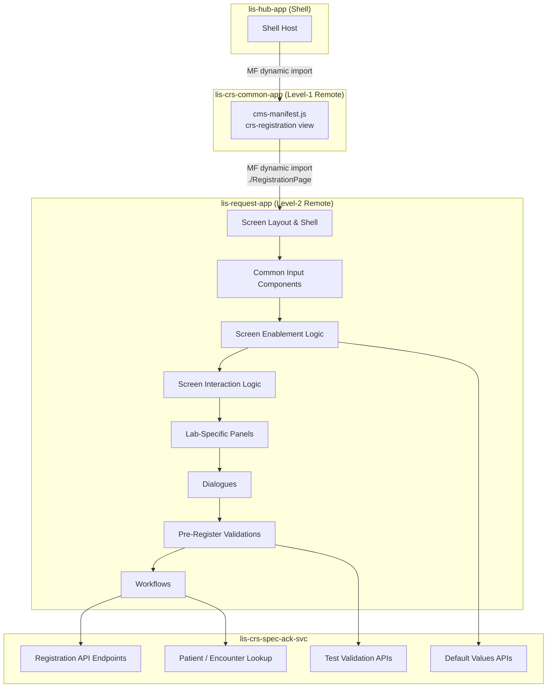

# Registration Screen — Migration Plan

> [!info] Purpose
> This document tracks the full migration of the legacy Adobe Flex **Manual Registration** screen to the React micro-frontend architecture (`lis-request-app`). It serves as the living task list for AI-assisted coding and will be updated continuously as work progresses.

## Architecture Reference

- [[LIS/ECP/Micro-Frontend-Backend Architecture/00 - Overview|00 — CRS Revamp System Overview]]
- [[LIS/ECP/Micro-Frontend-Backend Architecture/02 - Micro-Frontend Architecture|02 — Micro-Frontend Architecture]]
- [[LIS/ECP/Micro-Frontend-Backend Architecture/03 - Backend Microservices|03 — Backend Microservices]]

**Target Repositories**

| Layer | Repository | Port | Notes |
|---|---|---|---|
| Frontend (new) | `lis-request-app` | TBD | New Remote Plugin MFE; owns Registration screen and related request screens |
| Frontend (consumer) | `lis-crs-common-app` | 3010 | Consumes `lis-request-app` via Webpack Module Federation |
| Backend | `lis-crs-spec-ack-svc` | 8118 | `CrsRegController` (~289 lines) — primary registration API |
| Hub BFF | `lis-hub-svc` | 5000 | Auth, dictionary, default values via Hub API |

**MFE Integration**

`lis-request-app` follows the same sub-remote pattern as `lab-crs-app`:

```
lis-hub-app  →  lis-crs-common-app  →  lis-request-app
  (Shell)          (Level-1 Remote)       (Level-2 Remote)
```

- `lis-request-app` exposes Registration screen (e.g. `./RegistrationPage`)
- `lis-crs-common-app` consumes it via `craco.config.js` Module Federation config
- `lis-crs-common-app` registers the `crs-registration` view in its `cms-manifest.js` and renders the consumed component

**Key Constraints**
- `lis-request-app` is a new Webpack Module Federation remote (`craco.config.js` with `ModuleFederationPlugin`)
- `lis-crs-common-app` adds `lis-request-app` as a consumer in its `craco.config.js`
- Registration screen component wrapped with scoped Emotion cache (`key: "request"`) via `renderReactComponent`
- State access through `LisApiContext` only — no direct Zustand store imports from the Shell
- All API calls via `apiContext.request` (configured Axios with Bearer JWT + `ServiceParameterVo` headers)
- Backend responses follow `ResultDataResponse<T>` envelope; all data operations use `POST`

---

## Knowledge Base Reference

- [[Knowledge Base/01_Screens/Registration/_Registration_Overview|Registration Screen Overview]]

---

## Screen Overview

The Manual Registration screen allows Registration Staff to manually register specimens and orders into the LIS system. It consists of:

1. **Registration Keys Panel** — Enc No. / Req No. / HKID entry (screen entry point)
2. **Patient Demographics Panel** — Name, Location, DOB/Age, Sex, Race
3. **Request Information Panel** — Clinical details, Doctor, Location, Urgency, Collect/Arrive/Request dates
4. **Test Panel** — Test code input and test list
5. **Lab-Specific Panels** — ANAT / BBNK / MICR VIRO (conditionally shown)
6. **Action Buttons** — Save / Clear / Exit + Retain checkboxes

Legacy implementation: Adobe Flex (ActionScript/MXML), MVVM with Parsley DI, `RegistrationPm` presentation model.

---

## Migration Scope



---

## Task List

> [!tip] Status Legend
> - `[ ]` — Pending
> - `[/]` — In Progress
> - `[x]` — Completed
> - `[-]` — Skipped / Not Applicable

---

### Phase 0 — Setup & View Registration

#### 0A — New `lis-request-app` repository

| # | Task | Status | Notes |
|---|---|---|---|
| 0A.1 | Scaffold `lis-request-app` repository | `[ ]` | CRACO + Webpack 5 + TypeScript; mirror `lab-crs-app` structure |
| 0A.2 | Configure `ModuleFederationPlugin` in `craco.config.js` | `[ ]` | MF name: `LisRequestApp`; expose `./RegistrationPage` |
| 0A.3 | Add `lis-request-app` to `craco.config.js` consumer list in `lis-crs-common-app` | `[ ]` | e.g. `LisRequestApp@:PORT` |
| 0A.4 | Add shared dependencies (`react`, `@cmschassis/*`, `@lis/lis-hub-lib`, MUI, Zustand, Axios) | `[ ]` | Match versions in `lis-crs-common-app`; use peer deps |
| 0A.5 | Set up nginx `docker-entrypoint.sh` with `__PLACEHOLDER__` env injection | `[ ]` | Follow `lab-crs-app` pattern |
| 0A.6 | Set up GitHub Actions CI/CD pipeline | `[ ]` | Follow CDRA reusable workflow templates |
| 0A.7 | Scaffold `Registration/` folder structure under `src/screens/` | `[ ]` | Components, hooks, types, api sub-folders |
| 0A.8 | Configure Emotion scoped cache for Registration root | `[ ]` | `key: "request"` in `renderReactComponent` |

#### 0B — Integration into `lis-crs-common-app`

| # | Task | Status | Notes |
|---|---|---|---|
| 0B.1 | Register `crs-registration` view in `cms-manifest.js` | `[ ]` | Add to `views[]` array; set `menuRoute: "Registration"` |
| 0B.2 | Wire `onWillDisplayView` in `plugin-manifest.module.ts` to lazy-import `./RegistrationPage` from `LisRequestApp` | `[ ]` | `const Component = await import('LisRequestApp/RegistrationPage')` |
| 0B.3 | Pass `apiContext` down to Registration component via prop or Context | `[ ]` | `LisRequestApp` cannot import `cms-api-provider.ts` directly — pass via props or window bridge |

---

### Phase 1 — Common Reusable Components

These components are shared across Registration and potentially other CRS screens.

| # | Task | Status | Reference |
|---|---|---|---|
| 1.1 | **HKID Input Component** — validation, format mask, lookup trigger | `[ ]` | [[Knowledge Base/01_Screens/Registration/Workflows/Retrieve Patient by HKID]] |
| 1.2 | **Encounter No. Input Component** — lookup trigger on confirm | `[ ]` | [[Knowledge Base/01_Screens/Registration/Workflows/Retrieve Patient by Encounter Number]] |
| 1.3 | **Request No. Input Component** — read-only display, system-assigned | `[ ]` | [[Knowledge Base/01_Screens/Registration/Workflows/Request No. Generation]] |
| 1.4 | **Location Input Component** — 3-part composite (Hospital + Specialty + Ward/Sub-Spec) | `[ ]` | Used in Patient Loc, Req Loc, Rpt Loc, Copy — reuse same component |
| 1.5 | **Doctor Input Component** — 2-part composite (Hospital + Doctor code/name), with Create New Doctor trigger | `[ ]` | [[Knowledge Base/01_Screens/Registration/Components/Interaction/Create New Doctor Dialogue]] |
| 1.6 | **Test Code Input Component** — autocomplete/dropdown, multi-test panel management | `[ ]` | [[Knowledge Base/01_Screens/Registration/Workflows/Test Code Selection Behavior]] |
| 1.7 | **DateTime Input Component** — date+time picker with "Exact time" checkbox variant | `[ ]` | Used for Collect / Arrive / Request / Admission dates |

---

### Phase 2 — Screen Layout

| # | Task | Status | Reference |
|---|---|---|---|
| 2.1 | **Registration Keys Panel** — Enc No., Req No. (read-only), HKID; keyboard shortcuts (Ctrl+Shift+E/H/A/X) | `[ ]` | [[Knowledge Base/01_Screens/Registration/Components/Enablement/Default Opening Behaviour]] |
| 2.2 | **Patient Demographics Panel** — two-column layout (Name, Chinese Name, Loc, Ward, Bed, Admitted / Sex, DOB, Age, Race) | `[ ]` | [[Knowledge Base/01_Screens/Registration/_Registration_Overview]] |
| 2.3 | **Request Information Panel** — two-column layout (Clin Dtl, Req Dr, Req Loc, Rpt Loc, Copy, Reference, Comment / Category, Confidential, Private, Bill, Urgency, Collect, Arrived, Request) | `[ ]` | [[Knowledge Base/01_Screens/Registration/_Registration_Overview]] |
| 2.4 | **Test Panel** — Add Test dropdown, test list display (bottom section) | `[ ]` | [[Knowledge Base/01_Screens/Registration/_Registration_Overview]] |
| 2.5 | **Retain Checkboxes Panel** — DB-driven (`RETAIN_MASTER`): Request, DT, Test, Urgency | `[ ]` | [[Knowledge Base/01_Screens/Registration/Components/Interaction/Retain]] |
| 2.6 | **Action Buttons** — Save (disabled initially), Clear, Exit | `[ ]` | [[Knowledge Base/01_Screens/Registration/_Registration_Overview]] |
| 2.7 | **No. of Label Panel** — optional panel, controlled by lab option | `[ ]` | [[Knowledge Base/01_Screens/Registration/Components/Enablement/No. of Label Panel]] |
| 2.8 | **Print Tube Label Panel** — optional panel, workstation-authorised | `[ ]` | [[Knowledge Base/01_Screens/Registration/Components/Enablement/Print Tube Label Panel]] |
| 2.9 | **Sendout Button** — optional, lab-option-driven visibility | `[ ]` | [[Knowledge Base/01_Screens/Registration/Components/Enablement/Sendout Button]] |
| 2.10 | **Screen Font Size** — Normal vs. Large based on menu item config | `[ ]` | [[Knowledge Base/01_Screens/Registration/Components/Enablement/Screen Font Size Configuration]] |
| 2.11 | **Urgency Color** — visual highlight based on urgency selection | `[ ]` | [[Knowledge Base/01_Screens/Registration/Components/Interaction/Urgency Color]] |

---

### Phase 3 — Screen Enablement Logic

Controls which panels/fields are enabled or disabled based on screen state.

| # | Task | Status | Reference |
|---|---|---|---|
| 3.1 | **Default Opening Behaviour** — Keys Panel enabled; Demographics + Request + Test disabled/hidden; Save disabled | `[ ]` | [[Knowledge Base/01_Screens/Registration/Components/Enablement/Default Opening Behaviour]] |
| 3.2 | **Patient Demographics Panel Enablement** — enabled after request number assigned | `[ ]` | [[Knowledge Base/01_Screens/Registration/Components/Enablement/Patient Demographics Panel]] |
| 3.3 | **Request Information Panel Enablement** — enabled after request number assigned | `[ ]` | [[Knowledge Base/01_Screens/Registration/Components/Enablement/Request Information Panel]] |
| 3.4 | **Requested Test Panel Enablement** — visible + enabled after request number assigned | `[ ]` | [[Knowledge Base/01_Screens/Registration/Components/Enablement/Requested Test Panel]] |
| 3.5 | **Input Specimen No. Button Enablement** — enabled after ready state, non-USID request number | `[ ]` | [[Knowledge Base/01_Screens/Registration/Components/Enablement/Input Specimen No. Button]] |
| 3.6 | **Sendout Button Enablement** — conditional on lab option | `[ ]` | [[Knowledge Base/01_Screens/Registration/Components/Enablement/Sendout Button]] |
| 3.7 | **No. of Label Panel Enablement** | `[ ]` | [[Knowledge Base/01_Screens/Registration/Components/Enablement/No. of Label Panel]] |
| 3.8 | **Print Tube Label Panel Enablement** | `[ ]` | [[Knowledge Base/01_Screens/Registration/Components/Enablement/Print Tube Label Panel]] |
| 3.9 | **ANAT Panel Enablement** — conditional on lab/test selection | `[ ]` | [[Knowledge Base/01_Screens/Registration/Components/Enablement/ANAT Panel]] |
| 3.10 | **BBNK Panel Enablement** — conditional on lab/test selection | `[ ]` | [[Knowledge Base/01_Screens/Registration/Components/Enablement/BBNK Panel]] |
| 3.11 | **MICR VIRO Panel Enablement** — conditional on lab/test selection | `[ ]` | [[Knowledge Base/01_Screens/Registration/Components/Enablement/MICR VIRO Panel]] |
| 3.12 | **Request No. Enablement after Registration Key Input** | `[ ]` | [[Knowledge Base/01_Screens/Registration/Components/Enablement/Request No. Enablement after Registration Key Input]] |

---

### Phase 4 — Screen Interaction Logic

Field-level cross-field interactions and dynamic behaviours.

| # | Task | Status | Reference |
|---|---|---|---|
| 4.1 | **Screen Object Tab Sequence** — DB-driven tab order from `OBJECT_ATTRIBUTE` table per lab | `[ ]` | [[Knowledge Base/01_Screens/Registration/Components/Interaction/Screen Object Tab Sequence]] |
| 4.2 | **Screen Object Focus** — default focus field after Request No. entry (`objattr_order = 999`) | `[ ]` | [[Knowledge Base/01_Screens/Registration/Components/Interaction/Screen Object Focus]] |
| 4.3 | **Copy Patient Location to Request Location** — auto-populate Request Loc from Patient Loc (default enabled, `COPY_REQ_LOCN_TO_PAT_LOCN_DISABLED` disables it) | `[ ]` | [[Knowledge Base/01_Screens/Registration/Components/Interaction/Copy Patient Location to Request Location]] |
| 4.4 | **Copy Request Date to Collection Date** — auto-populate Collection Date from Request Date | `[ ]` | [[Knowledge Base/01_Screens/Registration/Components/Interaction/Copy Request Date to Collection Date]] |
| 4.5 | **Location Interaction — Change Doctor Hospital** — update Doctor dropdown when hospital changes | `[ ]` | [[Knowledge Base/01_Screens/Registration/Components/Interaction/Location Interaction - Change Doctor Hospital]] |
| 4.6 | **Location Interaction — Private Referral** — trigger Private Change Reason Dialogue | `[ ]` | [[Knowledge Base/01_Screens/Registration/Components/Interaction/Location Interaction - Private Referral]] |
| 4.7 | **Clinical Detail Line Limit Validation** — enforce max line length on input | `[ ]` | [[Knowledge Base/01_Screens/Registration/Components/Interaction/Clinical Detail Line Limit Validation]] |
| 4.8 | **Request Doctor Description** — display doctor name on selection | `[ ]` | [[Knowledge Base/01_Screens/Registration/Components/Interaction/Request Doctor Description]] |
| 4.9 | **Retain Functionality** — persist field values across consecutive registrations per `RETAIN_MASTER` config | `[ ]` | [[Knowledge Base/01_Screens/Registration/Components/Interaction/Retain]] |

---

### Phase 5 — Lab-Specific Panels

#### 5A — ANAT Panel

| # | Task | Status | Reference |
|---|---|---|---|
| 5A.1 | **ANAT Panel container** — conditional render based on test selection | `[ ]` | [[Knowledge Base/01_Screens/Registration/Components/ANAT Panel/ANAT Test Dropdown]] |
| 5A.2 | **ANAT Test Dropdown** | `[ ]` | [[Knowledge Base/01_Screens/Registration/Components/ANAT Panel/ANAT Test Dropdown]] |
| 5A.3 | **Auth By Dropdown** | `[ ]` | [[Knowledge Base/01_Screens/Registration/Components/ANAT Panel/Auth By Dropdown]] |
| 5A.4 | **Confidential Bench** | `[ ]` | [[Knowledge Base/01_Screens/Registration/Components/ANAT Panel/Confidential Bench]] |
| 5A.5 | **Coroner Test Checkbox** | `[ ]` | [[Knowledge Base/01_Screens/Registration/Components/ANAT Panel/Coroner Test Checkbox]] |
| 5A.6 | **Date of Death Field** | `[ ]` | [[Knowledge Base/01_Screens/Registration/Components/ANAT Panel/Date of Death Field]] |
| 5A.7 | **Gynae Clinical Data Button** | `[ ]` | [[Knowledge Base/01_Screens/Registration/Components/ANAT Panel/Gynae Clinical Data Button]] |
| 5A.8 | **Gynae Clinical Data Request Panel** | `[ ]` | [[Knowledge Base/01_Screens/Registration/Components/ANAT Panel/Gynae Clinical Data Request Panel]] |
| 5A.9 | **Path Tech Dropdown** | `[ ]` | [[Knowledge Base/01_Screens/Registration/Components/ANAT Panel/Path Tech Dropdown]] |
| 5A.10 | **Specimen Collect Time Unknown Checkbox** | `[ ]` | [[Knowledge Base/01_Screens/Registration/Components/ANAT Panel/Specimen Collect Time Unknown Checkbox]] |
| 5A.11 | **Specimen Site Input Component** | `[ ]` | [[Knowledge Base/01_Screens/Registration/Components/ANAT Panel/Specimen Site Input Component]] |
| 5A.12 | **Specimen Type Dropdown** | `[ ]` | [[Knowledge Base/01_Screens/Registration/Components/ANAT Panel/Specimen Type Dropdown]] |
| 5A.13 | **X-Ray No Field** | `[ ]` | [[Knowledge Base/01_Screens/Registration/Components/ANAT Panel/X-Ray No Field]] |
| 5A.14 | **ANAT Panel Save Validation** | `[ ]` | [[Knowledge Base/01_Screens/Registration/Components/ANAT Panel/ANAT Panel Save Validation]] |

#### 5B — BBNK Panel

| # | Task | Status | Reference |
|---|---|---|---|
| 5B.1 | **BBNK Panel container** | `[ ]` | [[Knowledge Base/01_Screens/Registration/Components/BBNK Panel/BBNK Panel]] |
| 5B.2 | **Blood Category** | `[ ]` | [[Knowledge Base/01_Screens/Registration/Components/BBNK Panel/BBNK Panel - Blood Category]] |
| 5B.3 | **Mother Results** | `[ ]` | [[Knowledge Base/01_Screens/Registration/Components/BBNK Panel/BBNK Panel - Mother Results]] |
| 5B.4 | **Patient Results** | `[ ]` | [[Knowledge Base/01_Screens/Registration/Components/BBNK Panel/BBNK Panel - Patient Results]] |
| 5B.5 | **BBNK Request No. Input Dialogue** | `[ ]` | [[Knowledge Base/01_Screens/Registration/Components/BBNK Panel/BBNK Request No. Input Dialogue]] |

#### 5C — MICR VIRO Panel

| # | Task | Status | Reference |
|---|---|---|---|
| 5C.1 | **MICR VIRO Panel** — antibiogram / virology-specific fields | `[ ]` | [[Knowledge Base/01_Screens/Registration/Components/MICR VIRO Panel/MICR VIRO Panel]] |

---

### Phase 6 — Dialogues

| # | Task | Status | Reference |
|---|---|---|---|
| 6.1 | **Patient Selection Dialogue** — multi-result patient picker | `[ ]` | [[Knowledge Base/01_Screens/Registration/Components/Patient Selection Dialogue]] |
| 6.2 | **USID Input Dialogue** — unique specimen ID entry | `[ ]` | [[Knowledge Base/01_Screens/Registration/Components/USID Input Dialogue/USID Input Dialogue]] |
| 6.3 | **Remap Specimen Dialogue** | `[ ]` | [[Knowledge Base/01_Screens/Registration/Components/USID Input Dialogue/Remap Specimen Dialogue]] |
| 6.4 | **Specimen and Test Profile Manipulation** | `[ ]` | [[Knowledge Base/01_Screens/Registration/Components/USID Input Dialogue/Specimen and Test Profile Manipulation]] |
| 6.5 | **Report Copy Input Dialogue** — add/edit additional report copy locations | `[ ]` | [[Knowledge Base/01_Screens/Registration/Components/Interaction/Report Copy Input Dialogue]] |
| 6.6 | **Create New Doctor Dialogue** | `[ ]` | [[Knowledge Base/01_Screens/Registration/Components/Interaction/Create New Doctor Dialogue]] |
| 6.7 | **Verification Dialogue** — user confirmation before final save | `[ ]` | [[Knowledge Base/01_Screens/Registration/Workflows/Pre-Register/Verification Dialogue]] |
| 6.8 | **Send Out Information Dialogue** | `[ ]` | [[Knowledge Base/01_Screens/Registration/Workflows/Pre-Register/Send Out Information Dialogue]] |
| 6.9 | **Private Change Reason Dialogue** | `[ ]` | [[Knowledge Base/01_Screens/Registration/Workflows/Pre-Register/Private Change Reason Dialogue]] |
| 6.10 | **Result Entry — 24-Hour Urine** | `[ ]` | [[Knowledge Base/01_Screens/Registration/Workflows/Pre-Register/Result Entry/24-Hour Urine Result Entry Dialogue]] |
| 6.11 | **Result Entry — ABG** | `[ ]` | [[Knowledge Base/01_Screens/Registration/Workflows/Pre-Register/Result Entry/ABG Result Entry Dialogue]] |
| 6.12 | **Result Entry — ABG3** | `[ ]` | [[Knowledge Base/01_Screens/Registration/Workflows/Pre-Register/Result Entry/ABG3 Result Entry Dialogue]] |
| 6.13 | **Result Entry — CRCL** | `[ ]` | [[Knowledge Base/01_Screens/Registration/Workflows/Pre-Register/Result Entry/CRCL Result Entry Dialogue]] |
| 6.14 | **Result Entry — Fluid** | `[ ]` | [[Knowledge Base/01_Screens/Registration/Workflows/Pre-Register/Result Entry/Fluid Result Entry Dialogue]] |
| 6.15 | **Result Entry — TIMH** | `[ ]` | [[Knowledge Base/01_Screens/Registration/Workflows/Pre-Register/Result Entry/TIMH Result Entry Dialogue]] |
| 6.16 | **Result Entry — TOX** | `[ ]` | [[Knowledge Base/01_Screens/Registration/Workflows/Pre-Register/Result Entry/TOX Result Entry Dialogue]] |
| 6.17 | **Result Entry — Urine PYN** | `[ ]` | [[Knowledge Base/01_Screens/Registration/Workflows/Pre-Register/Result Entry/Urine PYN Result Entry Dialogue]] |
| 6.18 | **Result Entry — Urine QEH** | `[ ]` | [[Knowledge Base/01_Screens/Registration/Workflows/Pre-Register/Result Entry/Urine QEH Result Entry Dialogue]] |
| 6.19 | **Result Entry — Urine (generic)** | `[ ]` | [[Knowledge Base/01_Screens/Registration/Workflows/Pre-Register/Result Entry/Urine Result Entry Dialogue]] |
| 6.20 | **Result Entry — on Save dispatcher** — routes to correct dialogue by test type | `[ ]` | [[Knowledge Base/01_Screens/Registration/Workflows/Pre-Register/Result Entry/Result Entry on Save]] |

---

### Phase 7 — Pre-Register Validations

All triggered when user clicks **Save**, before the request is sent to the server.

#### 7A — Patient Info Validations

| # | Task | Status | Reference |
|---|---|---|---|
| 7A.1 | **Patient Info Validation on Save** — overall coordinator | `[ ]` | [[Knowledge Base/01_Screens/Registration/Validations/Pre-Register/Patient Info Validation/Patient Info Validation on Save]] |
| 7A.2 | **Age Value Validation on Save** | `[ ]` | [[Knowledge Base/01_Screens/Registration/Validations/Pre-Register/Patient Info Validation/Age Value Validation on Save]] |
| 7A.3 | **Patient Demographics Modified Validation on Save** | `[ ]` | [[Knowledge Base/01_Screens/Registration/Validations/Pre-Register/Patient Info Validation/Patient Demographics Modified Validation on Save]] |
| 7A.4 | **Patient Location Validation on Save** | `[ ]` | [[Knowledge Base/01_Screens/Registration/Validations/Pre-Register/Patient Info Validation/Patient Location Validation on Save]] |
| 7A.5 | **Patient Name Validation on Save** | `[ ]` | [[Knowledge Base/01_Screens/Registration/Validations/Pre-Register/Patient Info Validation/Patient Name Validation on Save]] |

#### 7B — Request Info Validations

| # | Task | Status | Reference |
|---|---|---|---|
| 7B.1 | **Request Info Validation on Save** — overall coordinator | `[ ]` | [[Knowledge Base/01_Screens/Registration/Validations/Pre-Register/Request Info Validation/Request Info Validation on Save]] |
| 7B.2 | **Request Doctor Validation on Save** | `[ ]` | [[Knowledge Base/01_Screens/Registration/Validations/Pre-Register/Request Info Validation/Request Doctor Validation on Save]] |
| 7B.3 | **Clinical Detail and Text Field Length Validation on Save** | `[ ]` | [[Knowledge Base/01_Screens/Registration/Validations/Pre-Register/Request Info Validation/Clinical Detail and Text Field Length Validation on Save]] |
| 7B.4 | **Specimen Datetime Validation on Save** | `[ ]` | [[Knowledge Base/01_Screens/Registration/Validations/Pre-Register/Request Info Validation/Specimen Datetime Validation on Save]] |

#### 7C — Test Validations

| # | Task | Status | Reference |
|---|---|---|---|
| 7C.1 | **Test Existence Validation on Save** | `[ ]` | [[Knowledge Base/01_Screens/Registration/Validations/Pre-Register/Test Validation/Test Existence Validation on Save]] |
| 7C.2 | **Test Duplication Validation on Save** | `[ ]` | [[Knowledge Base/01_Screens/Registration/Validations/Pre-Register/Test Validation/Test Duplication Validation on Save]] |
| 7C.3 | **Test Prefix Validation on Save** | `[ ]` | [[Knowledge Base/01_Screens/Registration/Validations/Pre-Register/Test Validation/Test Prefix Validation on Save]] |
| 7C.4 | **Test Registrable Validation on Save** | `[ ]` | [[Knowledge Base/01_Screens/Registration/Validations/Pre-Register/Test Validation/Test Registrable Validation on Save]] |
| 7C.5 | **Test Valid Period Validation on Save** — with bypass option | `[ ]` | [[Knowledge Base/01_Screens/Registration/Validations/Pre-Register/Test Validation/Test Valid Period Validation on Save]] |
| 7C.6 | **Test Validity Validation on Save** — with bypass option | `[ ]` | [[Knowledge Base/01_Screens/Registration/Validations/Pre-Register/Test Validation/Test Validity Validation on Save]] |
| 7C.7 | **MICR VIRO Validation** | `[ ]` | [[Knowledge Base/01_Screens/Registration/Workflows/MICR VIRO Validation]] |

---

### Phase 8 — Workflows

#### 8A — Patient Retrieval

| #    | Task                                                           | Status | Reference                                                                                 |
| ---- | -------------------------------------------------------------- | ------ | ----------------------------------------------------------------------------------------- |
| 8A.1 | **Retrieve Patient by HKID**                                   | `[ ]`  | [[Knowledge Base/01_Screens/Registration/Workflows/Retrieve Patient by HKID]]             |
| 8A.2 | **Retrieve Patient by Encounter Number**                       | `[ ]`  | [[Knowledge Base/01_Screens/Registration/Workflows/Retrieve Patient by Encounter Number]] |
| 8A.3 | **Create New Patient by HKID**                                 | `[ ]`  | [[Knowledge Base/01_Screens/Registration/Workflows/Create New Patient by HKID]]           |
| 8A.4 | **Patient Tag Alert** — show alert when patient has tags/flags | `[ ]`  | [[Knowledge Base/01_Screens/Registration/Workflows/Patient Tag Alert]]                    |

#### 8B — Default Values

| # | Task | Status | Reference |
|---|---|---|---|
| 8B.1 | **Default Patient Category** | `[ ]` | [[Knowledge Base/01_Screens/Registration/Workflows/Default Patient Category]] |
| 8B.2 | **Default Request Doctor** | `[ ]` | [[Knowledge Base/01_Screens/Registration/Workflows/Default Request Doctor]] |
| 8B.3 | **Default Request Info** | `[ ]` | [[Knowledge Base/01_Screens/Registration/Workflows/Default Request Info]] |
| 8B.4 | **Default Request Location** | `[ ]` | [[Knowledge Base/01_Screens/Registration/Workflows/Default Request Location]] |

#### 8C — Registration Save Sequence

| # | Task | Status | Reference |
|---|---|---|---|
| 8C.1 | **Request No. Generation** — system-assigned, pre-save | `[ ]` | [[Knowledge Base/01_Screens/Registration/Workflows/Request No. Generation]] |
| 8C.2 | **Test Code Selection Behavior** | `[ ]` | [[Knowledge Base/01_Screens/Registration/Workflows/Test Code Selection Behavior]] |
| 8C.3 | **Register Request** — main save: assemble Registration Packing and POST to `CrsRegController` | `[ ]` | [[Knowledge Base/01_Screens/Registration/Workflows/Register Request]] |
| 8C.4 | **Register ANAT Request** — ANAT-specific save path | `[ ]` | [[Knowledge Base/01_Screens/Registration/Workflows/Register ANAT Request]] |
| 8C.5 | **Register MICR VIRO Request** — MICR/VIRO-specific save path | `[ ]` | [[Knowledge Base/01_Screens/Registration/Workflows/Register MICR VIRO Request]] |

#### 8D — Post-Register

| # | Task | Status | Reference |
|---|---|---|---|
| 8D.1 | **Registration Worksheet Printing** — post-save worksheet | `[ ]` | [[Knowledge Base/01_Screens/Registration/Workflows/Post-Register/Registration Worksheet Printing]] |
| 8D.2 | **Request No Label Printing** — post-save label print | `[ ]` | [[Knowledge Base/01_Screens/Registration/Workflows/Post-Register/Request No Label Printing]] |
| 8D.3 | **Clear Screen** — reset all fields after successful registration | `[ ]` | [[Knowledge Base/01_Screens/Registration/Workflows/Post-Register/Clear Screen]] |

---

### Phase 9 — Backend API

All endpoints in `lis-crs-spec-ack-svc` under `CrsRegController`. Requests use `POST` with `ResultDataResponse<T>` response envelope.

| # | Task | Status | Notes |
|---|---|---|---|
| 9.1 | **Patient lookup by HKID** — verify / expose existing endpoint | `[ ]` | Check `CrsRegController` or `CrsSearchController` |
| 9.2 | **Patient lookup by Encounter No.** | `[ ]` | |
| 9.3 | **Request No. generation endpoint** | `[ ]` | |
| 9.4 | **Doctor search / lookup endpoint** | `[ ]` | |
| 9.5 | **Location search / lookup endpoint** | `[ ]` | |
| 9.6 | **Default registration values endpoint** — category, doctor, request info | `[ ]` | May be in `CrsDftRegController` |
| 9.7 | **Test validation endpoint** — existence, registrable, valid period | `[ ]` | |
| 9.8 | **Register Request endpoint** — main POST to persist registration packing | `[ ]` | `CrsRegController` POST endpoint |
| 9.9 | **Register ANAT Request endpoint** | `[ ]` | ANAT-specific fields |
| 9.10 | **Register MICR VIRO Request endpoint** | `[ ]` | MICR/VIRO-specific fields |
| 9.11 | **PMI patient write-back** — update patient name/race/Chinese name to PMI on first registration | `[ ]` | Conditional on access right `u_lis_obj_hkpmi_security_check` |
| 9.12 | **Lab options / configuration endpoint** — `RETAIN_MASTER`, tab sequence (`OBJECT_ATTRIBUTE`), lab options | `[ ]` | May already exist in Hub BFF |

---

### Phase 10 — Integration & Testing

| # | Task | Status | Notes |
|---|---|---|---|
| 10.1 | Unit tests — common input components | `[ ]` | |
| 10.2 | Unit tests — validation logic (all Phase 7 items) | `[ ]` | |
| 10.3 | Unit tests — workflow hooks (patient retrieval, defaults, save sequence) | `[ ]` | |
| 10.4 | Integration test — full registration save flow (happy path) | `[ ]` | |
| 10.5 | Integration test — ANAT registration | `[ ]` | |
| 10.6 | Integration test — BBNK registration | `[ ]` | |
| 10.7 | Integration test — MICR VIRO registration | `[ ]` | |
| 10.8 | Integration test — new patient (HKID not in system) | `[ ]` | |
| 10.9 | Integration test — retain functionality across consecutive registrations | `[ ]` | |
| 10.10 | Accessibility — keyboard tab sequence matches DB config | `[ ]` | |

---

## Registration Packing Structure (Save Payload)

> [!note] Reference for Backend Contract
> When implementing the **Register Request** save (8C.3), assemble the following structure before POSTing to `CrsRegController`.

```
RegistrationPacking
├── PatientIdentity          (HKID, sex, DOB, name, race, Chinese name, death, DOD, confidentiality)
├── EncounterIdentity        (encounter no., patient hospital, encounter key, isActive)
├── EncounterDetails         (admission date, ward, hospital, specialty, bed, category, MRN, ...)
├── RequestProfileDetails[]  (one per test per lab: alpha code, lab number, registered date, request no.)
├── RegistrationData
│   ├── RequestDetail        (doctor, specialty, location, collect/arrive/request dates, urgency, category, ...)
│   └── RequestData          (clinical details, comment, reference)
├── ReportCopies[]           (primary + additional)
├── ProcessParameter         (bypass flags, PHLC flag, PMI status, private referral audit, ...)
├── TestResults[]            (from result entry dialogues)
└── NewPatient?              (only for new patients: patient + encounter info)
```

---

## Key Configuration Options

| Option Code | Group | Effect |
|---|---|---|
| `DEFAULT_TAB_ORDER_HKID` | — | Initial focus on HKID instead of Enc No. |
| `COPY_REQ_LOCN_TO_PAT_LOCN_DISABLED` | `REQUEST_REGISTRATION` | Disable auto-copy of Request Location to Patient Location |
| `CREATE_PHLC_LAB_ORDER_REG` | `SEND_OUT` | Create PHLC lab order for eligible send-outs |
| `RETAIN_MASTER` | DB table | Defines retain checkbox options |
| `OBJECT_ATTRIBUTE` | DB table (function=`REG`) | Tab sequence and focus configuration per lab |

---

## Dependencies & Blockers

> [!warning] Track any blocking items here

| # | Description | Blocking Phase | Status |
|---|---|---|---|
| D.1 | Confirm `CrsRegController` endpoint contracts (request/response DTOs) | 9.8 | `[ ]` |
| D.2 | Confirm dictionary keys for Age Unit (`AGE_UNIT`), Urgency, Category, Bill keywords | 2.2–2.3 | `[ ]` |
| D.3 | Confirm HKID lookup service integration (PAS vs. local) | 8A.1 | `[ ]` |
| D.4 | Confirm `OBJECT_ATTRIBUTE` table access — via BFF or spec-ack-svc? | 4.1 | `[ ]` |
| D.5 | Confirm worksheet printing integration (print service API) | 8D.1 | `[ ]` |
| D.6 | Confirm label printing integration | 8D.2 | `[ ]` |

---

## Progress Summary

| Phase | Total Tasks | Completed | In Progress | Pending |
|---|---|---|---|---|
| Phase 0 — Setup | 11 | 0 | 0 | 11 |
| Phase 1 — Common Components | 7 | 0 | 0 | 7 |
| Phase 2 — Screen Layout | 11 | 0 | 0 | 11 |
| Phase 3 — Enablement | 12 | 0 | 0 | 12 |
| Phase 4 — Interaction | 9 | 0 | 0 | 9 |
| Phase 5 — Lab Panels | 23 | 0 | 0 | 23 |
| Phase 6 — Dialogues | 20 | 0 | 0 | 20 |
| Phase 7 — Validations | 16 | 0 | 0 | 16 |
| Phase 8 — Workflows | 15 | 0 | 0 | 15 |
| Phase 9 — Backend API | 12 | 0 | 0 | 12 |
| Phase 10 — Testing | 10 | 0 | 0 | 10 |
| **Total** | **146** | **0** | **0** | **146** |

---

## Changelog

| Date | Change |
|---|---|
| 2026-03-13 | Initial document created — full task list from Knowledge Base analysis |
| 2026-03-13 | Updated target repository — Registration screen to be built in new `lis-request-app` MFE, consumed by `lis-crs-common-app`; Phase 0 expanded to cover new repo scaffolding and MF integration |
