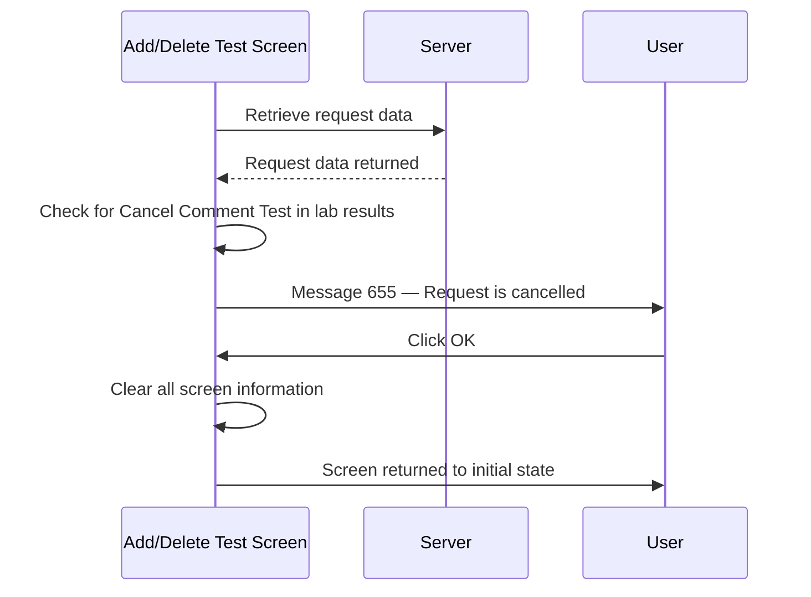

# Request Cancelled Message

## Overview

When a request is retrieved on the Add/Delete Test screen and the system determines that it has already been cancelled, message 655 is displayed to inform the user. Unlike the Cancel Request screen where a cancelled request may still be actionable depending on user rights, on the Add/Delete Test screen a cancelled request is always a blocking condition — the screen is cleared after the user dismisses the message and no further action can be taken on that request.

---

## Related User Stories

- **[[CRST-1022]]** — Add Delete Test — Request Cancelled Message

**Epic:** LISP-262 [CRST][DEV] Add/Delete Test — Request Retrieval

---

## Trigger Point

This check is performed after a request is successfully retrieved from the server. The system examines the lab results of the retrieved request to determine if it has been cancelled.

---

## How Cancellation Is Detected

A request is considered cancelled when **all** of the following conditions are met in the retrieved lab results:
- A test result exists with a group key matching the **Cancel Comment Test** code, and
- The corresponding test result group counter is **1**, and
- The test result code (ckey) matches the **Cancel Comment Test** code, and
- The corresponding test result counter is **1**.

The Cancel Comment Test code is defined by the lab option:

| Lab Option | Field | Value |
|---|---|---|
| `CANCEL` | `option_code` | `CANCEL_COMMENT` |
| — | `option_value` | The test code (ckey) identifying a cancel comment test |

---

## Workflow

### Process Flow

### Step-by-Step Details

1. The request is retrieved and the system scans the lab results for the Cancel Comment Test pattern.
2. If the pattern is found, message **655** is displayed informing the user that the request has been cancelled.
3. The user clicks **OK** to dismiss the message.
4. All information is cleared from the screen — the screen returns to its initial state with the **Request No.** field empty and all controls disabled.
5. The user must enter a new request number to continue.

---

## Messages

| Message Code | Description | Trigger | User Options | Outcome |
|---|---|---|---|---|
| 655 | Request has been cancelled | Cancel Comment Test found in retrieved lab results | OK (dismiss) | All screen information cleared |

---

## Configuration

| Setting | Option Code | Source Table | Purpose |
|---------|------------|--------------|---------|
| Cancel Comment Test | `CANCEL_COMMENT` | `LAB_OPTION` (`option_group = 'CANCEL'`) | Defines the test code used to identify a cancel comment test record in the lab results, which the system uses to detect cancelled requests |

---

## Business Rules

1. A request is identified as cancelled only when the Cancel Comment Test is found at group counter 1 and test counter 1 simultaneously — partial matches do not trigger the message.
2. On the Add/Delete Test screen, a cancelled request is always a hard stop: the user cannot proceed with add or delete operations on a cancelled request.
3. After dismissing message 655, the screen is unconditionally cleared — there is no option to keep the request data on screen.
4. If the Cancel Comment Test lab option is not configured, the cancellation check cannot be performed and no message will be shown for any request.

---

## Related Workflows

- [[Retrieve Request]] — The cancelled request check occurs as part of the post-retrieval sequence, before the discharge check.
- [[Patient Discharged Message]] — The discharge check only applies to non-cancelled requests; a cancelled request will not trigger message 4153, 4156, or 4157.
