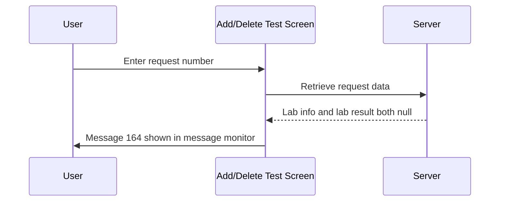

# Request Not Found Message

## Overview

When a user enters a request number on the Add/Delete Test screen and the system is unable to locate any matching request data, message 164 is shown in the message monitor. The message informs the user that the request could not be found so they can verify the number and try again.

---

## Related User Stories

- **[[CRST-1023]]** — Add Delete Test — Request Not Found Message

**Epic:** LISP-262 [CRST][DEV] Add/Delete Test — Request Retrieval

---

## Trigger Point

This message is shown after the server returns a response where both the retrieved lab information and lab results are null — meaning no request record was found for the entered request number.

---

## Workflow

### Process Flow

### Step-by-Step Details

1. The user enters a request number in the **Request No.** field.
2. The system validates the format and sends a retrieval request to the server.
3. The server returns a response where both the lab information and lab results are null.
4. Message **164** is displayed in the message monitor, indicating the request could not be found.
5. The screen remains in its initial state; the user may enter a different request number.

---

## Error Messages

| Message | Description | Trigger | User Options |
|---------|-------------|---------|-------------|
| 164 | Request not found | Server returns null lab info and null lab result for the entered request number | Dismiss (shown in message monitor) |

---

## Business Rules

1. Message 164 is triggered only when **both** the lab information and lab result returned from the server are null.
2. The message is shown in the message monitor (not as a blocking alert); the screen remains accessible.

---

## Related Workflows

- [[Retrieve Request]] — This message is one of the possible outcomes of the request retrieval flow.
- [[Laboratory Selection]] — Lab identification precedes the retrieval attempt; this message is only reached after a lab has been determined.
