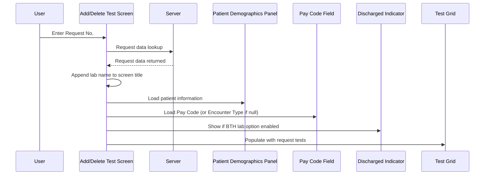

# Retrieve Request

## Overview

When a valid request number is entered and the laboratory has been identified, the Add/Delete Test screen retrieves the full request, loads patient and request information into the relevant panels, and populates the Test Grid with the tests associated with the request. The screen title is updated with the name of the identified lab, and contextual fields such as Pay Code and the Discharged indicator are shown according to hospital and lab configuration.

---

## Related User Stories

- **[[CRST-1019]]** — Add Delete Test — Retrieve Request

**Epic:** LISP-262 [CRST][DEV] Add/Delete Test — Request Retrieval

---

## Trigger Point

Initiated after the request number has been entered, the laboratory has been identified (with no unsupported-lab block), and the system has successfully retrieved the request data from the server.

---

## Workflow Scenario: Retrieve Request

### Prerequisites

- A valid request number has been entered.
- The identified lab is supported on this screen.
- No other blocking messages (e.g., patient discharged, private patient, cancelled request) have been triggered.

### Process Flow

### Step-by-Step Details

1. **Screen title updated:** The lab name is appended to the screen title based on the identified laboratory number:

   | Lab No | Labs | Title Suffix |
   |--------|------|--------------|
   | 1 | CPS, TIS, NBS | Chemical Pathology Lab |
   | 2 | GNS | Genetic Lab |
   | 3 | HMS | Haematology Lab |
   | 4 | IMS | Immunology Lab |
   | 5 | APS | Anatomical Pathology Lab |
   | 6 | BBS | Blood Bank |
   | 7 | MBS | Microbiology Lab |
   | 8 | VRS | Virology Lab |

2. **Patient information loaded:** Patient demographics (name, date of birth, sex, HKID, etc.) are loaded into the read-only Patient Demographics panel.

3. **Pay Code displayed:** The GCRS Order Pay Code is loaded into the **Pay Code** field. If the Pay Code is null, the **Encounter Type** is displayed instead.

4. **Discharged indicator shown:** For BTH hospitals, if the "add test for discharged patient" lab option is enabled, the **Discharged** text indicator is shown with the patient's discharge date.

5. **Test Grid populated:** All tests associated with the request are loaded into the Test Grid. Each row represents one test with the following columns:

   | Column | Data Displayed | Notes |
   |--------|---------------|-------|
   | DEL | Deletion indicator | Default blank (not marked for deletion) |
   | Specimen | Specimen or USID | Specimen number related to the test |
   | Test Profile | Profile name | Profile the test belongs to |
   | Group | Test group alpha code | From test group dictionary |
   | Test Code | Test alpha code | For Culture result type, the Sensitivity test code is used |
   | Test Name | Test full name | For Culture result type, the Sensitivity test name is used |
   | Ctr | Group counter | **Visible for Special Lab only** |
   | Sub-ctr | Test counter; Sensitivity test counter for Culture tests | **Visible for Special Lab only** |
   | Status Date | Test status date | Background colour reflects the test status |
   | Optional | "Y" if optional; "N" if not | |

   Three additional **invisible** columns are also stored in each row for use by downstream logic:

   | Invisible Column | Purpose |
   |------------------|---------|
   | isStandalone | True if the test's group contains only one test with the same key *(non-MBS only)* |
   | isFirstDftRequest | True if this is the first DFT request (DFT Request time flag = 0) *(CPS only)* |
   | isTisCorrelationExist | True if a TIS correlation exists for this test *(TIS / Lab No. 1 only)* |

6. **Test Grid sorting:** If the `ENABLE_SORT` lab option is disabled, the Test Grid is sorted using the default sort order: **Test Profile → Group Key → Ctr → Result Type → Sub-ctr**. If sorting is enabled, the user may interact with column headers to re-sort.

---

## Configuration

| Setting | Option Code | Source Table | Purpose | Effect When Enabled | Effect When Disabled |
|---------|------------|--------------|---------|--------------------|--------------------|
| Add Test for Discharged Patient | *(option_group = 'TEST_MAINTENANCE')* | `LAB_OPTION` | Controls whether discharged patients can have tests added | Discharged indicator shown | Discharged indicator hidden |
| Enable Sort | `ENABLE_SORT` | `LAB_OPTION` (`option_group = 'TEST_MAINTENANCE'`) | Controls whether the user can sort the Test Grid | User can click column headers to sort | Default sort order applied automatically |

---

## Business Rules

1. The screen title always reflects the name of the identified lab, appended after the base screen title on every retrieval.
2. If the GCRS Order Pay Code is null, the Encounter Type is displayed in the Pay Code field instead.
3. The Discharged indicator is only relevant for BTH (private hospital) patients and is subject to a configurable lab option.
4. For Culture test types, the Test Code, Test Name, and Sub-ctr columns display the corresponding Sensitivity test values.
5. The **Ctr** and **Sub-ctr** columns are only visible when a Special Lab (BBNK, CHEM, MICR) request is loaded.
6. The three invisible columns (isStandalone, isFirstDftRequest, isTisCorrelationExist) are loaded per test but not displayed; they are used by lab-specific validation logic downstream.
7. The default Test Grid sort order (when sort is not enabled) is: Test Profile → Group Key → Ctr → Result Type → Sub-ctr.

---

## Related Workflows

- [[Not Supported Lab Message]] — Checked before retrieval proceeds.
- [[Patient Discharged Message]] — Checked after retrieval; may block the screen.
- [[Private Patient Message]] — Checked after retrieval; may restrict the screen.
- [[Request Cancelled Message]] — Checked after retrieval; blocks the screen if request is cancelled.
- [[Request Not Found Message]] — Displayed if the server returns no matching request.
- [[Laboratory Selection]] — Precedes this workflow when multiple labs match the request format.
