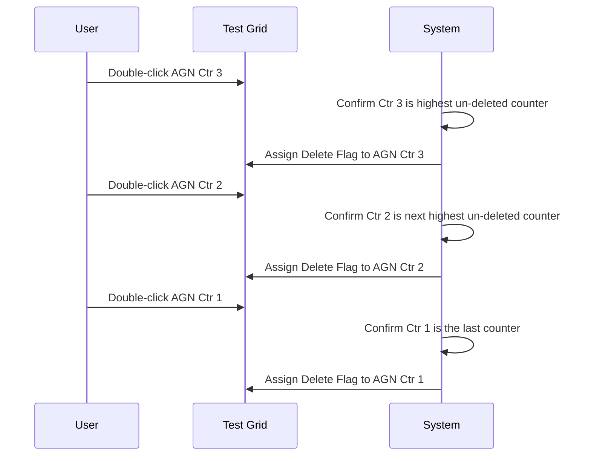
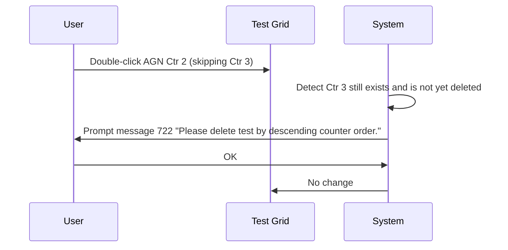
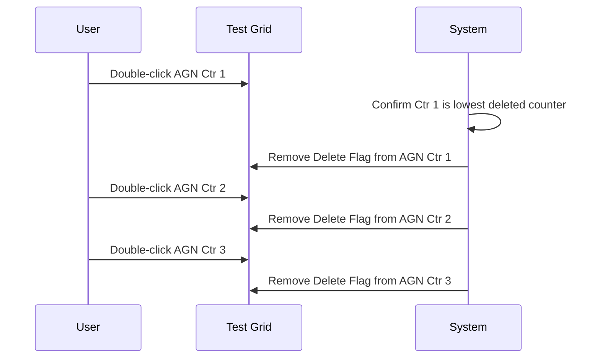
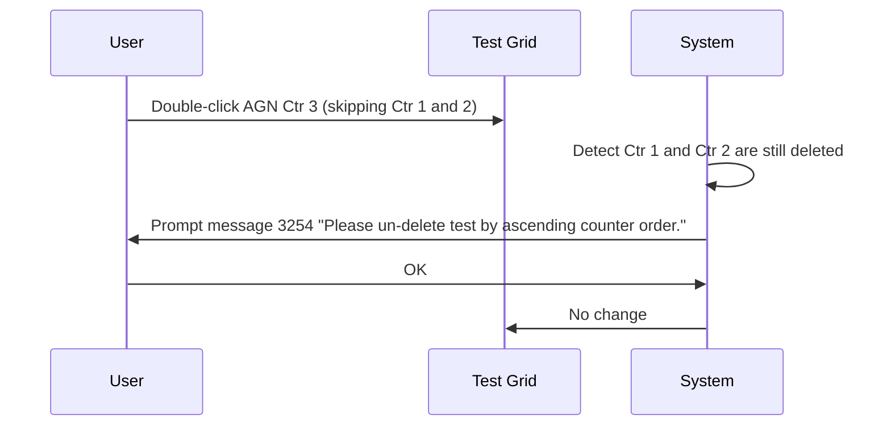
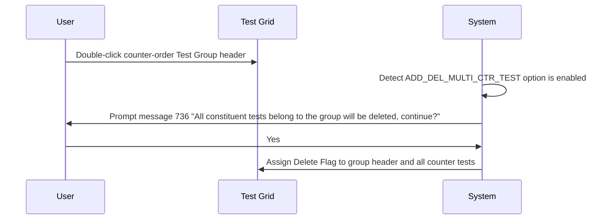
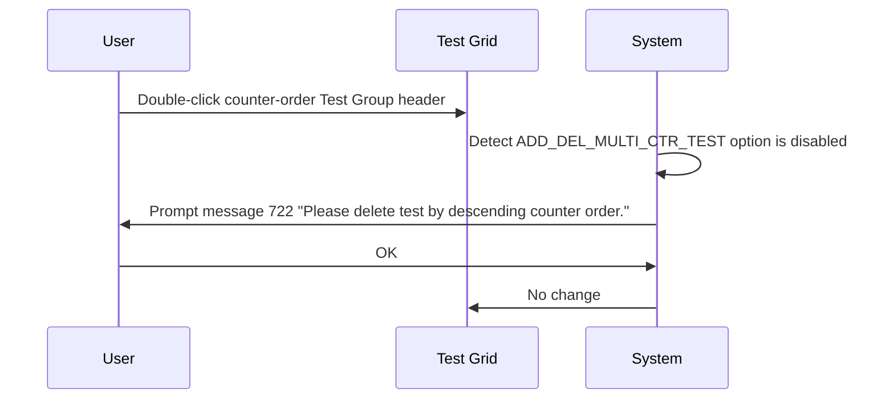

# Mark Test to Delete - Check Test Delete or Un-delete in Order

## Overview

This workflow governs the order in which tests with repeated counter values must be deleted or un-deleted in the Add Delete Test screen. The rule applies specifically to **B. Bank lab** requests, where the same test code can appear multiple times within a group, each with a distinct counter (Ctr) value. Tests must be deleted in **descending counter order** and un-deleted in **ascending counter order**. An option also controls whether deleting a counter-order test group in a single action is permitted.

---

## Related User Stories

- **[[CRST-1029]]** - Add Delete Test - Mark Test to Delete: Check Test Delete or Un-delete in Order

**Epic:** LISP-264 [CRST][DEV] Add/Delete Test - Screen Object Interaction

---

## Key Concepts

### Counter Order (Ctr)
The `TESTRSLT.testrslt_ctr` value that differentiates multiple rows of the same test code within the same group. For B. Bank lab, a single test code (e.g., AGN) may appear with Ctr values 1, 2, and 3, representing repeated test entries.

### Descending Delete Order
When marking tests with counter values for deletion, the test with the **highest Ctr value must be deleted first**, working down to Ctr 1. Skipping or reversing this order is blocked by a message prompt.

### Ascending Un-delete Order
When removing the Delete Flag from counter-order tests, the test with the **lowest Ctr value must be un-deleted first**, working up. Skipping or reversing this order is blocked by a message prompt.

### ADD_DEL_MULTI_CTR_TEST Option
A lab option that controls whether a user may delete all counter-order tests in a group at once by double-clicking the group header. When disabled, double-clicking the group header for a counter-order group is blocked with message 722.

---

## Trigger Point

This check is invoked automatically as part of the [[Mark Test to Delete]] workflow, whenever the user double-clicks a test row that belongs to a group containing multiple counter-order tests in a B. Bank lab request.

---

## Workflow Scenarios

### Scenario 1: Delete Counter-Order Tests in Descending Order (Correct)

#### Prerequisites
- A B. Bank lab request is retrieved.
- The Test Grid contains a test code (e.g., AGN) appearing in the same group with Ctr values 1, 2, and 3.
- None of the rows have the Delete Flag assigned yet.

#### Process Flow

#### Step-by-Step Details

1. The user double-clicks the row for AGN with Ctr 3. The system confirms this is the highest un-deleted counter value in the group and assigns the Delete Flag.
2. The user double-clicks the row for AGN with Ctr 2. The system confirms this is now the highest remaining un-deleted counter and assigns the Delete Flag.
3. The user double-clicks the row for AGN with Ctr 1. As the last counter, the Delete Flag is assigned.

---

### Scenario 2: Delete Counter-Order Tests Out of Sequence (Blocked)

#### Prerequisites
- A B. Bank lab request is retrieved with AGN at Ctr 1, 2, and 3 — all un-deleted.
- The user attempts to delete AGN Ctr 2 before deleting Ctr 3.

#### Process Flow

#### Step-by-Step Details

1. The user double-clicks AGN Ctr 2 without first deleting Ctr 3.
2. The system detects that a higher counter value still exists without the Delete Flag.
3. Message **722** is displayed: *"Please delete test by descending counter order."*
4. The user clicks **OK**. The message closes and no Delete Flag is assigned.

---

### Scenario 3: Un-delete Counter-Order Tests in Ascending Order (Correct)

#### Prerequisites
- All AGN counter rows (Ctr 1, 2, 3) already have the Delete Flag assigned.
- The user begins un-deleting starting from Ctr 1.

#### Process Flow

#### Step-by-Step Details

1. The user double-clicks AGN Ctr 1. The system confirms this is the lowest deleted counter and removes the Delete Flag.
2. The user double-clicks AGN Ctr 2. The Delete Flag is removed.
3. The user double-clicks AGN Ctr 3. The Delete Flag is removed.

---

### Scenario 4: Un-delete Counter-Order Tests Out of Sequence (Blocked)

#### Prerequisites
- All AGN counter rows (Ctr 1, 2, 3) have the Delete Flag assigned.
- The user attempts to un-delete AGN Ctr 3 before un-deleting Ctr 1 and Ctr 2.

#### Process Flow

#### Step-by-Step Details

1. The user double-clicks AGN Ctr 3 without first un-deleting Ctr 1 and Ctr 2.
2. The system detects that lower counter values still have the Delete Flag assigned.
3. Message **3254** is displayed: *"Please un-delete test by ascending counter order."*
4. The user clicks **OK**. The message closes and no change is made.

---

### Scenario 5: Delete an Entire Counter-Order Test Group — Option Enabled

#### Prerequisites
- `LAB_OPTION [option_group = 'TEST_MAINTENANCE', option_code = 'ADD_DEL_MULTI_CTR_TEST', option_value = 1]` is set for the lab.
- The test group contains counter-order tests (e.g., AGN Ctr 1, 2, 3).
- The user double-clicks the **group header row** for the counter-order group.

#### Process Flow

#### Step-by-Step Details

1. The user double-clicks the group header row for a counter-order test group.
2. The system checks the `ADD_DEL_MULTI_CTR_TEST` lab option and finds it enabled.
3. Message **736** is displayed (as per the standard group deletion flow — see [[Mark Test to Delete]]).
4. The user clicks **Yes**. The Delete Flag is assigned to the group header and all counter test rows within the group.

---

### Scenario 6: Delete an Entire Counter-Order Test Group — Option Disabled

#### Prerequisites
- `LAB_OPTION [option_group = 'TEST_MAINTENANCE', option_code = 'ADD_DEL_MULTI_CTR_TEST', option_value = 0]` is set for the lab.
- The user double-clicks the **group header row** for a counter-order test group.

#### Process Flow

#### Step-by-Step Details

1. The user double-clicks the group header row for a counter-order test group.
2. The system checks the `ADD_DEL_MULTI_CTR_TEST` lab option and finds it disabled.
3. Message **722** is displayed: *"Please delete test by descending counter order."*
4. The user clicks **OK**. No change is made to the Delete Flag.

---

## Summary Tables

### Order Enforcement Rules

| Action | Required Order | Violation Message |
|---|---|---|
| Delete counter-order tests individually | Descending (highest Ctr first) | 722 — "Please delete test by descending counter order." |
| Un-delete counter-order tests individually | Ascending (lowest Ctr first) | 3254 — "Please un-delete test by ascending counter order." |
| Delete counter-order test group (option enabled) | Group header triggers message 736; all flagged at once | None (standard group deletion) |
| Delete counter-order test group (option disabled) | Not allowed by group header | 722 — "Please delete test by descending counter order." |

### Messages

| Message | Text | Trigger | User Options |
|---|---|---|---|
| 722 | "Please delete test by descending counter order." | Deletion not in descending Ctr order; or group deletion attempted when option disabled | OK |
| 3254 | "Please un-delete test by ascending counter order." | Un-deletion not in ascending Ctr order | OK |

> Both message 722 and message 3254 have only an **OK** button. No further action follows after dismissal; the grid remains unchanged.

---

## Configuration

| Setting | Option Code | Purpose | Effect when enabled | Effect when disabled |
|---|---|---|---|---|
| Multi-Counter Test Group Delete | `ADD_DEL_MULTI_CTR_TEST` | Controls whether an entire counter-order test group can be deleted at once via the group header | Group header double-click proceeds to message 736 confirmation | Message 722 shown; group header delete is blocked |

> Source: `LAB_OPTION` table, `option_group = 'TEST_MAINTENANCE'`, `option_code = 'ADD_DEL_MULTI_CTR_TEST'`, `option_value = 1` (enabled) or `0` (disabled).

---

## Business Rules

1. Counter-order checking applies only to labs where the **Ctr** column is visible — specifically B. Bank lab.
2. Tests within the same group and with the same test code but different Ctr values must always be deleted in **descending** Ctr order.
3. Tests within the same group and with the same test code but different Ctr values must always be un-deleted in **ascending** Ctr order.
4. Violating either ordering rule displays a blocking message (722 or 3254) and leaves the Delete Flag unchanged.
5. The `ADD_DEL_MULTI_CTR_TEST` option only affects counter-order group deletion via the group header. Individual test row interactions are always subject to rules 2 and 3 regardless of the option value.
6. Messages 722 and 3254 are non-branching — clicking OK dismisses the message and no further action is taken.

---

## Related Workflows

- [[Mark Test to Delete]] — This order check is performed as part of every double-click interaction in the Mark Test to Delete workflow.
- [[Mark Test to Delete - User Access Right Validation]] — Access rights are checked before this order check is performed.
- [[Add Delete Test (Action)]] — The Submit workflow that processes the Delete Flags accumulated by this workflow.
