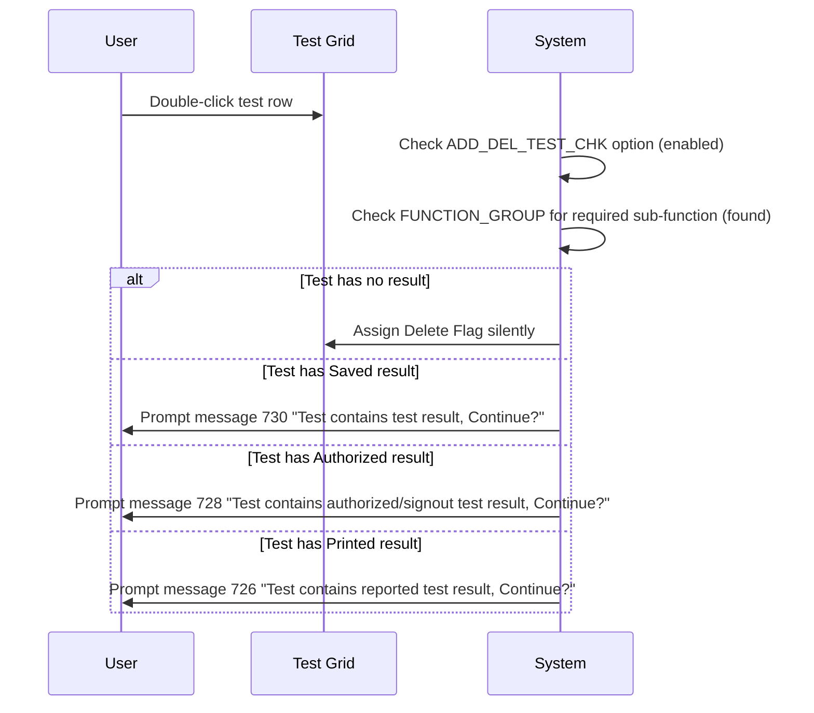
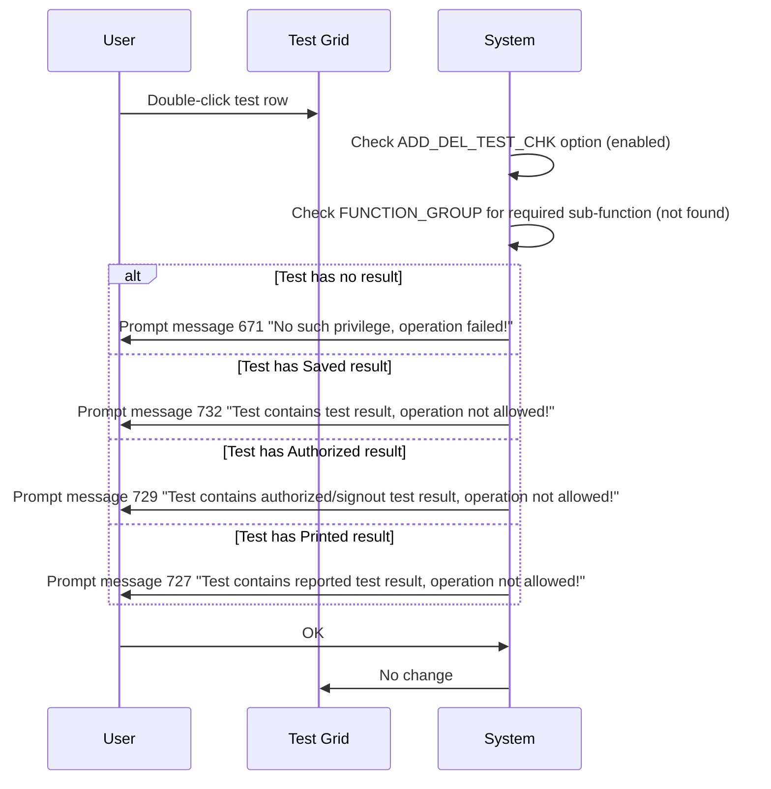
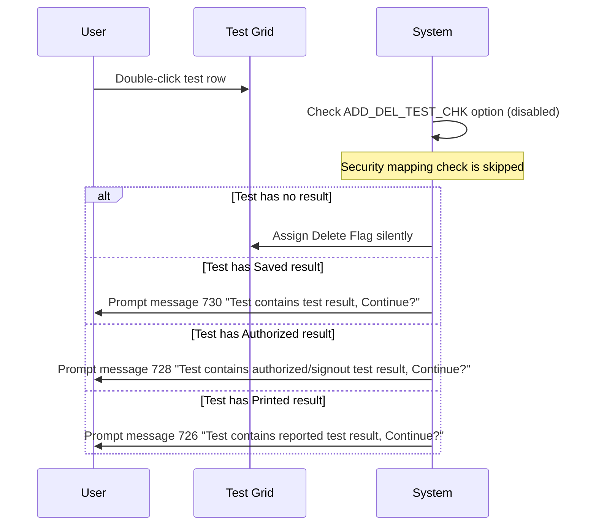

# Mark Test to Delete - User Access Right Validation

## Overview

Before any Delete Flag can be assigned to a test in the Add Delete Test screen, the system evaluates the user's authorisation rights for that specific type of deletion. The validation outcome depends on two factors: whether the `ADD_DEL_TEST_CHK` lab option is enabled, and whether the appropriate security function has been set up in the `FUNCTION_GROUP` table for the lab. The result determines whether the deletion proceeds silently, prompts for confirmation, or is blocked outright.

---

## Related User Stories

- **[[CRST-1030]]** - Add Delete Test - Mark Test to Delete: User Access Right Validation

**Epic:** LISP-264 [CRST][DEV] Add/Delete Test - Screen Object Interaction

---

## Key Concepts

### ADD_DEL_TEST_CHK Option
A lab option (`LAB_OPTION`, `option_group = 'TEST_MAINTENANCE'`, `option_code = 'ADD_DEL_TEST_CHK'`) that controls whether security function mapping is enforced when marking tests for deletion. When enabled, the system checks whether the user's role is mapped to the required deletion function in `FUNCTION_GROUP`. When disabled, the security mapping check is bypassed.

### FUNCTION_GROUP Security Mapping
Each lab has a set of security functions registered in the `FUNCTION_GROUP` table. For Add Delete Test, the relevant function names are per-lab (e.g., `w_lis_test_maintenance` for most labs, `w_lis_bbnk_test_maintenance` for B. Bank). Each deletion authority type has a corresponding sub-function (e.g., `cbx_delete_test`, `cbx_delete_resulted_test`). If the mapping exists for the user's lab, the user has the right to delete that category of test.

### Test Result Status Categories
The validation logic groups test result statuses into four categories:

| Category | Applicable TESTRSLT.testrslt_status Values |
|---|---|
| No result | 0 (not ready) |
| Saved result | 1 (Saved), 21 (Amended and Saved) |
| Authorized result | 4 (Await Signout), 5 (Authorized), 24 (Amended and Await Signout), 25 (Amended and Authorized) |
| Printed result | 6 (Printed), 26 (Amended and Printed) |

---

## Trigger Point

This validation is performed as part of the [[Mark Test to Delete]] workflow immediately after the user double-clicks a test row, before the Delete Flag is assigned or any confirmation prompt is shown.

---

## Security Function Mapping by Lab

| Lab No. | Lab | Security Function Name |
|---|---|---|
| 1 | Chem. | `w_lis_test_maintenance` |
| 2 | Genetic. | `w_lis_gns_test_maintenance` |
| 3 | Haem. | `w_lis_test_maintenance` |
| 4 | Immu. | `w_lis_test_maintenance` |
| 5 | Histo. | `w_lis_test_maintenance` |
| 6 | B. Bank | `w_lis_bbnk_test_maintenance` |
| 7 | Micro. | `w_lis_test_maintenance` |
| 8 | Viro. | `w_lis_test_maintenance` |
| 9 | CRS | `w_lis_crs_test_maintenance` |

### Authorisation Sub-Functions

| Authorisation | Sub-Function |
|---|---|
| Add Test | `cbx_add_test` |
| Delete Test (no result) | `cbx_delete_test` |
| Delete Resulted Test (Saved status) | `cbx_delete_resulted_test` |
| Delete Authorized Test (Authorized / Await Signout status) | `cbx_delete_authorized_test` |
| Delete Reported Test (Printed status) | `cbx_delete_reported_test` |

---

## Workflow Scenarios

### Scenario 1: Option Enabled — Security Mapping Exists

When `ADD_DEL_TEST_CHK` is enabled **and** the required sub-function is mapped in `FUNCTION_GROUP` for the lab, the system proceeds with confirmation prompts for non-trivial deletions.

#### Process Flow

#### Step-by-Step Details

1. The user double-clicks a test row. The system checks the `ADD_DEL_TEST_CHK` option — it is enabled.
2. The system checks `FUNCTION_GROUP` for the required sub-function for this lab — the mapping exists.
3. The outcome depends on the test's result status:
   - **No result (status 0):** Delete Flag is assigned immediately, with no prompt.
   - **Saved result (status 1 or 21):** Message **730** is displayed: *"Test contains test result, Continue?"* — Yes/No.
   - **Authorized result (status 4, 5, 24, or 25):** Message **728** is displayed: *"Test contains authorized/signout test result, Continue?"* — Yes/No.
   - **Printed result (status 6 or 26):** Message **726** is displayed: *"Test contains reported test result, Continue?"* — Yes/No.
4. For messages 726, 728, and 730:
   - **Yes:** The message closes and the Delete Flag is assigned.
   - **No:** The message closes and no change is made.

---

### Scenario 2: Option Enabled — Security Mapping Does NOT Exist

When `ADD_DEL_TEST_CHK` is enabled but the required sub-function is **not** mapped in `FUNCTION_GROUP`, the deletion is blocked with a non-confirmatory message regardless of test status.

#### Process Flow

#### Step-by-Step Details

1. The user double-clicks a test row. The `ADD_DEL_TEST_CHK` option is enabled but the security mapping is absent.
2. A blocking message is displayed based on the test's result status — all are non-confirmatory (OK only):
   - **No result:** Message **671**: *"No such privilege, operation failed!"*
   - **Saved result:** Message **732**: *"Test contains test result, operation not allowed!"*
   - **Authorized result:** Message **729**: *"Test contains authorized/signout test result, operation not allowed!"*
   - **Printed result:** Message **727**: *"Test contains reported test result, operation not allowed!"*
3. The user clicks **OK**. The message closes and no change is made to the Delete Flag.

---

### Scenario 3: Option Disabled

When `ADD_DEL_TEST_CHK` is disabled, the security mapping check in `FUNCTION_GROUP` is **not** performed. The system falls back to confirmation-only behaviour for tests with results, and assigns the flag silently for tests without results.

#### Process Flow

#### Step-by-Step Details

1. The user double-clicks a test row. The `ADD_DEL_TEST_CHK` option is disabled.
2. The security mapping check is skipped entirely.
3. Behaviour by test status:
   - **No result (status 0):** Delete Flag is assigned immediately with no prompt.
   - **Saved result (status 1 or 21):** Message **730** displayed — Yes/No.
   - **Authorized result (status 4, 5, 24, or 25):** Message **728** displayed — Yes/No.
   - **Printed result (status 6 or 26):** Message **726** displayed — Yes/No.
4. For messages 726, 728, and 730: **Yes** assigns the flag; **No** makes no change.

---

## Summary Tables

### Outcome Matrix by Option State and Security Mapping

| ADD_DEL_TEST_CHK | Security Mapping in FUNCTION_GROUP | Test Status | Message | Type | Delete Flag Assigned on Yes/OK? |
|---|---|---|---|---|---|
| Enabled | Exists | No result | None | — | Yes (silent) |
| Enabled | Exists | Saved | 730 | Yes/No | Yes on Yes |
| Enabled | Exists | Authorized | 728 | Yes/No | Yes on Yes |
| Enabled | Exists | Printed | 726 | Yes/No | Yes on Yes |
| Enabled | Not exists | No result | 671 | OK only | No |
| Enabled | Not exists | Saved | 732 | OK only | No |
| Enabled | Not exists | Authorized | 729 | OK only | No |
| Enabled | Not exists | Printed | 727 | OK only | No |
| Disabled | N/A | No result | None | — | Yes (silent) |
| Disabled | N/A | Saved | 730 | Yes/No | Yes on Yes |
| Disabled | N/A | Authorized | 728 | Yes/No | Yes on Yes |
| Disabled | N/A | Printed | 726 | Yes/No | Yes on Yes |

### Messages

| Message | Text | Type | User Options | Outcome on Each Option |
|---|---|---|---|---|
| 726 | "Test contains reported test result, Continue?" | Confirmation | Yes / No | Yes → flag assigned; No → no change |
| 727 | "Test contains reported test result, operation not allowed!" | Blocking | OK | No change |
| 728 | "Test contains authorized/signout test result, Continue?" | Confirmation | Yes / No | Yes → flag assigned; No → no change |
| 729 | "Test contains authorized/signout test result, operation not allowed!" | Blocking | OK | No change |
| 671 | "No such privilege, operation failed!" | Blocking | OK | No change |
| 730 | "Test contains test result, Continue?" | Confirmation | Yes / No | Yes → flag assigned; No → no change |
| 732 | "Test contains test result, operation not allowed!" | Blocking | OK | No change |

---

## Configuration

| Setting | Option Code | Purpose | Effect when enabled | Effect when disabled |
|---|---|---|---|---|
| Delete Test Security Check | `ADD_DEL_TEST_CHK` | Controls whether `FUNCTION_GROUP` security mapping is evaluated before allowing deletion | Security mapping checked; absence of mapping blocks deletion with a non-confirmatory message | Security mapping check skipped; confirmation prompts still apply for tests with results |

> Source: `LAB_OPTION` table, `option_group = 'TEST_MAINTENANCE'`, `option_code = 'ADD_DEL_TEST_CHK'`, `option_value = 1` (enabled) or `0` (disabled).

---

## Business Rules

1. The access right check is performed for every double-click on a test row in the Test Grid, before the order-of-manipulation check.
2. When `ADD_DEL_TEST_CHK` is enabled, both the option and the `FUNCTION_GROUP` mapping must be satisfied for a deletion to proceed.
3. Tests with no result can be deleted silently (no prompt) when access rights are satisfied — either by explicit mapping (option enabled) or by option being disabled.
4. Tests with Saved, Authorized, or Printed result statuses always require confirmation (messages 730, 728, 726) when the user has the right to delete them. They can never be deleted silently.
5. When `ADD_DEL_TEST_CHK` is enabled but the required security mapping is absent, the operation is blocked regardless of test status — the blocking messages (671, 732, 729, 727) are non-confirmatory.
6. When `ADD_DEL_TEST_CHK` is disabled, the system behaves as if the user always has the rights for the deletion; the confirmation prompts for tests with results still apply.
7. The CRS lab (lab no. 9) uses the `w_lis_crs_test_maintenance` security function, not the standard `w_lis_test_maintenance`.

---

## Related Workflows

- [[Mark Test to Delete]] — This validation is the first check performed in every double-click interaction in that workflow.
- [[Mark Test to Delete - Check Test Delete or Un-delete in Order]] — Order-of-manipulation check follows the access right validation.
- [[Add Delete Test (Action)]] — The Submit workflow that processes all Delete Flags set after this validation.
