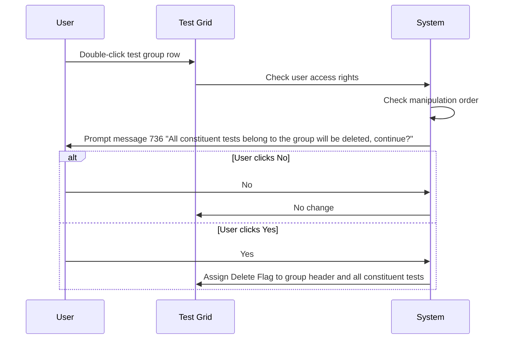
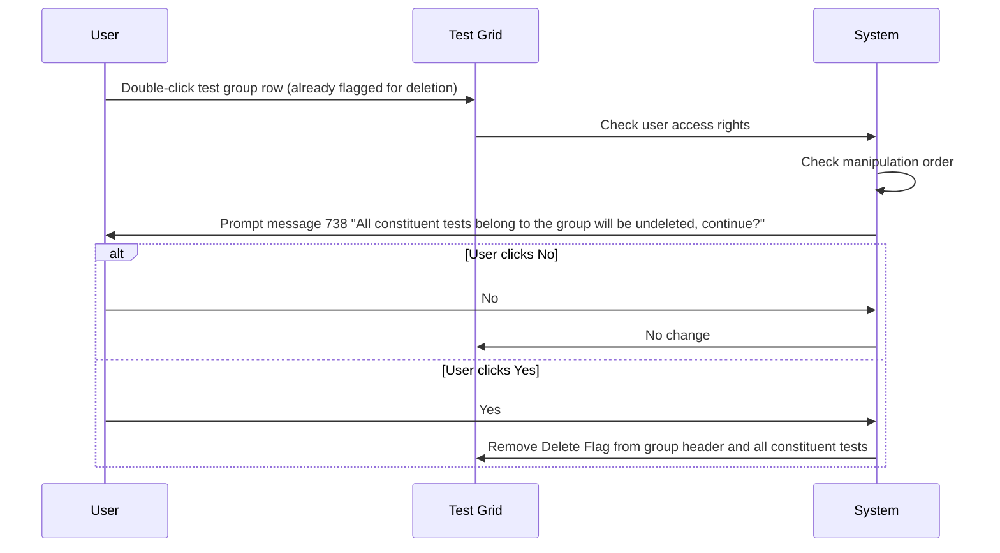
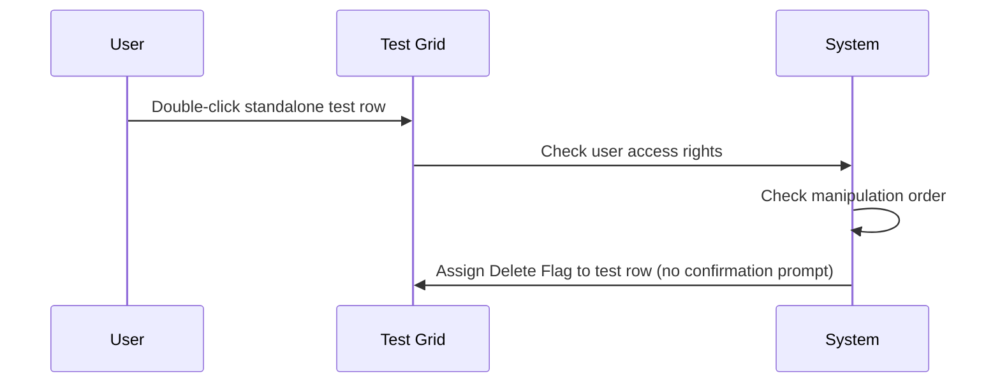
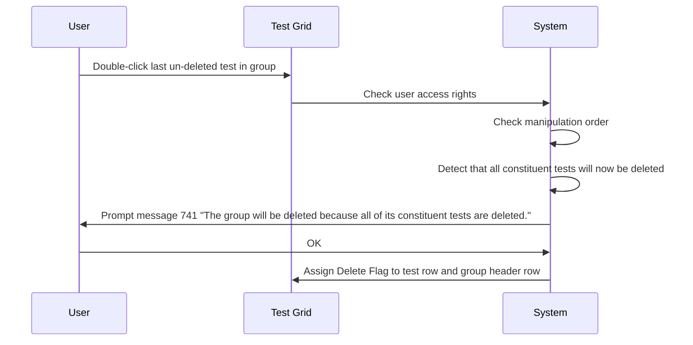

# Mark Test to Delete

## Overview

The Mark Test to Delete workflow allows registration staff to select individual tests or test groups for deletion (or un-deletion) from a retrieved lab request on the Add Delete Test screen. The user double-clicks a row in the Test Grid to toggle the Delete Flag on a test or test group. The system evaluates user access rights and order-of-manipulation constraints before assigning or removing the flag, and prompts for confirmation when an entire test group is affected.

---

## Related User Stories

- **[[CRST-1028]]** - Add Delete Test - Mark Test to Delete

**Epic:** LISP-264 [CRST][DEV] Add/Delete Test - Screen Object Interaction

---

## Key Concepts

### Delete Flag
A visual indicator applied to a row in the Test Grid that marks the test or test group for deletion when the Submit action is executed. Rows with the Delete Flag are visually distinguished in the grid.

### Test Group
A set of constituent tests that share a common group header. Deleting or un-deleting the group header affects all constituent tests within that group.

### Standalone Test
A test that is the sole member of its group, displayed as an individual row. Standalone tests can be deleted directly without a group-level confirmation prompt — unless the deletion would implicitly delete the last remaining test in the group.

### Counter (Ctr / Sub-Ctr)
Visible only for Special Labs (B. Bank and Microbiology). Represents a repeated counter for the same test code within a group. Counter-order tests must be deleted in descending order and un-deleted in ascending order (see [[Mark Test to Delete - Check Test Delete or Un-delete in Order]]).

---

## Trigger Point

This workflow is triggered when the user double-clicks a test or test group row in the Test Grid on the Add Delete Test screen, after a lab request has been successfully retrieved.

---

## Workflow Scenarios

### Scenario 1: Mark a Test Group for Deletion

#### Prerequisites
- A lab request has been retrieved and the Test Grid is populated.
- The user double-clicks a **test group row** (a row where the Test Code column is blank and the Group Code column identifies the group header).
- The test group does not yet have the Delete Flag assigned.

#### Process Flow



#### Step-by-Step Details

1. The user double-clicks a test group row in the Test Grid.
2. The system checks that the user has the required access rights to mark the test group for deletion (see [[Mark Test to Delete - User Access Right Validation]]).
3. The system checks whether the test group can be manipulated in the current order (see [[Mark Test to Delete - Check Test Delete or Un-delete in Order]]).
4. If both checks pass, the system displays message **736**: *"All constituent tests belong to the group will be deleted, continue?"*
5. If the user clicks **No**: the message panel closes and no change is made to the Delete Flag on any row.
6. If the user clicks **Yes**: the message panel closes and the Delete Flag is assigned to the group header row and all constituent test rows within the group.

---

### Scenario 2: Un-mark a Test Group (Remove Delete Flag)

#### Prerequisites
- The Test Grid contains a test group where both the group header and all constituent tests already have the Delete Flag assigned.
- The user double-clicks the **test group row** to toggle it back to un-deleted.

#### Process Flow



#### Step-by-Step Details

1. The user double-clicks a test group row that already has the Delete Flag assigned.
2. The system checks user access rights and manipulation order.
3. The system displays message **738**: *"All constituent tests belong to the group will be undeleted, continue?"*
4. If the user clicks **No**: the message panel closes and no change is made.
5. If the user clicks **Yes**: the message panel closes and the Delete Flag is removed from the group header and all constituent tests within the group.

---

### Scenario 3: Mark a Standalone Test for Deletion (No Last-Test Condition)

#### Prerequisites
- The user double-clicks a **standalone test row** (a test row that is not the last remaining un-deleted test in its group).
- The test does not yet have the Delete Flag assigned.

#### Process Flow



#### Step-by-Step Details

1. The user double-clicks a standalone test row (not the last un-deleted test in its group).
2. The system checks user access rights and manipulation order.
3. If both checks pass, the Delete Flag is assigned directly to the test row without any confirmation prompt.

---

### Scenario 4: Mark the Last Remaining Test in a Group for Deletion

#### Prerequisites
- All other tests in the same group already have the Delete Flag assigned.
- The user double-clicks the **last un-deleted test** within the group.

#### Process Flow



#### Step-by-Step Details

1. The user double-clicks the last test within a group that does not yet have the Delete Flag.
2. The system detects that marking this test would result in all constituent tests within the group being deleted.
3. The system displays message **741**: *"The group will be deleted because all of its constituent tests are deleted."*
4. The user clicks **OK**. The Delete Flag is assigned to both the test row and the group header row.

> Message 741 has only an **OK** button — it is informational, not a choice prompt.

---

### Scenario 5: Un-mark a Standalone Test (Remove Delete Flag from Test and Group)

#### Prerequisites
- The test group header and all its constituent tests already have the Delete Flag assigned.
- The user double-clicks a **specific test row** to un-delete it.

#### Process Flow

```mermaid
sequenceDiagram
    User->>Test Grid: Double-click test row (Delete Flag already set; group also flagged)
    Test Grid->>System: Check user access rights
    System->>System: Check manipulation order
    System->>User: Prompt message 739 "Group header is undeleted because a constituent test is undeleted."
    User->>System: OK
    System->>Test Grid: Remove Delete Flag from test row and group header row
```

#### Step-by-Step Details

1. The user double-clicks a test row whose group header also has the Delete Flag assigned.
2. The system checks user access rights and manipulation order.
3. The system displays message **739**: *"Group header is undeleted because a constituent test is undeleted."*
4. The user clicks **OK**. The Delete Flag is removed from both the test row and the group header row.

> Message 739 has only an **OK** button — it is informational, not a choice prompt.

---

## Summary Tables

### Double-Click Action Summary

| Row Type | Current State | Action | Confirmation Required | Outcome |
|---|---|---|---|---|
| Test Group | Not flagged | Mark delete | Yes — message 736 (Yes/No) | Group header + all tests flagged |
| Test Group | All tests flagged | Mark un-delete | Yes — message 738 (Yes/No) | Group header + all tests un-flagged |
| Standalone test | Not flagged, not last in group | Mark delete | No | Test row flagged |
| Standalone test | Not flagged, last un-deleted in group | Mark delete | Informational — message 741 (OK) | Test row + group header flagged |
| Standalone test | Flagged; group also flagged | Mark un-delete | Informational — message 739 (OK) | Test row + group header un-flagged |

### Messages

| Message | Text | Trigger | User Options |
|---|---|---|---|
| 736 | "All constituent tests belong to the group will be deleted, continue?" | User double-clicks a test group row for deletion | Yes / No |
| 738 | "All constituent tests belong to the group will be undeleted, continue?" | User double-clicks an already-deleted test group row to un-delete | Yes / No |
| 739 | "Group header is undeleted because a constituent test is undeleted." | User un-deletes a specific test whose group header is also flagged | OK |
| 741 | "The group will be deleted because all of its constituent tests are deleted." | User marks the last un-deleted test in a group for deletion | OK |

---

## Data Sources

The columns displayed in the Test Grid are sourced as follows (varies by lab type):

| Column | General Labs (CPS, HMS, IMS, VRS, GNS) | Special Labs (BBS, MBS) |
|---|---|---|
| Delete Flag | N/A (assigned by user interaction) | N/A (assigned by user interaction) |
| Test Profile | `TEST_REGISTRABLE.testreg_profile_desc` | `TEST_REGISTRABLE.testreg_profile_desc` |
| Group Code | `TEST_DICT.test_alpha_code` + `TEST_DICT.test_header_ckey` + `TEST_REGISTRABLE.testreg_header` | `TEST_DICT.test_alpha_code` + `TEST_DICT.test_header_ckey` + `TEST_REGISTRABLE.testreg_header` |
| Test Code | Depends on test group | Depends on test group |
| Test Name | `TEST_DICT.test_full_name` | `TEST_DICT.test_full_name` |
| Ctr | Not shown | `TESTRSLT.testrslt_ctr` |
| Sub-Ctr | Not shown | `TESTRSLT.testrslt_rslt_ctr` |
| Status Date | `TESTRSLT.testrslt_status_date` | `TESTRSLT.testrslt_status_date` |
| Optional | `TESTRSLT.testrslt_optional` | `TESTRSLT.testrslt_optional` |

> The **Ctr** and **Sub-Ctr** columns are only visible for B. Bank and Microbiology labs.

---

## Business Rules

1. Double-clicking a row always initiates access rights checking before any flag change is applied.
2. Manipulation-order checking is performed before the Delete Flag is assigned or removed (see [[Mark Test to Delete - Check Test Delete or Un-delete in Order]]).
3. Marking a test group for deletion always requires user confirmation (message 736 or 738). Individual standalone tests do not require confirmation unless the last-test condition applies.
4. Marking the last remaining un-deleted test in a group implicitly marks the group header for deletion as well (message 741 — informational, not confirmatory).
5. Un-deleting any test within a group automatically removes the Delete Flag from the group header (message 739 — informational, not confirmatory).
6. The Delete Flag is a screen-level state only until Submit is executed. No data is written to the database by this workflow alone.

---

## Related Workflows

- [[Mark Test to Delete - Check Test Delete or Un-delete in Order]] — The order-of-manipulation check is performed as part of every double-click action in this workflow.
- [[Mark Test to Delete - User Access Right Validation]] — Access rights are verified before any Delete Flag change is applied.
- [[Object Enablement After Retrieval]] — Defines the screen state in which the Test Grid is interactive.
- [[Add Delete Test (Action)]] — The Submit workflow that processes the Delete Flags set by this workflow.
