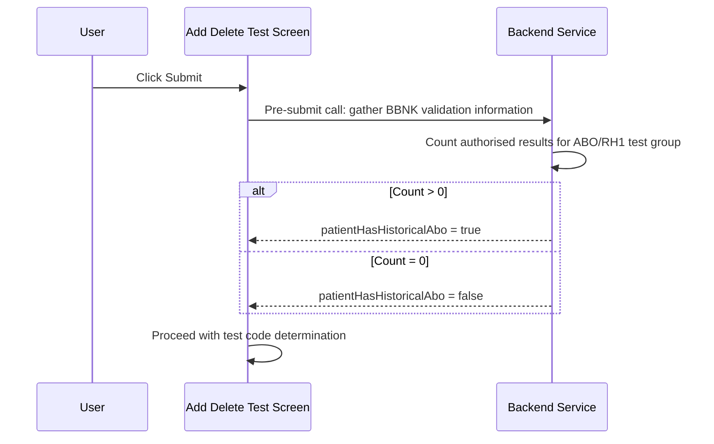

# BBNK Get Patient Blood History

## Overview

Before the Add Delete Test submission is processed for a BBNK request, the system performs a pre-submit server call to retrieve the patient's blood history. This information is required to correctly determine which test codes should be registered when tests are added (see [[BBNK Test Code Determination]]). The system determines whether the patient has a historical ABO record either by querying test results or by consulting an external Patient Blood History Service, depending on how the lab has been configured.

---

## Related User Stories

- **[[CRST-1046]]** — Add Delete Test - BBNK: Get Patient Blood History

**Epic:** LISP-268 [CRST][DEV] Add/Delete Test — Special Lab Workflow (BBNK)

---

## Key Concepts

### Historical ABO
A patient is considered to have a historical ABO record if they have a previously authorised result for the ABO/RH1 test group. The presence or absence of this record directly controls which BBNK test codes are registered on submission.

### Patient Blood History Service
An external service that provides blood history data when the lab is not configured to derive this information from test results directly.

---

## Trigger Point

This workflow is triggered when the user clicks the **Submit** button on the Add Delete Test screen for a BBNK request, as part of the pre-submit server call sequence that runs before the request packing data is sent to the server.

---

## Workflow Scenarios

### Scenario 1: Historical ABO Determined from Test Results

#### Prerequisites

- The lab option `HISTORICAL_ABO_CHECK_CRITERIA` (option group `REQUEST_REGISTRATION`) is configured with `option_value = 1` for the BBNK lab.
- The user clicks **Submit** on a BBNK request.

#### Process Flow

#### Step-by-Step Details

1. The user clicks **Submit** on the Add Delete Test screen for a BBNK request.
2. The system identifies that this is a BBNK request and initiates a pre-submit server call to gather BBNK-specific validation information before packing the request.
3. The backend service detects that `HISTORICAL_ABO_CHECK_CRITERIA` is set to `1` for the lab.
4. The backend service counts the patient's authorised results for the ABO/RH1 test group (test member key = 3).
5. If the count is greater than zero, the patient is determined to have a **historical ABO** record. If the count is zero, the patient has no historical ABO record.
6. The result (`patientHasHistoricalAbo`: true or false) is returned to the Add Delete Test screen.
7. The screen stores this value and proceeds to the test code determination step (see [[BBNK Test Code Determination]]).

---

### Scenario 2: Historical ABO Determined from Patient Blood History Service

#### Prerequisites

- The lab option `HISTORICAL_ABO_CHECK_CRITERIA` (option group `REQUEST_REGISTRATION`) is **not** configured, or is configured with `option_value = 0`, for the BBNK lab.
- The user clicks **Submit** on a BBNK request.

#### Step-by-Step Details

1. The user clicks **Submit** on the Add Delete Test screen for a BBNK request.
2. The system identifies that this is a BBNK request and initiates a pre-submit server call to gather BBNK-specific validation information.
3. The backend service detects that `HISTORICAL_ABO_CHECK_CRITERIA` is not set to `1`.
4. The backend service consults the **Patient Blood History Service** to determine whether the patient has a prior blood history.
5. The result (`patientHasHistoricalAbo`: true or false) is returned to the Add Delete Test screen.
6. The screen stores this value and proceeds to the test code determination step.

> **Note:** As of the time of writing, no hospital has been configured to use the test-result-based method (`HISTORICAL_ABO_CHECK_CRITERIA = 1`). All sites currently retrieve blood history via the Patient Blood History Service.

---

## Configuration

| Setting | Option Code | Option Group | Purpose | Effect when enabled (value = 1) | Effect when disabled (value = 0 or absent) |
|---------|------------|--------------|---------|--------------------------------|--------------------------------------------|
| Historical ABO Check Criteria | `HISTORICAL_ABO_CHECK_CRITERIA` | `REQUEST_REGISTRATION` | Determines the source used to establish whether a patient has a historical ABO record | Blood history determined from authorised ABO/RH1 test results | Blood history determined from the Patient Blood History Service |

---

## Business Rules

1. The patient blood history retrieval is performed as a mandatory pre-submit step for all BBNK requests; it is not optional.
2. The `patientHasHistoricalAbo` flag (true or false) derived from this workflow is consumed directly by the test code determination logic on submission. See [[BBNK Test Code Determination]].
3. The pre-submit server call for BBNK is distinct from the main submission call — it runs first and its result must be received before the request packing data is sent.

---

## Related Workflows

- [[BBNK Test Code Determination]] — Uses the `patientHasHistoricalAbo` flag returned by this workflow to determine the correct test codes to register.
- [[Add Delete Test (Action)]] — The overall submission workflow; the BBNK pre-submit call is an additional step in the pre-submit sequence.
