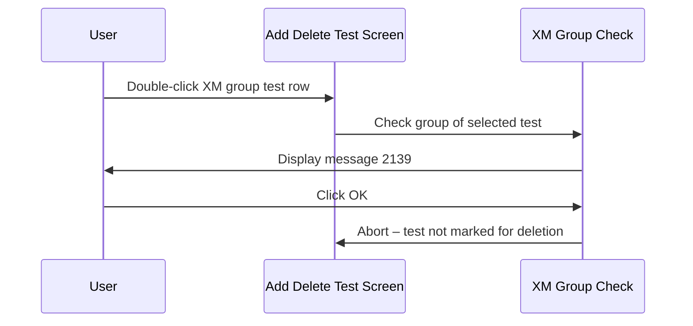

# BBNK Mark Test to Delete - Check Cross Match Group

## Overview

When a user attempts to mark a test for deletion on a BBNK request, the system checks whether the selected test belongs to the Cross Match (XM) group. Tests in the XM group may have issued blood components or reserved blood products associated with them, and deleting such tests from the Add Delete Test screen is not permitted. If the selected test is in the XM group, message 2139 is displayed and the deletion is blocked. This check is the first step in the BBNK mark-delete validation sequence.

---

## Related User Stories

- **[[CRST-1045]]** — Add Delete Test - BBNK: Mark Test to Delete - Check Cross Match Group

**Epic:** LISP-268 [CRST][DEV] Add/Delete Test — Special Lab Workflow (BBNK)

---

## Trigger Point

Initiated as Step 1 of the [[BBNK Mark Test to Delete]] sequence, immediately when a user double-clicks a test row on a BBNK request to mark it for deletion.

---

## Workflow Scenarios

### Scenario 1: Selected Test Is in the XM Group

#### Prerequisites

- A BBNK request has been retrieved on the Add Delete Test screen.
- The user double-clicks a test row whose group belongs to the Cross Match (XM) group.

#### Process Flow

#### Step-by-Step Details

1. The user double-clicks a test row to mark it for deletion on a BBNK request.
2. The system identifies the group of the selected test and checks whether it is the Cross Match (XM) group.
3. The selected test is in the XM group. Message **2139** is displayed:
   > *"Unable to add or delete cross match and issue test result. Please use release worksheet to release reserved blood or use return worksheet to return issued blood component."*
4. The user clicks **OK** to dismiss the message.
5. The message closes. The selected test remains unchanged — it is **not** marked for deletion. All data on the Add Delete Test screen is preserved.

---

### Scenario 2: Selected Test Is Not in the XM Group

#### Prerequisites

- A BBNK request has been retrieved on the Add Delete Test screen.
- The user double-clicks a test row that does not belong to the XM group.

#### Step-by-Step Details

1. The system checks the group of the selected test and finds it is **not** in the XM group.
2. The XM group check passes. The sequence proceeds to Step 2 (User Access Right Check) in the [[BBNK Mark Test to Delete]] sequence.

---

## Summary Table

| Condition | Result | Message |
|-----------|--------|---------|
| Selected test is in the XM group | Deletion blocked | 2139 |
| Selected test is not in the XM group | Proceed to next check | — |

---

## Error Messages and System Prompts

| Message | Text | Trigger | User Options |
|---------|------|---------|-------------|
| 2139 | "Unable to add or delete cross match and issue test result. Please use release worksheet to release reserved blood or use return worksheet to return issued blood component." | User attempts to mark a test in the XM group for deletion | OK (dismiss) |

> **Important:** Clicking OK on message 2139 dismisses the prompt only. The test is **not** marked for deletion and the screen data is unchanged.

---

## Business Rules

1. The XM group is identified by the group key value 26 (as defined in the BBNK test dictionary).
2. The restriction applies to all tests under the XM group — selecting any individual test within the group triggers the same block.
3. To remove issued blood or reserved blood products linked to an XM test, the user must use the **Release Worksheet** (to release reserved blood) or the **Return Worksheet** (to return issued blood components). These operations cannot be performed from the Add Delete Test screen.
4. This check is enforced before any access right check — even users with deletion rights cannot bypass it.

---

## Related Workflows

- [[BBNK Mark Test to Delete]] — The parent sequence; this check is Step 1.
- [[Mark Test to Delete - User Access Right Validation]] — The next step in the BBNK sequence when this check passes.
