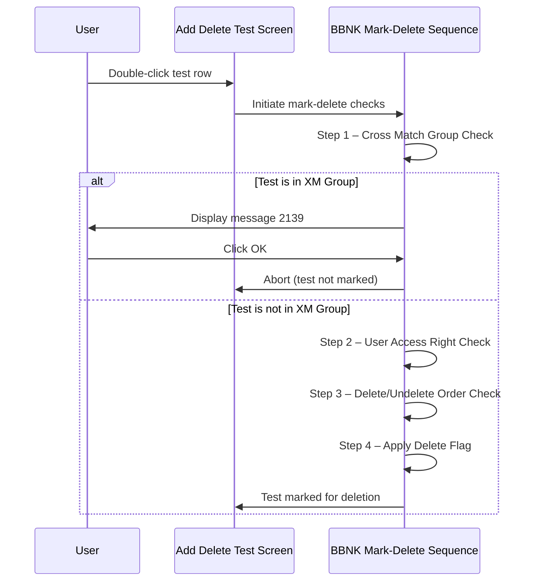

# BBNK Mark Test to Delete

## Overview

When a user marks a test for deletion on a Blood Bank (BBNK) request, the system applies a BBNK-specific validation sequence before the standard checks are run. This sequence differs from the general mark-delete process in that it inserts a lab-specific cross-match group check as the very first step. If the selected test belongs to the Cross Match (XM) group, deletion is immediately blocked and a message is displayed. Only tests outside the XM group proceed through the remaining standard checks.

---

## Related User Stories

- **[[CRST-1044]]** — Add Delete Test - BBNK: Mark Test to Delete

**Epic:** LISP-268 [CRST][DEV] Add/Delete Test — Special Lab Workflow (BBNK)

---

## Trigger Point

This sequence is initiated when the user double-clicks a test row on the Add Delete Test screen for a BBNK request, triggering the mark-delete or un-mark-delete action.

---

## Workflow Scenarios

### Scenario 1: Mark-Delete Sequence for BBNK Requests

#### Prerequisites

- A BBNK request has been retrieved on the Add Delete Test screen.
- The user double-clicks a test row to mark it for deletion.

#### Process Flow

#### Step-by-Step Details

1. The system determines that the request being worked on is a BBNK request and applies the BBNK-specific mark-delete sequence.

2. **Step 1 — Cross Match Group Check:** The system checks whether the selected test belongs to the Cross Match (XM) group. If it does, message **2139** is displayed and the mark-delete action is aborted. See [[BBNK Mark Test to Delete - Check Cross Match Group]] for full details.

3. **Step 2 — User Access Right Check:** The system verifies that the current user has the appropriate access rights to delete the test, based on the test's current status. See [[Mark Test to Delete - User Access Right Validation]] for full details.

4. **Step 3 — Delete / Undelete Order Check:** The system validates that tests are being marked for deletion or un-deletion in the required order. See [[Mark Test to Delete - Check Test Delete or Un-delete in Order]] for full details.

5. **Step 4 — Apply Delete Flag:** If all checks pass, the delete flag is toggled on the selected test. The test row is visually updated to reflect its pending-delete state.

---

## Summary Table — BBNK Mark-Delete Step Sequence

| Step | Check | Failure Message | Action on Failure |
|------|-------|-----------------|-------------------|
| 1 | Cross Match Group | 2139 | Abort; test not marked |
| 2 | User Access Right | *(various — see [[Mark Test to Delete - User Access Right Validation]])* | Abort |
| 3 | Delete / Undelete Order | *(see [[Mark Test to Delete - Check Test Delete or Un-delete in Order]])* | Abort |
| 4 | Apply Delete Flag | — | Test row updated on screen |

> **Note:** The BBNK sequence places the cross-match group check **before** the security check, unlike the CHEM sequence which places TIS correlation first. This ensures that XM group restrictions are enforced regardless of the user's access rights.

---

## Business Rules

1. Tests in the Cross Match (XM) group may never be marked for deletion from the Add Delete Test screen on a BBNK request. Blood management operations for these tests must be performed via the Release Worksheet or Return Worksheet.
2. The BBNK mark-delete validation sequence runs in strict order; each step must pass before the next is evaluated.
3. Clicking OK on message 2139 closes the message and leaves the selected test unchanged — it is not marked for deletion.

---

## Related Workflows

- [[BBNK Mark Test to Delete - Check Cross Match Group]] — Detailed rules for the XM group check (Step 1).
- [[Mark Test to Delete - User Access Right Validation]] — Standard access right check applied at Step 2.
- [[Mark Test to Delete - Check Test Delete or Un-delete in Order]] — Standard order check applied at Step 3.
- [[Mark Test to Delete]] — General (non-lab-specific) mark-delete workflow.
- [[BBNK Get Patient Blood History]] — Patient blood history retrieved on Submit for BBNK requests.
