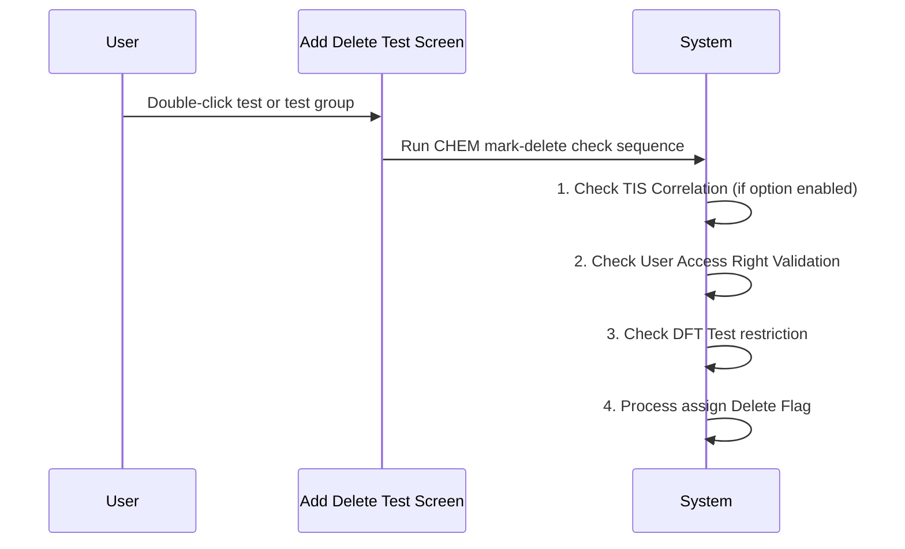

# CHEM: Mark Test to Delete

## Overview

This workflow describes the sequence of checks performed when a user double-clicks a test or test group to mark it for deletion on the Add Delete Test screen for CHEM lab (CPS) and TIS lab requests. The CHEM lab applies a specific ordered set of checks before the delete flag is assigned, with two additional checks prepended ahead of the standard checks used by other labs: a TIS Correlation check and a DFT test check.

---

## Related User Stories

- **[[CRST-1041]]** - Add Delete Test - CHEM: Mark Test to Delete

**Epic:** LISP-267 [CRST][DEV] Add/Delete Test - Special Lab Workflow (CHEM)

---

## Key Concepts

### CHEM Lab
The Chemistry laboratory (CPS lab, lab number 1) within the CRS application. Also covers TIS (Therapeutic Index Service) requests handled through the CPS processor.

### DFT (Drug Function Test)
A type of test that forms a timed series of related requests under a single DFT order. The first request in the series (DFT Time Flag = 0) has a restriction on full deletion — see [[CHEM: Mark Test to Delete - Check DFT]].

### TIS Correlation
A linkage between a TIS lab request and another request. If the `CHECK_TIS_CORRELATION` lab option is enabled, the system prevents deletion of tests on a request that has an active TIS correlation — see [[CHEM: Mark Test to Delete - Check TIS Correlation]].

---

## Trigger Point

Initiated when the user double-clicks a test or test group row in the Test Grid on the Add Delete Test screen, with a CHEM or TIS lab request retrieved.

---

## Workflow Scenarios

### Scenario 1: Delete Check Sequence for CHEM/TIS Lab

#### Process Flow

#### Step-by-Step Details

1. The user double-clicks a test or test group row in the Test Grid.
2. The system runs the CHEM-specific mark-delete check sequence in order:

| Step | Check | Described in |
|---|---|---|
| 1 | TIS Correlation Check (only if `CHECK_TIS_CORRELATION` option is enabled) | [[CHEM: Mark Test to Delete - Check TIS Correlation]] |
| 2 | User Access Right Validation | [[Mark Test to Delete - User Access Right Validation]] |
| 3 | DFT Test Check | [[CHEM: Mark Test to Delete - Check DFT]] |
| 4 | Assign Delete Flag (standard delete/un-delete behaviour) | [[Mark Test to Delete]] |

3. If any check fails (i.e., a blocking message is shown and the user clicks OK), the sequence is aborted and the delete flag is **not** assigned. The test data remains unchanged.
4. If all checks pass, the standard [[Mark Test to Delete]] logic runs and the delete flag is assigned or removed.

---

## Business Rules

1. The CHEM lab runs four sequential checks before assigning a delete flag — two more than the standard lab flow.
2. The TIS Correlation check is only performed if the `CHECK_TIS_CORRELATION` lab option is enabled. If the option is disabled, this step is skipped and the sequence proceeds directly to the access right check.
3. The order of checks is fixed: TIS Correlation → Access Right → DFT → Assign Delete Flag.

---

## Related Workflows

- [[CHEM: Mark Test to Delete - Check TIS Correlation]] — Step 1: checks whether the request has an active TIS correlation that blocks deletion.
- [[Mark Test to Delete - User Access Right Validation]] — Step 2: checks whether the user has sufficient access rights to delete the selected test.
- [[CHEM: Mark Test to Delete - Check DFT]] — Step 3: checks whether the selected test is the last deletable test on a first-DFT-series request.
- [[Mark Test to Delete]] — Step 4: the standard delete flag assignment logic applied after all checks pass.
