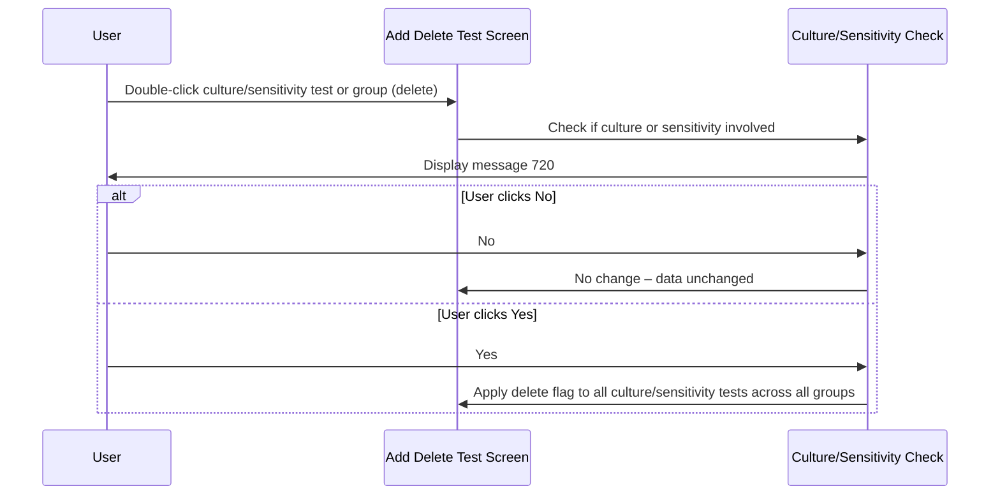

# MICR Mark Test to Delete - Culture or Sensitivity Check

## Overview

When a user marks a Culture or Sensitivity test for deletion or un-deletion on a MICR request, the system requires explicit confirmation before applying the change. This is because Culture and Sensitivity tests are structurally coupled — deleting or restoring one must be propagated to all related culture and sensitivity tests across the entire request. A confirmation message is always shown before any flag is toggled, and clicking **Yes** triggers a cascade update across all culture and sensitivity test rows, regardless of which group they belong to. Non-culture, non-sensitivity tests in the same group are only affected when the top-level "Main" group is the target of the action.

---

## Related User Stories

- **[[CRST-1050]]** — Add Delete Test - MICR: Mark Test to Delete - Culture or Sensitivity Check

**Epic:** LISP-269 [CRST][DEV] Add/Delete Test — Special Lab Workflow (MICR)

---

## Key Concepts

### Culture Test
A test whose result type is Culture. Displayed as a group or individual test row. Deleting a culture test also affects all sensitivity tests linked to it and in other groups.

### Sensitivity Test
A sub-test linked to a Culture test. Displayed as an individual row under a culture group. Has the same cascading delete/undelete behaviour as culture tests.

### Main Test Group
The top-level group row on the request. Marking the Main group for deletion or un-deletion affects **all** tests and test groups on the request, including both culture/sensitivity and non-culture/sensitivity rows.

### Culture or Sensitivity Group
A test group that contains at least one culture or sensitivity test whose delete flag needs to change (i.e., whose current flag differs from the intended new state).

---

## Trigger Point

Initiated as Step 2 of the [[MICR Mark Test to Delete]] sequence, when the user double-clicks a culture or sensitivity test row (or a group containing them) after the access right check has passed.

---

## Workflow Scenarios

### Scenario 1: Mark a Culture or Sensitivity Test / Group for Deletion

#### Prerequisites

- A MICR request has been retrieved on the Add Delete Test screen.
- The user double-clicks a culture or sensitivity test (or a test group containing culture/sensitivity tests) to mark it for deletion.

#### Process Flow

#### Step-by-Step Details

1. The system determines whether the selected test row or group is a culture or sensitivity type.
2. If it is, message **720** is displayed: *"All culture tests will be deleted, continue?"*
3. **If the user clicks No:** The message closes. No delete flag is changed. All data on the screen remains unchanged.
4. **If the user clicks Yes:** The message closes. The system applies the delete flag to **all** culture and sensitivity tests and their groups across the entire request, regardless of which group the user originally selected. See the propagation rules below.

---

### Scenario 2: Un-mark (Undelete) a Culture or Sensitivity Test / Group

#### Prerequisites

- Culture and/or sensitivity tests already have the delete flag set.
- The user double-clicks a culture or sensitivity test (or group) to un-mark it.

#### Step-by-Step Details

1. The system determines that the selected test or group is a culture or sensitivity type.
2. Message **721** is displayed: *"All culture tests will be marked as undelete, continue?"*
3. **If the user clicks No:** The message closes. No delete flag is changed.
4. **If the user clicks Yes:** The message closes. The system **removes** the delete flag from all culture and sensitivity tests and their groups across the entire request. Non-culture, non-sensitivity tests retain their existing delete flags.

---

### Scenario 3: Mark the Main Test Group for Deletion

When the user double-clicks the **Main** test group (the top-level group row) rather than a specific culture/sensitivity group or test:

1. Message **720** is displayed.
2. If the user clicks **Yes**, the delete flag is applied to **all** tests and test groups on the request — including both culture/sensitivity **and** non-culture/sensitivity rows.
3. If the user clicks **No**, no changes are made.

---

### Scenario 4: Un-mark the Main Test Group

When the user double-clicks the **Main** test group to un-mark it (when all tests already have delete flags):

1. Message **721** is displayed.
2. If the user clicks **Yes**, the delete flag is removed from **all** tests and test groups on the request — including both culture/sensitivity and non-culture/sensitivity rows.
3. If the user clicks **No**, no changes are made.

---

### Scenario 5: Selective Undelete of Culture/Sensitivity When All Tests Are Deleted

When all tests across the entire MICR request have delete flags, and the user un-marks a specific culture or sensitivity test or group (not the Main group):

1. Message **721** is displayed.
2. If the user clicks **Yes**, the delete flag is removed **only** from culture and sensitivity tests and their groups (across all culture/sensitivity groups on the request). Non-culture, non-sensitivity tests retain their delete flags.

---

## Summary of Propagation Rules

| User Action | Target | Confirmation | Effect on Culture/Sensitivity rows | Effect on Non-Culture/Sensitivity rows |
|-------------|--------|-------------|----------------------------------|---------------------------------------|
| Mark delete | Culture/Sensitivity test or group | 720 | All flagged | Unchanged |
| Mark delete | Main group | 720 | All flagged | All flagged |
| Undelete | Culture/Sensitivity test or group | 721 | All unflagged | Unchanged |
| Undelete | Main group | 721 | All unflagged | All unflagged |
| No action (No button) | Any | — | Unchanged | Unchanged |

> **Key rule:** Deleting or undeleting any culture or sensitivity test always propagates to **all** culture and sensitivity tests across **all** groups on the request — not just the group of the selected test.

---

## Error Messages and System Prompts

| Message | Text | Trigger | User Options |
|---------|------|---------|-------------|
| 720 | "All culture tests will be deleted, continue?" | User marks a culture or sensitivity test / group for deletion | Yes / No |
| 721 | "All culture tests will be marked as undelete, continue?" | User un-marks a culture or sensitivity test / group | Yes / No |

---

## Business Rules

1. The confirmation message (720 or 721) is **always** shown before any delete flag is changed on a culture or sensitivity row — there is no way to bypass it.
2. Clicking **No** on either message leaves all data completely unchanged.
3. When marking for deletion, all culture and sensitivity tests across **all groups** on the request receive the delete flag, not just those in the selected group.
4. When undeleting via a specific culture/sensitivity row (not the Main group), only culture and sensitivity rows are unflagged. Non-culture/sensitivity test rows keep their existing flags.
5. The Main group action (delete or undelete) is the only action that affects non-culture/sensitivity tests when triggered from a culture/sensitivity context.
6. A group is treated as a "culture or sensitivity group" if it contains at least one culture or sensitivity test whose current delete flag differs from the intended new state.

---

## Related Workflows

- [[MICR Mark Test to Delete]] — The parent sequence; this check is Step 2.
- [[MICR Retrieve Request]] — How culture and sensitivity rows are built when the request is first loaded.
- [[Mark Test to Delete]] — The general mark-delete workflow; the MICR override replaces the standard flag assignment step.
