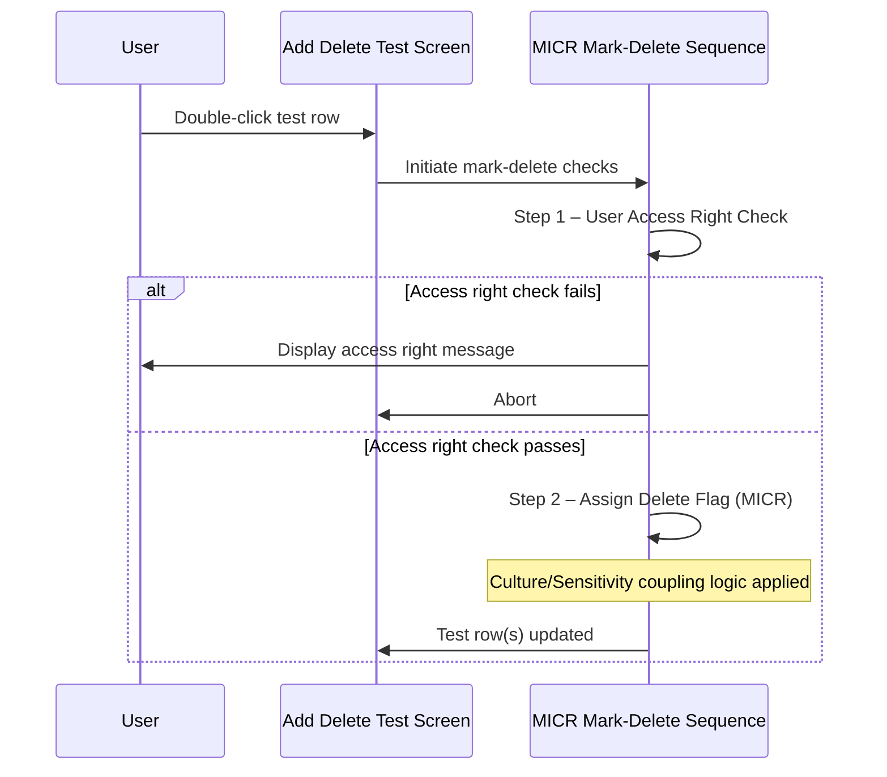

# MICR Mark Test to Delete

## Overview

When a user marks a test for deletion on a Microbiology (MICR) request, the system applies a MICR-specific validation sequence. Unlike the BBNK sequence (which adds a lab-specific pre-check) or the CHEM sequence (which adds TIS correlation and DFT checks), the MICR sequence runs only two steps: the standard user access right check, followed by a MICR-specific delete-flag assignment step that handles culture and sensitivity tests as a coupled unit. There is no MICR-specific pre-check that blocks deletion before the security step.

---

## Related User Stories

- **[[CRST-1049]]** — Add Delete Test - MICR: Mark Test to Delete

**Epic:** LISP-269 [CRST][DEV] Add/Delete Test — Special Lab Workflow (MICR)

---

## Trigger Point

Initiated when the user double-clicks a test row on the Add Delete Test screen for a MICR request, triggering the mark-delete or un-mark-delete action.

---

## Workflow Scenarios

### Scenario 1: Mark-Delete Sequence for MICR Requests

#### Prerequisites

- A MICR request has been retrieved on the Add Delete Test screen.
- The user double-clicks a test row to mark it for deletion (or un-deletion).

#### Process Flow

#### Step-by-Step Details

1. The system determines that the request is a MICR request and applies the MICR-specific mark-delete sequence.

2. **Step 1 — User Access Right Check:** The system verifies that the current user has the appropriate access rights to delete the selected test, based on the test's current status. See [[Mark Test to Delete - User Access Right Validation]] for full details.

3. **Step 2 — Assign Delete Flag (MICR):** The system applies the MICR-specific delete-flag logic. Unlike the standard step, this step checks whether the selected test or group is a **Culture or Sensitivity** type. If it is, a confirmation message is displayed before any flags are toggled, and the delete/undelete action propagates across all related culture and sensitivity tests. See [[MICR Mark Test to Delete - Culture or Sensitivity Check]] for full details.

---

## Summary Table — MICR Mark-Delete Step Sequence

| Step | Check | Notes |
|------|-------|-------|
| 1 | User Access Right Check | Standard check — see [[Mark Test to Delete - User Access Right Validation]] |
| 2 | Assign Delete Flag (MICR) | MICR-specific — culture/sensitivity coupling; see [[MICR Mark Test to Delete - Culture or Sensitivity Check]] |

> **Comparison with other labs:**
> - **Standard / general:** Step 1 = Access Right → Step 2 = Order Check → Step 3 = Assign Flag
> - **BBNK:** Step 1 = XM Group Check → Step 2 = Access Right → Step 3 = Order Check → Step 4 = Assign Flag
> - **CHEM:** Step 1 = TIS Correlation → Step 2 = Access Right → Step 3 = DFT Check → Step 4 = Assign Flag
> - **MICR:** Step 1 = Access Right → Step 2 = Assign Flag (MICR override — no order check)

---

## Business Rules

1. The MICR mark-delete sequence does **not** include the standard delete/undelete order check that applies to other labs. The access right check is followed directly by the flag assignment step.
2. Culture and sensitivity tests are always treated as a coupled unit when marking for deletion or un-deletion. Marking any culture or sensitivity test individually will affect all culture and sensitivity tests on the request.
3. Non-culture, non-sensitivity tests on a MICR request follow the standard flag assignment without the coupling logic.

---

## Related Workflows

- [[MICR Mark Test to Delete - Culture or Sensitivity Check]] — Detailed rules for Step 2 (the MICR-specific flag assignment with culture/sensitivity coupling).
- [[Mark Test to Delete - User Access Right Validation]] — Standard access right check applied at Step 1.
- [[Mark Test to Delete]] — The general (non-lab-specific) mark-delete workflow.
- [[MICR Retrieve Request]] — How culture and sensitivity rows are initially populated when a MICR request is loaded.
