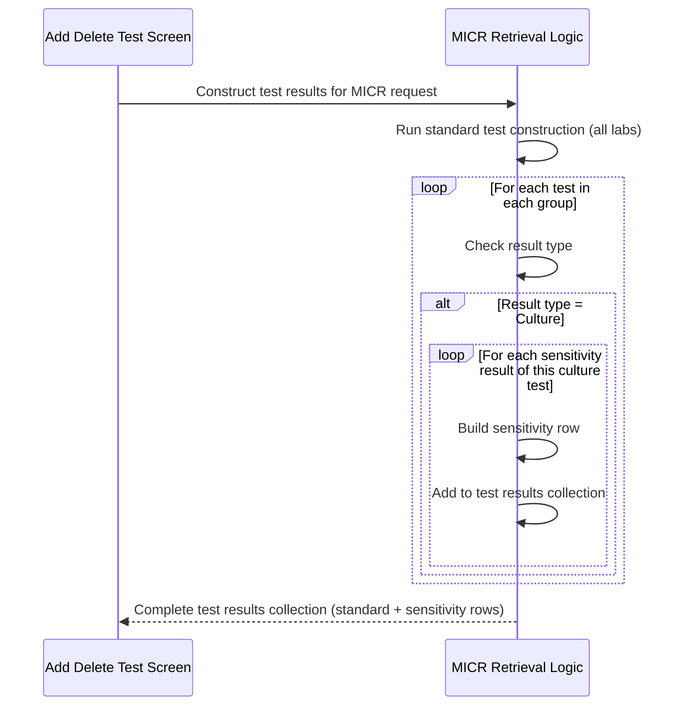

# MICR Retrieve Request

## Overview

When a Microbiology (MICR) request is retrieved on the Add Delete Test screen, the system builds the test result list using an extended construction process specific to MICR. In addition to the standard test rows that all labs produce, the MICR retrieval logic detects tests whose result type is **Culture** and, for each such test, generates additional rows — one for each **Sensitivity** result associated with that culture. This gives the user full visibility of all culture and sensitivity sub-tests on the screen before any add or delete actions are taken.

---

## Related User Stories

- **[[CRST-1048]]** — Add Delete Test - MICR: Retrieve Request

**Epic:** LISP-269 [CRST][DEV] Add/Delete Test — Special Lab Workflow (MICR)

---

## Key Concepts

### Culture Test
A test whose result type is set to **Culture** (result type value = 7 in the system). Culture tests can have one or more sensitivity sub-results associated with them.

### Sensitivity Result
A sub-result linked to a Culture test. Each sensitivity result represents an individual organism-antibiotic pairing and is displayed as a separate row on the Add Delete Test screen under the same test group as its parent culture test.

---

## Trigger Point

Initiated when the user enters a request number and the system successfully retrieves a MICR request on the Add Delete Test screen. The MICR-specific construction logic runs as an extension of the standard request retrieval process (see [[Retrieve Request]]).

---

## Workflow Scenarios

### Scenario 1: MICR Request with Culture Tests

#### Prerequisites

- A MICR request has been retrieved on the Add Delete Test screen.
- At least one test in the request has a result type of Culture.

#### Process Flow

#### Step-by-Step Details

1. The standard test result construction runs first, producing the same group and test rows that all labs would produce (see [[Retrieve Request]]).
2. For each test in each group, the system checks whether the result type is **Culture**.
3. If the test is a Culture test, the system retrieves all **Sensitivity results** linked to that culture test.
4. For each sensitivity result, the system constructs a new test result row with the following data:

| Field | Data |
|-------|------|
| Deletion Flag | Not deleted (default) |
| Specimen | Linked to USID or non-USID (same as parent test group) |
| Test Profile Name | Profile description from the test registration dictionary |
| Group Code | Derived from the test dictionary alpha code, test header key, and the registered profile header |
| Test Code | Resolved from the sensitivity test's dictionary entry |
| Test Name | Full name from the test dictionary |
| Ctr | Counter from the parent culture test result |
| Sub-Ctr | Counter specific to this sensitivity result |
| Status Date | Status date of the sensitivity result |
| Status Colour | Colour corresponding to the sensitivity result's current status |
| Optional | "Y" if the parent test is optional; otherwise "N" |
| Result Type | Sensitivity (distinct from Culture, for downstream delete-behaviour detection) |
| Group | Reference to the parent group row |

5. Each constructed sensitivity row is appended to the test results collection, after any standard rows already produced for the group.
6. The complete collection — standard test rows plus all sensitivity rows — is displayed in the test grid on the Add Delete Test screen.

---

### Scenario 2: MICR Request Without Culture Tests

If a MICR request contains no tests with a Culture result type, no additional sensitivity rows are generated. The test grid shows only the standard rows produced by the general retrieval logic.

---

## Data Sources

| Field | Source |
|-------|--------|
| Deletion Flag | Set to false (not deleted) by default on construction |
| Test Profile Name | `TEST_REGISTRABLE.testreg_profile_desc` |
| Group Code | `TEST_DICT.test_alpha_code`, `TEST_DICT.test_header_ckey`, `TEST_REGISTRABLE.testreg_header` |
| Test Name | `TEST_DICT.test_full_name` |
| Ctr | `TESTRSLT.testrslt_ctr` |
| Sub-Ctr | `TESTRSLT.testrslt_rslt_ctr` |
| Status Date | `TESTRSLT.testrslt_status_date` |
| Optional | `TESTRSLT.testrslt_optional` |

---

## Business Rules

1. Sensitivity rows are generated **only** for Culture tests (result type = 7). Other test types do not produce sub-rows.
2. Each sensitivity result generates exactly one row in the test grid — it is treated as an independent deletable unit on screen.
3. The deletion flag on all newly constructed rows (both standard and sensitivity) defaults to **not deleted**.
4. The sensitivity rows are visually grouped under the same test group as their parent culture test.

---

## Related Workflows

- [[Retrieve Request]] — The standard retrieval workflow that runs first; MICR extends it with culture/sensitivity row construction.
- [[MICR Mark Test to Delete - Culture or Sensitivity Check]] — The delete behaviour for culture and sensitivity rows once the request is displayed.
- [[MICR Mark Test to Delete]] — The MICR-specific mark-delete sequence.
