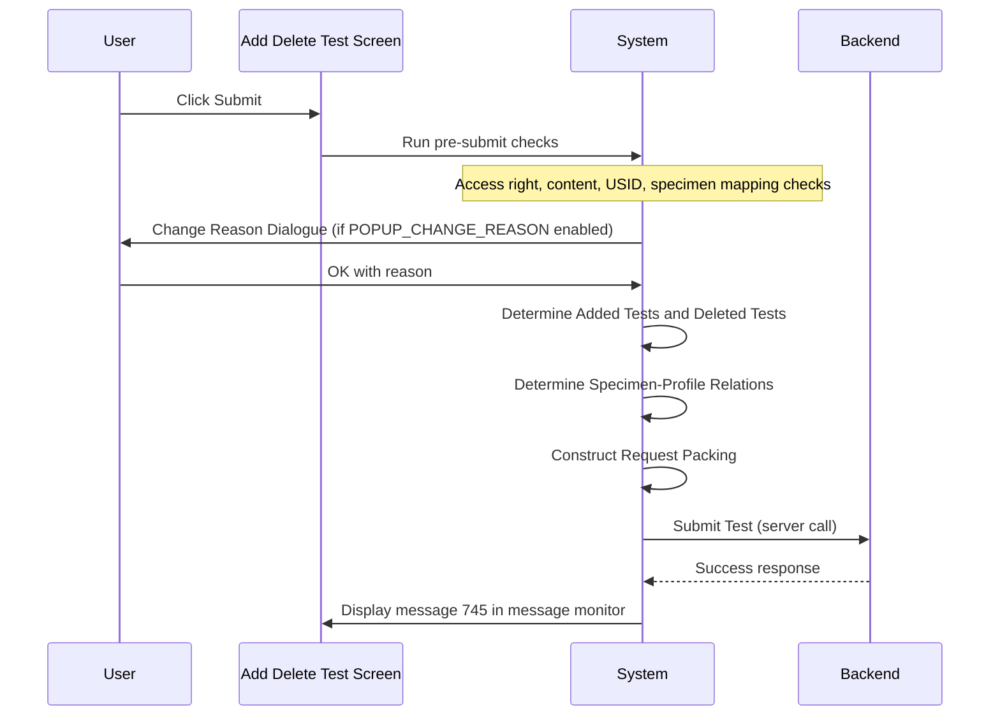

# Add Delete Test (Action)

## Overview

This workflow describes the full Submit action on the Add Delete Test screen — from the moment the user clicks **Submit** through all pre-submit validations, optional user prompts, data assembly, backend call, and post-submit outcome. It encompasses add test and delete test operations, specimen-profile relation determination, and the server call that persists changes. On success, a confirmation is shown in the message monitor. On failure, a server error message is displayed.

---

## Related User Stories

- **[[CRST-1039]]** - Add Delete Test - Add/Delete Test

**Epic:** LISP-265 [CRST][DEV] Add/Delete Test - Submit Action

---

## Key Concepts

### Added Tests
Test profiles entered by the user in the New Tests Panel during the current session that are not yet on the original request.

### Deleted Tests
Test profiles in the Test Grid that the user has marked for deletion in the current session.

### Not Deleted Tests
Test profiles that remain in the Test Grid and have **not** been marked for deletion. These are retained on the request.

### Specimen-Profile Relations
The mapping between specimen numbers (including USIDs) and test profile codes, built and modified via the [[USID Input Dialogue]]. Submitted as part of the request packing.

### Auto-Assign Specimens to New Profile
When the `SKIP_ASSIGN_NEW_PROFILE_TO_ALL_SPECIMENS` lab option is not set (or absent), any new test profile that has no explicit specimen-test mapping is automatically assigned all existing specimens on the request.

---

## Trigger Point

Initiated when the user clicks **Submit** on the Add Delete Test screen, after a request has been successfully retrieved.

---

## Workflow Scenarios

### Scenario 1: Successful Add/Delete Test Submission

#### Prerequisites

- A request has been retrieved.
- The user has added one or more test profiles and/or marked one or more tests for deletion.
- All pre-submit validations pass (see Pre-Submit Checks section).

#### Process Flow

#### Step-by-Step Details

1. The user clicks **Submit**.
2. The system runs pre-submit checks in sequence (see Pre-Submit Checks table below). Each check may pause the submission pending user acknowledgement.
3. If the `POPUP_CHANGE_REASON` lab option is enabled, the [[Change Reason Dialogue]] is displayed. The user selects a reason and enters optional free-text. Clicking Cancel aborts the submission.
4. Once all pre-submit checks pass and any change reason is collected, the system assembles the data:
   - **Added Tests**: gathered from the New Tests Panel.
   - **Deleted Tests**: gathered from the Test Grid (all profiles marked deleted).
   - **Not Deleted Tests**: the remaining test profiles not marked deleted.
   - **Specimen-Profile Relations**: determined based on the current USID Input state and the `SKIP_ASSIGN_NEW_PROFILE_TO_ALL_SPECIMENS` option:
     - If the option is **not set or absent**: all existing specimens are automatically assigned to any newly added test profile that has no explicit mapping.
     - If the option is **enabled**: newly added profiles with no explicit mapping are **not** automatically assigned any specimens.
5. The system constructs the Request Packing (see Packing Fields table below).
6. The system sends the Submit Test request to the backend.
7. On success, message **745** appears in the message monitor.

---

### Scenario 2: Submission Aborted by Pre-Submit Check

#### Step-by-Step Details

1. A pre-submit check fails (e.g., message 724, 742, or 4075 is displayed).
2. The user acknowledges the blocking message.
3. The submission is aborted. No data is written. The screen data remains unchanged.

---

### Scenario 3: Submission Aborted via Change Reason Cancel

#### Step-by-Step Details

1. All pre-submit checks pass.
2. The [[Change Reason Dialogue]] is displayed.
3. The user clicks **Cancel**.
4. The submission is aborted. No data is written. The screen returns to its previous state.

---

## Pre-Submit Checks (in order)

| Order | Check | Described in |
|---|---|---|
| 1 | USID Not Found Alert | [[USID Not Found Alert]] |
| 2 | Profile Not Mapped to Specimen | [[Profile Not Mapped to Specimen Message]] |
| 3 | Add Test User Access Right | [[Add Test User Access Right Validation]] |
| 4 | Add Test Content Validations (DFT, registrable, valid period, duplication, sex/age) | [[Add Test Validation]] |
| 5 | Delete Test Validation (all tests deleted) | [[Delete Test Validation]] |
| 6 | Change Reason Dialogue | [[Change Reason Dialogue]] |

---

## Request Packing Fields

| Field | Description |
|---|---|
| Lab Result | Lab result of the retrieved request |
| Request ID | Request number, hospital, and lab number |
| Authorise ID | The authorising user ID |
| Acting By ID | The acting-by user (if applicable) |
| Audit Comment | The change reason from the [[Change Reason Dialogue]] |
| Not Deleted Tests | Tests remaining on the request (not marked deleted), in `TestrsltSearchVo` format |
| Deleted Tests | Tests marked for deletion, in `TestrsltSearchVo` format |
| Added Tests | Newly added test profiles, in `RequestProfileDetailVo` format |
| Operation Audits | Audit records including specimen-test mapping audits |
| Deleted Profile Codes | Profile codes where all tests under the profile have been marked deleted |

---

## Error Messages and System Prompts

| Message | Description | Trigger | User Options |
|---|---|---|---|
| 745 | Test maintenance completed successfully | Successful backend response | Displayed in message monitor (no action required) |
| 3255 | Submit test failed *(message text not found in message dictionary)* | Backend returns a failure status from `submitTest` | *(no action documented)* |

> Note: Message 3255 is referenced in the source but the message text does not exist in the message dictionary. The server error path for general server faults is handled by message 3385 — see [[Server Error Message]].

---

## Configuration

| Setting | Option Code | Purpose | Effect when enabled | Effect when disabled |
|---|---|---|---|---|
| Skip Assign New Profile to All Specimens | `SKIP_ASSIGN_NEW_PROFILE_TO_ALL_SPECIMENS` | Controls whether new test profiles without explicit specimen mappings are automatically assigned all specimens | New profiles without a mapping are **not** auto-assigned any specimens | New profiles without a mapping are automatically assigned all existing specimens |
| Popup Change Reason | `POPUP_CHANGE_REASON` | Controls whether the Change Reason Dialogue appears before submission | [[Change Reason Dialogue]] is prompted | Dialogue is skipped; no reason is collected |

> Both options in `LAB_OPTION` table. `SKIP_ASSIGN_NEW_PROFILE_TO_ALL_SPECIMENS`: `option_group = 'SPECIMEN'`. `POPUP_CHANGE_REASON`: `option_group = 'REQUEST_REGISTRATION'`.

---

## Business Rules

1. All pre-submit checks are run in sequence; a blocking failure at any step aborts the submission.
2. If the `SKIP_ASSIGN_NEW_PROFILE_TO_ALL_SPECIMENS` option is absent or disabled, newly added profiles are automatically assigned all existing specimens on the request if no explicit specimen mapping has been added.
3. If the `SKIP_ASSIGN_NEW_PROFILE_TO_ALL_SPECIMENS` option is enabled, automatic assignment does not occur — each new profile must be explicitly mapped via the [[USID Input Dialogue]].
4. On successful submission, only message 745 in the message monitor confirms the outcome. The screen data is refreshed.

---

## Related Workflows

- [[USID Not Found Alert]] — First pre-submit check.
- [[Profile Not Mapped to Specimen Message]] — Second pre-submit check.
- [[Add Test User Access Right Validation]] — Third pre-submit check.
- [[Add Test Validation]] — Fourth pre-submit check (content validations).
- [[Delete Test Validation]] — Fifth pre-submit check.
- [[Change Reason Dialogue]] — Final prompt before data is assembled and submitted.
- [[Server Error Message]] — Displayed if the backend call returns a server error.
- [[USID Input Dialogue]] — Where specimen-test mappings are built prior to submission.
