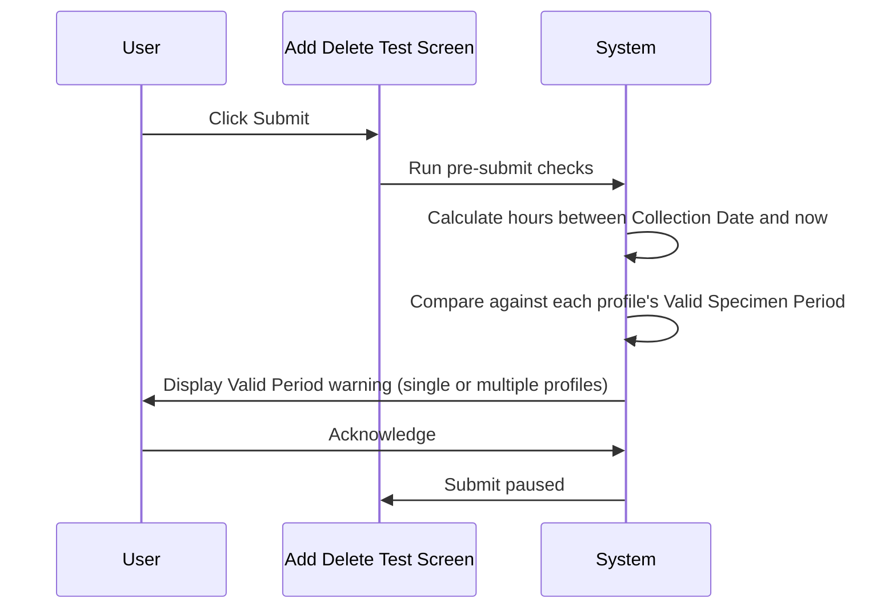

# Add Test Validation

## Overview

This workflow describes the set of content-based validations applied at Submit time to newly added test profiles on the Add Delete Test screen. Four distinct validation rules are checked in sequence: DFT (Default) test detection, registrable test status, specimen valid period, and test duplication. If any validation fails, a specific message is displayed and the submission is paused. All four checks apply only to test profiles newly added in the current session.

---

## Related User Stories

- **[[CRST-1036]]** - Add Delete Test - Add Test Validation

**Epic:** LISP-266 [CRST][DEV] Add/Delete Test - Submit Action

---

## Key Concepts

### DFT Test
A test profile flagged as a Default (DFT) test in the test dictionary setup. Adding a DFT test is allowed but requires the user to be informed via a warning message.

### Non-Registrable Test
A test profile that exists in the system but is not currently active or registrable. Attempting to add such a test is blocked.

### Valid Specimen Period
A configuration on a test profile specifying the maximum number of hours that may have elapsed since the specimen collection date. If the current time exceeds this period, a warning is shown.

### Duplication Period
A configuration on a test profile that prevents the same test from being registered more than once within a specified time window. If duplicate requests are found within the period, a warning lists them.

### Test Validity (Sex/Age Check)
A lab-level option that enables validation of whether the patient's sex and age are appropriate for the requested test profile. Failures are reported per profile code.

---

## Trigger Point

Initiated as part of the Submit process on the Add Delete Test screen, after the Add Test access right check passes, when one or more new test profiles have been added.

---

## Workflow Scenarios

### Scenario 1: DFT Test Validation

#### Prerequisites

- A newly added test profile is configured as a DFT test in the test dictionary.

#### Step-by-Step Details

1. The user clicks **Submit**.
2. The system identifies that one or more newly added test profiles are DFT tests.
3. Message **733** is displayed, listing the DFT test profile(s).
4. The user acknowledges the message. The Submit process is paused pending acknowledgement.

---

### Scenario 2: Registrable Test Validation

#### Prerequisites

- A newly added test profile exists in the system but is non-registrable (inactive or otherwise ineligible for registration).

#### Step-by-Step Details

1. The system checks whether each newly added test profile is registrable.
2. If a non-registrable profile is found, message **497** is displayed with the profile code(s).
3. The Submit process is paused. The user must remove or correct the non-registrable test before resubmitting.

---

### Scenario 3: Test Valid Period Validation

#### Prerequisites

- A newly added test profile has a Valid Specimen Period configured (in hours).
- The date difference between the specimen collection date and the current date/time equals or exceeds the configured Valid Specimen Period.

#### Process Flow

#### Step-by-Step Details

1. For each newly added test profile with a Valid Specimen Period, the system calculates the elapsed time since the specimen collection date in hours.
   - Calculation: `(collection date − current date)` in milliseconds ÷ 1,000 ÷ 60 ÷ 60
2. If the elapsed time is **greater than or equal to** the configured Valid Specimen Period, the profile is flagged.
3. A dialogue is displayed with the message: `"Collection time of test: [Test Profile Name] > [Test Valid Period] hours ago!"` — one line per affected profile.
4. The user acknowledges the message. The Submit process is paused.

---

### Scenario 4: Test Duplication Validation

#### Prerequisites

- A newly added test profile has a Duplication Period configured (> 0).
- More than one request for the same patient already exists with the same test registered, and the registration or arrival date of those requests falls within the Duplication Period.

#### Step-by-Step Details

1. The system checks whether any newly added test profile has a Duplication Period configured.
2. The system searches for existing requests with the same test for the same patient within the duplication window.
   - If `TEST_DUPLICATION_CHECK_CRITERIA` option is set to `1`: duplicates are found by **Arrival Date**.
   - If the option is absent or not set: duplicates are found by **Register Date**.
3. If more than one duplicate is found, message **908** is displayed, listing the duplicate requests.
4. The Submit process is paused.

---

### Scenario 5: Test Validity (Sex/Age) Validation

#### Prerequisites

- The `SEX_AGE_TEST_CHECK_ENABLED` lab option is enabled for the requesting lab.
- A Test Validity Setup exists for the newly added test profile and the requesting lab.
- The patient's sex or age does not meet the validation criteria configured for the test profile.

#### Step-by-Step Details

1. The system checks whether the `SEX_AGE_TEST_CHECK_ENABLED` option is enabled for the requesting lab.
2. For each newly added test profile, the system looks up the Test Validity Setup for that profile and lab.
3. If the patient's sex or age is outside the configured valid range, the profile is flagged.
4. Error message **2587** is displayed, listing the test profile code(s) that failed the sex/age check.
5. The Submit process is paused.

---

## Error Messages and System Prompts

| Message | Description | Trigger | User Options |
|---|---|---|---|
| 733 | Newly added test profile is a DFT test | A DFT test is found among the newly added profiles | Acknowledge (submit paused) |
| 497 | Newly added test profile is non-registrable | A non-registrable test profile has been added | Acknowledge (submit paused) |
| *(Valid Period dialogue)* | `"Collection time of test: [Test Profile Name] > [Test Valid Period] hours ago!"` — one line per affected profile | Elapsed time since collection equals or exceeds Valid Specimen Period | Acknowledge (submit paused) |
| 908 | Duplicate request(s) found within the Duplication Period | More than one existing request with same test found within duplication window | Acknowledge (submit paused) |
| 2587 | Test profile fails Sex/Age validity check | Patient sex or age does not meet the Test Validity Setup criteria | Acknowledge (submit paused) |

---

## Configuration

| Setting | Option Code | Purpose | Effect when enabled | Effect when disabled |
|---|---|---|---|---|
| Test Duplication Check Criteria | `TEST_DUPLICATION_CHECK_CRITERIA` | Controls whether duplication period uses Arrival Date (value = 1) or Register Date (absent/other) | Duplicate check uses Arrival Date | Duplicate check uses Register Date |
| Sex/Age Test Validity Check | `SEX_AGE_TEST_CHECK_ENABLED` | Controls whether patient sex/age is validated against test profile setup | Sex/Age validation performed; message 2587 on failure | Sex/Age validation skipped |

> Both options are in `LAB_OPTION` table, `option_group = 'REQUEST_REGISTRATION'`.

---

## Business Rules

1. All four validations apply only to **newly added** test profiles — tests already on the request are not re-validated.
2. Each validation is independent; all failures relevant to the submitted profiles are reported.
3. The Valid Specimen Period calculation uses elapsed hours, computed as: `(current date − collection date) in milliseconds ÷ 1,000 ÷ 60 ÷ 60`. The warning is triggered when this value is **greater than or equal to** the configured period.
4. Test Duplication uses Arrival Date if `TEST_DUPLICATION_CHECK_CRITERIA = 1`; otherwise Register Date is used.
5. Sex/Age validity checking is only performed if the `SEX_AGE_TEST_CHECK_ENABLED` option is enabled for the requesting lab.

---

## Related Workflows

- [[Add Test User Access Right Validation]] — The access right check that precedes these content validations.
- [[Delete Test Validation]] — The equivalent Submit-time validation applied to tests marked for deletion.
- [[Add Delete Test (Action)]] — The overall submit action workflow that encompasses all pre-submit checks and the backend call.
