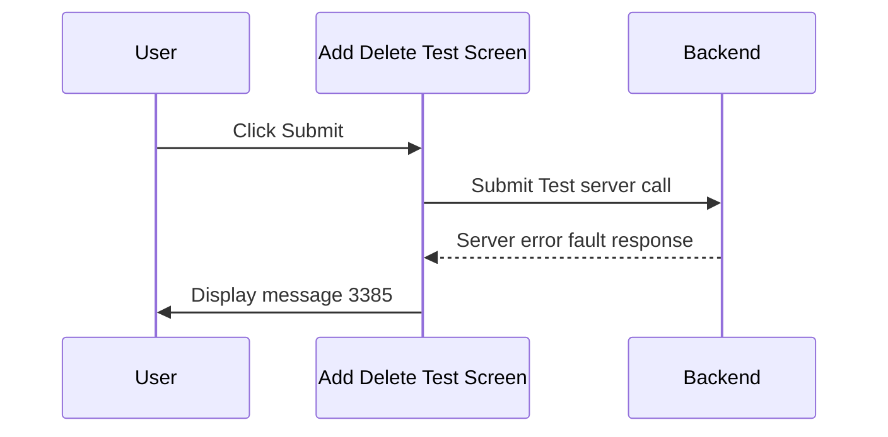

# Server Error Message

## Overview

This workflow describes the error handling behaviour on the Add Delete Test screen when the backend service returns a server error in response to a Submit request. When a server-side fault is received, message 3385 is displayed to alert the user. No data is written as a result of the failed call.

---

## Related User Stories

- **[[CRST-1040]]** - Add Delete Test - Server Error Message

**Epic:** LISP-265 [CRST][DEV] Add/Delete Test - Submit Action

---

## Trigger Point

Initiated when the backend service call for Test Maintenance (Submit Test) returns a server error fault response, after the user has clicked **Submit** and all pre-submit checks have passed.

---

## Workflow Scenarios

### Scenario 1: Server Error Returned from Backend

#### Process Flow

#### Step-by-Step Details

1. The user clicks **Submit** and all pre-submit validations pass.
2. The system sends the Submit Test request to the backend service.
3. The backend returns a server error (fault response).
4. Message **3385** is displayed to alert the user that a server error has occurred.
5. No test data is added or deleted. The request remains in its pre-submission state.

---

## Error Messages and System Prompts

| Message | Description | Trigger | User Options |
|---|---|---|---|
| 3385 | A server error has occurred | Backend service call returns a fault response during Submit | OK (dismiss) |

---

## Business Rules

1. Message 3385 is only triggered by a server-level fault — it is not triggered by business validation failures (those use dedicated messages such as 724, 742, etc.).
2. After a server error, no data is written. The screen retains the data the user had entered.

---

## Related Workflows

- [[Add Delete Test (Action)]] — The overall submit workflow; the server error message represents the failure path of the backend call step.
