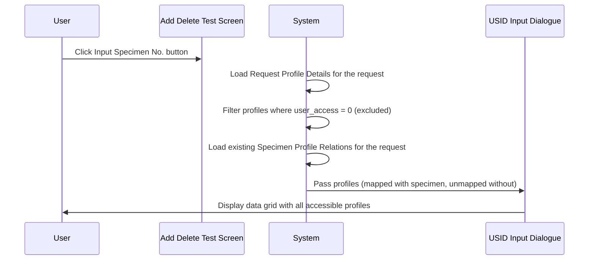

# Create Specimen Profile Relation from Request

## Overview

When the Input Specimen No. button is clicked on the Add Delete Test screen, the system assembles the set of test profiles from the current request to populate the USID Input Dialogue. This workflow describes how the system builds that list of test profile-to-specimen relations: it draws from the request's profile details, filters out profiles the user is not permitted to see, and includes any specimen mappings that already exist. The resulting data is passed to the [[USID Input Dialogue]] for display and editing.

---

## Related User Stories

- **[[CRST-1031]]** - Add Delete Test - Create Specimen Profile Relation from Request

**Epic:** LISP-266 [CRST][DEV] Add/Delete Test - USID

---

## Key Concepts

### Request Profile Detail
The set of test profiles associated with the retrieved lab request. Each profile may or may not already have a specimen (USID or specimen number) mapped to it.

### User Access on Profile Relation
Each test profile in the `USID_PROFILE_RELATION` table carries a `user_access` flag. Profiles with `user_access = 0` are excluded from the dialogue — staff cannot interact with them regardless of any existing mapping.

### Mapped vs Unmapped Profile
- A **mapped profile** is one that already has a specimen number or USID assigned to it in the existing specimen-profile relations.
- An **unmapped profile** is one that appears in the request's profile details but has no specimen currently assigned.

---

## Trigger Point

This workflow is executed when the user clicks the **Input Specimen No.** button on the Add Delete Test screen, after a request has been retrieved and the screen is in the Ready state.

---

## Workflow Scenarios

### Scenario 1: Request Has Mapped and Unmapped Test Profiles

#### Prerequisites
- A lab request is retrieved.
- The request has at least one test profile with an existing specimen mapping and at least one without.

#### Process Flow

#### Step-by-Step Details

1. The system retrieves all test profiles from the request's profile details.
2. Profiles where `USID_PROFILE_RELATION.user_access = 0` are excluded from the list.
3. For each remaining profile, the system checks whether an existing specimen-profile relation is present.
4. Mapped profiles (with specimen) are included with their specimen number populated.
5. Unmapped profiles (without specimen) are included with the Specimen No. column blank.
6. The assembled list is passed to the [[USID Input Dialogue]] for display in the data grid.

---

### Scenario 2: All Test Profiles Are Unmapped

#### Prerequisites
- The request has no existing specimen-profile relations.
- All test profiles have `user_access ≠ 0`.

#### Step-by-Step Details

1. The system loads the test profiles from the request's profile details.
2. No existing specimen relations are found.
3. All profiles are displayed in the dialogue with the Specimen No. column blank.

---

### Scenario 3: A Profile Has user_access = 0

#### Prerequisites
- One or more of the request's test profiles have `USID_PROFILE_RELATION.user_access = 0`.

#### Step-by-Step Details

1. The system loads the test profiles.
2. Profiles with `user_access = 0` are identified and removed from the list before populating the dialogue.
3. The remaining profiles (with `user_access ≠ 0`) are shown in the dialogue. The filtered-out profiles do not appear at all — they are not shown as blank rows.

---

## Summary Tables

### Profile Display Rules

| Condition | Shown in Dialogue | Specimen No. Column |
|---|---|---|
| Profile with `user_access ≠ 0` and existing specimen mapping | Yes | Populated with mapped specimen |
| Profile with `user_access ≠ 0` and no specimen mapping | Yes | Blank |
| Profile with `user_access = 0` | No | N/A |

---

## Business Rules

1. Only test profiles where `USID_PROFILE_RELATION.user_access ≠ 0` are eligible for display in the USID Input Dialogue.
2. All eligible profiles are shown in the dialogue, whether or not they have an existing specimen mapping.
3. If a mapping already exists for a profile, it is pre-populated as the initial state of that row.
4. This assembly occurs every time the Input Specimen No. button is clicked; the list is rebuilt fresh each time.

---

## Related Workflows

- [[USID Input Dialogue]] — The assembled profile-specimen relations are passed directly into this dialogue for display and user interaction.
- [[Profile Not Mapped to Specimen Message]] — Triggered at Submit time if a newly added profile remains unmapped after the user has interacted with the dialogue.
- [[USID Not Found Alert]] — Triggered at Submit time if a USID entered in the dialogue does not exist in the system.
