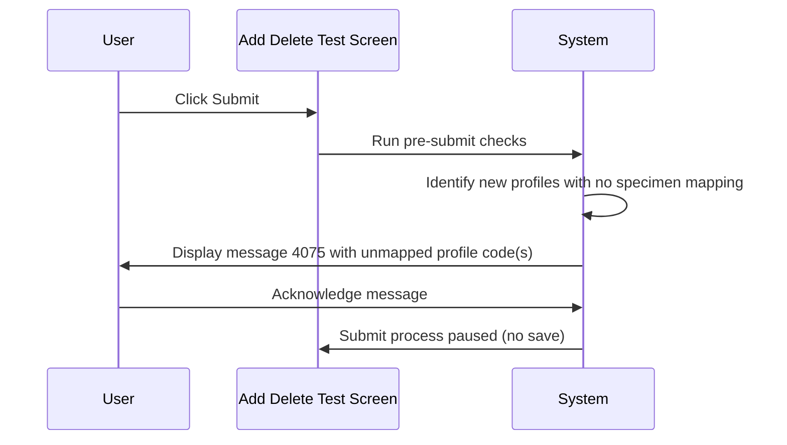
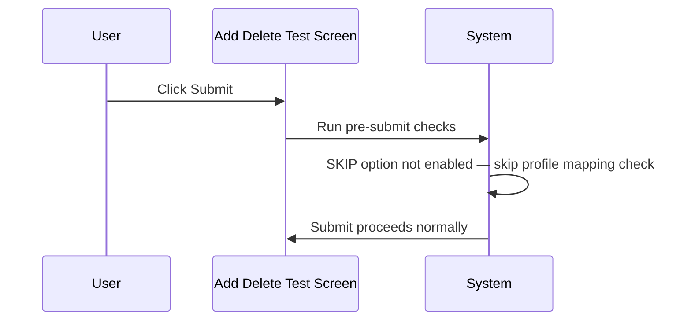

# Profile Not Mapped to Specimen Message

## Overview

This workflow describes the validation that occurs at Submit time when a new test profile has been added to a request but no specimen-test mapping was recorded for it in the USID Input Dialogue. When the `SKIP_ASSIGN_NEW_PROFILE_TO_ALL_SPECIMENS` lab option is enabled, submitting without a specimen mapping for a newly added profile causes a blocking message to be displayed, listing the unmapped profile codes. The Submit process is paused until the user acknowledges the message.

---

## Related User Stories

- **[[CRST-1033]]** - Add Delete Test - USID: Profile Not Mapped to Specimen Message

**Epic:** LISP-265 [CRST][DEV] Add/Delete Test - USID

---

## Trigger Point

Initiated as part of the Submit process on the Add Delete Test screen, before the request data is saved.

---

## Workflow Scenarios

### Scenario 1: New Profile Added, No Specimen Mapped, Lab Option Enabled

#### Prerequisites

- The user has added one or more new test profiles to the request via the Test Panel.
- At least one of those new profiles has **not** been mapped to a specimen in the [[USID Input Dialogue]].
- The `SKIP_ASSIGN_NEW_PROFILE_TO_ALL_SPECIMENS` lab option is set to enabled for the requesting lab.

#### Process Flow

#### Step-by-Step Details

1. The user clicks **Submit** on the Add Delete Test screen.
2. The system runs pre-submit validation checks.
3. The system identifies all new test profiles that were added in the current session but have no specimen-test relation recorded in the USID Input Dialogue.
4. If one or more such profiles exist and the `SKIP_ASSIGN_NEW_PROFILE_TO_ALL_SPECIMENS` lab option is enabled, message **4075** is displayed. The message lists the profile codes that are not yet mapped to a specimen.
5. The user clicks **OK** on message 4075.
6. The Submit process is paused; no data is saved. The user must return to the [[USID Input Dialogue]] to assign specimens before submitting again.

---

### Scenario 2: Lab Option Disabled or Not Configured

#### Prerequisites

- The `SKIP_ASSIGN_NEW_PROFILE_TO_ALL_SPECIMENS` lab option is either set to disabled (`option_value = 0`) or the option does not exist for the requesting lab.

#### Process Flow

#### Step-by-Step Details

1. The user clicks **Submit**.
2. The system evaluates whether the `SKIP_ASSIGN_NEW_PROFILE_TO_ALL_SPECIMENS` option is enabled.
3. Because the option is disabled or not present, the profile-to-specimen mapping check is skipped entirely.
4. The Submit process continues to the next validation step without prompting the user.

---

## Error Messages and System Prompts

| Message | Description | Trigger | User Options |
|---|---|---|---|
| 4075 | One or more new test profiles are not mapped to a specimen. Lists affected profile code(s). | Submit clicked with unmapped new profiles and lab option enabled | OK (dismiss; submit remains paused) |

---

## Configuration

| Setting | Option Code | Purpose | Effect when enabled | Effect when disabled |
|---|---|---|---|---|
| Skip Assign New Profile to All Specimens | `SKIP_ASSIGN_NEW_PROFILE_TO_ALL_SPECIMENS` | Controls whether unmapped new profiles block submission | Message 4075 displayed and submit paused if any new profile has no specimen mapping | Profile mapping check is skipped; submit proceeds regardless |

> Source: `LAB_OPTION` table, `option_group = 'SPECIMEN'`, `option_code = 'SKIP_ASSIGN_NEW_PROFILE_TO_ALL_SPECIMENS'`, `option_value = 1` (enabled).

---

## Business Rules

1. This check applies only to **newly added** test profiles — test profiles that were already on the request before the Add Delete Test session are not evaluated.
2. If the `SKIP_ASSIGN_NEW_PROFILE_TO_ALL_SPECIMENS` option is absent or disabled, no validation is performed and no message is shown regardless of mapping status.
3. The Submit process does not continue past this validation if message 4075 is triggered; the user must address the mapping before resubmitting.

---

## Related Workflows

- [[USID Input Dialogue]] — The dialogue where specimen-to-profile mappings are created. Unmapped profiles must be resolved here before submission succeeds.
- [[Create Specimen Profile Relation from Request]] — Defines which profiles are considered newly added vs. pre-existing.
- [[USID Not Found Alert]] — Another pre-submit check that runs in the same Submit process, validating USID existence.
