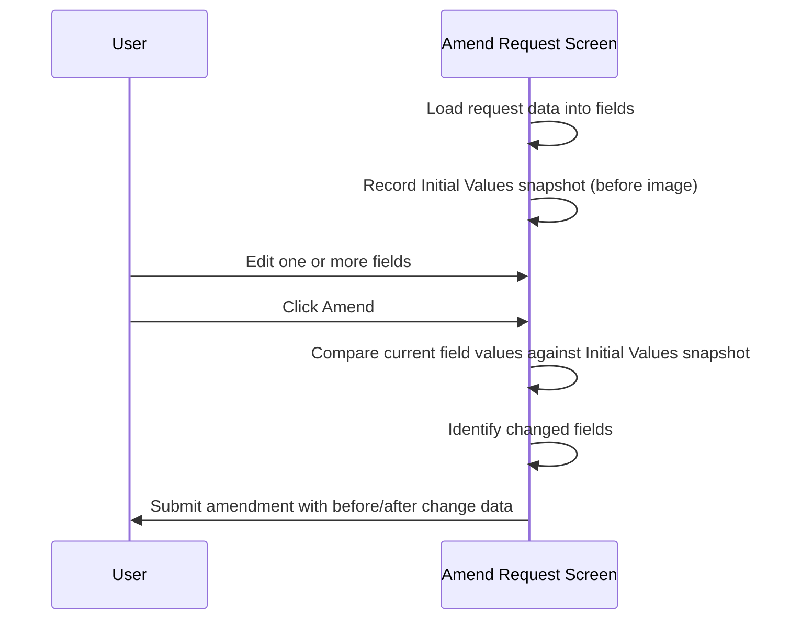

# Initial Values Snapshot

## Overview

When a request is successfully retrieved on the Amend Request screen, the system immediately records a **snapshot of the current field values** — referred to as the "Initial Values" or "before image". This snapshot is held in memory alongside the live field values for the duration of the session. Its purpose is twofold: it provides the basis for comparing what changed when the user submits an amendment, and it ensures that if the user edits fields but then clears the screen or exits without amending, the original values can be restored exactly the next time the same request is retrieved.

---

## Related User Stories

- **[[CRST-780]]** - Amend Request - Initial Values of Request
- **[[CRST-779]]** - Amend Request - Retrieve Request
- **[[CRST-778]]** - Amend Request - Object Enablement After Retrieval

**Epic:** LISP-229 [CRST][DEV] Amend Request - Request Retrieval

---

## Trigger Point

Triggered automatically immediately after a registered request is successfully retrieved and its data is loaded onto the Amend Request screen. The snapshot is taken once per retrieval, before the user makes any edits.

---

## Workflow Scenarios

### Scenario 1: Snapshot Taken on Retrieval, User Submits Amendment

#### Prerequisites
- A registered request has been retrieved on the Amend Request screen.
- The Initial Values snapshot has been recorded.
- The user edits one or more fields and clicks **Amend**.

#### Process Flow



#### Step-by-Step Details

1. Immediately after the request data is populated into all screen fields, the system records the Initial Values snapshot. The snapshot captures the current value of each tracked field as a "before image".

2. The user edits the desired fields in the **Request Information** panel or changes the **Data Retention** selection.

3. When the user clicks **Amend**, the system compares the current (edited) field values against the stored Initial Values snapshot to determine which fields have been changed.

4. The amendment is submitted with the identified changes. The Initial Values snapshot is consumed by this process.

---

### Scenario 2: User Edits Fields, Then Clears Without Amending, Then Re-retrieves

#### Prerequisites
- A registered request has been retrieved.
- The Initial Values snapshot has been recorded.
- The user edits one or more fields but then clicks **Clear** or exits without clicking **Amend**.
- The user re-retrieves the same request.

#### Process Flow

```mermaid
sequenceDiagram
    participant User
    participant Screen as Amend Request Screen

    Screen->>Screen: Load request data; record Initial Values snapshot
    User->>Screen: Edit one or more fields
    User->>Screen: Click Clear (or Exit) without amending
    Screen->>Screen: Discard edited values; clear screen
    User->>Screen: Re-enter the same request number
    Screen->>Screen: Reload request data from database
    Screen->>Screen: Re-record Initial Values snapshot from stored data
    Screen->>User: Original (unmodified) values restored on screen
```

#### Step-by-Step Details

1. After retrieval, the Initial Values snapshot is recorded. The user makes edits to the field values on screen.

2. The user clicks **Clear** or exits the screen without clicking **Amend**. No amendment is written to the database — the edits are discarded.

3. When the user re-retrieves the same request number, the system reloads the data from the database. Because no amendment was submitted, the database still holds the original values.

4. The Initial Values snapshot is re-recorded from the freshly loaded data. The screen shows the original, unmodified values — not the edits that were discarded in step 2.

> The Initial Values mechanism does not persist between sessions or screen clears. It is a within-session, in-memory snapshot that exists only from the moment of retrieval until the screen is cleared or the amendment is submitted.

---

## Fields Covered by the Snapshot

The following fields are included in the Initial Values snapshot. These are the fields tracked for before/after change comparison.

| Field |
|-------|
| Category |
| Clinical Detail |
| Pay Code |
| Request Doctor — Hospital |
| Request Doctor — Code |
| Request Location — Hospital |
| Request Location — Specialty |
| Request Location — Ward / Clinic |
| Report Location — Hospital |
| Report Location — Specialty |
| Report Location — Ward / Clinic |
| Report Copy — Hospital |
| Report Copy — Specialty |
| Report Copy — Ward / Clinic |
| Reference |
| Comment |
| Confidential |
| Private |
| Bill |
| Urgency |
| Bed |
| Specimen Collection Datetime |
| Specimen Request Datetime |
| Specimen Arrival Datetime |
| Data Retention |

---

## Business Rules

1. The Initial Values snapshot is taken automatically immediately after a request is loaded onto the screen. No user action is required to trigger it.
2. The snapshot is a complete in-memory before-image of all tracked fields at the moment of retrieval. It does not represent the database state — once taken, it does not update if the database record changes during the session.
3. The snapshot is used by the amendment process to identify which fields the user has changed before submitting.
4. If the user clears the screen or exits without amending, no database write occurs and the snapshot is discarded. On next retrieval of the same request, the snapshot is re-recorded from the current (unchanged) database values.
5. Pay Code is included in the snapshot for change-comparison purposes even though it is non-editable on the screen.
6. Data Retention is included in the snapshot and is compared as part of the amendment if the user has the required access right.

---

## Related Workflows

- [[Retrieve Request]] — The snapshot is taken as the final step of the retrieval workflow, after all fields are populated.
