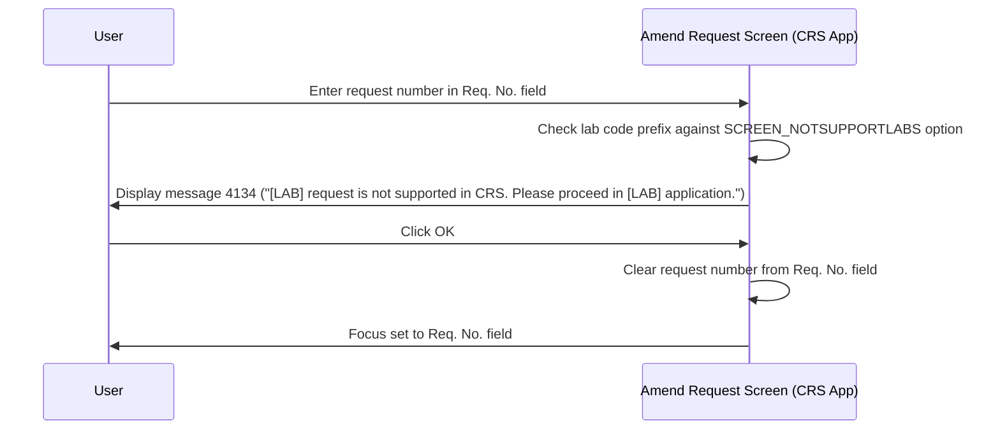

# Not Supported Lab Message

## Overview

When a user attempts to retrieve a request on the CRS application's Amend Request screen, the system checks whether the lab code of the entered request belongs to a list of labs that are not supported in the CRS application. If the request belongs to a restricted lab, retrieval is blocked and message **4134** is displayed, directing the user to proceed in the appropriate application instead. The request number is cleared from the **Req. No.** field after the user dismisses the message, and focus returns to that field so the user can enter a valid request number.

This check is applicable to the CRS application only. It does not apply to the General Laboratory Amend Request screen.

---

## Related User Stories

- **[[CRST-781]]** - Amend Request - Not Supported Lab Message
- **[[CRST-779]]** - Amend Request - Retrieve Request

**Epic:** LISP-229 [CRST][DEV] Amend Request - Request Retrieval

---

## Trigger Point

Triggered when the user enters a request number in the **Req. No.** field and the system determines that the lab code prefix of that request number matches an entry in the not-supported labs configuration for the current hospital's CRS application.

---

## Workflow Scenario

### Scenario: User Retrieves a Request for a Not Supported Lab

#### Prerequisites
- The CRS application Amend Request screen is open.
- The `SCREEN_NOTSUPPORTLABS` lab option is configured for the hospital, with one or more lab code prefixes listed in its option text.
- The user enters a request number whose lab code prefix matches a restricted entry.

#### Process Flow

#### Step-by-Step Details

1. The user enters a request number in the **Req. No.** field. Before loading the request, the system evaluates the lab code prefix of the entered number against the not-supported labs configuration.

2. The system determines the list of restricted lab code prefixes from the `SCREEN_NOTSUPPORTLABS` lab option (`option_group = 'REQUEST_REGISTRATION'`, `option_code = 'SCREEN_NOTSUPPORTLABS'`). The restricted prefixes are stored in `option_text` under the key `PROMPT_REQUEST_NOT_SUPPORTED_LAB`, as a comma-separated list of lab code numbers (e.g., `PROMPT_REQUEST_NOT_SUPPORTED_LAB:1,3`).

3. If the request's lab code prefix matches a restricted entry, message **4134** is displayed:
   > *"[LAB] request is not supported in CRS. Please proceed in [LAB] application."*
   
   The `[LAB]` placeholder is replaced with the name of the specific application associated with the restricted lab (e.g., "CPS", "HMS"). No request data is loaded onto the screen.

4. The user clicks **OK** to dismiss the message.

5. The request number is cleared from the **Req. No.** field. Focus is placed back on the **Req. No.** field so the user can enter a different request number.

---

## Message Reference

| Message Code | Text | Trigger | User Options |
|-------------|------|---------|-------------|
| 4134 | "[LAB] request is not supported in CRS. Please proceed in [LAB] application." | Entered request number belongs to a lab restricted by `SCREEN_NOTSUPPORTLABS` | OK (dismiss) |

---

## Configuration

| Setting | Option Code | Purpose | Effect when configured | Effect when not configured |
|---------|-------------|---------|----------------------|--------------------------|
| Not Supported Labs | `SCREEN_NOTSUPPORTLABS` *(option_group = `REQUEST_REGISTRATION`)* | Defines which lab code prefixes are blocked from retrieval in the CRS application | Requests with matching lab code prefixes are blocked; message 4134 displayed | No lab restriction applied; all requests retrievable |

> The restricted lab code prefixes are stored in `option_text` using the format `PROMPT_REQUEST_NOT_SUPPORTED_LAB:<labCode1>,<labCode2>,...`. Multiple lab codes can be listed. The lab codes correspond to entries in the lab code map — for example, lab code `1` maps to the CPS (Chemistry) application and lab code `3` maps to the HMS (HAET) application.

---

## Business Rules

1. This check applies only to the CRS application variant of the Amend Request screen. The General Laboratory Amend Request is not subject to this restriction.
2. The lab code restriction is configured per hospital — each hospital's CRS application may have a different set of restricted labs.
3. More than one lab code prefix can be restricted under a single `SCREEN_NOTSUPPORTLABS` option entry, by providing a comma-separated list in `option_text`.
4. When message 4134 is shown, no request data is retrieved or displayed. The screen remains in its pre-retrieval state.
5. After the user dismisses message 4134, the **Req. No.** field is cleared and focus returns to it. The user must enter a different (supported) request number to proceed.

---

## Related Workflows

- [[Retrieve Request]] — This message is an error path within the request retrieval workflow, triggered before any data is loaded.
