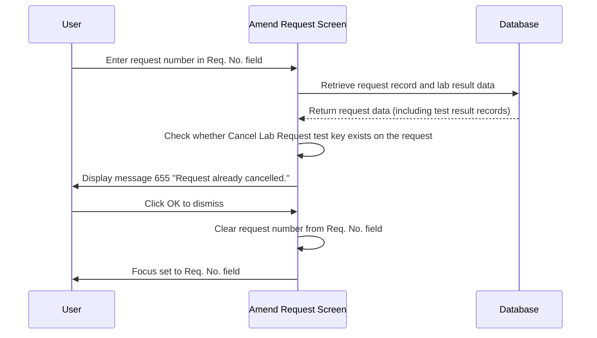

# Request Cancelled Message

## Overview

When a staff member attempts to retrieve a request on the Amend Request screen, the system first checks whether the request has already been cancelled. A request is considered cancelled when a **Cancel Lab Request** test result record has been applied to it in the laboratory database. If cancellation is detected, the system displays message **655** ("Request already cancelled.") before any request data is loaded. The user is informed and returned to the **Req. No.** field to enter a different request number. This check prevents staff from inadvertently amending a request that has already been formally cancelled.

---

## Related User Stories

- **[[CRST-782]]** - Amend Request - Request Cancelled Message

**Epic:** LISP-229 [CRST][DEV] Amend Request - Request Retrieval

---

## Key Concepts

### Cancel Lab Request Test Key
Each laboratory configures a specific test key that acts as a marker for request cancellation. When this marker test has been applied to a request (i.e., a test result record for that test key exists on the request), the request is considered cancelled. The test key is configured via the **Cancel Comment** option under the `CANCEL` option group (`LAB_OPTION.option_code = 'CANCEL_COMMENT'`, `option_group = 'CANCEL'`).

### Cancelled Request Definition
A request is classified as cancelled when both of the following are true:
1. The **Cancel Lab Request** test key is configured for the request's laboratory.
2. A test result record matching that test key exists on the request in `TESTRSLT` (counter 1).

---

## Trigger Point

Evaluated immediately after the system has successfully retrieved the request data from the database — before any panel fields are populated on screen. This check is part of the request-ready processing step within the [[Retrieve Request]] workflow.

---

## Workflow Scenario

### Scenario: Retrieving a Cancelled Request

#### Prerequisites
- The Amend Request screen is open.
- The user enters a request number for a request that has been cancelled (i.e., the Cancel Lab Request test result marker is present on the request record).
- The `CANCEL_COMMENT` option is configured for the relevant laboratory.

#### Process Flow

#### Step-by-Step Details

1. The user enters a request number into the **Req. No.** field. The system retrieves the request data and its associated test result records from the database.

2. The system looks up the **Cancel Lab Request** test key configured for the request's laboratory (via the `CANCEL_COMMENT` option under the `CANCEL` option group). It then checks whether a test result record matching that key (counter 1) is present on the retrieved request.

3. If the cancellation marker is found, the system displays message **655**: *"Request already cancelled."* The request panels are **not** populated — no data is loaded onto the screen.

4. The user clicks **OK** to dismiss the message. The **Req. No.** field is cleared and focus returns to it, allowing the user to enter a different request number.

> This check applies to all Amend Request variants (General Lab and CRS application).

---

## Message Reference

| Message | Text | Trigger | User Options |
|---------|------|---------|-------------|
| 655 | "Request already cancelled." | The entered request number has the Cancel Lab Request test key applied to it | OK (dismiss) |

---

## Configuration

| Setting | Option Code | Option Group | Purpose | Effect when configured | Effect when not configured |
|---------|-------------|--------------|---------|----------------------|--------------------------|
| Cancel Comment Test Key | `CANCEL_COMMENT` | `CANCEL` | Identifies the test key used to mark a request as cancelled in the lab result data | Cancelled requests are detected and message 655 is shown | No cancellation check is performed |

---

## Business Rules

1. A request is considered cancelled only when the **Cancel Lab Request** test key is both configured for the laboratory **and** present as a test result record (counter 1) on the specific request.
2. The cancellation check is evaluated **before** any request data is loaded onto the screen — the panels remain blank if cancellation is detected.
3. After the user dismisses message 655, the **Req. No.** field is cleared and focus is returned to it. The screen state is unchanged from before the retrieval attempt.
4. The `CANCEL_COMMENT` option is scoped per laboratory — each lab may have a different test key configured as its cancellation marker.
5. This check applies regardless of application variant (General Lab or CRS application).

---

## Related Workflows

- [[Retrieve Request]] — The parent workflow within which this cancelled request check is performed.
- [[Not Supported Lab Message]] — A parallel pre-load check that blocks retrieval when the request's lab is not supported in the current application.
