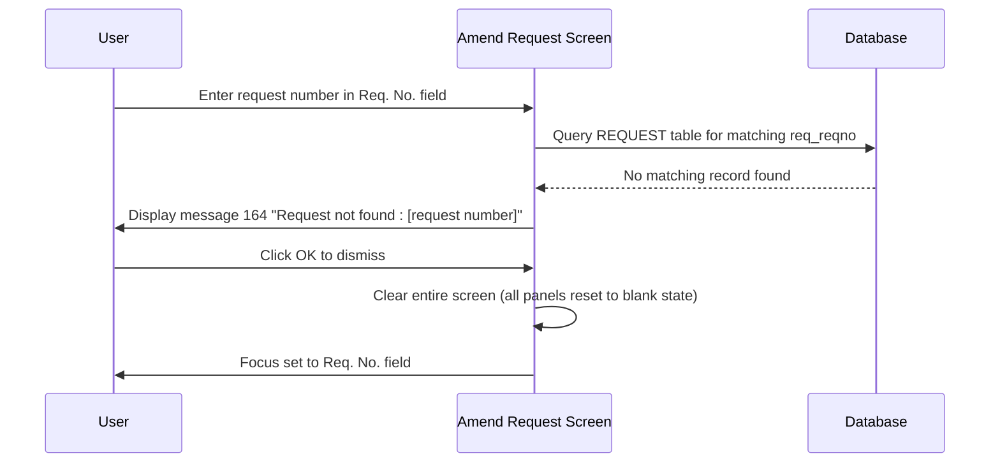

# Request Not Found Message

## Overview

When a staff member enters a request number on the Amend Request screen, the system attempts to locate the corresponding record in the database. If the request number does not exist in the registered request records, the system displays message **164** ("Request not found : [request number]") to inform the user that no matching record could be found. The entered request number is shown in the message text. After the user dismisses the message, the screen is fully cleared and focus returns to the **Req. No.** field, ready for a new entry. This check prevents the screen from entering an inconsistent state when an unrecognised or mistyped request number is submitted.

---

## Related User Stories

- **[[CRST-783]]** - Amend Request - Request Not Found Message

**Epic:** LISP-229 [CRST][DEV] Amend Request - Request Retrieval

---

## Trigger Point

Triggered when the system cannot locate a record in the `REQUEST` table matching the request number entered in the **Req. No.** field. This is the failure path of the [[Retrieve Request]] workflow — evaluated when the database query returns no result.

---

## Workflow Scenario

### Scenario: Request Number Not Found in the Database

#### Prerequisites
- The Amend Request screen is open.
- The user enters a request number that does not exist in the `REQUEST` table (e.g., the number was never registered, was mistyped, or belongs to a different system).

#### Process Flow

#### Step-by-Step Details

1. The user enters a request number into the **Req. No.** field. The system queries the `REQUEST` table for a record matching that number.

2. If no matching record is found, the system displays message **164**: *"Request not found : [request number]"*, where the entered request number is substituted into the message text.

3. No request data is loaded. The screen panels remain in their blank pre-retrieval state.

4. The user clicks **OK** to dismiss the message. The entire screen is cleared — all panels are reset to their blank default state — and focus returns to the **Req. No.** field.

> **Note:** The "not found" path performs a full screen clear on dismiss, in contrast to the [[Request Cancelled Message]] and [[Not Supported Lab Message]] paths, which clear only the **Req. No.** field. This is because the "not found" condition occurs before the screen can have any partial state from a previous retrieval.

---

## Message Reference

| Message | Text | Trigger | User Options |
|---------|------|---------|-------------|
| 164 | "Request not found : [request number]" | The entered request number does not exist in the `REQUEST` table | OK (dismiss) |

---

## Business Rules

1. The "not found" check is the database-level failure path — it is triggered when the `REQUEST` table contains no record for the submitted request number.
2. The entered request number is included in the message text, confirming to the user exactly which number was not found.
3. On dismissing the message, the **entire screen** is cleared — not only the **Req. No.** field. This is distinct from other retrieval error paths (cancelled, not supported lab) where only the **Req. No.** field is cleared.
4. After the clear, focus is returned to the **Req. No.** field so the user can immediately attempt a new retrieval.
5. This check applies to all Amend Request variants (General Lab and CRS application).

---

## Related Workflows

- [[Retrieve Request]] — The parent workflow whose database query failure triggers this message.
- [[Request Cancelled Message]] — A parallel post-retrieval check; clears the Req. No. field only (not the full screen).
- [[Not Supported Lab Message]] — A parallel pre-retrieval check (CRS app only); clears the Req. No. field only (not the full screen).
