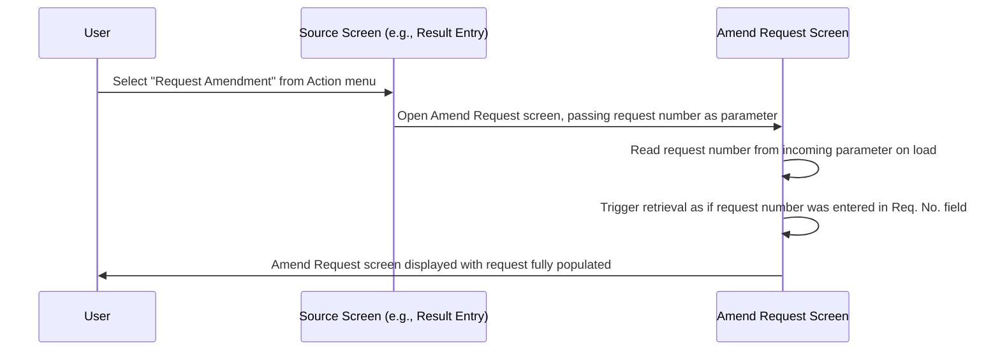

# Request Retrieval from Other Screen

## Overview

The Amend Request screen supports an alternative retrieval path where a request is loaded automatically — without the staff member manually entering a request number — when the screen is opened from another screen in the system. When a user invokes the **Request Amendment** action from a supported source screen (such as the APS Lab Result Entry screen or the APS Result Enquiry screen), the system opens the Amend Request screen and immediately populates it with the request that was active on the originating screen. This allows staff to amend a request in context, without having to re-enter the request number manually.

---

## Related User Stories

- **[[CRST-784]]** - Amend Request - Request Retrieval from Other Screen

**Epic:** LISP-229 [CRST][DEV] Amend Request - Request Retrieval

---

## Key Concepts

### Menu Parameter
When a source screen opens the Amend Request screen, it passes the request number as a parameter through the system's screen-switching mechanism. The Amend Request screen reads this parameter on load and uses it to trigger retrieval automatically, as if the user had typed the number into the **Req. No.** field directly.

---

## Trigger Point

Triggered when the Amend Request screen is opened via the **Request Amendment** menu action from a source screen, and a request number is passed as part of that navigation. The screen reads the request number on initialisation and begins retrieval immediately — before the user interacts with the **Req. No.** field.

---

## Workflow Scenario

### Scenario: Opening Amend Request from a Source Screen

#### Prerequisites
- A source screen (e.g., APS Lab Result Entry or APS Result Enquiry) is open with a request already loaded.
- The user selects the **Request Amendment** action from the screen's action menu.

#### Process Flow

#### Step-by-Step Details

1. The user selects **Request Amendment** from the action menu of the source screen (e.g., the APS Lab Result Entry screen or the APS Result Enquiry screen). The system passes the currently active request number to the Amend Request screen as a navigation parameter.

2. The Amend Request screen opens and reads the incoming request number. It immediately triggers the standard retrieval process — equivalent to the user having typed the request number into the **Req. No.** field and submitted it.

3. The standard [[Retrieve Request]] workflow runs in full: request data is loaded, all panels are populated, the Initial Values snapshot is recorded, and screen objects are enabled. Any retrieval error paths (cancelled request, not found) also apply.

4. The **Req. No.** field is populated with the retrieved request number and set to non-editable, exactly as it would be after a manual retrieval.

---

## Supported Source Screens

| Source Screen | Action That Opens Amend Request |
|--------------|--------------------------------|
| APS Lab Result Entry | "Request Amendment" from the Action menu |
| APS Result Enquiry | "Request Amendment" from the Action menu |

---

## Business Rules

1. The automatic retrieval on open is functionally identical to a manual retrieval — all the same validation checks (cancelled request, not found, not supported lab) and panel population steps apply.
2. If no request number is passed in the navigation parameter, no automatic retrieval is triggered and the screen opens in its blank default state.
3. The source screen is responsible for passing the correct request number; the Amend Request screen does not validate which screen originated the navigation.

---

## Related Workflows

- [[Retrieve Request]] — The retrieval workflow that is triggered automatically when the screen is opened from another screen with a request number parameter.
