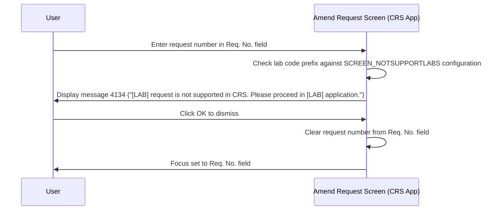
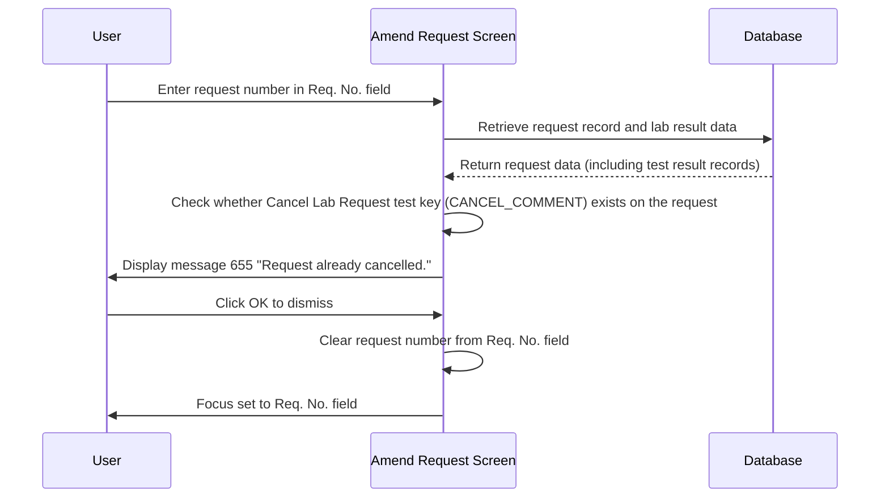

# Retrieve Request

## Overview

The **Retrieve Request** workflow loads an existing registered lab request onto the Amend Request screen when a staff member enters a request number. The system identifies the relevant laboratory by checking the lab number on the request record, then retrieves and populates all screen panels — Patient Demographic, Request Information, and Data Retention — with the stored request data. Once retrieval is complete, the screen transitions from its default blank state to an active state where request information fields become editable and action buttons are enabled.

---

## Related User Stories

- **[[CRST-779]]** - Amend Request - Retrieve Request
- **[[CRST-780]]** - Amend Request - Initial Values of Request
- **[[CRST-781]]** - Amend Request - Not Supported Lab Message
- **[[CRST-782]]** - Amend Request - Request Cancelled Message
- **[[CRST-778]]** - Amend Request - Object Enablement After Retrieval
- **[[CRST-771]]** - Amend Request - Patient Demographic Panel
- **[[CRST-772]]** - Amend Request - Request Information Panel
- **[[CRST-776]]** - Amend Request - Data Retention Selection Panel

**Epic:** LISP-229 [CRST][DEV] Amend Request - Request Retrieval

---

## Trigger Point

Initiated when the user enters a request number into the **Req. No.** field on the Amend Request screen and submits it (e.g., by pressing Enter or tabbing out of the field).

---

## Workflow Scenarios

### Scenario 1: Successful Request Retrieval

#### Prerequisites
- The Amend Request screen is open.
- The user has entered a valid, registered request number in the **Req. No.** field.

#### Process Flow

```mermaid
sequenceDiagram
    participant User
    participant Screen as Amend Request Screen
    participant DB as Database

    User->>Screen: Enter request number in Req. No. field
    Screen->>DB: Query REQUEST by req_reqno; check req_labno
    DB-->>Screen: Return request record
    Screen->>DB: Query PATIENT for pay code (pat_type)
    Screen->>DB: Query OFFICE for doctor full name (office_name)
    Screen->>DB: Query REQUEST_COPY_HIST for report copy details
    DB-->>Screen: Return all related records
    Screen->>User: Populate Patient Demographic panel (read-only)
    Screen->>User: Populate Request Information panel (editable)
    Screen->>User: Populate Data Retention panel (if user has access right)
    Screen->>User: Enable Amend button and other applicable buttons
    Screen->>Screen: Record Initial Values snapshot (before image of all tracked fields)
```

#### Step-by-Step Details

1. The user enters a request number into the **Req. No.** field. The system uses the lab number embedded in the request record (`REQUEST.req_labno`) to identify which laboratory the request belongs to and retrieve the correct data set.

2. The **Patient Demographic** panel is populated with the patient's details from the request record. All fields are set to non-editable after population.

3. The **Request Information** panel is populated with the request's stored values. The majority of fields become editable; **Pay Code** and **Request Doctor — Full Name** remain non-editable.

4. The **Data Retention** panel is populated with the stored retention value. The panel becomes interactive if the user holds the required **LAB_FUNCTION** access right for the retrieved lab.

5. The **Req. No.** field itself is set to non-editable — the retrieved request number is displayed but cannot be changed without clearing the screen.

6. The **Amend** button is enabled. Other buttons (**Input Specimen No.**, **Send Out**, **Print Send Out**, **Print Form**) are enabled according to their individual conditions as described in [[Buttons]].

7. The system immediately records an **Initial Values snapshot** — a before-image of all tracked request fields held in memory for the duration of the session. This snapshot is used to identify changed fields when the amendment is submitted, and ensures original values are restored if the user clears without amending. See [[Initial Values Snapshot]] for full details.

---

### Scenario 2: Request Belongs to a Not Supported Lab (CRS App Only)

#### Prerequisites
- The CRS application Amend Request screen is open.
- The `SCREEN_NOTSUPPORTLABS` lab option is configured with one or more restricted lab code prefixes.
- The user enters a request number whose lab code prefix matches a restricted entry.

#### Process Flow



#### Step-by-Step Details

1. The user enters a request number into the **Req. No.** field. The system extracts the lab code prefix and checks it against the list of restricted lab codes in the `SCREEN_NOTSUPPORTLABS` lab option.

2. If the lab code matches a restricted entry, the system immediately displays message **4134**: *"[LAB] request is not supported in CRS. Please proceed in [LAB] application."* The lab name is substituted into both placeholders in the message text.

3. No request data is loaded. The screen remains in its pre-retrieval blank state.

4. The user clicks **OK** to dismiss the message. The **Req. No.** field is cleared and focus returns to it, allowing the user to enter a different request number.

> See [[Not Supported Lab Message]] for full details on configuration, message text, and business rules.

---

### Scenario 3: Retrieving a Cancelled Request

#### Prerequisites
- The Amend Request screen is open.
- The user enters a request number for a request that has been cancelled — the Cancel Lab Request test key (configured via the `CANCEL_COMMENT` option) has been applied as a test result record on the request.
- This scenario applies to all application variants (General Lab and CRS application).

#### Process Flow



#### Step-by-Step Details

1. The user enters a request number into the **Req. No.** field. The system retrieves the request data and its associated test result records from the database.

2. The system looks up the **Cancel Lab Request** test key for the request's laboratory (via the `CANCEL_COMMENT` option under the `CANCEL` option group) and checks whether a matching test result record (counter 1) is present on the retrieved request.

3. If the cancellation marker is found, the system displays message **655**: *"Request already cancelled."* The request panels are **not** populated — no data is loaded onto the screen.

4. The user clicks **OK** to dismiss the message. The **Req. No.** field is cleared and focus returns to it.

> See [[Request Cancelled Message]] for full details on the cancelled request check, configuration, and business rules.

---

## Data Mapping

The following table lists every field populated during retrieval, including the exact source table and column name.

### Request Number

| Field Label | Table | Column | Data Type | Notes |
|-------------|-------|--------|-----------|-------|
| Request No. | `REQUEST` | `req_reqno` | varchar(16) | Displayed in Req. No. field; non-editable after retrieval |

### Patient Demographic Panel

| Field Label | Table | Column | Data Type | Notes |
|-------------|-------|--------|-----------|-------|
| HKID | `REQUEST` | `req_pid` | char(12) | |
| Encounter | `REQUEST` | `req_encounter` | char(15) | |
| Name (English) | `REQUEST` | `req_name` | varchar(81) | |
| Name (Chinese) | `REQUEST` | `req_cname` | varchar(60) | |
| Sex | `REQUEST` | `req_sex` | char(1) | |
| Age | `REQUEST` | `req_age` | tinyint | |
| Age Unit | `REQUEST` | `req_age_unit` | tinyint | |

### Request Information Panel

| Field Label | Table | Column | Data Type | Notes |
|-------------|-------|--------|-----------|-------|
| Category | `REQUEST` | `req_category` | tinyint | Editable after retrieval |
| Clinical Detail | `REQUEST` | `req_cdetail` / `req_cdetail2` | varchar(255) | Two columns combined; editable after retrieval |
| Reference | `REQUEST` | `req_reference` | varchar(255) | Editable after retrieval |
| Comment | `REQUEST` | `req_comment` | varchar(255) | Editable after retrieval |
| Bill | `REQUEST` | `req_bill` | tinyint | Editable after retrieval |
| Urgency | `REQUEST` | `req_urgency` | tinyint | Editable after retrieval |
| Confidential | `REQUEST` | `req_confidential` | tinyint | Editable after retrieval |
| Private | `REQUEST` | `req_lab_only` | tinyint | Editable after retrieval |
| Bed | `REQUEST` | `req_bed` | varchar(8) | Editable after retrieval |
| Pay Code | `PATIENT` | `pat_type` | char(3) | Non-editable after retrieval |
| Request Doctor — Hospital | `REQUEST` | `req_reqdoc_hosp` | char(12) | Editable after retrieval |
| Request Doctor — Code | `REQUEST` | `req_doc` | smallint | Editable after retrieval |
| Request Doctor — Full Name | `OFFICE` | `office_name` | varchar(40) | Non-editable; auto-populated from doctor code |
| Request Location — Hospital | `REQUEST` | `req_locn_hosp` | char(12) | Editable after retrieval |
| Request Location — Specialty | `REQUEST` | `req_unit` | smallint | Editable after retrieval |
| Request Location — Ward / Clinic | `REQUEST` | `req_locn` | smallint | Editable after retrieval |
| Report Location — Hospital | `REQUEST` | `req_rept_dest_hosp` | char(12) | Editable after retrieval |
| Report Location — Specialty | N/A | N/A | N/A | Not stored separately |
| Report Location — Ward / Clinic | `REQUEST` | `req_rept_dest` | smallint | Editable after retrieval |
| Report Copy — Hospital | `REQUEST_COPY_HIST` | `reqcp_office_hosp` | char(12) | Editable after retrieval |
| Report Copy — Specialty | N/A | N/A | N/A | Not stored separately |
| Report Copy — Ward / Clinic | `REQUEST_COPY_HIST` | `reqcp_office` | smallint | Editable after retrieval |
| Specimen Collection Datetime | `REQUEST` | `req_collected_date` | smalldatetime | Editable after retrieval |
| Specimen Request Datetime | `REQUEST` | `req_requested_date` | smalldatetime | Editable after retrieval |
| Specimen Arrival Datetime | `REQUEST` | `req_arrived_date` | smalldatetime | Editable after retrieval |

### Data Retention Panel

| Field Label | Table | Column | Data Type | Notes |
|-------------|-------|--------|-----------|-------|
| Data Retention | `REQUEST` | `req_retention` | tinyint | Populated on retrieval; editable if user has LAB_FUNCTION access right |

---

## Data Sources

| Data | Source |
|------|--------|
| Main request record | `REQUEST` table — identified by request number; lab scoped by `req_labno` |
| Pay Code | `PATIENT` table — joined via patient identifier on the request |
| Doctor full name | `OFFICE` table — joined via doctor code (`req_doc`) |
| Report copy location | `REQUEST_COPY_HIST` table — joined via request identifier |

---

## Business Rules

1. The system uses `REQUEST.req_labno` to determine which lab the request belongs to before retrieving data.
2. The **Req. No.** field becomes non-editable after a successful retrieval.
3. The **Patient Demographic** panel fields are always non-editable after retrieval — patient details cannot be changed on the Amend Request screen.
4. **Pay Code** is sourced from the `PATIENT` table, not the `REQUEST` table, and is always non-editable after retrieval.
5. **Request Doctor — Full Name** is sourced from the `OFFICE` table and is non-editable; it updates automatically when the user selects a new doctor via the **New Doctor Code** button.
6. **Clinical Detail** is stored across two columns (`req_cdetail` and `req_cdetail2`) and is displayed as a single field.
7. **Report Location — Specialty** and **Report Copy — Specialty** are not stored as discrete columns; they are derived contextually.
8. The **Data Retention** panel is populated from `REQUEST.req_retention` but is only interactive if the user holds the required **LAB_FUNCTION** access right for the retrieved lab.
9. This retrieval workflow applies to the General Laboratory Amend Request. The CRS application variant follows the same retrieval pattern but without the Data Retention panel.

---

## Related Workflows

- [[Object Enablement After Retrieval]] — Defines which fields and buttons become enabled or remain disabled once retrieval completes.
- [[Initial Values Snapshot]] — The before-image snapshot recorded at the end of each retrieval, used for change comparison and value restoration.
- [[Not Supported Lab Message]] — Error path triggered when the entered request number belongs to a CRS-restricted lab (CRS app only).
- [[Request Cancelled Message]] — Error path triggered when the entered request number belongs to a request that has already been cancelled.
