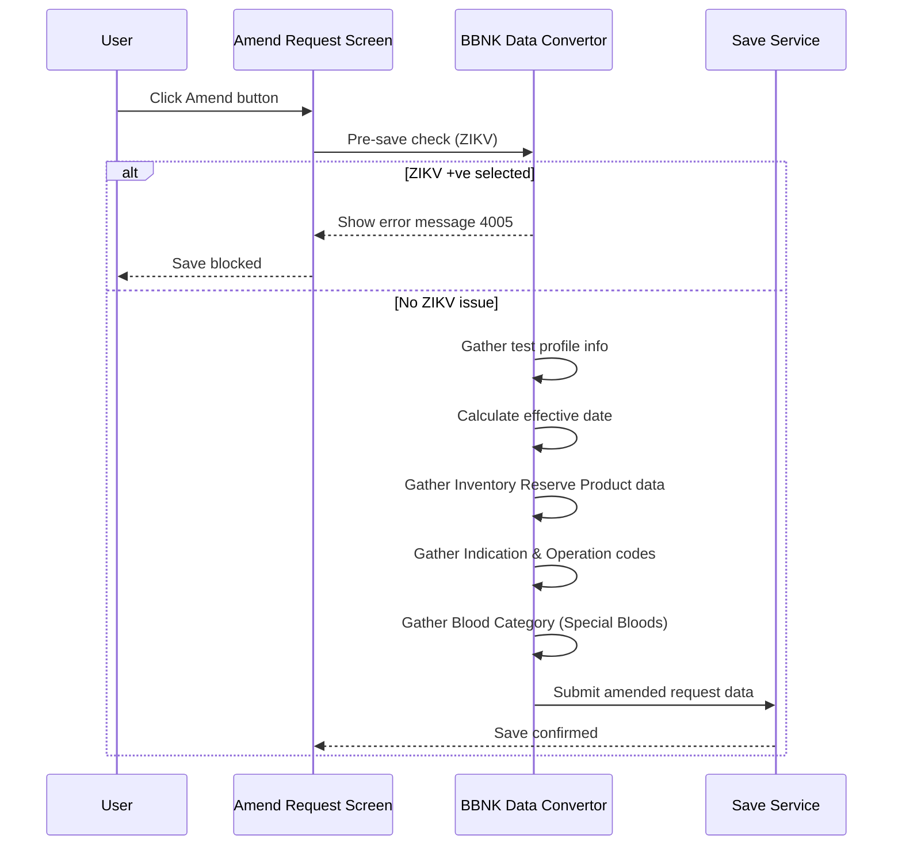

# BBNK Amend Request

## Overview

When the user confirms an amendment to a BBS request, the system gathers the Blood Bank–specific data entered in the BBNK Panel and prepares it for saving. This includes the Inventory Reserve Product details, Indication and Operation codes, the effective date, and the Blood Category (special blood requirements). A pre-save check is performed to block any selection of ZIKV-positive blood category before data collection proceeds.

---

## Related User Stories

- **[[CRST-831]]** - Amend Request - BBNK: Amend Request

**Epic:** LISP-227 [CRST][DEV] Amend Request - Special Lab Workflow (BBNK)

---

## Trigger Point

Initiated as part of the standard Amend Request save sequence after input validation has passed. The BBNK-specific data preparation runs before the request record is persisted to the database.

---

## Workflow Scenarios

### Scenario 1: Standard BBS Amend Save

#### Prerequisites
- A BBS request has been retrieved.
- The user has made changes in the BBNK Panel.
- Input validation has passed.

#### Process Flow

#### Step-by-Step Details

1. **Pre-save ZIKV check:** Before data collection begins, the system checks whether the Blood Category selection includes ZIKV-positive. If it does, error message **4005** is displayed and the save does not proceed.

2. **Test Profile Info:** The system collects the list of test profile records from the retrieved request data and prepares them as part of the save parameter.

3. **Effective Date determination:** The system calculates the effective date for the request using the following priority:

   | Priority | Condition | Value Used |
   |----------|-----------|------------|
   | 1 | Collection Date is not null and time portion is not 00:00 | Collection Date |
   | 2 | Arrival Date is not null and time portion is not 00:00 | Arrival Date |
   | 3 | (Fallback) | Registered Datetime |

4. **Inventory Reserve Product:** The system writes the following fields to the `bb_request_inv` record for this request:

   | Field | Source |
   |-------|--------|
   | Product Type | Input from Inventory Reserve Product — Type |
   | Product Unit | Input from Inventory Reserve Product — Unit |
   | Date Required | Input from Inventory Reserve Product — Date Required |
   | Special Bloods | Current special blood selection from Blood Category |
   | PID Key | Patient identifier key from the process parameter |
   | Claimed HKID Info | Claimed HKID information from the process parameter |

5. **Indication and Operation Codes:** The system writes code records to `bb_request_code`:
   - Multiple indication codes entered with `,` as separator are split and saved as separate records, one per code. Duplicated indication codes are not saved.
   - The operation code is saved into the first code record row. Even if multiple values are entered with `,` separation, the value is taken directly as-is from the input.

6. **Blood Category:** The current special blood selections are collected from the Blood Category selection and included as part of the Inventory Reserve Product record.

---

## Data Saved

### `bb_request_inv`

| Field Label | Table | Column | Notes |
|-------------|-------|--------|-------|
| Product Type | `bb_request_inv` | *(product type column)* | Keyword ckey value; null if not set |
| Product Unit | `bb_request_inv` | *(unit column)* | Integer value; null if not set |
| Date Required | `bb_request_inv` | *(date column)* | Date value |
| Special Bloods | `bb_request_inv` | *(special bloods column)* | Collection of special blood records |

### `bb_request_code`

| Field Label | Table | Column | Notes |
|-------------|-------|--------|-------|
| Indication Code | `bb_request_code` | *(indication column)* | One record per code; duplicates excluded |
| Operation Code | `bb_request_code` | *(operation column)* | Stored in first record row; taken as-is from input |

---

## Error Messages and System Prompts

| Message | Text | Trigger | User Options |
|---------|------|---------|-------------|
| 4005 | ZIKV +ve blood category cannot be selected | User selects ZIKV +ve in Blood Category before saving | OK (dismiss; save blocked) |

---

## Business Rules

1. The ZIKV-positive blood category cannot be saved. The system blocks the save and shows error message 4005 if this category is selected.
2. Effective date priority is: Collection Date (if non-zero time) → Arrival Date (if non-zero time) → Registered Datetime.
3. Duplicated indication codes are not saved to the database.
4. Operation code is saved as the first code record row regardless of how many indication codes are present.

---

## Related Workflows

- [[BBNK Panel Enablement]] — Defines when the BBNK Panel is active and accepting input.
- [[BBNK Load Data]] — Populates the BBNK Panel when a BBS request is first retrieved.
- [[BBNK Change Audit]] — Records the audit log for any BBNK fields changed during the amendment.
