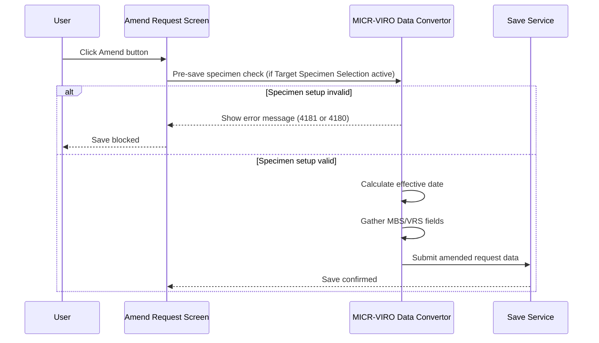

# MICR-VIRO Amend Request

## Overview

When the user confirms an amendment to an MBS or VRS request, the system gathers the MICR-VIRO Panel data and prepares it for saving to the database. The data collected includes the Microbiologist, Specimen Type, Site, Chemotherapy used, and Treatment Category fields, together with the patient identifier and request number. The effective date is also recalculated using the standard three-way priority rule. For VRS requests where the Target Specimen Selection mode is active, an additional pre-save specimen setup check is performed before data is written.

---

## Related User Stories

- **[[CRST-837]]** - Amend Request - MICR/VIRO: Amend Request

**Epic:** LISP-228 [CRST][DEV] Amend Request - Special Lab Workflow (MICR/VIRO)

---

## Trigger Point

Initiated as part of the standard Amend Request save sequence after input validation has passed. The MICR-VIRO-specific data preparation runs before the request record is persisted to the database.

---

## Workflow Scenarios

### Scenario 1: Standard MBS/VRS Amend Save

#### Prerequisites
- An MBS or VRS request has been retrieved.
- The user has made changes in the MICR-VIRO Panel.
- Input validation has passed.

#### Process Flow

#### Step-by-Step Details

1. **Pre-save specimen check (Target Specimen Selection mode only):** When the Target Specimen Selection lab option is active, the system checks whether the SPECIMEN keyword group has active entries for the MBS/VRS lab. If no active specimen keywords exist, error message **4181** is shown and the save is blocked. If duplicate specimen entries are found, error message **4180** is shown and the save is blocked.

2. **Effective Date determination:** The system calculates the effective date using the following priority:

   | Priority | Condition | Value Used |
   |----------|-----------|------------|
   | 1 | Collection Date is not null and time portion is not 00:00 | Collection Date |
   | 2 | Arrival Date is not null and time portion is not 00:00 | Arrival Date |
   | 3 | (Fallback) | Registered Datetime |

3. **Data gathered for saving:** The following fields are collected from the MICR-VIRO Panel and written to the `mb_request` record for this request:

| Field Label | Table | Column | Notes |
|-------------|-------|--------|-------|
| Microbiologist | `mb_request` | `req_microbiologist` | Keyword key value; stored as 0 if no item is selected |
| Specimen Type | `mb_request` | `req_specimen` | Selected keyword key value |
| Site | `mb_request` | `req_site` | Free-text input value |
| Chemotherapy used | `mb_request` | `req_chemotherapy` | Free-text input value |
| Treatment Category | `mb_request` | `req_treatment` | Keyword key value; stored as 0 if no item is selected |
| PID Group | `mb_request` | `req_pidgroup` | Patient HKID key of the current request |
| Request No. | `mb_request` | `req_reqno` | Current request number |

---

## Error Messages and System Prompts

| Message | Trigger | User Options |
|---------|---------|-------------|
| 4181 | No active SPECIMEN keywords configured for the lab (Target Specimen Selection mode) | OK (dismiss; save blocked) |
| 4180 | Duplicate specimen setup detected (Target Specimen Selection mode) | OK (dismiss; save blocked) |

---

## Business Rules

1. Effective date priority is: Collection Date (if non-zero time) → Arrival Date (if non-zero time) → Registered Datetime.
2. Microbiologist and Treatment Category are stored as integer value 0 (not null) when no item is selected, to distinguish "deliberately cleared" from "not set".
3. The pre-save specimen check only applies when the Target Specimen Selection lab option is active.

---

## Related Workflows

- [[MICR-VIRO Panel — Enablement]] — Defines when the panel is active and accepting input.
- [[MICR-VIRO Panel — Load Data]] — Populates the panel when an MBS/VRS request is first retrieved.
- [[MICR-VIRO Change Audit]] — Records the audit log for any MICR-VIRO fields changed during the amendment.
- [[MICR-VIRO Validation]] — The validation checks that must pass before this workflow runs.
