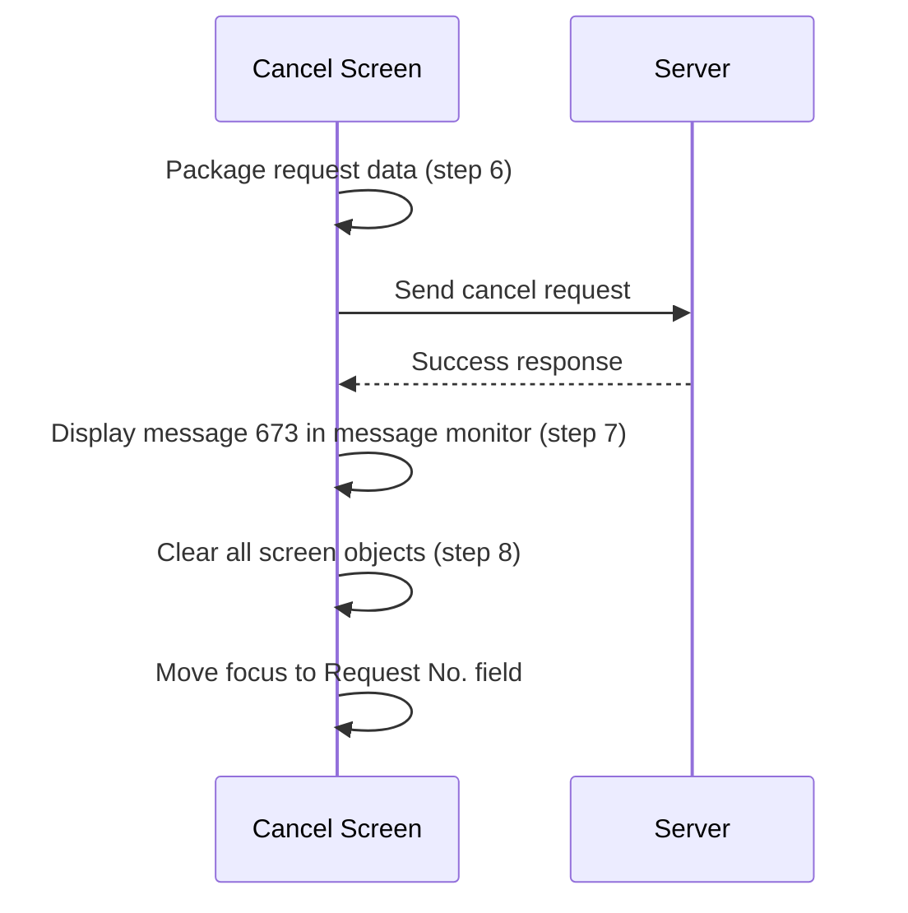
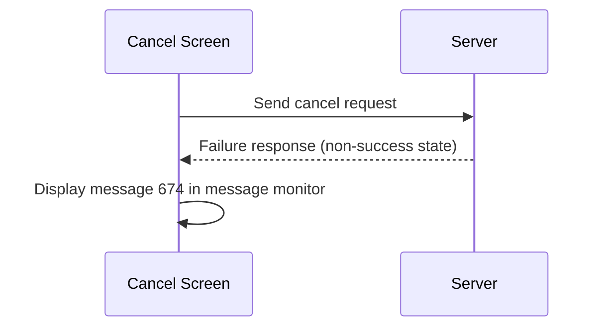
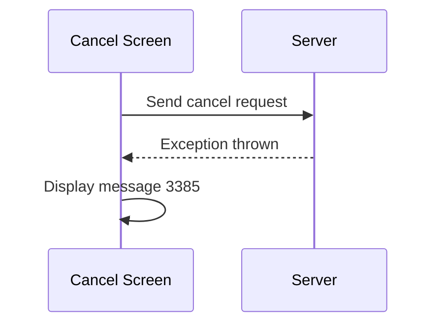

# Cancel Request (Action)

## Overview

After all validation, user validation, and confirmation steps pass, the system commits the cancel action. It packages the request data, sends it to the server, displays a completion message, and then clears the screen. This is step 6 through step 8 of the eight-step cancel pipeline. On success, message 673 appears in the message monitor. On failure, message 674 is shown. On server error, message 3385 is shown.

---

## Related User Stories

- **[[CRST-941]]** — Cancel Request — Cancel Request (Action)

**Epic:** LISP-247 [CRST][DEV] Cancel Request - Cancel Action

---

## Trigger Point

Steps 6–8 of the eight-step cancel pipeline, after [[Ask for Confirmation]] (step 5) passes.

---

## Workflow Scenarios

### Scenario 1: Successful Cancellation

#### Prerequisites
- All preceding pipeline steps have passed (confirmation, gather info, validation, user validation, ask for confirmation).

#### Process Flow

#### Step-by-Step Details

1. **Package request data (step 6 — Process Save):** The system assembles the cancel request package with the following data:

   | Data Field | Content |
   |---|---|
   | Lab Result | Full lab result data for the retrieved request |
   | Cancel Comment | Text entered in the **Cancel Reason** text area |
   | Cancel Comment Test Key | The key identifying the cancel comment test for the current lab |
   | Authorize ID | The ID of the user who authorised via User Validation Dialogue |
   | Acting By ID | The ID of the user who performed the cancel action |
   | Request Level | 4 = Printed; 3 = Authorized; 2 = Entered; 1 = No Result |
   | Cancel Comment Test | The cancel comment test object found within the request |
   | Is Authorize | Whether this action also authorises the cancel comment test |

2. **Server call:** The packaged data is sent to the backend to perform the cancellation.
3. **On success — Prompt completion message (step 7):** Message 673 is displayed in the message monitor.
4. **Clear screen (step 8):** All screen objects are cleared, process parameters are reset, and focus moves to the **Request No.** field.

---

### Scenario 2: Cancel Action Fails (Server Returns Failure)

#### Process Flow

#### Step-by-Step Details

1. The server processes the cancel request but returns a failure state.
2. Message 674 — *"Record update failed!"* — is displayed in the message monitor.
3. The screen data is retained. See [[Failure Message]].

---

### Scenario 3: Server Error (Exception from Backend)

#### Process Flow

#### Step-by-Step Details

1. The backend throws an exception during processing.
2. Message 3385 is displayed as a prompt.
3. The screen data is retained. See [[Server Error Message]].

---

## Summary Tables

### Request Package Contents

| Data Field | Content |
|---|---|
| Lab Result | Full lab result data for the retrieved request |
| Cancel Comment | Text from the **Cancel Reason** text area |
| Cancel Comment Test Key | Cancel comment test key for the current lab |
| Authorize ID | Authorising user ID (from User Validation) |
| Acting By ID | Acting-by user ID (from User Validation) |
| Request Level | 4 = Printed; 3 = Authorized; 2 = Entered; 1 = No Result |
| Cancel Comment Test | The cancel comment test object in the request |
| Is Authorize | Whether the cancel comment test is also to be authorised |

### Messages

| Message | Text | Trigger | Display Location |
|---|---|---|---|
| 673 | *(cancel completion notice)* | Cancel action succeeded | Message monitor |
| 674 | "Record update failed!" | Server returns failure state | Message monitor |
| 3385 | *(server error notice)* | Backend exception thrown | Prompt |

---

## Business Rules

1. The request package is assembled immediately before the server call — it captures the state of the screen at the point the cancel pipeline reaches step 6.
2. The `Request Level` value in the package reflects the classification determined during the security check (see [[Validation]]).
3. The `Is Authorize` flag is always `false` for the standard cancel action; it is `true` only for the Authorize Cancel Reason action (see [[Authorize Cancel Reason]]).
4. After a successful cancellation, the screen is unconditionally cleared and focus returns to the **Request No.** field regardless of what was displayed.
5. Failure and server error messages do not clear the screen — the operator can review the data and retry.

---

## Related Workflows

- [[Ask for Confirmation]] — Step 5; immediately precedes the server call.
- [[Validation]] — Step 3; determines the Request Level value packed into the request.
- [[Failure Message]] — Documents message 674 shown when the server returns failure.
- [[Server Error Message]] — Documents message 3385 shown when an exception is thrown.
- [[Authorize Cancel Reason]] — A separate pipeline that also uses the request packing mechanism with `Is Authorize = true`.
