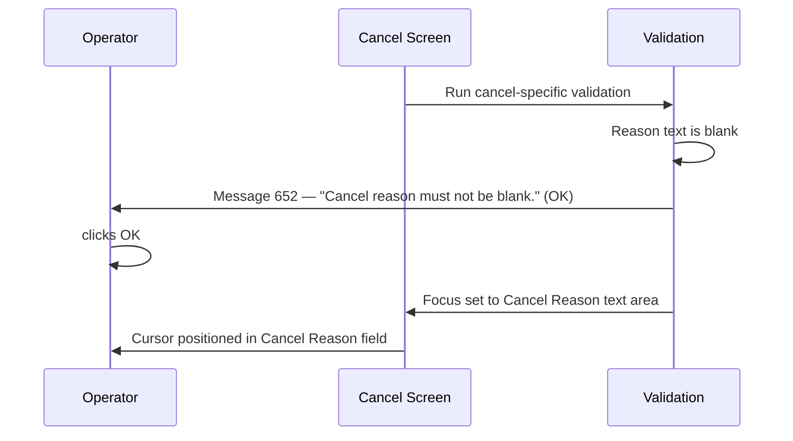

# Validation

## Overview

Before the cancel action is committed to the server, the system runs a two-phase validation against the request. The first phase checks whether the operator holds the access rights required to cancel a request at the highest result status present. The second phase checks that the cancel comment configuration and the reason text entered by the operator are valid. Both phases run as step 3 of the eight-step cancel pipeline, after the initial confirmation prompt and the server information gather. If either phase fails, the cancellation is aborted and the screen data is retained.

---

## Related User Stories

- **[[CRST-938]]** — Cancel Request — Validation

**Epic:** LISP-247 [CRST][DEV] Cancel Action

---

## Key Concepts

### Request Level
A classification assigned to the request during security check, based on the highest result status found among its tests. The system assigns one of four levels, in priority order: Printed (level 4) → Authorized (level 3) → Entered/Saved (level 2) → No Result (level 1).

### Access Right
A per-operator permission stored in the user profile. Four distinct rights govern cancellation, each tied to a result level. The right controls whether the operator may cancel a request at that level at all, not merely whether a confirmation is required.

### Cancel Comment Test
A specific test within the request that acts as the placeholder for the cancel reason text. Its key is derived from the system's Cancel Comment configuration. If no such test is found for the current lab, the cancellation cannot proceed.

### Comment Code Tag (`^`)
A prefix character embedded in free-text comments to denote a coded comment reference. When the operator types `^CODENAME` in the cancel reason field, the system validates that the referenced code exists. This is distinct from the `&` decode tag used for auto-substitution on focus-out (see [[Decode Text]]).

---

## Trigger Point

Triggered as step 3 of the cancel pipeline, immediately after the system has gathered server-side information (step 2). It runs only if the operator confirmed the "Are you sure?" prompt (step 1). See [[Confirmation Message]] for step 1 behaviour.

---

## Workflow Scenarios

### Scenario 1: Security Check — Request Has Printed Results

#### Prerequisites
- The operator has clicked **Cancel Request**.
- The initial confirmation was accepted.
- At least one test in the request has a Printed or Amended-and-Printed status, and its result type is not zero.

#### Process Flow

```mermaid
sequenceDiagram
    participant Operator
    participant Cancel Screen
    participant Validation

    Cancel Screen->>Validation: Run security check
    Validation->>Validation: Detect highest result level = Printed (level 4)
    alt Operator has "Delete Reported Test" right
        Validation->>Operator: Message 662 — "Request contain reported test result, Continue?" (Yes / No)
        alt Operator clicks Yes
            Validation->>Cancel Screen: Proceed to Phase 2
        else Operator clicks No
            Validation->>Cancel Screen: Abort; retain screen data
        end
    else Operator lacks right
        Validation->>Operator: Message 663 — "Request contain reported test result, operation not allowed!" (OK)
        Validation->>Cancel Screen: Abort; retain screen data
    end
```

#### Step-by-Step Details

1. The system scans all tests in the request. Tests with result type zero are excluded from this scan.
2. The system finds at least one test with a Printed or Amended-and-Printed status. The request is classified at level 4 (Printed).
3. The system checks whether the operator holds the **Delete Reported Test** right.
4. **If the operator has the right:** Message 662 is displayed — *"Request contain reported test result, Continue?"* with **Yes** and **No** buttons.
   - Clicking **Yes** dismisses the message and advances to Phase 2 (cancel-specific validation).
   - Clicking **No** dismisses the message and silently aborts the cancellation. The screen data is retained.
5. **If the operator lacks the right:** Message 663 is displayed — *"Request contain reported test result, operation not allowed!"* with an **OK** button. Clicking **OK** aborts the cancellation. The screen data is retained.

---

### Scenario 2: Security Check — Request Has Authorized Results (No Printed)

#### Prerequisites
- No tests have a Printed or Amended-and-Printed status (or all such tests have result type zero).
- At least one test has an Authorized, Amended-and-Awaiting-Signout, or Amended-and-Authorized status, with result type not zero.

#### Process Flow

```mermaid
sequenceDiagram
    participant Operator
    participant Cancel Screen
    participant Validation

    Cancel Screen->>Validation: Run security check
    Validation->>Validation: Detect highest result level = Authorized (level 3)
    alt Operator has "Delete Authorized Test" right
        Validation->>Operator: Message 665 — "Request contain authorized test result, Continue?" (Yes / No)
        alt Operator clicks Yes
            Validation->>Cancel Screen: Proceed to Phase 2
        else Operator clicks No
            Validation->>Cancel Screen: Abort; retain screen data
        end
    else Operator lacks right
        Validation->>Operator: Message 666 — "Request contain authorized test result, operation not allowed!" (OK)
        Validation->>Cancel Screen: Abort; retain screen data
    end
```

#### Step-by-Step Details

1. No Printed results are found. The system finds at least one Authorized-level result. The request is classified at level 3 (Authorized).
2. The system checks whether the operator holds the **Delete Authorized Test** right.
3. **If the operator has the right:** Message 665 is displayed — *"Request contain authorized test result, Continue?"* with **Yes** and **No** buttons.
   - **Yes** → advance to Phase 2.
   - **No** → abort; screen data retained.
4. **If the operator lacks the right:** Message 666 is displayed — *"Request contain authorized test result, operation not allowed!"* with **OK**. Clicking **OK** aborts the cancellation.

---

### Scenario 3: Security Check — Request Has Entered Results (No Printed or Authorized)

#### Prerequisites
- No tests have Printed or Authorized-level statuses (excluding result-type-zero tests).
- At least one test has an Entered or Amended-and-Entered status, with result type not zero.

#### Process Flow

```mermaid
sequenceDiagram
    participant Operator
    participant Cancel Screen
    participant Validation

    Cancel Screen->>Validation: Run security check
    Validation->>Validation: Detect highest result level = Entered (level 2)
    alt Operator has "Delete Resulted Test" right
        Validation->>Operator: Message 668 — "Request contain entered test result, Continue?" (Yes / No)
        alt Operator clicks Yes
            Validation->>Cancel Screen: Proceed to Phase 2
        else Operator clicks No
            Validation->>Cancel Screen: Abort; retain screen data
        end
    else Operator lacks right
        Validation->>Operator: Message 669 — "Request contain entered test result, operation not allowed!" (OK)
        Validation->>Cancel Screen: Abort; retain screen data
    end
```

#### Step-by-Step Details

1. No Printed or Authorized results are found. The system finds at least one Entered-level result. The request is classified at level 2 (Entered).
2. The system checks whether the operator holds the **Delete Resulted Test** right.
3. **If the operator has the right:** Message 668 is displayed — *"Request contain entered test result, Continue?"* with **Yes** and **No** buttons.
   - **Yes** → advance to Phase 2.
   - **No** → abort; screen data retained.
4. **If the operator lacks the right:** Message 669 is displayed — *"Request contain entered test result, operation not allowed!"* with **OK**. Clicking **OK** aborts the cancellation.

---

### Scenario 4: Security Check — Request Has No Results

#### Prerequisites
- No tests have any result-bearing status (or all tests have result type zero).
- The request is result-free.

#### Process Flow

```mermaid
sequenceDiagram
    participant Operator
    participant Cancel Screen
    participant Validation

    Cancel Screen->>Validation: Run security check
    Validation->>Validation: Detect no results — level 1 (No Result)
    alt Operator has "Delete Test" right
        Validation->>Cancel Screen: Proceed to Phase 2 (no confirmation prompt)
    else Operator lacks right
        Validation->>Operator: Message 671 — "No such privilege, operation failed!" (OK)
        Validation->>Cancel Screen: Abort; retain screen data
    end
```

#### Step-by-Step Details

1. No tests with any result-bearing status are found. The request is classified at level 1 (No Result).
2. The system checks whether the operator holds the **Delete Test** right.
3. **If the operator has the right:** No confirmation message is displayed. The system silently advances to Phase 2.
4. **If the operator lacks the right:** Message 671 is displayed — *"No such privilege, operation failed!"* with **OK**. Clicking **OK** aborts the cancellation.

> **Note:** The no-result case is the only scenario in which a rights check passes without presenting a Yes/No confirmation to the operator.

---

### Scenario 5: Cancel-Specific Validation — Cancel Comment Not Configured

#### Prerequisites
- Phase 1 (security check) has passed.
- The system's Cancel Comment configuration does not define a cancel comment test key for the current lab.

#### Process Flow

```mermaid
sequenceDiagram
    participant Operator
    participant Cancel Screen
    participant Validation

    Cancel Screen->>Validation: Run cancel-specific validation
    Validation->>Validation: cancelCommentTestkey is null
    Validation->>Operator: Message 651 — "CANCEL COMMENT/TESTS not define." (OK)
    Validation->>Cancel Screen: Abort; retain screen data
```

#### Step-by-Step Details

1. The system checks whether a cancel comment test key exists for the current lab.
2. No key is found. Message 651 is displayed — *"CANCEL COMMENT/TESTS not define."* with **OK**.
3. Clicking **OK** dismisses the message. The cancellation is aborted and the screen data is retained. Focus is not changed.

---

### Scenario 6: Cancel-Specific Validation — Reason Text Is Blank

#### Prerequisites
- Phase 1 has passed.
- A cancel comment test key exists.
- The **Cancel Reason** text area is empty or contains only whitespace.

#### Process Flow



#### Step-by-Step Details

1. A cancel comment test key exists.
2. The **Cancel Reason** text area is empty or contains only whitespace. Message 652 is displayed — *"Cancel reason must not be blank."* with **OK**.
3. Clicking **OK** dismisses the message and moves focus to the **Cancel Reason** text area. The cancellation is aborted.

---

### Scenario 7: Cancel-Specific Validation — Invalid Comment Code in Reason

#### Prerequisites
- Phase 1 has passed.
- A cancel comment test key exists.
- The **Cancel Reason** text area contains a `^`-prefixed code that does not match any valid comment code.

#### Process Flow

```mermaid
sequenceDiagram
    participant Operator
    participant Cancel Screen
    participant Validation

    Cancel Screen->>Validation: Run cancel-specific validation
    Validation->>Validation: Reason text is not blank; validateString() fails
    Validation->>Operator: Message 653 — "Invalid comment code found in T&S remark for patient" (OK)
    Operator->>Operator: clicks OK
    Validation->>Cancel Screen: Focus set to Cancel Reason text area
```

#### Step-by-Step Details

1. A cancel comment test key exists and the reason text is not blank.
2. The system validates the reason text. It finds a `^`-prefixed code token that cannot be resolved to a valid comment code.
3. Message 653 is displayed — *"Invalid comment code found in T&S remark for patient"* with **OK**.
4. Clicking **OK** dismisses the message and moves focus to the **Cancel Reason** text area. The cancellation is aborted.

---

### Scenario 8: All Validation Passes

#### Prerequisites
- Phase 1 has passed (operator has required right; confirmation accepted if applicable).
- A cancel comment test key exists.
- The **Cancel Reason** text area is not blank.
- All `^`-prefixed comment codes in the reason text are valid.

#### Step-by-Step Details

1. Security check passes without messages (no-result case) or the operator clicked **Yes** on the confirmation message.
2. Cancel comment test key is present.
3. The reason text is not blank and all embedded comment codes are valid.
4. The system advances to step 4 of the cancel pipeline (user validation). See [[User Validation]].

---

## Summary Tables

### Access Rights — Security Check

| Access Right | Controls cancellation of | Confirmation Message | Blocked Message |
|---|---|---|---|
| Delete Reported Test | Requests with any Printed result | 662 | 663 |
| Delete Authorized Test | Requests with any Authorized result (no Printed) | 665 | 666 |
| Delete Resulted Test | Requests with any Entered/Saved result (no Printed or Authorized) | 668 | 669 |
| Delete Test | Requests with no results at all | *(none — silently proceeds)* | 671 |

### Request Level Classification

| Level | Classification | Status Values Detected |
|---|---|---|
| 4 | Printed | Printed; Amended-and-Printed |
| 3 | Authorized | Authorized; Amended-and-Awaiting-Signout; Amended-and-Authorized |
| 2 | Entered | Entered; Amended-and-Entered |
| 1 | No Result | No result-bearing status found |

> Tests with result type zero are excluded from all status classification checks.

### Message Reference

| Message | Text | Trigger | User Options | Post-Action |
|---|---|---|---|---|
| 662 | "Request contain reported test result, Continue?" | Has Delete Reported Test right; Printed results exist | Yes / No | Yes → proceed; No → abort |
| 665 | "Request contain authorized test result, Continue?" | Has Delete Authorized Test right; Authorized results exist | Yes / No | Yes → proceed; No → abort |
| 668 | "Request contain entered test result, Continue?" | Has Delete Resulted Test right; Entered results exist | Yes / No | Yes → proceed; No → abort |
| 663 | "Request contain reported test result, operation not allowed!" | Lacks Delete Reported Test right; Printed results exist | OK | Abort; data retained |
| 666 | "Request contain authorized test result, operation not allowed!" | Lacks Delete Authorized Test right; Authorized results exist | OK | Abort; data retained |
| 669 | "Request contain entered test result, operation not allowed!" | Lacks Delete Resulted Test right; Entered results exist | OK | Abort; data retained |
| 671 | "No such privilege, operation failed!" | Lacks Delete Test right; no results exist | OK | Abort; data retained |
| 651 | "CANCEL COMMENT/TESTS not define." | Cancel comment test key not configured for current lab | OK | Abort; data retained; no focus change |
| 652 | "Cancel reason must not be blank." | Cancel Reason field is empty or whitespace | OK | Abort; focus → Cancel Reason |
| 653 | "Invalid comment code found in T&S remark for patient" | `^`-prefixed code in reason text is not a valid comment code | OK | Abort; focus → Cancel Reason |

---

## Configuration

| Setting | Option Code | Purpose | Effect when configured | Effect when absent |
|---|---|---|---|---|
| Cancel Comment Test | *(source: Cancel Comment dictionary, parsed per lab number)* | Identifies the test within the request that stores the cancel reason text | Cancel-specific validation can run; reason text is required | Message 651 is shown and cancellation is blocked |

---

## Business Rules

1. Status classification is based on the **highest** result level found — if any test is Printed, the entire request is treated as a level-4 (Printed) request, regardless of the status of other tests.
2. Tests with result type zero are excluded from all result status checks. They do not contribute to the request level classification.
3. The no-result case (level 1) is the only scenario in which a passing rights check does not display a confirmation prompt to the operator — the system proceeds silently.
4. Phase 2 (cancel-specific validation) runs only after Phase 1 passes. If Phase 1 aborts, Phase 2 is never evaluated.
5. The `^` comment code tag used in validation is distinct from the `&` decode tag. The `&` tag performs live text substitution on focus-out (see [[Decode Text]]); the `^` tag causes validation failure if the referenced code is invalid.
6. Message 651 does not move focus — it is a system configuration error, not a user input error.
7. Messages 652 and 653 both move focus to the **Cancel Reason** text area after the operator dismisses the prompt.

---

## Related Workflows

- [[Confirmation Message]] — Step 1 of the cancel pipeline; the "Are you sure?" prompt that precedes validation.
- [[Cancel Comment Test]] — Describes how the cancel comment test key is identified from the request data during retrieval; this key is used in Phase 2.
- [[Decode Text]] — Describes the `&`-tag decode behaviour on the Cancel Reason field, which is distinct from the `^`-tag validation covered here.
- [[User Validation]] — Step 4 of the pipeline; runs after all validation passes.
