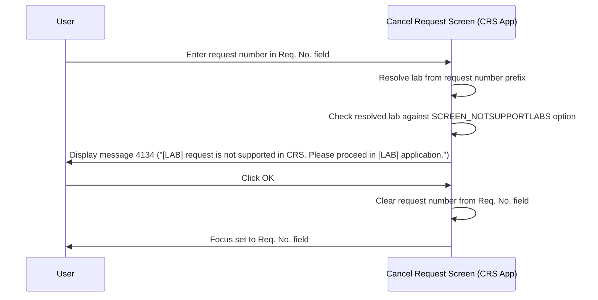

# Not Supported Lab Message

## Overview

When a user attempts to retrieve a request on the CRS application's Cancel Request screen, the system checks whether the resolved lab code of the entered request belongs to a list of labs that are not supported in the CRS application. If the request belongs to a restricted lab, retrieval is blocked and message **4134** is displayed, directing the user to proceed in the appropriate application instead. The request number is cleared from the **Req. No.** field after the user dismisses the message, and focus returns to that field so the user can enter a valid request number.

This check applies to the CRS application only and does not apply to the General Laboratory Cancel Request screen.

---

## Related User Stories

- **[[CRST-930]]** - Cancel Request - Not Supported Lab Message

**Epic:** LISP-245 [CRST][DEV] Cancel Request - Request Retrieval

---

## Trigger Point

Triggered after the user enters a request number and the system resolves its lab — either directly from the prefix, or after a [[Laboratory Selection]] choice in a multi-lab scenario. Before loading any request data, the system checks whether the resolved lab is in the not-supported list. If it is, the message is shown and retrieval is abandoned.

---

## Workflow Scenario

### Scenario: User Retrieves a Request for a Not Supported Lab

#### Prerequisites

- The CRS application Cancel Request screen is open.
- The `SCREEN_NOTSUPPORTLABS` lab option is configured for the hospital, with one or more lab code numbers listed in its option text under the `PROMPT_REQUEST_NOT_SUPPORTED_LAB` key.
- The user enters a request number whose resolved lab matches a restricted entry.

#### Process Flow

#### Step-by-Step Details

1. The user enters a request number in the **Req. No.** field. The system validates the format and resolves the target lab — either from the prefix directly, or via the [[Laboratory Selection]] dialogue when multiple labs share the same prefix.

2. Before loading any request data, the system evaluates whether the resolved lab is in the configured not-supported list. The list is loaded from the `SCREEN_NOTSUPPORTLABS` lab option (`option_group = 'REQUEST_REGISTRATION'`, `option_code = 'SCREEN_NOTSUPPORTLABS'`). The restricted lab code numbers are stored in `option_text` under the key `PROMPT_REQUEST_NOT_SUPPORTED_LAB`, formatted as a comma-separated list (e.g., `PROMPT_REQUEST_NOT_SUPPORTED_LAB:1,3`). Multiple keys can be present, separated by semicolons.

3. If the resolved lab is in the restricted list, message **4134** is displayed:
   > *"[LAB] request is not supported in CRS. Please proceed in [LAB] application."*

   The `[LAB]` placeholder is substituted with the abbreviated application name for the restricted lab (e.g., "CPS" for Chemistry, "HMS" for Haematology). No request data is loaded onto the screen.

4. The user clicks **OK** to dismiss the message.

5. The request number is cleared from the **Req. No.** field. Focus is placed back on the **Req. No.** field so the user can enter a different request number.

---

## Message Reference

| Message Code | Text | Trigger | User Options |
|-------------|------|---------|-------------|
| 4134 | "[LAB] request is not supported in CRS. Please proceed in [LAB] application." | Resolved lab is in the `SCREEN_NOTSUPPORTLABS` restricted list | OK (dismiss) |

> The `[LAB]` placeholder is filled with the restricted lab's application code (e.g., "CPS", "HMS"). It appears twice in the message — once for the request type description and once for the application name — and both occurrences display the same lab code.

---

## Configuration

| Setting | Option Code | Purpose | Effect when configured | Effect when not configured |
|---------|-------------|---------|----------------------|-----------------------------|
| Not Supported Labs | `SCREEN_NOTSUPPORTLABS` *(option_group = `REQUEST_REGISTRATION`)* | Defines which lab code numbers are blocked from retrieval in the CRS application | Requests with matching lab code numbers are blocked; message 4134 displayed | No lab restriction applied; all requests retrievable |

> The restricted lab code numbers are stored in `option_text` using the format `PROMPT_REQUEST_NOT_SUPPORTED_LAB:<labCode1>,<labCode2>,...`. Multiple lab codes can be listed, separated by commas. Multiple named restriction groups can be defined in the same option text, separated by semicolons. The lab code numbers correspond to entries in the lab number mapping — for example, lab code `1` maps to the CPS (Chemistry) application and lab code `3` maps to the HMS (Haematology) application.

---

## Business Rules

1. This check applies only to the **CRS application** variant of the Cancel Request screen. The General Laboratory Cancel Request is not subject to this restriction.
2. The not-supported lab restriction is configured per hospital — each hospital's CRS application may restrict a different set of labs.
3. More than one lab code number can be restricted under a single `SCREEN_NOTSUPPORTLABS` entry, by providing a comma-separated list in `option_text`.
4. The not-supported check is performed **after** lab resolution. In a multi-lab scenario where the [[Laboratory Selection]] dialogue is shown, the check fires against whichever lab the user selected — meaning a user can be shown message 4134 after making a lab selection.
5. When message 4134 is shown, no request data is retrieved or displayed. The screen remains in its initial state.
6. After the user dismisses message 4134, the **Req. No.** field is cleared and focus returns to it. The user must enter a different (supported) request number to proceed.

---

## Related Workflows

- [[Retrieve Request]] — This message is an error path within the request retrieval workflow, triggered before any data is loaded.
- [[Laboratory Selection]] — In multi-lab CRS scenarios, the not-supported lab check fires after the user selects a lab from the selection dialogue.
- [[Request Not Found Message]] — A separate error path triggered when the request number does not exist in a supported lab's database.
