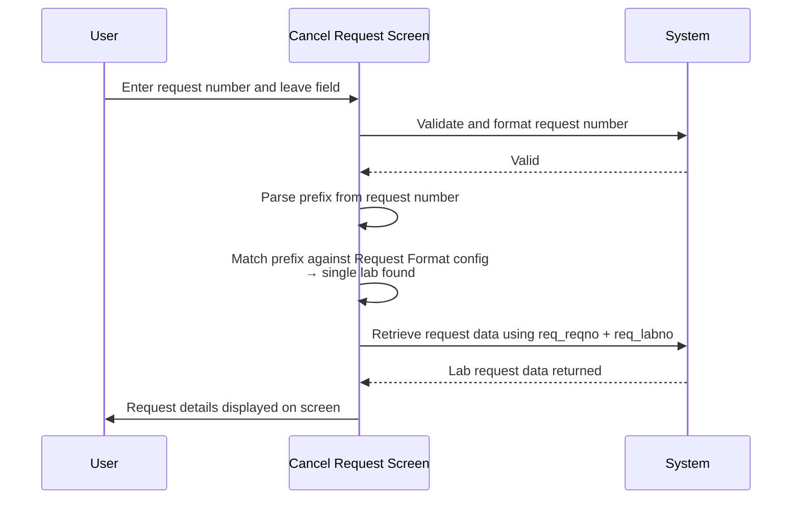
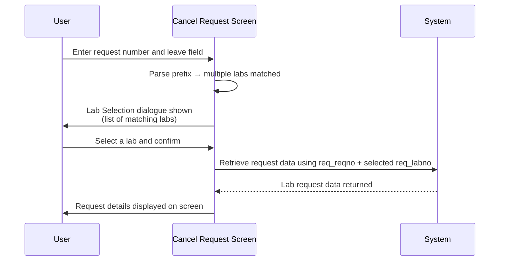

# Retrieve Lab Request by its Assigned Lab No

## Overview

When a user enters a request number on the Cancel Request screen, the system identifies which laboratory performed the request by matching the request number's prefix against a set of known request format patterns. The system then retrieves the lab request data from the performing lab using both the request number (`REQUEST.req_reqno`) and the assigned lab number (`REQUEST.req_labno`). This ensures that the correct lab's data — patient details, test results, and specimen information — is loaded onto the screen.

---

## Related User Stories

- **[[CRST-981]]** - Cancel Request - Retrieve Lab Request by its Assigned Lab No.

**Epic:** LISP-245 [CRST][DEV] Cancel Request - Request Retrieval

---

## Key Concepts

### Assigned Lab Number
The value stored in `REQUEST.req_labno` that identifies which laboratory performed the request. Each lab is associated with a numeric lab code and one or more request number prefixes.

### Request Number Prefix
The non-numeric characters embedded within a request number (e.g., "C", "H", "A") that identify the performing lab. The system parses the prefix from the entered request number and matches it against the global Request Format configuration to determine the lab number.

### Cross-Lab Registration (CRS) Context
When the Cancel Request screen is used from a cross-lab registration context, the system derives the lab number from the request number prefix. When used from within a single-lab application context, the lab number defaults to the current application's lab.

---

## Trigger Point

This process begins as soon as the user leaves the **Request No.** field after entering a request number. The system validates and parses the request number, then determines the performing lab before fetching the request data.

See [[Retrieve Request]] for the full retrieval flow.

---

## Lab Number Mapping

The following labs can be retrieved on the Cancel Request screen, identified by their assigned lab number and request number prefix:

| Lab No. | Laboratory |
|---------|-----------|
| 1 | Chemical Pathology / Transplantation and Immunogenetics |
| 2 | Genetic Service / Sendout Service |
| 3 | Haematology |
| 4 | Immunology |
| 5 | Anatomical Pathology |
| 6 | Blood Bank |
| 7 | Microbiology |
| 8 | Virology |

---

## Workflow Scenarios

### Scenario 1: Single Lab Resolved from Request Number Prefix

#### Prerequisites
- The entered request number has a prefix that maps uniquely to one lab in the Request Format configuration.
- The Cancel Request screen is operating in a cross-lab registration context.

#### Process Flow

#### Step-by-Step Details

1. The user enters a request number and moves focus away from the **Request No.** field.
2. The system validates the format of the request number.
3. If valid, the system extracts the prefix portion of the request number (the non-numeric characters between any leading digits and the trailing numeric sequence).
4. The system looks up all active Request Format entries in the global configuration, filtering for those whose prefix matches the extracted prefix.
5. A single matching lab number is found. The system proceeds directly to retrieve the request data using that lab number combined with the request number.
6. The request data from `REQUEST.req_reqno` and `REQUEST.req_labno` is returned and loaded onto the screen.

---

### Scenario 2: Multiple Labs Match the Prefix — User Selects Lab

#### Prerequisites
- The entered request number prefix matches more than one lab in the Request Format configuration (e.g., a USID-format request number that is valid across multiple labs).
- The Cancel Request screen is operating in a cross-lab registration context.

#### Process Flow

#### Step-by-Step Details

1. The prefix resolution step returns more than one candidate lab number.
2. A **Lab Selection** dialogue is displayed listing all candidate labs by their full name.
3. The first lab in the list is pre-selected by default.
4. The user selects a lab and confirms (by clicking or pressing Enter).
5. The system retrieves the request data using the selected lab number.
6. If the selected lab is not supported on this Cancel Request installation, message **4134** is shown and the request number field is cleared (see [[Not Supported Lab Message]]).

---

### Scenario 3: Single-Lab Application Context

#### Prerequisites
- The Cancel Request screen is accessed from a single-lab application (not a cross-lab registration context).

#### Step-by-Step Details

1. The system bypasses prefix matching entirely.
2. The lab number is set to the current application's lab number.
3. The system retrieves the request data using that lab number directly.

---

## Data Sources

| Data | Source |
|---|---|
| Request number | Entered by user in the **Request No.** field |
| Assigned lab number | Derived from request number prefix via global Request Format configuration; stored in `REQUEST.req_labno` |
| Request Format configuration | Global cached dictionary — Request Format |

---

## Business Rules

1. The lab number is derived from the request number prefix, not entered manually by the user.
2. When the prefix matches exactly one lab, the system proceeds automatically without user interaction.
3. When the prefix matches multiple labs (e.g., USID format), the user must select the intended lab from a dialogue before retrieval proceeds.
4. In a single-lab application context, the current application's lab number is always used regardless of the request number prefix.
5. Both `REQUEST.req_reqno` and `REQUEST.req_labno` are used together to uniquely identify and retrieve the correct lab request record.

---

## Related Workflows

- [[Retrieve Request]] — This is the sub-step within the overall request retrieval flow that determines the lab before the request data is fetched.
- [[Laboratory Selection]] — Describes the lab selection dialogue shown when multiple labs match the request number prefix.
- [[Not Supported Lab Message]] — Shown when the resolved lab number is not supported on the current Cancel Request installation.
