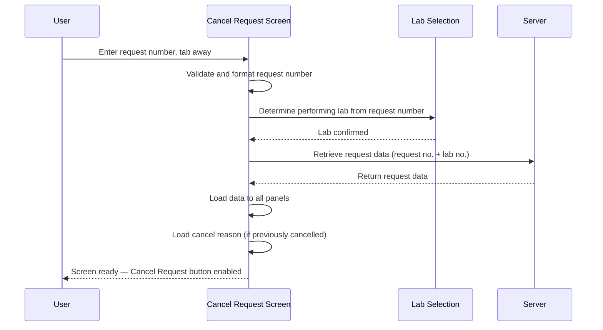

# Retrieve Request

## Overview

When a user enters a request number on the Cancel Request screen and tabs away, the system validates the request number, determines the performing lab, and retrieves the full request data from the server. The Patient Demographic panel, Clinical Detail, Comment, Test Grid, and — for MBS/VRS — the Specimen and Site section are all populated from the retrieved data. If the request has already been cancelled and a cancel reason exists, it is also loaded into the Cancel Reason field. Once data has loaded successfully, the screen transitions to the ready state and the Cancel Request button becomes enabled.

---

## Related User Stories

- **[[CRST-925]]** - Cancel Request - Retrieve Request

**Epic:** LISP-245 [CRST][DEV] Cancel Request - Request Retrieval

---

## Trigger Point

Initiated when the user enters a request number in the **Req. No.** field and the focus moves away (e.g., by pressing Tab). The system first validates and formats the request number, then selects the performing lab, then retrieves all request data from the server.

---

## Workflow Scenarios

### Scenario 1: Request Found and Retrieved Successfully

#### Prerequisites
- The Cancel Request screen is open.
- The user has entered a valid, existing request number.

#### Process Flow

#### Step-by-Step Details

1. **Request number validation:** The system validates and formats the text in the **Req. No.** field. If the request number is not in a valid format or does not exist, the entry is rejected and the field is cleared (see [[Request Not Found Message]]).

2. **Lab determination:** The system examines the request number to identify the performing lab. If the lab is not supported on this screen, a message is shown and the field is cleared (see [[Not Supported Lab Message]]). Otherwise, the performing lab is set and the screen title is updated to include the lab name.

3. **Server retrieval:** The system sends the request number and lab number to the server to retrieve the full request data.

4. **Data loaded to panels:** On a successful response, the following data is populated on the screen:

**Patient Demographic Panel**

| Field | Source Table | Source Column |
|-------|-------------|---------------|
| Request No. | `REQUEST` | `req_reqno` |
| HKID | `REQUEST` | `req_pid` |
| Encounter | `REQUEST` | `req_encounter` |
| Name (English) | `REQUEST` | `req_name` |
| Name (Chinese) | `REQUEST` | `req_cname` |
| Sex | `REQUEST` | `req_sex` |
| Age | `REQUEST` | `req_age` |
| Age Unit | `REQUEST` | `req_age_unit` |
| Req. Doc | `REQUEST` | `req_doc` |
| Request Location — Hospital | `REQUEST` | `req_locn_hosp` |
| Request Location — Specialty | `REQUEST` | `req_unit` |
| Request Location — Ward/Clinic | `REQUEST` | `req_locn` |
| Report Location — Hospital | `REQUEST` | `req_rept_dest_hosp` |
| Report Location — Ward/Clinic | `REQUEST` | `req_rept_dest` |
| Report Copy — Hospital | `REQUEST_COPY_HIST` | `reqcp_office_hosp` |
| Report Copy — Ward/Clinic | `REQUEST_COPY_HIST` | `reqcp_office` |
| Bed | `REQUEST` | `req_bed` |

> Report Copy Location may have more than one entry. Clicking the Report Copy button on the Patient Demographic panel displays all report copy locations associated with the retrieved request.

**Clinical Detail**

| Field | Source Table | Source Columns | Notes |
|-------|-------------|----------------|-------|
| Clinical Detail | `REQUEST` | `req_cdetail`, `req_cdetail2` | Both columns are combined; total capacity is 2 × 255 characters |

**Comment**

| Field | Source Table | Source Column |
|-------|-------------|---------------|
| Comment | `REQUEST` | `req_comment` |

5. **Test Grid populated:** The tests attached to the request are loaded into the Test Grid. Each row shows the test code, status date (colour-coded by status), and whether the test is optional. If USID is enabled for the performing lab, a Specimen column is also shown.

6. **Cancel Reason loaded (previously cancelled requests only):** The system searches the retrieved test results for the Cancel Comment test (identified by the `CANCEL_COMMENT` lab option key). If that test is found and its text result is not empty, the Cancel Reason text is loaded into the **Cancel Reason** text input and the **Keep Cancel Reason** checkbox is checked. If the test is not found or has no text, the Cancel Reason field remains blank.

7. **Screen transitions to ready state:** The **Cancel Request** button is enabled. The **Req. No.** field becomes non-editable. All controls that require a retrieved request become active (see [[Object Enablement After Retrieval]]).

---

### Scenario 2: Request Not Found

If the server returns no request data for the entered request number, the system shows a "not found" message and clears the screen. See [[Request Not Found Message]].

---

### Scenario 3: Already Cancelled — Request Cancelled Message

If the retrieved request has already been cancelled, the screen shows the Request Cancelled Message. See [[Request Cancelled Message]].

---

## Business Rules

1. The performing lab is derived from the request number prefix; the retrieval call includes both the request number and the lab number.
2. If the request has an existing cancel reason (Cancel Comment test with non-empty text), it is automatically loaded into the Cancel Reason field and the Keep Cancel Reason checkbox is checked on retrieval.
3. Clinical Detail is stored across two database columns (`req_cdetail` and `req_cdetail2`); both are combined when displayed on screen.
4. Report Copy Location may have multiple entries; all are accessible via the Report Copy dialogue on the Patient Demographic panel.
5. All patient demographic fields are **read-only** after retrieval; they cannot be edited on the Cancel Request screen.

---

## Related Workflows

- [[Default Screen Behavior]] — Describes the initial state of the screen before any request is retrieved.
- [[Laboratory Selection]] — The lab determination step that runs after request number validation.
- [[Request Not Found Message]] — The message shown when no matching request exists.
- [[Not Supported Lab Message]] — The message shown when the request's lab is not supported.
- [[Request Cancelled Message]] — The behaviour when the retrieved request has already been cancelled.
- [[Object Enablement After Retrieval]] — Which controls become enabled once a request is successfully loaded.
- [[Cancel Comment Test]] — How the system identifies the Cancel Comment test key used to find an existing cancel reason.
