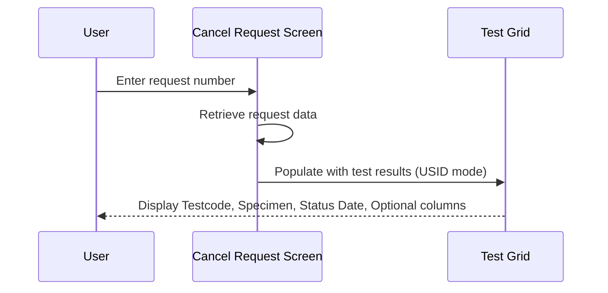
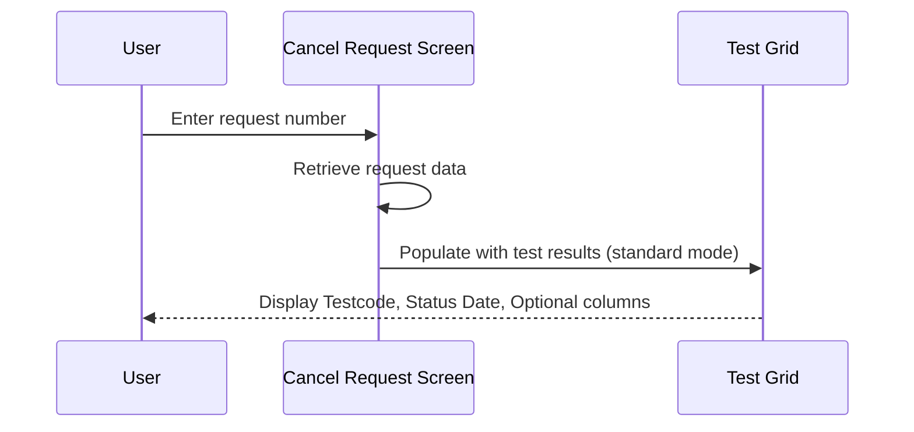

# Test Result

## Overview

When a request is successfully retrieved in the Cancel Request screen, the system displays the request's test results in a **Test Grid**. The grid allows lab staff to review the status of each test before deciding whether to proceed with cancellation. Each row shows the test code, its status date (colour-coded by status), and whether the test is optional. When the retrieved request belongs to a lab that has USID (Unique Specimen Identifier) enabled, a **Specimen** column is also shown to display the corresponding specimen number for each test.

---

## Related User Stories

- **[[CRST-927]]** - Cancel Request - Test Result

**Epic:** LISP-245 [CRST][DEV] Cancel Request - Request Retrieval

---

## Trigger Point

The Test Grid is populated immediately after a request is successfully retrieved. It forms part of the data displayed when the screen transitions to the ready state following a valid request number entry.

---

## Workflow Scenarios

### Scenario 1: Request Retrieved from a USID-Enabled Lab

#### Prerequisites

- The retrieved request belongs to a lab that has USID enabled.
- The request contains one or more tests with result data.

#### Process Flow

#### Step-by-Step Details

1. The system retrieves the test result data for the request, iterating through all lab result views, groups, and individual tests.
2. For each test, the system checks whether the test is a USID-type test. If it is, the associated specimen numbers are captured alongside the test data.
3. The Test Grid displays four columns: **Testcode**, **Specimen**, **Status Date**, and **Optional**.
4. The **Testcode** column shows the alphabetic test code looked up from the test dictionary using the test's key.
5. The **Specimen** column shows the display specimen values for the test, joined by a comma if there are multiple specimens. If no display specimen is set for a specimen entry, that entry is omitted.
6. The **Status Date** column shows the date and time of the test's status, with a background colour indicating the test's current status (see the Status Date Colour table below).
7. The **Optional** column shows **Y** if the test is optional; otherwise it is blank.

---

### Scenario 2: Request Retrieved from a USID-Disabled Lab

#### Prerequisites

- The retrieved request belongs to a lab that does not have USID enabled.
- The request contains one or more tests with result data.

#### Process Flow

#### Step-by-Step Details

1. The system retrieves the test result data, iterating through all lab result views, groups, and tests.
2. For each test, the system records the test code, status date, optional flag, and status colour code.
3. The Test Grid displays three columns: **Testcode**, **Status Date**, and **Optional**. The **Specimen** column is not shown.
4. The **Testcode**, **Status Date**, and **Optional** columns behave identically to Scenario 1.

---

## Summary Tables

### Test Grid Columns

| Column | Data Displayed | Shown When |
|--------|---------------|------------|
| Testcode | Alphabetic test code from the test dictionary | Always |
| Specimen | Display specimen number(s) for the test; multiple specimens separated by commas | Only when USID is enabled for the lab |
| Status Date | Date and time of the test's current status; background colour follows test status (see below) | Always |
| Optional | "Y" if the test is optional; blank if mandatory | Always |

---

### Status Date Background Colour

| Test Status | Status Code(s) | Background Colour |
|-------------|---------------|-------------------|
| Awaiting Result | 0 | Default (no colour) |
| Unauthorized | 1, 21 | Yellow |
| Awaiting Signout | 4, 24 | Red |
| Completed | 5, 25 | Green |
| Reported | 6, 26 | Cyan |
| Cancelled | 17 | Magenta |

---

## Business Rules

1. The Test Grid is populated by traversing all lab result views, then all groups within each view, then all tests within each group.
2. The **Specimen** column is only included in the grid when the retrieved request's lab has USID enabled; it is absent for all other labs.
3. A test is considered optional if its optional value is 1 or greater; the **Optional** column displays "Y" in this case and is blank otherwise.
4. The background colour of the **Status Date** cell is determined by the test's status code at the time of retrieval; it reflects the status at the point the request was loaded, not in real time.
5. The test order in the grid follows the traversal order of the lab result data; no additional sorting is applied.

---

## Related Workflows

- [[Retrieve Request]] — The Test Grid is populated as part of the overall request retrieval flow.
- [[Object Enablement After Retrieval]] — After the Test Grid is populated, the screen's buttons and input fields are enabled or disabled based on the test statuses shown in the grid.
