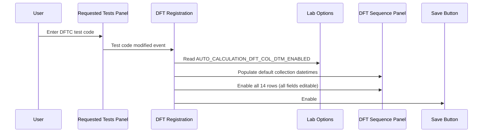
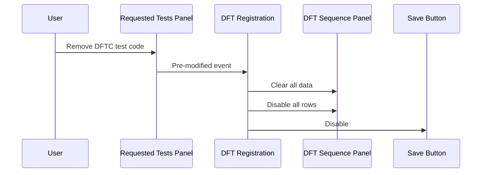

# DFT Panel Enablement — DFTC

## Overview

This workflow describes the behaviour of the DFT Sequence Panel when a **DFTC** (DFT Custom) test is selected during DFT Registration. Unlike DFTS and DFTT tests, the DFTC series allows staff to edit all 14 time sequence rows, including the Time Flag values. The default collection datetimes pre-populated in the rows are influenced by two lab options: whether auto-calculation is enabled, and whether force recalculation is enabled. If the DFTC test code is removed, the DFT Sequence Panel is cleared and disabled.

---

## Related User Stories

- **[[CRST-688]]** - DFT Registration - DFT Panel Enablement (DFTC)

**Epic:** LISP-210 [CRST][DEV] DFT Registration

---

## Key Concepts

### DFTC (DFT Custom)
A DFT test series where all 14 sequence rows are fully editable. Staff may enter or modify the Request No., Collection Datetime, and Time Flag for each row. The time flag sequence is not predetermined by the test dictionary.

### Auto-Calculation of Collection Datetime
Controlled by the lab option `AUTO_CALCULATION_DFT_COL_DTM_ENABLED`. When **enabled**, the system sets the default first collection datetime to the current date at `00:00`, and all other rows' collection datetimes are derived from the first row's datetime using the time flag offset. When **disabled**, the default collection datetime for all rows is the current date and time (no offset calculation).

### Force Recalculation of Collection Datetime
Controlled by the lab option `FORCE_RECALCULATION_DFT_COL_DTM_ENABLED`. This only applies to DFTC tests when auto-calculation is also enabled. When **enabled**, modifying the collection datetime or time flag of any row triggers the system to automatically recalculate the collection datetimes of other rows based on the updated value. When **disabled**, changing a value on one row does not affect the collection datetimes on other rows.

---

## Trigger Point

This workflow begins when a user adds a test code to the **Requested Tests** panel on the DFT Registration screen, and that test's series type (from the test dictionary) is identified as `DFTC`.

---

## Workflow Scenarios

### Scenario 1: User adds a DFTC test code

#### Prerequisites
- The DFT Registration screen is open.
- A patient (new or existing) has been entered, enabling the Requested Tests panel.
- The test being added has a test attribute of `DFTC` (optionally with time flags, e.g., `DFTC,0,1,2,...`).

#### Process Flow

#### Step-by-Step Details

1. The user types or selects a DFTC test code in the **Requested Tests** panel.
2. The system checks the lab option **Auto-calculation of DFT collection datetime** (`AUTO_CALCULATION_DFT_COL_DTM_ENABLED`):
   - If **disabled**: all 14 rows are pre-populated with the current date and time as the default Collection Datetime.
   - If **enabled**: all 14 rows are pre-populated with the current date at `00:00` as the default Collection Datetime.
3. All 14 DFT Sequence rows are enabled. Each row's **Request No.**, **Collection Datetime**, and **Time Flag** fields are all editable.
4. The **DFT Sequence Panel** is enabled.
5. The **Save** button becomes enabled.

---

### Scenario 2: User modifies a Collection Datetime or Time Flag value (DFTC with auto-calculation)

#### Prerequisites
- A DFTC test code is active.
- The lab option `AUTO_CALCULATION_DFT_COL_DTM_ENABLED` is enabled.

#### Step-by-Step Details

**When Force Recalculation is disabled** (`FORCE_RECALCULATION_DFT_COL_DTM_ENABLED` = disabled):
1. The user modifies the Collection Datetime or Time Flag on any row.
2. The system does **not** recalculate any other rows' collection datetimes. Each row retains its current value.

**When Force Recalculation is enabled** (`FORCE_RECALCULATION_DFT_COL_DTM_ENABLED` = enabled):
1. The user modifies the Collection Datetime or Time Flag on any row.
2. The system identifies the row with **Time Flag = 0** as the reference (anchor) row. If no row has Time Flag = 0, the first row is used.
3. If the user modifies the **anchor row**, all other rows' collection datetimes are recalculated based on the updated anchor datetime and each row's time flag offset.
4. If the user modifies **any other row**, only that row's collection datetime is recalculated relative to the anchor row.

> When the modified row's Time Flag is 0 and auto-calculation is active, the system first prompts: **"Do you want to change the collection time for all other sequences?"** The user must confirm (Yes) before the recalculation proceeds.

---

### Scenario 3: User removes a DFTC test code after data has been entered

#### Prerequisites
- A DFTC test code has been added and the DFT Sequence Panel is populated and enabled.
- The user has optionally entered or modified values in one or more rows.

#### Process Flow

#### Step-by-Step Details

1. The user removes the DFTC test code from the **Requested Tests** panel.
2. The system immediately clears all data from every row of the **DFT Sequence Panel** — Request No., Collection Datetime, and Time Flag values are all cleared.
3. All 14 rows are disabled.
4. The **Save** button is disabled.
5. The screen returns to the "patient ready" state — Request Information and Requested Tests panels remain editable.

---

## Summary Tables

### DFT Sequence Panel field states — DFTC test active

| Field | State | Editable |
|-------|-------|----------|
| Request No. (all 14 rows) | Enabled | Yes |
| Collection Datetime (all 14 rows) | Enabled | Yes |
| Time Flag (all 14 rows) | Enabled | Yes |
| Save button | Enabled | — |

### DFT Sequence Panel field states — DFTC test removed / no test entered

| Field | State | Editable |
|-------|-------|----------|
| Request No. | Visible, disabled | No |
| Collection Datetime | Visible, disabled | No |
| Time Flag | Visible, disabled | No |
| Save button | Disabled | — |

### Default collection datetime by auto-calculation setting

| `AUTO_CALCULATION_DFT_COL_DTM_ENABLED` | Default Collection Datetime on panel open |
|----------------------------------------|------------------------------------------|
| Disabled | Current date and time |
| Enabled | Current date at 00:00 |

### Recalculation behaviour matrix (DFTC, auto-calculation enabled)

| `FORCE_RECALCULATION_DFT_COL_DTM_ENABLED` | User modifies anchor row (Time Flag = 0) | User modifies any other row |
|-------------------------------------------|------------------------------------------|-----------------------------|
| Disabled | No recalculation occurs | No recalculation occurs |
| Enabled | All other rows are recalculated (after user confirms) | That row alone is recalculated relative to the anchor |

---

## Configuration

| Setting | Option Code | Purpose | Effect when enabled | Effect when disabled |
|---------|-------------|---------|--------------------|--------------------|
| Auto-calculation of DFT collection datetime | `AUTO_CALCULATION_DFT_COL_DTM_ENABLED` | Sets default collection datetime basis and controls whether time flag offsets drive datetime values | Default datetime = current date at 00:00; offsets applied | Default datetime = current date and time; no offsets applied |
| Force recalculation of DFT collection datetime | `FORCE_RECALCULATION_DFT_COL_DTM_ENABLED` | Controls whether editing a row's time sequence triggers recalculation of other rows (DFTC only, requires auto-calc enabled) | Editing anchor row recalculates all rows; editing other rows recalculates that row | No recalculation occurs on row edits |

---

## Business Rules

1. For DFTC tests, all 14 DFT Sequence rows are fully editable — including the Time Flag field.
2. The default Collection Datetime at panel activation is current date at `00:00` when auto-calculation is enabled, or current date and time when disabled.
3. All sequence rows' collection datetimes are initially set to the same default value; subsequent offset-based calculation depends on the force-recalculation setting.
4. Removing the DFTC test code from the Requested Tests panel clears all DFT Sequence Panel data immediately.
5. The Save button is only enabled when a valid DFTC test code is present in the Requested Tests panel.
6. Force recalculation only applies to DFTC tests; it has no effect on DFTS or DFTT tests.

---

## Related Workflows

- [[DFT Registration]] — The parent screen within which this enablement occurs.
- [[DFT Panel - DFTS]] — Comparable enablement behaviour for the DFTS (DFT Sample) series.
- [[DFT Panel - DFTT]] — Comparable enablement behaviour for the DFTT (DFT Timed) series.
