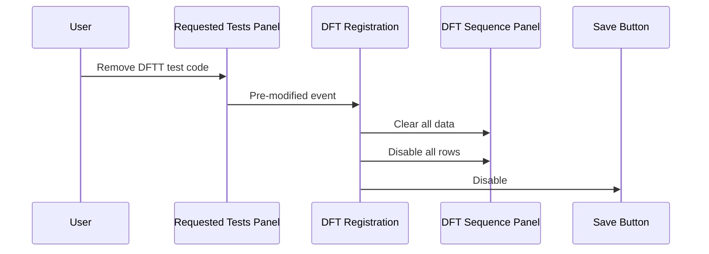

# DFT Panel Enablement — DFTT

## Overview

This workflow describes the behaviour of the DFT Sequence Panel when a **DFTT** (DFT Timed) test is selected during DFT Registration. When a DFTT test code is added to the Requested Tests panel, the DFT Sequence Panel becomes enabled with the number of active rows determined by the test's configuration. Request No. and Collection Datetime fields are editable per active row, but the Time Flag values are fixed by the test dictionary and cannot be edited by the user. If the DFTT test code is removed, the DFT Sequence Panel is cleared and disabled.

---

## Related User Stories

- **[[CRST-746]]** - DFT Registration - DFT Panel Enablement (DFTT)

**Epic:** LISP-210 [CRST][DEV] DFT Registration

---

## Key Concepts

### DFTT (DFT Timed)
A DFT test series where the time flag sequence points are defined entirely by the test configuration in the test dictionary. Staff can enter Request No. and Collection Datetime for each active sequence row, but the Time Flag values themselves are read-only.

### Test Attribute
Each DFT test has a `test_attribute` value in the test dictionary that encodes both the series type and the time flag sequence. For DFTT tests the format is: `DFTT,<flag1>,<flag2>,...` (e.g., `DFTT,0,10,20,30,60,120`). The number of comma-separated values after `DFTT` determines how many sequence rows are activated.

---

## Trigger Point

This workflow begins when a user adds a test code to the **Requested Tests** panel on the DFT Registration screen, and that test's series type (from the test dictionary) is identified as `DFTT`.

---

## Workflow Scenarios

### Scenario 1: User adds a DFTT test code

#### Prerequisites
- The DFT Registration screen is open.
- A patient (new or existing) has been entered, enabling the Requested Tests panel.
- The test being added has a test attribute starting with `DFTT`.

#### Process Flow

```mermaid
sequenceDiagram
    User->>Requested Tests Panel: Enter DFTT test code
    Requested Tests Panel->>DFT Registration: Test code modified event
    DFT Registration->>Test Dictionary: Retrieve test attribute and time flags
    DFT Registration->>DFT Sequence Panel: Populate time flag rows (from test attribute)
    DFT Registration->>DFT Sequence Panel: Enable active rows (Request No. + Collect D/T editable; Time Flag disabled)
    DFT Registration->>Save Button: Enable
```

#### Step-by-Step Details

1. The user types or selects a DFTT test code in the **Requested Tests** panel.
2. The system reads the test's **Test Attribute** from the test dictionary. The attribute is in the format `DFTT,<flag1>,<flag2>,...`.
3. The system counts the time flag values listed after `DFTT`. This determines how many of the 14 DFT Sequence rows are activated.
   - Example: `DFTT,0,10,20,30,60,120` activates 6 rows; the remaining 8 rows are visible but disabled.
4. For each activated row, the system sets the **Time Flag** value from the test attribute. The Time Flag field is shown but **not editable** by the user.
5. The **Request No.** and **Collection Datetime** fields on each activated row are visible and editable.
6. The remaining rows (up to 14 total) are visible but fully disabled.
7. The **DFT Sequence Panel** is enabled.
8. The **Save** button becomes enabled.

---

### Scenario 2: User removes a DFTT test code after data has been entered

#### Prerequisites
- A DFTT test code has been added and the DFT Sequence Panel is populated and enabled.
- The user has optionally entered Request No. and/or Collection Datetime values in the active rows.

#### Process Flow



#### Step-by-Step Details

1. The user removes the DFTT test code from the **Requested Tests** panel.
2. The system immediately clears all data from every row of the **DFT Sequence Panel** — Request No., Collection Datetime, and Time Flag values are all cleared.
3. All 14 rows are disabled.
4. The **Save** button is disabled.
5. The screen returns to the "patient ready" state — Request Information and Requested Tests panels remain editable.

---

## Summary Tables

### DFT Sequence Panel field states — DFTT test active

| Field | State | Editable |
|-------|-------|----------|
| Request No. (active rows) | Enabled | Yes |
| Collection Datetime (active rows) | Enabled | Yes |
| Time Flag (active rows) | Visible, disabled | No — fixed by test dictionary |
| All fields (inactive rows) | Visible, disabled | No |

### DFT Sequence Panel field states — DFTT test removed / no test entered

| Field | State | Editable |
|-------|-------|----------|
| Request No. | Visible, disabled | No |
| Collection Datetime | Visible, disabled | No |
| Time Flag | Visible, disabled | No |
| Save button | Disabled | — |

---

## Business Rules

1. When a DFTT test is selected, only the rows corresponding to the time flags defined in the test attribute become active; the remaining rows are disabled.
2. The Time Flag values for DFTT tests are read-only — they are sourced from the test dictionary and cannot be changed by the user.
3. Removing the DFTT test code from the Requested Tests panel clears all DFT Sequence Panel data immediately.
4. The Save button is only enabled when a valid DFTT test code is present in the Requested Tests panel.

---

## Related Workflows

- [[DFT Registration]] — The parent screen within which this enablement occurs.
- [[DFT Panel Enablement - DFTS]] — Comparable enablement behaviour for the DFTS (DFT Sample) series.
- [[DFT Panel Enablement - DFTC]] — Enablement behaviour for the DFTC (DFT Custom) series, where time flags are editable.
