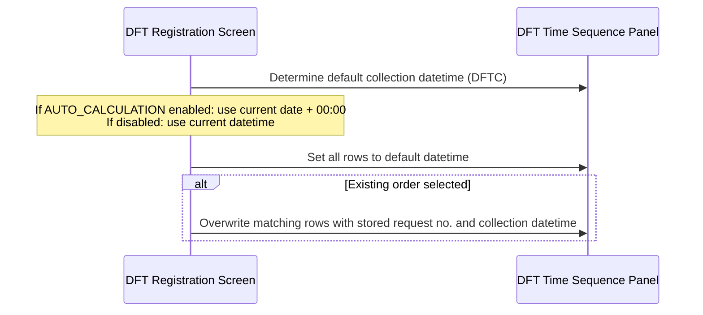
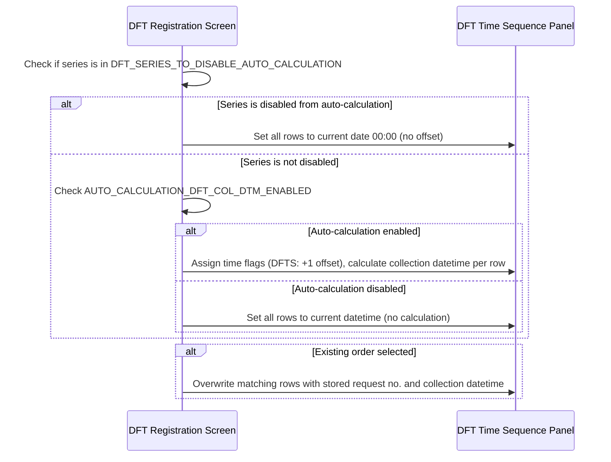

# DFT Registration – Load DFT Data to Components

## Overview

After the DFT test code and order number have been resolved, the system populates the DFT Time Sequence Panel with the initial collection datetimes for each time point in the DFT series. The initial datetime assigned to each row depends on the DFT series type (DFTT, DFTS, or DFTC), the lab option settings for auto-calculation, and whether the test series has been explicitly excluded from auto-calculation. For existing orders, previously recorded request numbers and collection datetimes are loaded back into the relevant rows, overriding the calculated defaults.

---

## Related User Stories

- **[[CRST-774]]** - DFT Registration - Load DFT data to Components

**Epic:** LISP-210 [CRST][DEV] DFT Registration

---

## Key Concepts

### DFT Series
Each DFT test belongs to one of three series, encoded in the test's attribute string:

| Series | Identifier | Meaning |
|--------|-----------|---------|
| DFTT | `DFTT` | Standard time-series; time flags represent minutes or another unit |
| DFTS | `DFTS` | Sample-series; time flag values are offset by +1 internally |
| DFTC | `DFTC` | Custom-series; the user defines the number of time points manually |

### Time Flag
An integer that represents the relative collection time offset for a DFT row. For DFTT and DFTC, the time flag value is stored and used as-is. For DFTS, the time flag stored in the database is the raw test attribute value — the system displays and uses a value that is the stored value **+1**.

### Default First Collection Datetime
The baseline datetime used when calculating initial collection datetimes. When auto-calculation is enabled, the time component is set to **00:00** and the date used is the current date. When auto-calculation is disabled, the full current datetime (date and time) is used as the default.

### Auto-Calculation of Collection Datetime
When enabled (`AUTO_CALCULATION_DFT_COL_DTM_ENABLED`), the system calculates each row's collection datetime by adding the row's time flag (in the configured unit) to the default first collection datetime. When disabled, all rows receive the same default datetime with no offset applied.

### Disable Auto-Calculation by Series
The `DFT_SERIES_TO_DISABLE_AUTO_CALCULATION` option allows specific DFT test series (identified by their series code, e.g., `DFTS` or `DFTT`) to be excluded from auto-calculation, regardless of the `AUTO_CALCULATION_DFT_COL_DTM_ENABLED` setting.

---

## Trigger Point

This workflow begins immediately after the system has resolved the DFT test code and DFT order number. It is the sixth step of the overall DFT registration sequence, following the [[DFT Order Dialogue]] resolution and before the DFT Panel is enabled for user input.

---

## Workflow Scenarios

### Scenario 1: DFTC (Custom Series) — Load Collection Datetimes

#### Prerequisites
- The DFT test belongs to the **DFTC** (custom) series.
- The DFT Time Sequence Panel has been configured with the required number of time-point rows for this test.

#### Process Flow

#### Step-by-Step Details

1. The system determines the **default collection datetime**:
   - If **Auto-Calculation of DFT Collection Datetime** is enabled: the default is the current date with time set to **00:00**.
   - If **Auto-Calculation** is disabled: the default is the current date and current time.
2. The system sets **all rows** in the DFT Time Sequence Panel to this default datetime.
3. If the registration is linked to an **existing DFT order** (i.e., the user selected an order from the [[DFT Order Dialogue]]):
   - For each row in the existing order that matches the current DFT order number, the system loads the previously recorded **Request No.** and **Collection Datetime** into the corresponding Time Sequence row.
   - These rows are marked as existing (not new), which affects how they are handled on save.

> **Note:** For DFTC, auto-calculation by time flag offset does **not** apply. All rows are initialised to the same default datetime; the user adjusts individual row datetimes manually.

---

### Scenario 2: DFTT or DFTS Series — Load with Auto-Calculation Check

#### Prerequisites
- The DFT test belongs to the **DFTT** or **DFTS** series.
- Time flags are defined in the test's attribute string.

#### Process Flow

#### Step-by-Step Details

1. The system checks whether the current DFT test series code is listed in the **Disable Auto-Calculation** option (`DFT_SERIES_TO_DISABLE_AUTO_CALCULATION`):

   **If the series is disabled from auto-calculation:**
   - The auto-calculation flag is forced to **off** for this registration, regardless of the `AUTO_CALCULATION_DFT_COL_DTM_ENABLED` setting.
   - The default collection datetime is set to the current date with time **00:00**.
   - All rows are set to this datetime; no time-flag offset is applied.

   **If the series is not disabled:**
   - The system reads the `AUTO_CALCULATION_DFT_COL_DTM_ENABLED` setting.
   - If **enabled**: the default datetime is the current date with time **00:00**.
   - If **disabled**: the default datetime is the current date and current time.

2. For each time flag defined in the test's attribute:
   - **For DFTS**: the display time flag is the attribute value **+ 1** (e.g., attribute `0` → time flag displayed as `1`).
   - **For DFTT**: the time flag is used as-is.
   - The time flag value is assigned to the corresponding Time Sequence row.

3. If **auto-calculation is active** (not disabled by the series option, and `AUTO_CALCULATION_DFT_COL_DTM_ENABLED` is on):
   - The collection datetime for each row is calculated by adding the row's time flag value (in the DFT unit, e.g., minutes, hours, or days) to the default first collection datetime.
   - **Exception:** If the DFT unit is null (not set) and the time flag is between 1 and 15 (exclusive of 0 and 16), all such rows are set to the same default datetime instead of being offset.

4. If **auto-calculation is not active**:
   - All rows receive the same default collection datetime; no offset is calculated.

5. If the registration is linked to an **existing DFT order**:
   - For each row in the existing order that matches the current DFT order number, the system loads the previously recorded **Request No.** and **Collection Datetime** into the corresponding Time Sequence row (matched by adjusted time flag).
   - These rows are marked as existing (not new).

---

## Summary: Collection Datetime Initialisation by Configuration

| DFT Series | `DFT_SERIES_TO_DISABLE_AUTO_CALCULATION` includes this series | `AUTO_CALCULATION_DFT_COL_DTM_ENABLED` | Initial Collection Datetime | Time-flag offset applied | Re-calculate when Time Flag 0 edited |
|------------|--------------------------------------------------------------|---------------------------------------|----------------------------|--------------------------|--------------------------------------|
| DFTT | Yes | Yes | Current date 00:00 | No | Yes |
| DFTT | No | Yes | Current date 00:00 | Yes | Yes |
| DFTT | Yes | No | Current date 00:00 | No | No |
| DFTT | No | No | Current datetime | No | No |
| DFTS | Yes | Yes | Current date 00:00 | No | N/A |
| DFTS | No | Yes | Current date 00:00 | Yes | N/A |
| DFTS | Yes | No | Current date 00:00 | No | N/A |
| DFTS | No | No | Current datetime | No | N/A |
| DFTC | N/A | Yes | Current date 00:00 | No | N/A |
| DFTC | N/A | No | Current datetime | No | N/A |

> The collection datetime fields in the DFT Time Sequence Panel are always editable by the user, regardless of the auto-calculation settings.

---

## Configuration

| Setting | Option Code | Purpose | Effect when enabled | Effect when disabled |
|---------|-------------|---------|--------------------|--------------------|
| Auto Calculation of DFT Collection Datetime | `AUTO_CALCULATION_DFT_COL_DTM_ENABLED` | Controls whether collection datetimes are calculated from the time flag offset | Default datetime uses current date + 00:00; offset by time flag per row | Default datetime is current date and current time; no offset applied |
| Force Recalculation of DFT Collection Datetime | `FORCE_RECALCULATION_DFT_COL_DTM_ENABLED` | Controls whether collection datetimes are recalculated when the Time Flag 0 row is edited (DFTC series) | Recalculation is triggered on edit of the Time Flag 0 row | No forced recalculation on edit |
| Disable Auto-Calculation by Series | `DFT_SERIES_TO_DISABLE_AUTO_CALCULATION` | Suppresses auto-calculation for specific DFT test series, identified by series code in `option_text` (e.g., `DFTS`, `DFTT`) | Auto-calculation disabled for the listed series; all rows default to current date 00:00 regardless of `AUTO_CALCULATION_DFT_COL_DTM_ENABLED` | Auto-calculation follows the `AUTO_CALCULATION_DFT_COL_DTM_ENABLED` setting for all series |

All options are stored in `LAB_OPTION` with `option_group = 'REQUEST_REGISTRATION'`.

---

## Business Rules

1. For the DFTS series, the time flag value stored in the test attribute is incremented by **+1** when assigned to each DFT Time Sequence row. This offset is applied consistently regardless of auto-calculation settings.
2. When `DFT_SERIES_TO_DISABLE_AUTO_CALCULATION` is enabled and the current test's series code matches the configured series, auto-calculation is suppressed for that series — even if `AUTO_CALCULATION_DFT_COL_DTM_ENABLED` is on.
3. When auto-calculation is active, the default first collection datetime is always set to the current date at **00:00**, not the current time.
4. When auto-calculation is inactive, the default collection datetime is the current date **and** current time.
5. Existing order rows (loaded from a previously incomplete DFT order) always override the calculated defaults — their stored request numbers and collection datetimes are restored exactly.
6. Collection datetime fields in the DFT Time Sequence Panel remain editable by the user at all times.
7. For DFTC (custom series), the time flag offset calculation is not applied. All rows are initialised to the same default datetime; the panel does not auto-calculate offsets between rows on initial load.
8. If the DFT unit is null and a time flag value is between 1 and 15 (inclusive), the collection datetime for that row is set equal to the default datetime rather than adding the flag as a unit offset. This prevents unexpected large date offsets when no unit is defined.

---

## Related Workflows

- [[DFT Registration - Register]] — After collection datetimes are loaded into the Time Sequence Panel, the user completes entry and saves; this workflow governs what is persisted to the database.
- [[DFT Order Dialogue]] — Resolves the DFT order number before this workflow executes; the selected order number determines which existing rows are loaded back.
- [[Validation - DFT Collection Datetime Recalculation (Message 1510)]] — Governs how collection datetimes are recalculated when the user subsequently edits the Time Flag 0 row.
