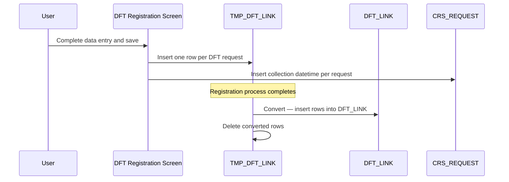

# DFT Registration – Register (Data Persistence)

## Overview

When a DFT lab request is successfully registered, the system persists the registration data across several tables. In addition to the standard lab request tables used across all request types, DFT registration writes a record into the `TMP_DFT_LINK` table for each registered request row. Once the full registration process completes, the data is converted — moved from `TMP_DFT_LINK` into the permanent `DFT_LINK` table — and the temporary records are deleted. The collection datetime for each DFT request is also stored in the standard lab request table.

---

## Related User Stories

- **[[CRST-761]]** - Registration - DFT Registration - Register

**Epic:** LISP-210 [CRST][DEV] DFT Registration

---

## Key Concepts

### DFT Order Number
A unique identifier that groups all DFT request rows belonging to the same DFT registration session for a patient. When a patient continues an existing incomplete DFT order (see [[Validation - Message 1508 (Active DFT Order)]]), the existing order number is reused, linking the new rows to the prior session.

### TMP_DFT_LINK (Temporary)
An intermediate staging table where DFT request data is written during the registration process. Data exists here only while the registration is being processed.

### DFT_LINK (Permanent)
The permanent DFT order table in the Lab database. Records are moved here from `TMP_DFT_LINK` once the registration process has completed successfully.

### DFT Completion Status
Each DFT request record carries a status value that tracks whether its order is complete:

| Status Value | Meaning |
|-------------|---------|
| 0 | Incomplete (default for all newly registered requests) |
| 1 | Complete |
| 4 | Awaiting Signout |
| 99 | Outstanding |

All newly registered DFT requests are inserted with status **0** (Incomplete).

---

## Trigger Point

Initiated when the user completes data entry on the DFT Registration screen and the registration process is executed. Each enabled row on the DFT Panel that carries a Request No. results in one record being written.

---

## Data Persistence Process

The registration follows a two-stage data flow:

---

## Scenario 1: New DFT Registration

### Prerequisites
- The patient does not have an existing incomplete DFT order for the same test profile, or the user chose **No** on [[Validation - Message 1508 (Active DFT Order)]].

### Step-by-Step Details

1. For each Request No. row entered on the DFT Panel, the system inserts one row into `TMP_DFT_LINK` with the field values described below.
2. A **new DFT Order No.** is generated and assigned to all rows belonging to this registration session.
3. The collection datetime for each request is written to the standard lab request table.
4. Once all rows are processed, the data is converted from `TMP_DFT_LINK` to `DFT_LINK`.
5. The temporary records in `TMP_DFT_LINK` are deleted after successful conversion.

---

## Scenario 2: Adding to an Existing Incomplete DFT Order

### Prerequisites
- An incomplete DFT order exists for the same patient (same identity group) and same test profile.
- The user chose **Yes** on the [[Validation - Message 1508 (Active DFT Order)]] prompt.

### Step-by-Step Details

1. For each new Request No. row entered in the current session, the system inserts one row into `TMP_DFT_LINK`.
2. The **existing DFT Order No.** from the previous incomplete session is used — no new order number is generated.
3. The collection datetime for each new request is written to the standard lab request table.
4. Once all new rows are processed, the data is converted from `TMP_DFT_LINK` to `DFT_LINK`.
5. The temporary records are deleted after successful conversion.

---

## Data Written to TMP_DFT_LINK and DFT_LINK

Each DFT request row results in one record in `TMP_DFT_LINK` (and, after conversion, one record in `DFT_LINK`). The fields written are identical in both tables:

| Field | Description | Value Inserted |
|-------|-------------|----------------|
| DFT Order No. | Groups all request rows for the same DFT registration session | New order no. for new registrations; existing order no. when continuing a previous incomplete order |
| Patient Identity Group | The registered patient's identity group | Patient's identity group |
| Request No. | The lab request number for this DFT row | The Request No. entered or assigned on the DFT Panel row |
| DFT Status | Completion status of the DFT order | Always **0** (Incomplete) for newly registered requests |
| Time Flag | The time flag value assigned to this DFT row | The time flag value from the DFT Panel row (positive or negative integer) |
| Test Profile | Identifies which DFT test profile this row belongs to | The test code key of the DFT test selected on the registration screen |
| Sample Flag | Indicates whether this row belongs to a DFTS (sample-type) registration | **1** for DFTS; **0** for DFTT and DFTC |

> **Note:** Time flag values may be positive, negative, or zero. All values are stored as entered.

---

## Collection Datetime

The collection datetime for each DFT request is stored in the standard lab request table (`CRS_REQUEST`), not in `TMP_DFT_LINK` or `DFT_LINK`. This is consistent with the handling of collection datetimes across all request types.

---

## TMP_DFT_LINK Lifecycle

| Stage | Action |
|-------|--------|
| During registration processing | One row per DFT request inserted into `TMP_DFT_LINK` |
| On registration completion | All rows converted and inserted into `DFT_LINK` |
| After conversion | All corresponding rows deleted from `TMP_DFT_LINK` |

The `TMP_DFT_LINK` table is purely a staging area and should not contain records after a registration process has completed.

---

## Business Rules

1. Every newly registered DFT request — whether part of a new order or an addition to an existing order — is always inserted with DFT Status **0** (Incomplete).
2. The DFT Order No. is the key that groups multiple request rows into a single DFT order. It must be shared across all rows of the same session; for continued orders it must match the existing incomplete order's number.
3. The Sample Flag is set to **1** only for DFTS-series requests. All other series (DFTT, DFTC) receive a Sample Flag of **0**.
4. Time flags may be positive, negative, or zero; no sign restriction is applied during data persistence.
5. Data in `TMP_DFT_LINK` is transient. It must be deleted from the temporary table after successful conversion to `DFT_LINK`.
6. The collection datetime is written to the standard lab request table, not to the DFT link tables.

---

## Related Workflows

- [[Validation - Message 1508 (Active DFT Order)]] — Determines whether the user is continuing an existing incomplete order or starting a new one; this directly affects which DFT Order No. is used on insert.
- [[DFT Panel Enablement - DFTS]] — Describes the DFTS series, which sets the Sample Flag to 1.
- [[DFT Panel Enablement - DFTT]] — Describes the DFTT series, which sets the Sample Flag to 0.
- [[DFT Panel Enablement - DFTC]] — Describes the DFTC series, which sets the Sample Flag to 0.
