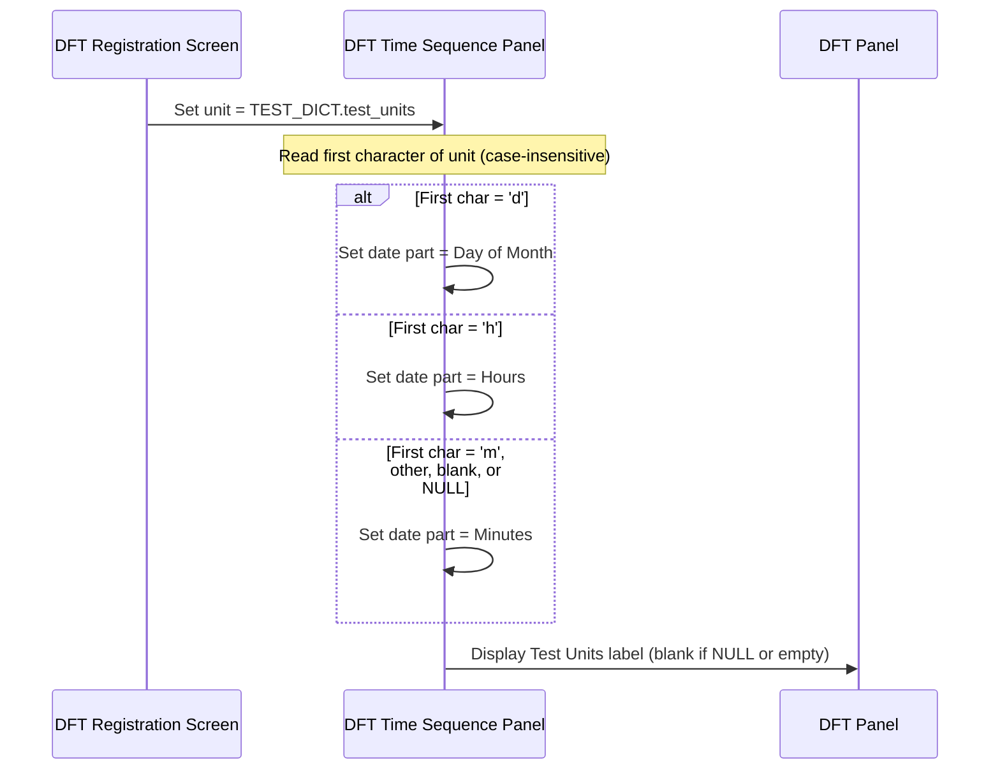

# DFT Registration – Time Sequence Unit Handling

## Overview

When a DFT test is selected during registration, the system reads the test's **Test Units** value from the test dictionary to determine the unit of measurement used when calculating collection datetimes across the DFT Time Sequence Panel. The first character of the Test Units value maps to one of three date parts — Minutes, Hours, or Day of Month — and this mapping controls how the time flag offset is applied to arrive at each row's collection datetime. If the Test Units value is NULL, blank, or does not begin with a recognised character, the system defaults to Minutes. The Test Units value is also displayed on the DFT Panel as a label so that staff can see the unit in use.

---

## Related User Stories

- **[[CRST-805]]** - DFT Registration - DFT Request Datetime Sequence Unit handling

**Epic:** LISP-210 [CRST][DEV] DFT Registration

---

## Key Concepts

### Test Units
The value stored in `TEST_DICT.test_units` for the selected DFT test. This value has two purposes:
1. It is **displayed as a label** on the DFT Panel so the user knows the unit of measurement in use.
2. Its **first character** (case-insensitive) determines the date part used for time flag offset calculations.

> If Test Units is NULL or blank (empty string), no label is shown on the DFT Panel.

### Date Part
The unit used by the time flag offset calculation. There are three possible date parts:

| Date Part | Meaning | Effect on time flag offset |
|-----------|---------|---------------------------|
| Minutes | Each unit of time flag = 1 minute | Time flag 20 = +20 minutes from base |
| Hours | Each unit of time flag = 1 hour | Time flag 2 = +2 hours from base |
| Day of Month | Each unit of time flag = 1 day | Time flag 3 = +3 days from base |

### Unit-to-Date-Part Mapping
The mapping is derived from the first character of `TEST_DICT.test_units`, compared case-insensitively:

| First Character of Test Units | Date Part Applied |
|-------------------------------|-------------------|
| `m` | Minutes |
| `h` | Hours |
| `d` | Day of Month |
| Any other character | Minutes (default) |
| Blank (empty string, not NULL) | Minutes (default) |
| NULL | Minutes (default) |

---

## Trigger Point

The unit determination occurs when `loadDftDataToComponents` sets up the DFT Time Sequence Panel, immediately after the test code has been resolved. It applies to all DFT series — DFTT, DFTS, and DFTC — whenever auto-calculation of collection datetimes is active.

---

## Workflow: Determine Date Part from Test Units

### Process Flow

### Step-by-Step Details

1. When the DFT test code is resolved, the system retrieves `TEST_DICT.test_units` for that test.
2. The system passes the Test Units value to the DFT Time Sequence Panel.
3. The DFT Time Sequence Panel reads the **first character** of the Test Units value and converts it to uppercase:
   - `D` → **Day of Month** date part
   - `H` → **Hours** date part
   - `M`, any other character → **Minutes** date part
   - If the value is NULL → **Minutes** date part (no character inspection)
4. The selected date part is stored and used for all subsequent time flag offset calculations in this registration session.
5. If Test Units is **not NULL and not blank**, the value is shown as a label on the DFT Panel. If it is NULL or blank (empty string), no unit label is displayed.

---

## Collection Datetime Calculation with Unit Applied

Once the date part is set, it is used by the auto-calculation logic (see [[DFT Registration – Load DFT Data to Components]]) whenever a time flag offset is applied. The offset formula is:

> **Collection Datetime = Base Datetime + (Time Flag × Date Part unit)**

### Examples

**Minutes (first char `m` or default):**

| Time Flag | Collection Datetime |
|-----------|---------------------|
| 0 | Base date at 00:00 |
| 20 | Base date at 00:20 |
| 60 | Base date at 01:00 |
| -10 | Base date minus 10 minutes |

**Hours (first char `h`):**

| Time Flag | Collection Datetime |
|-----------|---------------------|
| 0 | Base date at 00:00 |
| 15 | Base date at 15:00 |
| -10 | Previous day at 14:00 |
| 30 | Next day at 06:00 |

**Day of Month (first char `d`):**

| Time Flag | Collection Datetime |
|-----------|---------------------|
| 0 | Base date |
| 2 | Base date + 2 days |
| -1 | Base date minus 1 day |

---

## Applicability by Series

| DFT Series | Unit Handling Applies? | Condition |
|------------|----------------------|-----------|
| DFTT | Yes | When `AUTO_CALCULATION_DFT_COL_DTM_ENABLED` is on |
| DFTS | Yes | When `AUTO_CALCULATION_DFT_COL_DTM_ENABLED` is on |
| DFTC | Yes | When both `AUTO_CALCULATION_DFT_COL_DTM_ENABLED` and `FORCE_RECALCULATION_DFT_COL_DTM_ENABLED` are on |

> **NULL unit special case (DFTS/DFTT):** When Test Units is NULL and the time flag value is between 1 and 15 (inclusive), the system does **not** apply an offset — the collection datetime is set equal to the base datetime for those rows. This prevents unexpected large offsets for time flags that were intended as minute values but have no unit configured. See [[DFT Registration – Load DFT Data to Components]] for details.

---

## DFT Panel Unit Label Display

The DFT Panel displays the Test Units value as a read-only label. The label reflects the full `TEST_DICT.test_units` value, not just the first character:

| `TEST_DICT.test_units` | Label shown on DFT Panel |
|------------------------|--------------------------|
| `Mins` | `Mins` |
| `Hour` | `Hour` |
| `Day` | `Day` |
| `a` (unrecognised unit) | `a` |
| Blank (empty string) | *(no label shown)* |
| NULL | *(no label shown)* |

---

## Business Rules

1. The date part is determined entirely by the **first character** of `TEST_DICT.test_units`, compared case-insensitively. The full value of Test Units is not validated — only the first character is used for date part mapping.
2. A NULL Test Units value is treated identically to an unrecognised character — both result in the **Minutes** default date part.
3. A blank (empty string, not NULL) Test Units value also results in the **Minutes** default date part, because an empty string has no first character to evaluate.
4. Any Test Units value whose first character is not `m`, `h`, or `d` (case-insensitive) defaults to **Minutes**. The label is still displayed on the DFT Panel for unrecognised units.
5. NULL and blank Test Units values produce no label on the DFT Panel.
6. The date part setting affects all active rows in the DFT Time Sequence Panel for the current registration session.
7. For DFTC (custom series), the unit-based recalculation applies only when the user edits a Time Flag or Collection Datetime field, not on initial load. This recalculation is only active when both `AUTO_CALCULATION_DFT_COL_DTM_ENABLED` and `FORCE_RECALCULATION_DFT_COL_DTM_ENABLED` are enabled.

---

## Configuration

| Setting | Option Code | Purpose | Effect when enabled | Effect when disabled |
|---------|-------------|---------|--------------------|--------------------|
| Auto Calculation of DFT Collection Datetime | `AUTO_CALCULATION_DFT_COL_DTM_ENABLED` | Gates whether unit-based offset calculations are applied for DFTT and DFTS | Unit-based offsets applied; date part used to calculate each row's collection datetime | No offset calculation; all rows receive the same default datetime |
| Force Recalculation of DFT Collection Datetime | `FORCE_RECALCULATION_DFT_COL_DTM_ENABLED` | Gates whether unit-based offset calculations are triggered for DFTC on field edit | Unit-based offsets applied for DFTC on Time Flag / Collection Datetime edit | No offset recalculation for DFTC |

All options are stored in `LAB_OPTION` with `option_group = 'REQUEST_REGISTRATION'`.

---

## Data Sources

| Data | Source |
|------|--------|
| Test Units value | `TEST_DICT.test_units` for the selected DFT test |
| Date part constants | System constants: `D` = Day of Month, `H` = Hours, `M` = Minutes |

---

## Related Workflows

- [[DFT Registration – Load DFT Data to Components]] — Uses the date part determined here to calculate the initial collection datetime for each row when a DFT test is loaded.
- [[Validation - DFT Collection Datetime Recalculation (Message 1510)]] — Uses the same date part when recalculating collection datetimes after the user edits the Time Flag 0 row.
- [[DFT Panel - DFTT]] — The DFTT enablement workflow; unit handling applies when this series is active.
- [[DFT Panel - DFTS]] — The DFTS enablement workflow; unit handling applies when this series is active.
- [[DFT Panel - DFTC]] — The DFTC enablement workflow; unit handling applies on field edit when both auto-calculation options are enabled.
