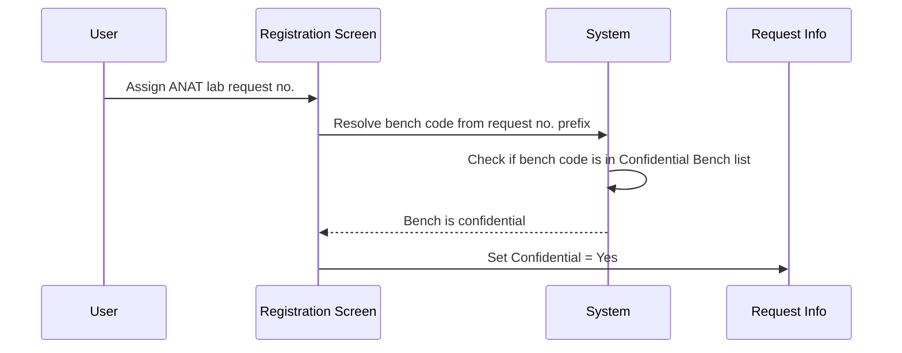
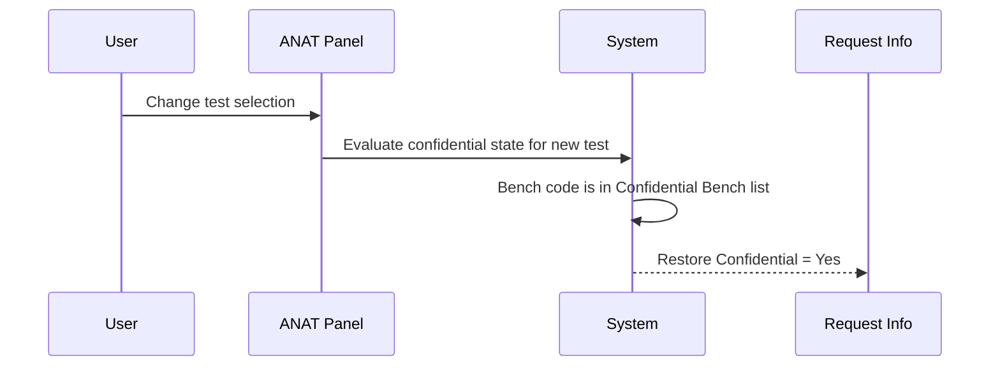

# Confidential Bench

## Overview

The Confidential Bench behaviour governs how the **Confidential** field on the Request Info section is automatically set when an ANAT lab request number is assigned. When the lab request number prefix matches a bench code that is configured as a confidential bench, the system automatically sets the Confidential field to **Yes**. If the prefix does not match any confidential bench, Confidential defaults to **No**. Additionally, whenever the user selects a new ANAT test, the system re-evaluates and may restore the Confidential value to **Yes** if the bench is confidential — overriding any manual change the user may have made.

---

## Related User Stories

- **[[CRST-606]]** — Registration - ANAT Panel - Confidential Bench

**Epic:** LISP-30 [CRST][DEV] Registration - Special Lab Workflow (ANAT)

---

## Key Concepts

### Confidential Bench
A bench code designated in the system configuration as requiring confidential handling. Requests assigned to a lab prefix matching a confidential bench are automatically marked as confidential.

### HISTO_SETUP — SET CONFIDENTIAL
Confidential bench codes are sourced from two places: the `CONFIDENTIAL_BENCH` lab option and the HISTO_SETUP table (bench category "SET CONFIDENTIAL"). Both sources are merged to form the complete list of confidential bench codes.

---

## Trigger Point

Confidential bench evaluation occurs in two situations:
1. When the user assigns a lab request number and the request number prefix is resolved to a bench code (on request number readiness).
2. When the user selects or changes the ANAT test in the ANAT Panel.

---

## Workflow Scenarios

### Scenario 1: Lab prefix matches a Confidential Bench

#### Prerequisites
- The lab request number prefix matches a bench code listed in the Confidential Bench configuration.

#### Process Flow

#### Step-by-Step Details

1. The user assigns an ANAT lab request number on Manual Registration.
2. The system resolves the request number prefix to a bench code.
3. The system checks whether the bench code appears in the Confidential Bench list (sourced from the `CONFIDENTIAL_BENCH` lab option combined with the HISTO_SETUP "SET CONFIDENTIAL" entries).
4. If the bench code is in the Confidential Bench list, the **Confidential** field on Request Info is automatically set to **Yes**.

---

### Scenario 2: Lab prefix does not match a Confidential Bench

#### Prerequisites
- The lab request number prefix resolves to a bench code that is **not** listed in the Confidential Bench configuration.

#### Step-by-Step Details

1. The user assigns an ANAT lab request number on Manual Registration.
2. The system resolves the request number prefix to a bench code.
3. The bench code is not found in the Confidential Bench list.
4. The **Confidential** field on Request Info remains at its default value of **No**.

---

### Scenario 3: User changes the ANAT test — Confidential reset to Yes

#### Prerequisites
- The lab request number prefix is a Confidential Bench.
- The Confidential field has been manually changed to **No** or **Restricted** by the user.

#### Process Flow

#### Step-by-Step Details

1. The Confidential field is currently set to **No** or **Restricted** (manually changed by the user).
2. The user selects a different ANAT test from the ANAT Test Dropdown.
3. The system re-evaluates the confidential state based on the bench code.
4. Because the bench code is in the Confidential Bench list, the system automatically restores the **Confidential** field to **Yes**.

> This reset occurs on every test selection change when the bench is confidential. Users cannot permanently override the Confidential = Yes default for a confidential bench by changing the test.

---

### Scenario 4: Test itself is marked as confidential

#### Prerequisites
- The selected test has a confidentiality flag (`TEST` table) set to **Confidential**.

#### Step-by-Step Details

1. The user selects an ANAT test that is individually flagged as confidential.
2. The system displays information message 1294 to notify the user.
3. The **Confidential** field is set to **Yes** regardless of the bench configuration.

---

## Summary Table

| Condition | Confidential Default |
|-----------|---------------------|
| Bench code is in Confidential Bench list | Yes |
| Bench code is NOT in Confidential Bench list | No |
| User changes ANAT test; bench is still confidential | Restored to Yes |
| Selected test is individually flagged confidential | Yes (with message 1294) |

---

## Configuration

| Setting | Option Code | Purpose | Effect when configured | Effect when not configured |
|---------|-------------|---------|------------------------|---------------------------|
| Confidential Bench | `CONFIDENTIAL_BENCH` *(group: REQUEST_REGISTRATION)* | Defines bench codes whose requests must be treated as confidential | Requests with a matching bench prefix default to Confidential = Yes | No bench-based confidential defaulting |

> Confidential bench codes are additionally sourced from HISTO_SETUP bench category "SET CONFIDENTIAL". Both sources are merged at runtime.

---

## Error Messages and System Prompts

| Message | Code | Trigger | User Options |
|---------|------|---------|-------------|
| Confidential test notice | 1294 | The selected ANAT test is individually flagged as confidential | OK (dismiss); Confidential field is set to Yes |
| Confidential change confirmation | 3877 | The user selects a non-confidential test on a bench where Confidential is currently Yes | Yes (set Confidential to No) / No (keep Confidential as Yes) |

---

## Related Workflows

- [[ANAT Test Dropdown]] — Changing the test selection triggers confidential re-evaluation.
- [[Date of Death Field]] — Also part of the ANAT Panel state that is evaluated when the bench is classified as an autopsy bench.
