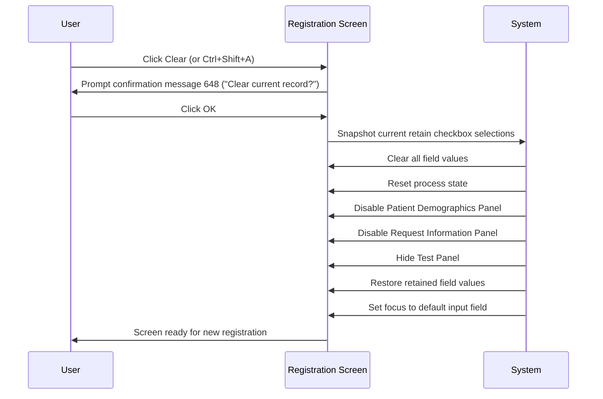
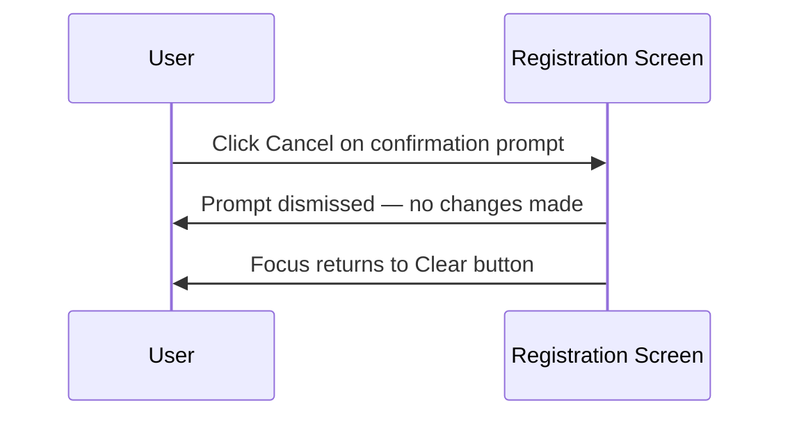

# Clear Button

## Overview

The **Clear** button allows registration staff to manually discard all data currently entered on the Registration screen and reset it to its default opening state, ready for a new registration. Before clearing, the system prompts the user for confirmation. If the user confirms, all fields are cleared except those retained by checked retain checkboxes, the screen panels are disabled, and focus is returned to the configured default input field. If the user declines, no change is made and focus returns to the **Clear** button.

---

## Related User Stories

- **[[CRST-112]]** - Registration - Clear Button
- **[[CRST-116]]** - Registration - Screen Object Focus *(default focus after clear)*
- **[[CRST-456]]** - Registration - Default Opening Behaviour *(field enablement reset)*

**Epic:** LISP-28 [CRST][DEV] Registration - Button Action

---

## Trigger Point

Initiated when the user clicks the **Clear** button, or presses the keyboard shortcut **Ctrl+Shift+A**, at any point while the Registration screen is open.

---

## Workflow Scenarios

### Scenario 1: User Confirms Clear

#### Prerequisites
- The Registration screen is open.
- The user clicks **Clear** or presses **Ctrl+Shift+A**.

#### Process Flow

#### Step-by-Step Details

1. The system displays confirmation message **648** ("Clear current record?") as a modal prompt with **OK** and **Cancel** buttons.

2. When the user clicks **OK**, the system first snapshots the current values of all fields associated with checked retain checkboxes. This snapshot is held temporarily so those values can be restored after the clear.

3. All input fields on the Registration screen are cleared — including **Encounter No.**, **Request No.**, **HKID**, all patient demographic fields, all request information fields, test selections, **Collection Date/Time**, and **Arrival Date/Time**.

4. The retain checkboxes themselves are **not** cleared or reset — they remain in whatever state the user last set them.

5. The screen panels are returned to their default disabled/hidden state:
   - The **Patient Demographics Panel** is visible but disabled.
   - The **Request Information Panel** is visible but disabled.
   - The **Test Panel** is hidden.
   - The **Save** button is disabled.
   - The **Clear** and **Exit** buttons remain enabled.

6. The system restores the values of any fields whose retain checkboxes are currently checked. For example, if the **Doctor** retain checkbox is ticked, the doctor code is repopulated in the **Doctor** field.

   > **Note:** If the last loaded patient was an existing patient, patient demographic fields (Encounter No., HKID, Patient Name, Chinese Name, Sex, Date of Birth, Age, Patient Location, Patient Category, Bed, Admission Date, MRN, Race) are excluded from retain restoration. This prevents stale patient data from being carried forward when clearing mid-session.

7. If restoring retain values causes the **Encounter No.** field to be repopulated, the system automatically initiates the patient lookup as if the user had entered the encounter number manually.

8. Focus is set to the configured default input field:
   - If the **Default Tab Order (HKID)** lab option is enabled, focus is placed on the **HKID** field.
   - Otherwise, focus is placed on the **Encounter No.** field.

---

### Scenario 2: User Cancels Clear

#### Prerequisites
- The confirmation prompt (message **648**) is displayed.
- The user clicks **Cancel** (or dismisses the prompt without clicking OK).

#### Process Flow

#### Step-by-Step Details

1. No fields are changed. All data on the screen remains exactly as it was before the user clicked **Clear**.

2. The retain checkboxes and all field values are unaffected.

3. Focus returns to the **Clear** button.

---

## Summary Table

| User Action | Outcome |
|---|---|
| Click **Clear** / press Ctrl+Shift+A | Confirmation prompt (message 648) displayed |
| Click **OK** on prompt | All fields cleared; retain values restored; screen reset; focus to default field |
| Click **Cancel** on prompt | No change; focus returns to **Clear** button |

---

## Relationship to Post-Save Clear

The Clear button performs the same core reset as the automatic screen clear that happens after a successful save (see [[Clear Screen]]). The key differences are:

| Aspect | Clear Button (CRST-112) | Post-Save Auto-Clear (CRST-111) |
|---|---|---|
| Trigger | User clicks **Clear** (or Ctrl+Shift+A) | Occurs automatically after a successful save |
| Confirmation | Always requires confirmation (message 648) | No confirmation — part of the save sequence |
| Retain checkbox state | Preserved; values restored | Preserved; values restored |
| Patient demographic fields skipped for existing patient | Yes | Yes |

---

## Configuration

| Setting | Option Code | Purpose | Effect when enabled | Effect when disabled |
|---------|------------|---------|--------------------|--------------------|
| Default Tab Order (HKID) | `DEFAULT_TAB_ORDER_HKID` | Controls whether HKID or Encounter No. receives focus after clear | Focus set to **HKID** | Focus set to **Encounter No.** |

> Retain field configuration (which fields are available as retain checkboxes) is defined in the **Object Attribute** setup for the RETAIN function group, not in `LAB_OPTION`.

---

## Business Rules

1. The **Clear** button is always visible and always enabled while the Registration screen is open, regardless of screen state.
2. The user must confirm the clear action via message **648** before any data is cleared. Cancelling the prompt leaves the screen unchanged.
3. Retain checkboxes are **never** reset by clicking Clear. The user's retain preferences persist until they manually change them.
4. For existing patients loaded in the current session, patient demographic fields are excluded from retain restoration to prevent stale patient data carry-over. These fields are always blank after a manual clear, regardless of retain checkbox state.
5. The **Clear** button keyboard shortcut is **Ctrl+Shift+A**.

---

## Related Workflows

- [[Clear Screen]] — The automatic screen clear triggered after a successful save. Performs the same reset as the Clear button, but without a confirmation prompt.
- [[Screen Object Focus]] — Defines the default focus field rules applied after a clear.
- [[Register Request]] — The save workflow that the Clear button interrupts or resets.
