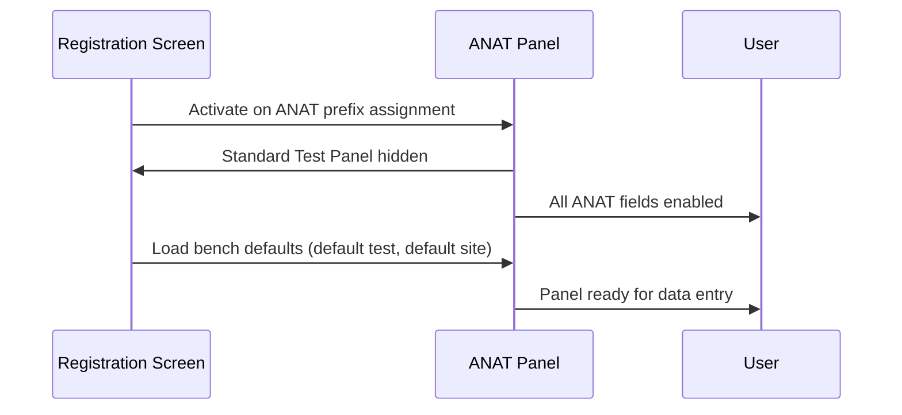
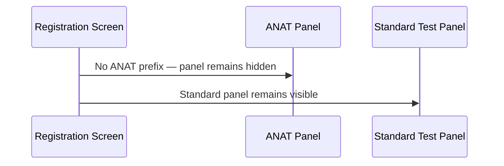

# ANAT Panel

## Overview

The ANAT Panel is the Anatomical Pathology–specific request entry panel that appears on the Registration screen when the assigned request number belongs to an ANAT (Anatomical Pathology) prefix. It replaces the standard Requested Test Panel with a set of fields tailored to anatomical pathology requests, including test selection, specimen site and type, responsible pathologist, date of death, and coroner and collection-time information. The panel is hidden entirely when a non-ANAT request number is in use.

---

## Related User Stories

- **[[CRST-461]]** - Registration - ANAT Panel Enablement
- **[[CRST-118]]** - Registration - ANAT Panel - Specimen Collect Time Unknown Checkbox

**Epic:** LISP-23 [CRST][DEV] Registration - Patient Handling

---

## Key Concepts

### ANAT (Anatomical Pathology) Lab
Laboratory number 5 within the system. The ANAT Panel is activated exclusively for requests whose prefix is configured against this lab.

### Bench
An ANAT-specific sub-classification (e.g., Histopathology, Cytology, Autopsy) that determines which default test and specimen site are pre-populated when the panel loads.

### Autopsy Mode
A request-level flag indicating that the case is an autopsy. When active, additional fields become enabled: **Date of Death**, **Coroner**, and **X-Ray Number** (if configured).

### Coroner Case
A subset of autopsy cases that involve a coroner. Whether a case defaults to coroner status is driven by the test code selected.

### Gynae Clinical Summary
Optional supplementary clinical data for gynaecological cytology requests. Accessible via the **Gynae** button and entered through a dedicated dialogue.

---

## Trigger Point

The ANAT Panel becomes visible and active after the Registration screen assigns a request number whose prefix matches an ANAT-configured entry in the Request Format table (lab = ANAT, lab number = 99, hospital = the current lab's hospital). The standard Requested Test Panel is hidden at the same time. If the request number does not match an ANAT prefix, the ANAT Panel remains hidden.

---

## Workflow Scenarios

### Scenario 1: ANAT Request Number Assigned

#### Prerequisites
- The request number prefix is configured as an ANAT prefix in the Request Format setup.
- The registration screen has reached the ready state (request number successfully assigned).

#### Process Flow

#### Step-by-Step Details

1. When the request number is assigned and the prefix resolves to an ANAT lab entry, the standard Requested Test Panel is hidden, and the ANAT Panel becomes the active data-entry area.
2. The system enables all ANAT Panel fields that are appropriate for the current bench and request context (see Field Enablement section below).
3. The system pre-populates the **Test** field and **Specimen Site** field with the default values configured for the current bench, if defaults exist.
4. The **Specimen Collect Time Unknown** checkbox is **checked by default**, and the collection time is set to 00:00 (midnight) to indicate an unknown time.
5. If the bench is configured as an autopsy bench, the **Date of Death** and **Coroner** fields are enabled. If the patient's date of death is recorded in the patient record, it is automatically populated into the **Date of Death** field.
6. If the request is an autopsy, the **Coroner** checkbox is automatically checked.
7. If the current user has a Responsible Pathologist security right, the **Responsible Pathologist** field is pre-populated with the current user.
8. If the patient's record is marked confidential, the confidentiality indicator is automatically set on the request.
9. If the bench is in the confidential bench list (configured via lab option or Histo Setup), the **Confidential** field is set to Confidential automatically.
10. The user may then enter or adjust values for **Test**, **Specimen Site**, **Specimen Type**, **Responsible Pathologist**, **Authorised By**, and other visible fields before saving the request.

---

### Scenario 2: Non-ANAT Request Number Assigned

#### Prerequisites
- The request number prefix does not match any ANAT prefix configuration.

#### Process Flow

#### Step-by-Step Details

1. When the request number prefix does not resolve to an ANAT lab entry, the ANAT Panel is not displayed.
2. The standard Requested Test Panel remains visible and active.
3. No ANAT-specific fields are presented to the user.

---

## Field Enablement Summary

The table below documents the enablement state of each ANAT Panel field across the three registration states.

| Field | Initial State | Patient Ready State | Ready State |
|---|---|---|---|
| Test | Disabled | Disabled | Enabled |
| Specimen Site | Disabled | Disabled | Enabled |
| Specimen Type | Disabled | Disabled | Enabled (only if bench code matches configured pattern) |
| Responsible Pathologist | Disabled | Disabled | Enabled |
| Authorised By | Disabled | Disabled | Enabled (only if **Authorised By** lab option is on) |
| Date of Death (editable) | Disabled | Disabled | Editable always; input enabled only if autopsy |
| X-Ray Number | Disabled | Disabled | Enabled only if autopsy **and** X-Ray Number lab option is on |
| Coroner | Disabled | Disabled | Enabled only if autopsy |
| Specimen Collect Time Unknown | Disabled | Disabled | Enabled |
| Gynae Button | Disabled | Disabled | Enabled (only if Gynae lab option is on) |

---

## Field Default Values on Load

| Field | Default Behaviour |
|---|---|
| Test | Pre-populated with the bench's configured default test (if set) |
| Specimen Site | Pre-populated with the bench's configured default site (if set); supports free-text or SNOMED code lookup modes |
| Specimen Type | Pre-populated from the test-to-specimen-type mapping when a test is selected (if configured) |
| Specimen Collect Time Unknown | **Checked by default**; collection time set to 00:00 |
| Date of Death | Pre-populated from the patient record if the patient is deceased and a date of death is recorded |
| Coroner | Checked automatically if the request is an autopsy |
| Responsible Pathologist | Pre-populated with the current user if the user has the Responsible Pathologist security role |
| Confidential | Set to Confidential if the bench is in the confidential bench list or the selected test is marked confidential |

---

## Specimen Collect Time Unknown Behaviour

> **The Specimen Collect Time Unknown checkbox is checked by default for all ANAT requests.** This sets the collection time to 00:00 (midnight).

- When the checkbox is checked, the collection time (hours, minutes, seconds) is reset to 00:00.
- When the user unchecks the checkbox, the collection time field becomes editable and the user may enter a specific time.
- If the user re-checks the checkbox after entering a time, the time is reset to 00:00 again.
- The checkbox does not affect the collection date — only the time portion.

---

## Gynae Clinical Summary Button

The **Gynae** button is visible and enabled only when the Gynae lab option is active for the ANAT lab.

- Clicking **Gynae** opens the Gynaecological Clinical Summary dialogue.
- If the selected test is a configured gynaecological test, the dialogue allows the user to enter or review clinical summary data.
- If the selected test is not a gynaecological test, a message is shown and the dialogue does not open.
- When a gynaecological test is selected and no gynae data exists yet, a default gynae clinical summary record is initialised automatically.

---

## Coroner and Autopsy Rules

1. The **Date of Death**, **Coroner**, and **X-Ray Number** fields are only active for autopsy requests.
2. The **Coroner** checkbox defaults to checked if the selected test is in the configured coroner test list.
3. When the user changes the test selection, the **Coroner** checkbox is re-evaluated against the coroner test list.
4. The **X-Ray Number** field is only enabled when both the autopsy flag is set and the X-Ray Number lab option is enabled.

---

## Configuration

| Setting | Option Code | Purpose | Effect when enabled | Effect when disabled |
|---|---|---|---|---|
| Authorised By | `AUTH_BY` | Controls whether the Authorised By field is shown and editable | Authorised By field enabled in Ready state | Authorised By field disabled |
| Authorise By Sync with Responsible Person | `AUTH_BY_SYNC_WITH_RESP_PERSON` (group: `RESULT_ENTRY`) | When enabled, selecting a Responsible Pathologist automatically pre-fills the Authorised By field with the same user if they appear in the Authorised By list | Authorised By auto-populated from Responsible Pathologist selection | No auto-sync; fields are independent |
| X-Ray Number | `XRAY_NO_ENABLED` | Controls whether the X-Ray Number field is available for autopsy requests | X-Ray Number field enabled for autopsy requests | X-Ray Number field always disabled |
| Gynae Clinical Summary | `MORE` / `GYNAE` | Controls whether the Gynae button and Gynaecological Clinical Summary dialogue are accessible | Gynae button visible and enabled | Gynae button hidden and disabled |
| Mandatory Site | `SITE_MANDATORY` | Controls whether the Specimen Site field is required before saving | Site label marked as required | Site not required |
| Mandatory Responsible Person | `RESP_PERSON_MANDATORY` | Controls whether the Responsible Pathologist field is required before saving | Responsible Pathologist label marked as required | Field not required |
| Specimen Type Bench | `SPECIMEN_TYPE_BENCH` | Specifies which bench codes allow the Specimen Type field to be enabled | Specimen Type enabled for matching bench codes | Specimen Type disabled |
| Default Site by Test | `DEFAULT_SITE_BY_TEST` | Maps test codes to default specimen sites | Site auto-populated when a test with a configured default is selected | No auto-population of site |
| Default Specimen Type by Test | `DEFAULT_SPECTYPE_BY_TEST` | Maps test codes to default specimen types | Specimen Type auto-populated when a test with a configured default is selected | No auto-population of specimen type |
| Coroner Tests | `CORONER_TEST` | Lists test codes that default the Coroner checkbox to checked | Coroner auto-checked for listed tests | Coroner not auto-checked |
| Confidential Bench | `CONFIDENTIAL_BENCH` | Lists bench codes whose requests default to Confidential | Confidential status auto-set for listed benches | No auto-confidential from bench |
| Print Cytology List | `PRINT_CYTOLOGY_LIST` | Controls whether the cytology print action is available | Cytology list printing enabled | Cytology list printing disabled |

> **Note:** Autopsy benches, coroner benches, cytology benches, confidential benches, and gynae test lists are also partly driven by the **Histo Setup** table (via site code groupings such as "AUTOPSY", "SET CORONER", "CYTOLOGY", "SET CONFIDENTIAL", "GYNAE CLINICAL DATA") rather than `LAB_OPTION` alone.

---

## Business Rules

1. The ANAT Panel is displayed if and only if the assigned request number prefix is configured in the Request Format table with lab = ANAT (lab number 5), lab sub-number = 99, and the hospital matches the current lab's hospital.
2. When the ANAT Panel is active, the standard Requested Test Panel is hidden.
3. All ANAT Panel fields are disabled until the registration screen reaches the Ready state (request number successfully assigned).
4. The Specimen Collect Time Unknown checkbox is always checked by default when the ANAT Panel loads, setting the collection time to 00:00.
5. Re-checking the Specimen Collect Time Unknown checkbox after the user has entered a time resets the time to 00:00.
6. The Date of Death, Coroner, and X-Ray Number fields are only active for autopsy requests.
7. The Coroner checkbox is automatically set based on the selected test's presence in the coroner test list.
8. The Authorised By field is independent of the Responsible Pathologist field unless the Authorise By Sync option is enabled, in which case a Responsible Pathologist selection automatically pre-fills Authorised By with the same user.
9. Selecting a test that is a gynaecological test and for which no gynae data yet exists causes a default gynae clinical data record to be initialised automatically.
10. The Confidential flag is set automatically if the bench or the selected test is in the confidential list; if the test changes to a non-confidential type after a confidential test was selected, the user is prompted to confirm removal of the confidential flag.

---

## Related Workflows

- [[Request No. Enablement after Registration Key Input]] — The ANAT Panel fields are disabled until the registration screen reaches the Ready state, which is triggered by successful request number assignment.
- [[Requested Test Panel]] — The standard Requested Test Panel is hidden when the ANAT Panel is active; the two panels are mutually exclusive.
- [[MICR VIRO Panel]] — A parallel discipline-specific panel for Microbiology and Virology requests, sharing the same state-driven enablement pattern.
