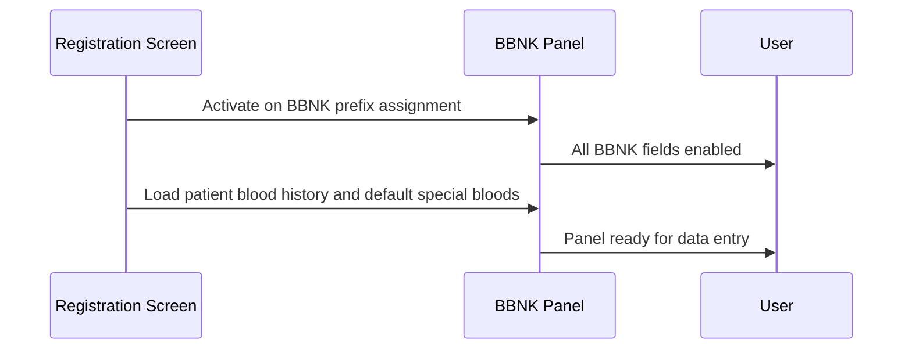
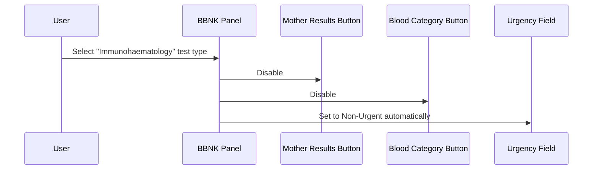
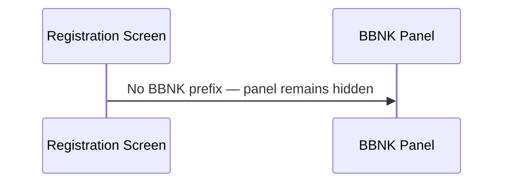

# BBNK Panel

## Overview

The BBNK Panel is the Blood Bank–specific request entry panel that appears on the Registration screen when the assigned request number belongs to a Blood Bank (BBNK) prefix. It provides the fields and actions required for blood bank requests, including patient blood history, blood category, special blood requirements, test type selection, operation and indication codes, inventory reservation, and access to haematology cross-lab results. The panel is hidden entirely when a non-BBNK request number is in use.

---

## Related User Stories

- **[[CRST-462]]** - Registration - BBNK Panel Enablement

**Epic:** LISP-25 [CRST][DEV] Registration - Screen Object Enablement

---

## Key Concepts

### BBNK (Blood Bank) Lab
Laboratory number 6 within the system. The BBNK Panel is activated exclusively for requests whose prefix is configured against this lab.

### Patient Blood History
A summary of the patient's previous blood bank records, including ABO/Rh grouping, historical type-and-screen results, and any active special blood requirements. Loaded into the panel when a valid patient is identified.

### Type and Screen (T&S)
A pre-transfusion test that checks the patient's blood group and screens for unexpected antibodies. One of four selectable test types on the BBNK Panel.

### Special Blood Requirements
Patient-specific requirements for non-standard blood products (e.g., irradiated, CMV-negative). Managed via the **Blood Category** button, which opens the Special Blood dialogue.

### Inventory Reserve Product Input
A sub-panel that allows staff to reserve specific blood products for the patient's request. Its visibility is controlled by a lab option.

### Haem Result
A cross-lab result button that provides access to historical haematology results for the patient. Its visibility is controlled by a lab option combined with a security access check.

### Claimed HKID
A secondary HKID associated with the patient through a claim linkage. When present, a copy button is displayed at the top of the panel to allow staff to copy the claimed HKID.

---

## Trigger Point

The BBNK Panel becomes visible and active after the Registration screen assigns a request number whose prefix matches a BBNK-configured entry in the Request Format table (lab = BBNK, lab number = 99, hospital = the current lab's hospital). If the request number does not match a BBNK prefix, the BBNK Panel remains hidden.

---

## Workflow Scenarios

### Scenario 1: BBNK Request Number Assigned

#### Prerequisites
- The request number prefix is configured as a BBNK prefix in the Request Format setup.
- The registration screen has reached the ready state (request number successfully assigned).

#### Process Flow

#### Step-by-Step Details

1. When the request number is assigned and the prefix resolves to a BBNK lab entry, the BBNK Panel becomes the active data-entry area.
2. The system enables all BBNK Panel fields appropriate to the current state (see Field Enablement Summary below).
3. The patient's blood history is loaded into the **Patient Results** display area, showing previous ABO/Rh group results and relevant historical information.
4. The **Mother Results** dialogue is pre-loaded with the patient's blood history if available.
5. If the patient has a registered HKID, the **Haem Result** button connects to cross-lab historical haematology results for that patient.
6. The **Blood Category** button is initialised with the default special blood requirements configured for the lab.
7. The **Inventory Reserve Product** sub-panel is pre-populated with the current date and time as the default required date.
8. If the patient has a claimed HKID linked to their record, a copy button appears at the top of the panel displaying the claimed HKID.
9. The user may then select a **Test Type**, enter **Operation Code** and **Indication Code** (if visible), specify **Inventory Reserve Product** requirements, and review or modify **Blood Category** (special blood) requirements before saving.

---

### Scenario 2: Immunohaematology Test Type Selected

#### Prerequisites
- The BBNK Panel is in the Ready state.
- The user selects **4. Immunohaematology** as the Test Type.

#### Process Flow

#### Step-by-Step Details

1. When the user selects **4. Immunohaematology** from the Test Type radio button group, the **Mother Results** button is disabled and the **Blood Category** button is disabled.
2. The **Urgency** field on the main Registration screen is automatically set to **Non-Urgent**.
3. If the user selects any other test type, the **Mother Results** button and **Blood Category** button are re-enabled.

---

### Scenario 3: Non-BBNK Request Number Assigned

#### Prerequisites
- The request number prefix does not match any BBNK prefix configuration.

#### Process Flow

#### Step-by-Step Details

1. When the request number prefix does not resolve to a BBNK lab entry, the BBNK Panel is not displayed.
2. No BBNK-specific fields are presented to the user.

---

## Visual Layout

The BBNK Panel is approximately 430 × 600 pixels and is arranged vertically. From top to bottom it contains:

1. **Claimed HKID Copy Button** — shown only when a claimed HKID is linked to the patient; hidden otherwise
2. **Patient Results** display area — shows the patient's blood history summary
3. **Blood Category** button and **Mother Results** button — side by side
4. **Operation Code** label and text input — hidden when the lab option suppresses it
5. **Indication Code** label and text input — hidden when the lab option suppresses it
6. **Inventory Reserve Product** sub-panel — hidden when the lab option suppresses it
7. **Test Type** radio button group — four options arranged vertically
8. **Haem Result** button — shown only when the lab option and security right permit it

---

## Buttons and Actions

### Blood Category
**When visible:** Always visible when the BBNK Panel is displayed.
**What it does:** Opens the Special Blood Requirements dialogue. The staff member can view or modify the patient's special blood product requirements. If the requirements differ from the lab default, the button label is displayed in italic to indicate a non-default selection. Clicking OK saves the selection back to the request.

### Mother Results
**When visible:** Always visible when the BBNK Panel is displayed.
**When enabled:** Enabled in Ready state, except when the **Immunohaematology** test type is selected.
**What it does:** Opens the Mother Results dialogue, which displays blood history information relevant to obstetric cases.

### Haem Result
**When visible:** Only when the **Haem Result** lab option is enabled **and** the user holds the Cross-Lab Result security right.
**What it does:** Initiates a cross-lab lookup to retrieve historical haematology results for the patient identified by their HKID.

### Claimed HKID Copy Button
**When visible:** Only when the patient has a claimed HKID linked to their record with a "Linked" status.
**What it does:** Allows the user to copy the claimed HKID value for use elsewhere on the screen.

---

## Field Enablement Summary

| Field / Component | Initial State | Patient Ready State | Ready State |
|---|---|---|---|
| Patient Results display | Disabled | Disabled | Enabled |
| Mother Results button | Disabled | Disabled | Enabled (disabled if Immunohaematology selected) |
| Test Type radio buttons | Disabled | Disabled | Enabled |
| Haem Result button | Disabled | Disabled | Enabled |
| Blood Category button | Disabled | Disabled | Enabled (disabled if Immunohaematology selected) |
| Indication Code field | Disabled | Disabled | Enabled (if visible per lab option) |
| Operation Code field | Disabled | Disabled | Enabled (if visible per lab option) |
| Inventory Reserve Product sub-panel | Disabled | Disabled | Enabled (if visible per lab option) |

---

## Test Type Options

The **Test Type** radio button group offers four mutually exclusive options:

| Value | Label | Notes |
|---|---|---|
| T&S/XM | 1. T&S/XM | Type and Screen / Cross-Match |
| Component | 2. Component | Blood component transfusion request |
| No sample (Tx) | 3. No sample (Tx) | Transfusion request with no sample |
| Immunohaematology | 4. Immunohaematology | Disables Mother Results and Blood Category; sets Urgency to Non-Urgent |

---

## Data Loaded on Patient Ready

When a valid patient is confirmed (Patient Ready state), the following data is loaded before the panel is enabled:

| Data | Source |
|---|---|
| Patient blood history summary | Loaded from patient blood history record |
| Mother results data | Loaded from patient blood history record |
| Haem result connection | Initialised using the patient's HKID |
| Default special blood requirements | Loaded from lab-level default special blood configuration |
| Inventory required date | Set to the current date and time |
| Claimed HKID | Loaded from the patient's claimed HKID linkage record |

---

## Configuration

| Setting | Option Code | Purpose | Effect when enabled | Effect when disabled |
|---|---|---|---|---|
| Haem Result | `TEST_RESULT` (group: `CROSS_LAB_RESULT`) | Controls whether the Haem Result button is available (also requires Cross-Lab Result security right) | Haem Result button visible | Haem Result button hidden |
| Operation and Indication Code Invisible | `OPERATION_AND_INDICATION_CODE_INVISIBLE` | Hides the Operation Code and Indication Code fields | Fields hidden | Fields visible |
| Operation and Indication Code Mandatory | `OPERATION_AND_INDICATION_CODE_MANDATORY` | Makes Operation Code and Indication Code required before saving | Fields marked required | Fields optional |
| Inventory Reserve Product | `INV_RESERVE_PRODUCT` | Controls whether the Inventory Reserve Product sub-panel is visible | Sub-panel visible | Sub-panel hidden |
| Inventory Reserve Product Mandatory | `INVENTORY_RESERVE_PRODUCT_MANDATORY` | Makes product type and unit required in the reserve product sub-panel | Product type and unit required | Not required |
| T&S/XM Auto-Generated Request No. Prefix | `AUTO_GENERATED_REQNO_PREFIX_TS` | Specifies the lab prefix used when the system auto-generates a request number for T&S/XM test type | Auto-generation uses this prefix | No auto-generation prefix for T&S/XM |
| Component Auto-Generated Request No. Prefix | `AUTO_GENERATED_REQNO_PREFIX_COMP` | Specifies the lab prefix used when the system auto-generates a request number for Component test type | Auto-generation uses this prefix | No auto-generation prefix for Component |
| Others Auto-Generated Request No. Prefix | `AUTO_GENERATED_REQNO_PREFIX_OTHER` | Specifies the lab prefix used when the system auto-generates a request number for other test types | Auto-generation uses this prefix | No auto-generation prefix for other types |
| T&S Remark Report | `PRINT_TS_REMARK_REPORT_ENABLED` | Controls whether the Type and Screen Remark report is printed automatically during registration | T&S Remark report printed | No automatic printing |
| Auto PID Check | `AUTO_PID_CHECK_ENABLED` | Controls whether the patient identity check is triggered automatically | PID check triggered automatically on patient load | PID check not triggered automatically |
| PID Check Mandatory | `PID_CHECK_MANDATORY` | Controls whether staff must acknowledge a PID check warning before proceeding | Unanswered PID check blocks registration | PID check warning shown but registration can proceed |
| T&S Duplicate Check Period | `TS_TESTS_DUPLICATION_CHECK_PERIOD` | Sets the time period used when checking for duplicate T&S requests | Duplicate check applies within this period | No duplicate check |
| T&S Duplicate Check Unit | `TS_TESTS_DUPLICATION_CHECK_UNIT` | Sets the unit (e.g., hours, days) for the duplicate T&S check period | Used in conjunction with check period | Not applicable if period is not set |
| Historical ABO Check | `HISTORICAL_ABO_CHECK_CRITERIA` | Controls whether historical ABO group consistency is checked at registration | Historical ABO checked | No historical ABO check |
| Prompt for Age Test Check | `PROMT_FOR_AGE_TEST_CHK` | Specifies which test code triggers an age-based T&S remark prompt (patient under 18) | Age prompt shown for the specified test | No age-based prompt |
| Auto-Generated Label Quantity | `AUTO_GEN_REQNO_LABEL_PRINT_QUANTITY` | Controls the number of request number labels printed when a request number is auto-generated | Specified quantity printed | Default quantity printed |

---

## Business Rules

1. The BBNK Panel is displayed if and only if the assigned request number prefix is configured in the Request Format table with lab = BBNK (lab number 6), lab sub-number = 99, and the hospital matches the current lab's hospital.
2. All BBNK Panel fields are disabled until the registration screen reaches the Ready state (request number successfully assigned).
3. Selecting the **Immunohaematology** test type automatically disables the **Mother Results** and **Blood Category** buttons and sets the **Urgency** field to Non-Urgent.
4. Switching away from the Immunohaematology test type re-enables the **Mother Results** and **Blood Category** buttons.
5. The **Blood Category** button label is displayed in italic when the current special blood requirements differ from the lab default.
6. The **Haem Result** button is only shown when both the lab option and the Cross-Lab Result security right are satisfied.
7. The **Claimed HKID Copy Button** is only shown when the patient has a claimed HKID with a "Linked" status.
8. The **Inventory Reserve Product** sub-panel is pre-populated with the current date as the default required date when patient data is loaded.
9. The standard Requested Test Panel remains visible for BBNK requests; the BBNK Panel provides additional blood-bank-specific fields alongside it.

---

## Related Workflows

- [[Request No. Enablement after Registration Key Input]] — The BBNK Panel fields are disabled until the registration screen reaches the Ready state, triggered by successful request number assignment.
- [[Requested Test Panel]] — The standard Requested Test Panel remains visible alongside the BBNK Panel for BBNK requests.
- [[MICR VIRO Panel]] — A parallel discipline-specific panel for Microbiology and Virology requests, sharing the same state-driven enablement pattern.
